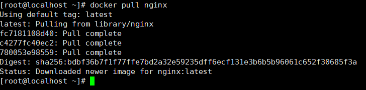
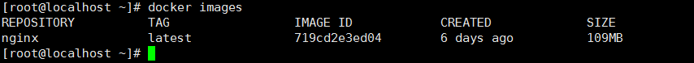
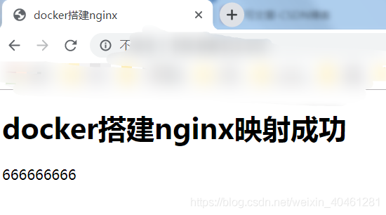

#   docker安装nginx

---
#   安装nginx docker镜像

1.  拉取镜像

```
docker pull nginx
```



2.  查看镜像库

```
docker images
```



3.  创建并运行镜像

```
docker run --name nginx -p 60103:80 -d nginx
```

#   将nginx关键目录映射到本机

1.  创建本机目录

```
mkdir -p /var/module/docker/nginx/{www,logs,conf}
```

+   www: nginx存储网站网页的目录
+   logs: nginx日志目录
+   conf: nginx配置文件目录

2.  将docker容器内的nginx配置文件整个目录拷贝到宿主机

```
docker cp 481e121fb29f:/etc/nginx/. /var/module/docker/nginx/conf
```

3.  停止正在运行的nginx容器

```
docker stop 481e121fb29f
```

4.  删除刚创建的nginx容器(第一次创建镜像的目的是拿到容器里的配置文件)

```
docker rm 481e121fb29f
```

5.  创建新的nginx

```
docker run -d -p 60103:80 --name nginx -v /var/module/docker/nginx/www:/usr/share/nginx/html -v /var/module/docker/nginx/conf:/etc/nginx -v /var/module/docker/nginx/logs:/var/log/nginx nginx
```

#   使用
在本机www目录下创建index.html内容为

```
vim /var/module/docker/nginx/www/index.html
```

```html
<!DOCTYPE html>
<html>
<head>
<meta charset="utf-8">
<title>docker搭建nginx</title>
</head>
<body>
    <h1>docker搭建nginx映射成功</h1>
    <p>666666666</p>
</body>
</html>
```



#   参考
[docker 安装 nginx 并配置反向代理](https://blog.csdn.net/weixin_40461281/article/details/92586378)
