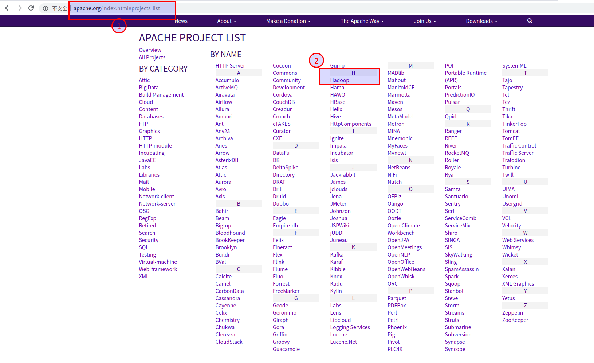
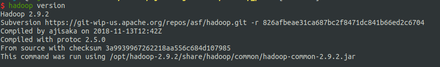

#   离线安装hadoop

---
#   (这是在Ubuntu18.04安装的说明)
##  下载
这是一个apache项目,自然在官网进行下载,下载方式很多,用命令wget也好,用curl也罢,这里主要说明要在哪里能找到Hadoop程序

1.  [http://apache.org/index.html](http://apache.org/index.html)


2.  找到Hadoop



3.  下载想要的版本的二进制文件


4.  点击下载


##  安装
安装很简单,解压就好,解压完后,目录下有如下文件


##  配置变量
```
1.  cd /etc/profile.d/

2.  sudo vim jdk.sh
3.  输入如下内容,并保存
export J2SDKDIR=/usr/lib/jvm/java-8-oracle
export J2REDIR=/usr/lib/jvm/java-8-oracle/jre
export PATH=$PATH:/usr/lib/jvm/java-8-oracle/bin:/usr/lib/jvm/java-8-oracle/db/bin:/usr/lib/jvm/java-8-oracle/jre/bin
export JAVA_HOME=/usr/lib/jvm/java-8-oracle
export DERBY_HOME=/usr/lib/jvm/java-8-oracle/db

4.  sudo vim hadoop.sh
5.  输入如下内容并保存
export HADOOP_HOME=/opt/hadoop-2.9.2
export PATH=$PATH:$HADOOP_HOME/bin:$HADOOP_HOME/sbin

6.  source /etc/export
```

##  测试安装
hadoop version





##  Hadoop的目录结构
```
hadoop-2.9.2
├── bin
│   ├── container-executor
│   ├── hadoop
│   ├── hadoop.cmd
│   ├── hdfs
│   ├── hdfs.cmd
│   ├── mapred
│   ├── mapred.cmd
│   ├── rcc
│   ├── test-container-executor
│   ├── yarn
│   └── yarn.cmd
├── etc
│   └── hadoop
│       ├── capacity-scheduler.xml
│       ├── configuration.xsl
│       ├── container-executor.cfg
│       ├── core-site.xml
│       ├── hadoop-env.cmd
│       ├── hadoop-env.sh
│       ├── hadoop-metrics2.properties
│       ├── hadoop-metrics.properties
│       ├── hadoop-policy.xml
│       ├── hdfs-site.xml
│       ├── httpfs-env.sh
│       ├── httpfs-log4j.properties
│       ├── httpfs-signature.secret
│       ├── httpfs-site.xml
│       ├── kms-acls.xml
│       ├── kms-env.sh
│       ├── kms-log4j.properties
│       ├── kms-site.xml
│       ├── log4j.properties
│       ├── mapred-env.cmd
│       ├── mapred-env.sh
│       ├── mapred-queues.xml.template
│       ├── mapred-site.xml.template
│       ├── slaves
│       ├── ssl-client.xml.example
│       ├── ssl-server.xml.example
│       ├── yarn-env.cmd
│       ├── yarn-env.sh
│       └── yarn-site.xml
├── include
│   ├── hdfs.h
│   ├── Pipes.hh
│   ├── SerialUtils.hh
│   ├── StringUtils.hh
│   └── TemplateFactory.hh
├── lib
│   └── native
│       ├── examples
│       ├── libhadoop.a
│       ├── libhadooppipes.a
│       ├── libhadoop.so -> libhadoop.so.1.0.0
│       ├── libhadoop.so.1.0.0
│       ├── libhadooputils.a
│       ├── libhdfs.a
│       ├── libhdfs.so -> libhdfs.so.0.0.0
│       └── libhdfs.so.0.0.0
├── libexec
│   ├── hadoop-config.cmd
│   ├── hadoop-config.sh
│   ├── hdfs-config.cmd
│   ├── hdfs-config.sh
│   ├── httpfs-config.sh
│   ├── kms-config.sh
│   ├── mapred-config.cmd
│   ├── mapred-config.sh
│   ├── yarn-config.cmd
│   └── yarn-config.sh
├── LICENSE.txt
├── NOTICE.txt
├── README.txt
├── sbin
│   ├── distribute-exclude.sh
│   ├── FederationStateStore
│   │   ├── MySQL
│   │   └── SQLServer
│   ├── hadoop-daemon.sh
│   ├── hadoop-daemons.sh
│   ├── hdfs-config.cmd
│   ├── hdfs-config.sh
│   ├── httpfs.sh
│   ├── kms.sh
│   ├── mr-jobhistory-daemon.sh
│   ├── refresh-namenodes.sh
│   ├── slaves.sh
│   ├── start-all.cmd
│   ├── start-all.sh
│   ├── start-balancer.sh
│   ├── start-dfs.cmd
│   ├── start-dfs.sh
│   ├── start-secure-dns.sh
│   ├── start-yarn.cmd
│   ├── start-yarn.sh
│   ├── stop-all.cmd
│   ├── stop-all.sh
│   ├── stop-balancer.sh
│   ├── stop-dfs.cmd
│   ├── stop-dfs.sh
│   ├── stop-secure-dns.sh
│   ├── stop-yarn.cmd
│   ├── stop-yarn.sh
│   ├── yarn-daemon.sh
│   └── yarn-daemons.sh
└── share
    ├── doc
    │   └── hadoop
    └── hadoop
        ├── common
        ├── hdfs
        ├── httpfs
        ├── kms
        ├── mapreduce
        ├── tools
        └── yarn
```

#   (这是在CentOs7安装的说明)
##  完全分布式运行模式
### 集群规划

|   linux169  |                   说明                  |   linux191  | 说明 |     linux232    |           说明           |      所在目录      |                           管理                           |
|-------------|-----------------------------------------|-------------|------|-----------------|--------------------------|--------------------|----------------------------------------------------------|
| NameNode    | 内部通讯端口:9000; http端口:60102=>对外 |             |      |                 |                          | /opt/module/hadoop | 在linux232服务器,使用sbin/start-all.sh  sbin/stop-all.sh |
| DataNode    |                                         | DataNode    |      | DataNode        |                          |                    |                                                          |
|             |                                         |             |      | ResourceManager | web ui 端口 => 7106 对外 |                    |                                                          |
| NodeManager |                                         | NodeManager |      | NodeManager     |                          |                    |                                                          |


### 集群安装
1.  包准备[(下载地址)](https://archive.apache.org/dist/hadoop/common/hadoop-2.7.2/)

```
hadoop-2.7.2.tar.gz
```

2.  解压

```
tar -zxvf -C hadoop-2.7.2.tar.gz /opt/module/
```

3.  创建软链接

```
ln -s /opt/module/hadoop-2.7.2 /opt/module/hadoop
```

4.  添加环境变量

```
vim /etc/profile.d/hadoop.sh

键入如下内容

##HADOOP_HOME
export HADOOP_HOME=/opt/module/hadoop
export PATH=$PATH:$HADOOP_HOME/bin
export PATH=$PATH:$HADOOP_HOME/sbin

重新载入环境变量

source /etc/profile
```

5.  删除压缩包

```
rm  hadoop-2.7.2.tar.gz
```

### 配置
####  看情况,修改ssh的端口和JAVA_HOME

```
vim /opt/module/hadoop/etc/hadoop/hadoop-env.sh
```


由于服务器环境的端口并不是默认的22端口,要使hadoop脚本能够正常工作,需要修改ssh端口

```
export HADOOP_SSH_OPTS="-p 55222"
```

2.  如果没有配置`JAVA_HOME`,需要修改java地址

```
export JAVA_HOME=${JAVA_HOME}
```

####  core-site.xml

```
vim /opt/module/hadoop/etc/hadoop/core-site.xml
```

```xml
<?xml version="1.0" encoding="UTF-8"?>
<?xml-stylesheet type="text/xsl" href="configuration.xsl"?>
<!--
                 Licensed under the Apache License, Version 2.0 (the "License");
  you may not use this file except in compliance with the License.
  You may obtain a copy of the License at

    http://www.apache.org/licenses/LICENSE-2.0

  Unless required by applicable law or agreed to in writing, software
  distributed under the License is distributed on an "AS IS" BASIS,
  WITHOUT WARRANTIES OR CONDITIONS OF ANY KIND, either express or implied.
  See the License for the specific language governing permissions and
  limitations under the License. See accompanying LICENSE file.
-->
<!-- Put site-specific property overrides in this file. -->
<configuration>
    <!-- 指定HDFS中NameNode的地址 -->
    <property>
        <name>fs.defaultFS</name>
        <value>hdfs://linux169:9000</value>
    </property>
    <!-- 指定Hadoop运行时产生文件的存储目录 -->
    <property>
        <name>hadoop.tmp.dir</name>
        <value>/var/module/hadoop/data/tmp</value>
    </property>
</configuration>
```

####  hdfs-site.xml

```
vim /opt/module/hadoop/etc/hadoop/hdfs-site.xml
```

```xml
<?xml version="1.0" encoding="UTF-8"?>
<?xml-stylesheet type="text/xsl" href="configuration.xsl"?>
<!--
            Licensed under the Apache License, Version 2.0 (the "License");
  you may not use this file except in compliance with the License.
  You may obtain a copy of the License at

    http://www.apache.org/licenses/LICENSE-2.0

  Unless required by applicable law or agreed to in writing, software
  distributed under the License is distributed on an "AS IS" BASIS,
  WITHOUT WARRANTIES OR CONDITIONS OF ANY KIND, either express or implied.
  See the License for the specific language governing permissions and
  limitations under the License. See accompanying LICENSE file.
-->
<!-- Put site-specific property overrides in this file. -->
<configuration>
    <!-- secondary namenode服务地址和端口 -->
    <property>
        <name>dfs.namenode.secondary.http-address</name>
        <value>linux232:7104</value>
    </property>
    <!-- 决定着系统里面的文件块的数据备份个数 -->
    <property>
        <name>dfs.replication</name>
        <value>3</value>
    </property>
    <!-- 指定 namenode web ui 端口 -->
    <property>
        <name>dfs.http.address</name>
        <value>0.0.0.0:60102</value>
    </property>
</configuration>
```

####  mapred-site.xml

```
vim /opt/module/hadoop/etc/hadoop/mapred-site.xml
```

```xml
<?xml version="1.0"?>
<?xml-stylesheet type="text/xsl" href="configuration.xsl"?>
<!--
       Licensed under the Apache License, Version 2.0 (the "License");
  you may not use this file except in compliance with the License.
  You may obtain a copy of the License at

    http://www.apache.org/licenses/LICENSE-2.0

  Unless required by applicable law or agreed to in writing, software
  distributed under the License is distributed on an "AS IS" BASIS,
  WITHOUT WARRANTIES OR CONDITIONS OF ANY KIND, either express or implied.
  See the License for the specific language governing permissions and
  limitations under the License. See accompanying LICENSE file.
-->

<!-- Put site-specific property overrides in this file. -->

<configuration>
    <!-- 指定MR运行在Yarn上 -->
    <property>
            <name>mapreduce.framework.name</name>
            <value>yarn</value>
    </property>
    <!-- 历史服务器端地址 -->
    <property>
            <name>mapreduce.jobhistory.address</name>
            <value>192.168.0.144:10020</value>
    </property>
    <!-- 历史服务器web端地址 -->
    <property>
            <name>mapreduce.jobhistory.webapp.address</name>
            <value>192.168.0.144:7105</value>
    </property>
</configuration>
```

####  yarn-site.xml

```
vim /opt/module/hadoop/etc/hadoop/yarn-site.xml
```

```xml
<?xml version="1.0"?>
<!--
            Licensed under the Apache License, Version 2.0 (the "License");
  you may not use this file except in compliance with the License.
  You may obtain a copy of the License at

    http://www.apache.org/licenses/LICENSE-2.0

  Unless required by applicable law or agreed to in writing, software
  distributed under the License is distributed on an "AS IS" BASIS,
  WITHOUT WARRANTIES OR CONDITIONS OF ANY KIND, either express or implied.
  See the License for the specific language governing permissions and
  limitations under the License. See accompanying LICENSE file.
-->
<configuration>
    <!-- NodeManager上运行的附属服务。需配置成mapreduce_shuffle，才可运行MapReduce程序 -->
    <property>
        <name>yarn.nodemanager.aux-services</name>
        <value>mapreduce_shuffle</value>
    </property>
    <!-- 指定YARN的ResourceManager的地址 -->
    <property>
        <name>yarn.resourcemanager.hostname</name>
        <value>linux232</value>
    </property>
    <!-- 修改yarn的 web ui 端口 -->
    <property>
        <description>The address of the RM web application.</description>
        <name>yarn.resourcemanager.webapp.address</name>
        <value>0.0.0.0:7106</value>
    </property>
</configuration>
```

+   修改yarn的web ui端口参考
  *   https://stackoverflow.com/questions/29278651/yarn-possible-values-for-resource-manager-web-ui-port
  *   You can setup the WebUI address in `yarn-default.xml` file.
  *   Set property `yarn.resourcemanager.webapp.address` to another port.

####  slaves

配置集群

```
vim /opt/module/hadoop/etc/hadoop/slaves
```

```
linux169
linux191
linux232
```

#   启动
集群启动
```
在linux232服务器(我这台有配置ssh证书),使用
sbin/start-all.sh
sbin/stop-all.sh
```

历史服务器启动
```
在linux191服务器(历史服务器所在地址),使用
sbin/mr-jobhistory-daemon.sh start historyserver
```


