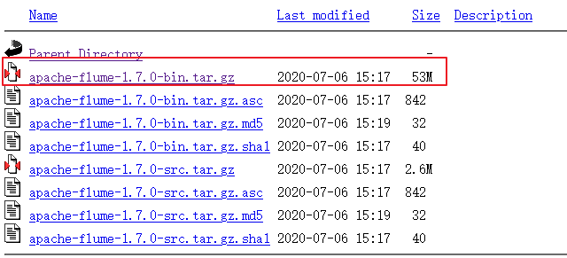

#   Centos7离线安装Flume

---

##  下载flume
http://archive.apache.org/dist/flume/1.7.0/



##  安装

```
tar -zxvf apache-flume-1.7.0-bin.tar.gz
mv apache-flume-1.7.0-bin /opt/module/
ln -s /opt/module/apache-flume-1.7.0-bin /opt/module/flume
```

##  配置jdk
```
cd /opt/module/flume/conf
mv flume-env.sh.template flume-env.sh
vi flume-env.sh
键入
export JAVA_HOME=/opt/module/jdk
```
