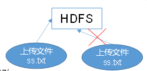
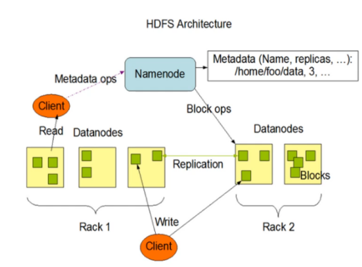
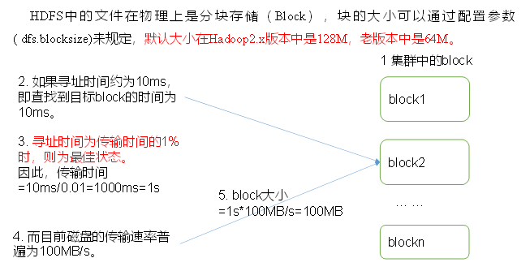

#   HDFS概述

----
#   HDFS优缺点
##  优点

+   高容错性
    *   数据自动保存多个副本。它通过增加副本的形式，提高容错性。
    *   某一个副本丢失以后，它可以自动恢复。

+   适合处理大数据
    *   数据规模:能够处理数据规模达到GB、TB、甚至PB级别的数据;
    *   文件规模:能够处理百万规模以上的文件数量，数量相当之大。

+   可构建在廉价机器上，通过多副本机制，提高可靠性。

##  缺点
+   不适台低延时数据访问，比如毫秒级的存储数据，是做不到的。
+   无法高效的对大量小文件进行存储。
    *   存储大量小文件的话，它会占用NarmeNode大量的内存来存储文件目录和块信息。这样是不可取的，因为NarmeNo de的内存总是有限的;
    *   小文件存储的寻址时间会超过读取时间，它违反了HDFS的设计目标。
+   不支持并发写入、文件随机修改。
    *   一个文件只能有一个写，不允许多个线程同时写;
    *   仅支持数据append (追加),不支持文件的随机修改。

##  小结
+   hadoop的缺点就一个字”慢”
+   hdfs的使用场景: 适合一次写入,多次读出的场景,且不支持文件的修改,适合用来做数据分析,并不适合用来做网盘应用

#   HDFS组成架构

+   NameNode (nn) :就是Master,它是一个主管、管理者。
    *   管理HDFS的名称空间;
    *   配置副本策略;
    *   管理数据块(Block) 映射信息; 
    *   处理客户端读写请求。
+   DataNode: 就是Slave。NameNode下达命令，DataNode执行实际的操作。
    *   存储实际的数据块; 
    *   执行数据块的读/写操作。
+   Client: 就是客户端。
    *   文件切分。文件上传HDFS的时候，Client将文件切分成一 个一 个的Block, 然后进行上传
    *   与NameNode交互，获取文件的位置信息;
    *   与DataNode交互， 读取或者写入数据;
    *    Client提供- 些命令来管理HDFS, 比如NameNode格式化;
    *    Client可以通过一-些命令来访问HDFS, 比如对HDFS增删查改操作;
+   Secondary NameNode:并非NameNode的热备。当NameNode挂掉的时候，它并不能马.上替换NameNode并提供服务。
    *   辅助NameNode,分担其工作量,比如定期合并Fsimage和Edits, 并推送给NameNode ;
    *   在紧急情况下，可辅助恢复NameNode。

#   HDFS文件块大小(面试重点)

+   HDFS中的文件在物理上是分块存储(Block),块的大小可以通过配置参数(dfs.blocksize)来规定,默认大小在Hadoop2.x版本中是128M,老版本中是64M。
+   为什么block设置为128M
    *   设寻址时间约为10ms 
    *   因为寻址时间为传输时间的1%时,则为最佳状态
    *   所以一个block给的传输时间大约为1s
    *   又因为磁盘的传输速率普遍为100MB/s
    *   所以一个blocks在1s*100M/s=100M最佳
    *   所以设定Block大小为128M

##  思考:为什么块的大小不能设直太小，也不能没置太大?
+   HDFS的块设置太小,会增加寻址时间,程序一直在找块的开始位置(典型例子就是机械硬盘文件碎片过多,文件碎片多会增加寻址时间)
+   如果块设置的太大,从磁盘传输数据的时间会明显大于寻址所需的时间.导致程序在处理这块数据时,会非常慢

总结: HDFS块的大小设置主要取决于磁盘传输速率。

