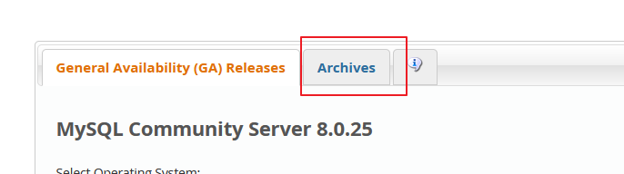
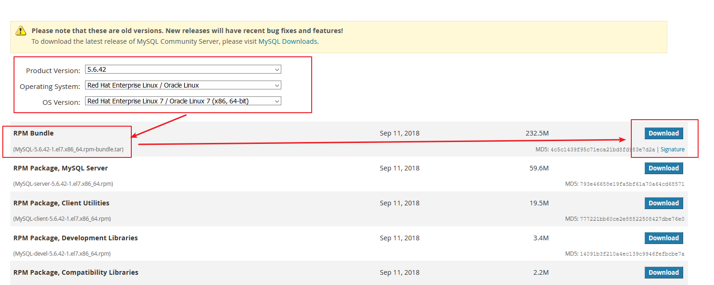
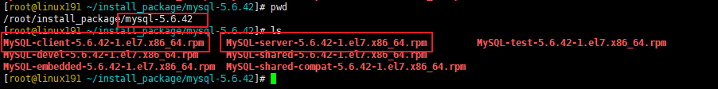
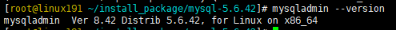

#   CentOs7使用rpm离线包安装Mysql5.6.42

----

#   下载MySQL5.6
1.  下载地址:https://dev.mysql.com/downloads/mysql/

2.  根据具体需求选要下载的mysql 版本





#   安装MysSQL
##  卸载旧版本
1.  看是否还有在运行的mysql

```
ps aux | grep mysql
ps aux | grep mariadb

有就停止运行
```

2.  查看是否有旧版本的mysql

```
rpm -qa | grep mariadb
rpm -qa | grep mysql
rpm -qa | grep MySQL
...
```

3.  删除旧版本

```
rpm -e --nodeps 前面查出来的包
```

4.  删除配置文件

```
find / -name mysql
find / -name my.cnf

删除与mysql相关的文件
```


##  安装
1.  解压

```
mkdir mysql-5.6.42
tar -xvf MySQL-5.6.42-1.el7.x86_64.rpm-bundle.tar  -C ./mysql-5.6.42/
```



2.  安装

```
rpm -ivh MySQL-server-5.6.42-1.el7.x86_64.rpm
rpm -ivh MySQL-client-5.6.42-1.el7.x86_64.rpm
```

3.  安装server后会生成初始密码

```
cat /root/.mysql_secret
```

4.  检查是否安装成功

```
//查看mysql 版本信息
mysqladmin --version
```



5.  查看mysql 用户和用户组：

```
cat /etc/passwd | grep mysql
cat /etc/group | grep mysql 
```

##  配置

参考:https://amos-x.com/index.php/amos/archives/mysql56-config/

```
# 修改配置文件
vim /etc/my.cnf
```

```
[mysql]
default-character-set=utf8

[mysqld]

#################################  基础配置信息  #################################

port = 7106

# 默认编码设为UTF8
character-set-server=utf8

# 表名忽略大小写，设置后所有大写都会变成小写
lower_case_table_name=1

# 数据库引擎innodb
default-storage-engine=INNODB

# binlog日志过期时间
expire_logs_days=30

# 开启慢查询日志
slow_query_log=ON
long_query_time=10    # 慢查询阈值时间，单位秒

# 禁用DNS反解析
skip-name-resolve

# 最大连接数
max_connections = 3000

# 最大错误连接数阈值，超过这个数的连接失败就会被拒绝报错。
max_connect_errors = 10000

# 最大允许的写入数据大小，超过会导致写入失败，且后续记录写入也会失败。为了数据完整性和业务情况。可设置较大。
max_allowed_packet = 32M

# 非交互式连接超时时间，默认28800 = 八小时
wait_timeout = 31536000
# 交互式连接超时时间，默认28800 = 八小时
interactive_timeout = 31536000
```

##  启停MySQL
启动、关闭、重启、查看服务状态
```
systemctl start mysql
systemctl restart mysql
systemctl stop mysql
systemctl status mysql
```

##  设置mysql自启动
centos7 安装mysql后自动添加了自动启动mysql，无需特殊配置

##  登录mysql，重置密码，设置远程访问权限

1.  查看随机数密码并登录mysql

随机密码存储位置在安装完毕的提示信息中有提示：


2.  使用随机密码登录

```
mysql -uroot -p
```

3.  修改密码

使用随机密码登录后无法进行数据库操作，需要修改密码

```
set password for root@localhost=password('123456');
```

之后使用设置的密码可以在本地登录

4.  修改远程访问密码

修改远程访问密码及访问ip
```
grant all privileges on *.* to root@'%' identified by '123456';
```

刷新授权列表
```
flush privileges;
```

##  防火墙打开接口
```
firewall-cmd --zone=public --add-port=7106/tcp --permanent 
firewall-cmd --reload
```

#   参考
https://blog.csdn.net/dlt77585211314/article/details/104007196
