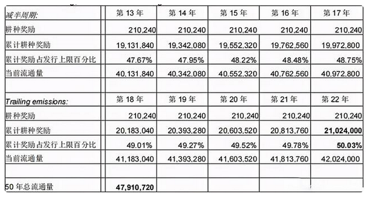
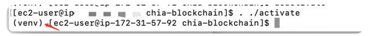
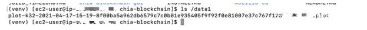
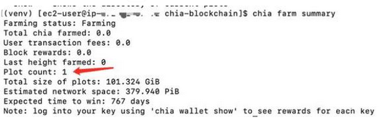
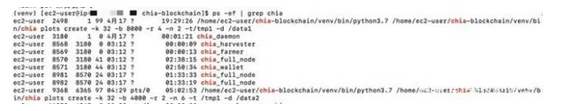
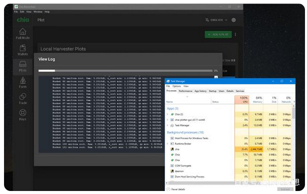
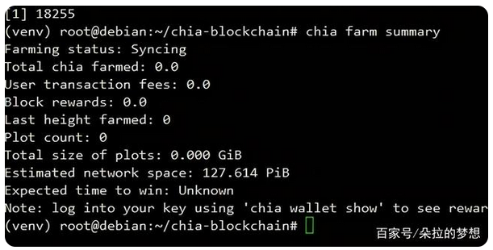

#   名称：Chia

中文名称：奇亚 缩写：XCH 是否ICO：否

是否预挖：2100万个作为战略储备，详情查看技术绿皮书

每块收益：每10分钟64个Chia奖励减半策略：3年一减半，第十三年起每10分钟4Chia

#   工作原理及竞争力

与现有加密货币的不同，chia 使用硬盘上的闲置磁盘空间来运行空间证明(PoSpace)，并与另一个共识算法—时间证明(PoTime)进行协调来验证区块链。Chia 农民的收益与资源量存储空间成正比;如果你有 10 倍的空间，你会得到 10 倍的奖励。但这里的 POST 不同于Filecoin 也不同于比特币的采矿机制。Chia用空余磁盘空间播种与比特币矿机用算力挖矿一样，但是 chia 更适合普通用户的参与，减少额外的 ASIC、算力、电力消耗。

简单来说首先你得准备好一块肥沃的土地(硬盘)，然后你在地上种满果蔬(chia播种)，等待果蔬成熟了，你可以自己收取(收益)，也可以给别人收取。地(硬盘)越大收益越高。

Chia农场不需要 ASIC 硬件。理论上而言，普通的笔记本电脑就可以操作—利用电脑上的闲置存储空间。科恩说 “ 奖励与你投入的资源量成正比。如果你有 10 倍的空间，你会得到 10 倍的奖励。但投入十分之一的人仍然可以获得奖励。“

#   挖矿经济模型

在奇亚网络的区块链上，通过耕种奖励(farming)可能产生的奇亚币总数没有上限，也没有限制。在启动后的第六年年底，截至该日产生的所有耕种奖励(farming)将占当时所有奇亚币的42%。从主网启动后，随着尾随排放在第13年开始放缓，养殖奖励大约需要21年才能与奇亚网络的战略储备规模持平。

这个释放计划时间表受比特币的释放时间表影响，并针对Chia(奇亚)区块链的一些不同的数学基础进行了调整，比如平均每天4608次奖励机会，以及较快的减半速度。

下表比较了比特币在每四年减半期间的挖矿总量和Chia(奇亚)币在每三年减半期间的产出量:



#   AWS云服务器基本说明

1.	首先选择服务器配置
2.	磁盘的话，gp3是SSD，做临时文件盘，st1便宜，做最终存Plot文件的盘。AWS的EBS有个比较强大的地方，就是可以单独给磁盘配置IOPS和吞吐。比如我500GB的SSD，默认IOPS 3000，吞吐125MB，运行两个任务时，吞吐先到达瓶颈，这时候你可以动态提升吞吐值（当然也会有额外的费用）
3.	选择操作系统一般选默认。
4.	操作系统这里划重点【如果你选择官方系统】，系统会检测你在使用挖矿程序，会对你进行封号拉黑处理，这里需要用到独立版Liunx系统（含有反监控技术 有效防止云服务厂商 封号 拉黑 限制等问题）

#   chia相关工具安装与配置

```
ssh -i "aws-mark.pem" ec2-user@xxx-xxx-xxx-xxx.us-west-2.compute.amazonaws.com -o ServerAliveInterval=30
```

#   挂载申请的磁盘

1.  列出磁盘状态

```
lsblk
```

2.  创建文件目录

```
sudo mkdir /tmp1
sudo mkdir /data1
```

3.  挂载

```
sudo mount /dev/nvme1n1 /tmp1
sudo mount /dev/nvme2n1 /data1
```

4.  更改目录Owner，注意不改文件夹权限P盘的时候会报错

```
sudo chown -R ec2-user.ec2-user /tmp1
sudo chown -R ec2-user.ec2-user /data1
```

#   开始安装chia相关工具

```
sudo yum update -y
sudo yum install python3 git -y
git clone https://github.com/Chia-Network/chia-blockchain.git -b latestcd chia-blockchainsh install.sh. ./activate
```

注意". ./activate"这个一定不要打错，执行完之后会进入一个python虚拟环境，如下所示，会有一个（venv）的前缀



首次安装，执行,执行完后会生成20几个助记词，要保存好，丢失了钱就没了

```
chia init
```

添加你的key（就是那20几个助记词）

```
chia keys add
```

启动挖矿

```
chia start farmer
```

上面的命令会把full-node、farmer、harvester、wallet都启动，命令参考：https://github.com/Chia-Network/chia-blockchain/wiki/CLI-Commands-Reference

这个命令可以查看下钱包，核对下跟你之前的指纹是否一致

```
chia wallet show
```

#   P盘

```
nohup chia plots create -k 32 -b 4000 -r 2 -n 6 -t /tmp1 -d /data1 >> plots2.log 2>&1 &
```

指令详解

+   -b就是使用的缓存大小（MB），我的系统是16GB的，所以我运行了两个任务，一个-b 8000，一个-b 4000，留一部分内存给其他进程。
+   -n 6就是要连续制作6个plot文件
+   -r就是并发线程，官网说默认2就比较好了，具体没研究。
+   -t /tmp1，临时盘的目录地址
+   -d /data1，最终存储plot文件的地址
+   nohup这个是为了让进程后台运行，我第一运行的时候，远程cli退出，这个进程就退了，p盘到一半，任务全白做，要重新P

P好之后就会出现.plot文件了



#   查看farm情况

```
chia farm summary
```



如果还不放心，可以时不时看看进程是否还在运行，可以看看进程

```
ps -ef | grep chia
```




#   Windows挖矿与Liunx挖矿区别
同等配置情况下（2H4G1T）win系统11小时还未下完P盘(播种)，而Liunx7小时已经结束1TP盘(播种)下载。






