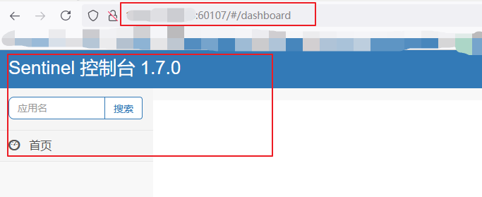

#   安装sentinel

---

#   下载
+   https://github.com/alibaba/Sentinel/releases
+   下载`sentinel-dashboard-1.7.0.jar`
+   我放在`/opt/module/sentinel/`目录下

#   运行命令
+   前提:Java 8 环境
+   启动命令

```
nohup java -Dserver.port=60107 -Dsentinel.dashboard.auth.username=sentinel -Dsentinel.dashboard.auth.password=sentinel -jar /opt/module/sentinel/sentinel-dashboard-1.7.0.jar >/dev/null 2>&1 &
```

说明

+   -Dserver.port => 指定端口
+   -Dsentinel.dashboard.auth.username => 指定用户名
+   -Dsentinel.dashboard.auth.password => 指定密码

#   访问Sentinel管理界面
+   http://ip:60107/#/dashboard
+   登录账号密码均为sentinel



