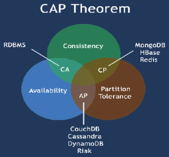
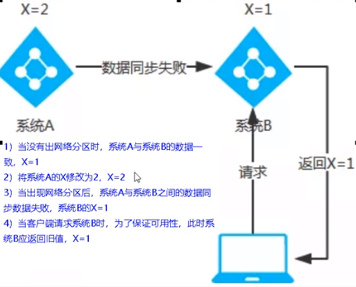
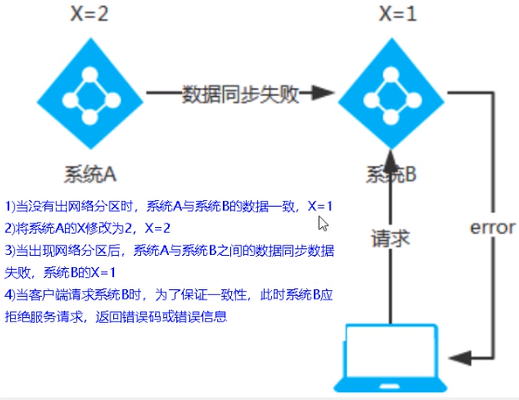

#   SpringCloud-06-三个注册中心异同点

---

##  35_三个注册中心异同点
|  组件名   | 语言CAP | 服务健康检查 | 对外暴露接口 | Spring Cloud集成 |
|-----------|---------|--------------|--------------|------------------|
| Eureka    | Java    | AP           | 可配支持     | HTTP             |
| Consul    | Go      | CP           | 支持         | HTTP/DNS         |
| Zookeeper | Java    | CP           | 支持客户端   | 已集成           |

##  CAP

+   C：Consistency (强一致性)
+   A：Availability (可用性)
+   P：Partition tolerance （分区容错性)

最多只能同时较好的满足两个。

CAP理论的核心是：一个分布式系统不可能同时很好的满足一致性，可用性和分区容错性这三个需求。

因此，根据CAP原理将NoSQL数据库分成了满足CA原则、满足CP原则和满足AP原则三大类:

+   CA - 单点集群，满足—致性，可用性的系统，通常在可扩展性上不太强大。
+   CP - 满足一致性，分区容忍必的系统，通常性能不是特别高。
+   AP - 满足可用性，分区容忍性的系统，通常可能对一致性要求低一些。

##  AP架构（Eureka）

当网络分区出现后，为了保证可用性，系统B可以返回旧值，保证系统的可用性。

结论：违背了一致性C的要求，只满足可用性和分区容错，即AP

##  CP架构（ZooKeeper/Consul）

当网络分区出现后，为了保证一致性，就必须拒接请求，否则无法保证一致性。

结论：违背了可用性A的要求，只满足一致性和分区容错，即CP。

CP 与 AP 对立同一的矛盾关系。
