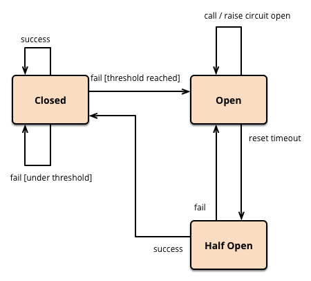
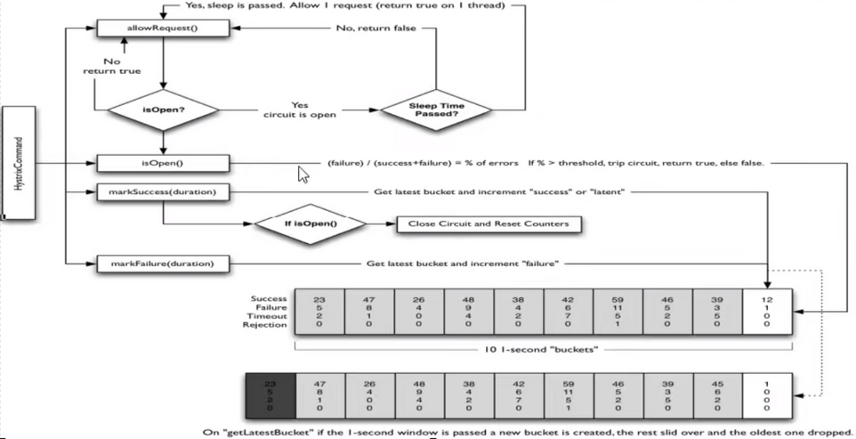
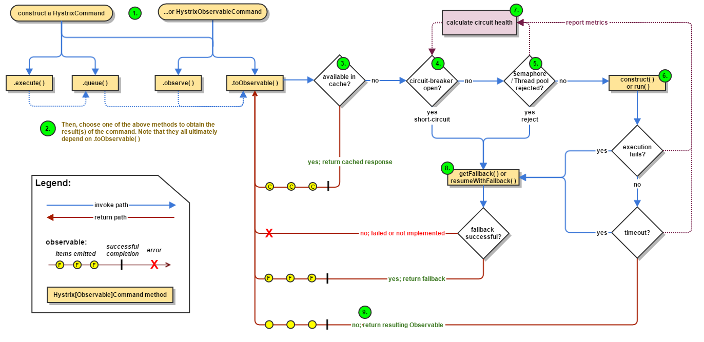
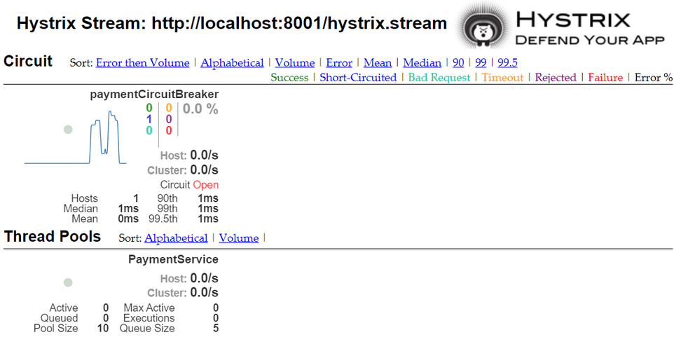
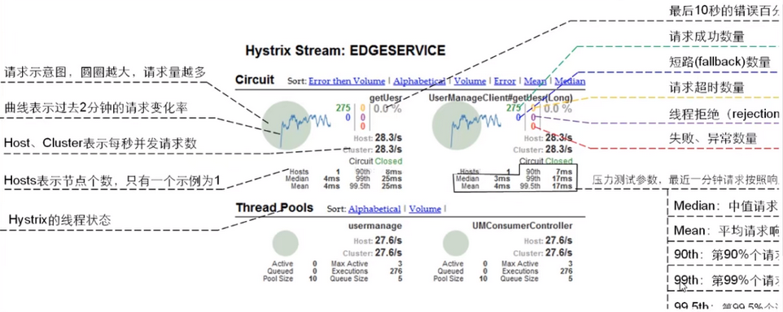

# SpringCloud-09-Hystrix

---
## 47_Hystrix是什么

### 概述

**分布式系统面临的问题**

复杂分布式体系结构中的应用程序有数十个依赖关系，每个依赖关系在某些时候将不可避免地失败。

**服务雪崩**

多个微服务之间调用的时候，假设微服务A调用微服务B和微服务C，微服务B和微服务C又调用其它的微服务，这就是所谓的“扇出”。如果扇出的链路上某个微服务的调用响应时间过长或者不可用，对微服务A的调用就会占用越来越多的系统资源，进而引起系统崩溃，所谓的“雪崩效应”.
对于高流量的应用来说，单一的后避依赖可能会导致所有服务器上的所有资源都在几秒钟内饱和。比失败更糟糕的是，这些应用程序还可能导致服务之间的延迟增加，备份队列，线程和其他系统资源紧张，导致整个系统发生更多的级联故障。这些都表示需要对故障和延迟进行隔离和管理，以便单个依赖关系的失败，不能取消整个应用程序或系统。

所以，通常当你发现一个模块下的某个实例失败后，这时候这个模块依然还会接收流量，然后这个有问题的模块还调用了其他的模块，这样就会发生级联故障，或者叫雪崩。

**Hystrix是什么**

Hystrix是一个用于处理分布式系统的延迟和容错的开源库，在分布式系统里，许多依赖不可避免的会调用失败，比如超时、异常等，Hystrix能够保证在一个依赖出问题的情况下，不会导致整体服务失败，避免级联故障，以提高分布式系统的弹性。

"断路器”本身是一种开关装置，当某个服务单元发生故障之后，通过断路器的故障监控（类似熔断保险丝)，向调用方返回一个符合预期的、可处理的备选响应（FallBack)，而不是长时间的等待或者抛出调用方无法处理的异常，这样就保证了服务调用方的线程不会被长时间、不必要地占用，从而避免了故障在分布式系统中的蔓延，乃至雪崩。

>   hystrix
>   n. 豪猪属;猬草属;豪猪;豪猪亚属

## 48_Hystrix停更进维

### 能干嘛

+   服务降级
+   服务熔断
+   接近实对的监控
+   …

### 官网资料

[link](https://github.com/Netflix/Hystrix/wiki/How-To-Use)

### Hystrix官宣，停更进维

[link](https://github.com/Netflix/Hystrix)

+   被动修bugs
+   不再接受合并请求
+   不再发布新版本

## 49_Hystrix的服务降级熔断限流概念初讲

### 服务降级

服务器忙，请稍后再试，不让客户端等待并立刻返回一个友好提示，fallback

### 哪些情况会出发降级

+   程序运行导常
+   超时
+   服务熔断触发服务降级
+   线程池/信号量打满也会导致服务降级

### 服务熔断

`类比保险丝`达到最大服务访问后，直接拒绝访问，拉闸限电，然后调用服务降级的方法并返回友好提示。

服务的降级 -> 进而熔断 -> 恢复调用链路

### 服务限流

秒杀高并发等操作，严禁一窝蜂的过来拥挤，大家排队，一秒钟N个，有序进行。
50_Hystrix支付微服务构建

将cloud-eureka-server7001改配置成单机版

1.  新建cloud-provider-hygtrix-payment8001

2.  POM

```xml
<?xml version="1.0" encoding="UTF-8"?>
<project xmlns="http://maven.apache.org/POM/4.0.0"
         xmlns:xsi="http://www.w3.org/2001/XMLSchema-instance"
         xsi:schemaLocation="http://maven.apache.org/POM/4.0.0 http://maven.apache.org/xsd/maven-4.0.0.xsd">
    <parent>
        <artifactId>cloud2020</artifactId>
        <groupId>com.atguigu.springcloud</groupId>
        <version>1.0-SNAPSHOT</version>
    </parent>
    <modelVersion>4.0.0</modelVersion>

    <artifactId>cloud-provider-hystrix-payment8001</artifactId>

    <dependencies>
        <!--hystrix-->
        <dependency>
            <groupId>org.springframework.cloud</groupId>
            <artifactId>spring-cloud-starter-netflix-hystrix</artifactId>
        </dependency>
        <!--eureka client-->
        <dependency>
            <groupId>org.springframework.cloud</groupId>
            <artifactId>spring-cloud-starter-netflix-eureka-client</artifactId>
        </dependency>
        <!--web-->
        <dependency>
            <groupId>org.springframework.boot</groupId>
            <artifactId>spring-boot-starter-web</artifactId>
        </dependency>
        <dependency>
            <groupId>org.springframework.boot</groupId>
            <artifactId>spring-boot-starter-actuator</artifactId>
        </dependency>
        <dependency><!-- 引入自己定义的api通用包，可以使用Payment支付Entity -->
            <groupId>com.atguigu.springcloud</groupId>
            <artifactId>cloud-api-commons</artifactId>
            <version>${project.version}</version>
        </dependency>
        <dependency>
            <groupId>org.springframework.boot</groupId>
            <artifactId>spring-boot-devtools</artifactId>
            <scope>runtime</scope>
            <optional>true</optional>
        </dependency>
        <dependency>
            <groupId>org.projectlombok</groupId>
            <artifactId>lombok</artifactId>
            <optional>true</optional>
        </dependency>
        <dependency>
            <groupId>org.springframework.boot</groupId>
            <artifactId>spring-boot-starter-test</artifactId>
            <scope>test</scope>
        </dependency>
    </dependencies>

</project>
```

3.  YML

```yaml
server:
  port: 8001

spring:
  application:
    name: cloud-provider-hystrix-payment

eureka:
  client:
    register-with-eureka: true
    fetch-registry: true
    service-url:
      #defaultZone: http://eureka7001.com:7001/eureka,http://eureka7002.com:7002/eureka
      defaultZone: http://eureka7001.com:7001/eureka
```

4.  主启动

```java
import org.springframework.boot.SpringApplication;
import org.springframework.boot.autoconfigure.SpringBootApplication;
import org.springframework.cloud.netflix.eureka.EnableEurekaClient;

/**
 */
@SpringBootApplication
@EnableEurekaClient
public class PaymentHystrixMain8001
{
    public static void main(String[] args) {
            SpringApplication.run(PaymentHystrixMain8001.class, args);
    }
}
```

5.  业务类

service

```java
import org.springframework.stereotype.Service;

import java.util.concurrent.TimeUnit;

/**
 */
@Service
public class PaymentService {
    /**
     */
    public String paymentInfo_OK(Integer id)
    {
        return "线程池:  "+Thread.currentThread().getName()+"  paymentInfo_OK,id:  "+id+"\t"+"O(∩_∩)O哈哈~";
    }

    public String paymentInfo_TimeOut(Integer id)
    {
        try { TimeUnit.MILLISECONDS.sleep(3000); } catch (InterruptedException e) { e.printStackTrace(); }
        return "线程池:  "+Thread.currentThread().getName()+" id:  "+id+"\t"+"O(∩_∩)O哈哈~"+"  耗时(秒): 3";
    }
}
```

controller

```java
import com.lun.springcloud.service.PaymentService;
import lombok.extern.slf4j.Slf4j;
import org.springframework.beans.factory.annotation.Value;
import org.springframework.web.bind.annotation.GetMapping;
import org.springframework.web.bind.annotation.PathVariable;
import org.springframework.web.bind.annotation.RestController;

import javax.annotation.Resource;

/**
 */
@RestController
@Slf4j
public class PaymentController
{
    @Resource
    private PaymentService paymentService;

    @Value("${server.port}")
    private String serverPort;

    @GetMapping("/payment/hystrix/ok/{id}")
    public String paymentInfo_OK(@PathVariable("id") Integer id)
    {
        String result = paymentService.paymentInfo_OK(id);
        log.info("*****result: "+result);
        return result;
    }

    @GetMapping("/payment/hystrix/timeout/{id}")
    public String paymentInfo_TimeOut(@PathVariable("id") Integer id)
    {
        String result = paymentService.paymentInfo_TimeOut(id);
        log.info("*****result: "+result);
        return result;
    }
}
```

6.  正常测试

启动eureka7001

启动cloud-provider-hystrix-payment8001

访问

success的方法 - http://localhost:8001/payment/hystrix/ok/1
每次调用耗费5秒钟 - http://localhost:8001/payment/hystrix/timeout/1

上述module均OK

以上述为根基平台，从正确 -> 错误 -> 降级熔断 -> 恢复。

## 51_JMeter高并发压测后卡顿
上述在非高并发情形下，还能勉强满足

### Jmeter压测测试

[JMeter官网](https://jmeter.apache.org/index.html)

    The Apache JMeter™ application is open source software, a 100% pure Java application designed to load test functional behavior and measure performance. It was originally designed for testing Web Applications but has since expanded to other test functions.

开启Jmeter，来20000个并发压死8001，20000个请求都去访问paymentInfo_TimeOut服务

1.  测试计划中右键添加-》线程-》线程组（线程组202102，线程数：200，线程数：100，其他参数默认）

2.  刚刚新建线程组202102，右键它-》添加-》取样器-》Http请求-》基本 输入http://localhost:8001/payment/hystrix/ok/1

3.  点击绿色三角形图标启动。

看演示结果：拖慢，原因：tomcat的默认的工作线程数被打满了，没有多余的线程来分解压力和处理。

### Jmeter压测结论

上面还是服务提供者8001自己测试，假如此时外部的消费者80也来访问，那消费者只能干等，最终导致消费端80不满意，服务端8001直接被拖慢。

## 52_订单微服务调用支付服务出现卡顿

看热闹不嫌弃事大，80新建加入

1.  新建 - cloud-consumer-feign-hystrix-order80

2.  POM

```xml
<?xml version="1.0" encoding="UTF-8"?>
<project xmlns="http://maven.apache.org/POM/4.0.0"
         xmlns:xsi="http://www.w3.org/2001/XMLSchema-instance"
         xsi:schemaLocation="http://maven.apache.org/POM/4.0.0 http://maven.apache.org/xsd/maven-4.0.0.xsd">
    <parent>
        <artifactId>LearnCloud</artifactId>
        <groupId>com.lun.springcloud</groupId>
        <version>1.0.0-SNAPSHOT</version>
    </parent>
    <modelVersion>4.0.0</modelVersion>

    <artifactId>cloud-consumer-feign-hystrix-order80</artifactId>

    <dependencies>
        <!--openfeign-->
        <dependency>
            <groupId>org.springframework.cloud</groupId>
            <artifactId>spring-cloud-starter-openfeign</artifactId>
        </dependency>
        <!--hystrix-->
        <dependency>
            <groupId>org.springframework.cloud</groupId>
            <artifactId>spring-cloud-starter-netflix-hystrix</artifactId>
        </dependency>
        <!--eureka client-->
        <dependency>
            <groupId>org.springframework.cloud</groupId>
            <artifactId>spring-cloud-starter-netflix-eureka-client</artifactId>
        </dependency>
        <!-- 引入自己定义的api通用包，可以使用Payment支付Entity -->
        <dependency>
            <groupId>com.lun.springcloud</groupId>
            <artifactId>cloud-api-commons</artifactId>
            <version>${project.version}</version>
        </dependency>
        <!--web-->
        <dependency>
            <groupId>org.springframework.boot</groupId>
            <artifactId>spring-boot-starter-web</artifactId>
        </dependency>
        <dependency>
            <groupId>org.springframework.boot</groupId>
            <artifactId>spring-boot-starter-actuator</artifactId>
        </dependency>
        <!--一般基础通用配置-->
        <dependency>
            <groupId>org.springframework.boot</groupId>
            <artifactId>spring-boot-devtools</artifactId>
            <scope>runtime</scope>
            <optional>true</optional>
        </dependency>
        <dependency>
            <groupId>org.projectlombok</groupId>
            <artifactId>lombok</artifactId>
            <optional>true</optional>
        </dependency>
        <dependency>
            <groupId>org.springframework.boot</groupId>
            <artifactId>spring-boot-starter-test</artifactId>
            <scope>test</scope>
        </dependency>
    </dependencies>
</project>
```

3.  YML

```yaml
server:
  port: 80

eureka:
  client:
    register-with-eureka: false
    service-url:
      defaultZone: http://eureka7001.com:7001/eureka/
```

4.  主启动

```java
import org.springframework.boot.SpringApplication;
import org.springframework.boot.autoconfigure.SpringBootApplication;
import org.springframework.cloud.netflix.hystrix.EnableHystrix;
import org.springframework.cloud.openfeign.EnableFeignClients;

/**
 */
@SpringBootApplication
@EnableFeignClients
//@EnableHystrix
public class OrderHystrixMain80
{
    public static void main(String[] args)
    {
        SpringApplication.run(OrderHystrixMain80.class,args);
    }
}
```

5.  业务类

```java
import org.springframework.cloud.openfeign.FeignClient;
import org.springframework.stereotype.Component;
import org.springframework.web.bind.annotation.GetMapping;
import org.springframework.web.bind.annotation.PathVariable;

/**
 */
@Component
@FeignClient(value = "CLOUD-PROVIDER-HYSTRIX-PAYMENT" /*,fallback = PaymentFallbackService.class*/)
public interface PaymentHystrixService
{
    @GetMapping("/payment/hystrix/ok/{id}")
    public String paymentInfo_OK(@PathVariable("id") Integer id);

    @GetMapping("/payment/hystrix/timeout/{id}")
    public String paymentInfo_TimeOut(@PathVariable("id") Integer id);
}
```

```java
import com.lun.springcloud.service.PaymentHystrixService;
import lombok.extern.slf4j.Slf4j;
import org.springframework.web.bind.annotation.GetMapping;
import org.springframework.web.bind.annotation.PathVariable;
import org.springframework.web.bind.annotation.RestController;

import javax.annotation.Resource;

@RestController
@Slf4j
public class OrderHystirxController {
    @Resource
    private PaymentHystrixService paymentHystrixService;

    @GetMapping("/consumer/payment/hystrix/ok/{id}")
    public String paymentInfo_OK(@PathVariable("id") Integer id)
    {
        String result = paymentHystrixService.paymentInfo_OK(id);
        return result;
    }

    @GetMapping("/consumer/payment/hystrix/timeout/{id}")
    public String paymentInfo_TimeOut(@PathVariable("id") Integer id) {
        String result = paymentHystrixService.paymentInfo_TimeOut(id);
        return result;
    }
}
```

6.  正常测试

http://localhost/consumer/payment/hystrix/ok/1

7.  高并发测试

2W个线程压8001

消费端80微服务再去访问正常的Ok微服务8001地址

http://localhost/consumer/payment/hystrix/ok/32

消费者80被拖慢

原因：8001同一层次的其它接口服务被困死，因为tomcat线程池里面的工作线程已经被挤占完毕。

正因为有上述故障或不佳表现才有我们的降级/容错/限流等技术诞生。

## 53_降级容错解决的维度要求

超时导致服务器变慢(转圈) - 超时不再等待

出错(宕机或程序运行出错) - 出错要有兜底

解决：

+   对方服务(8001)超时了，调用者(80)不能一直卡死等待，必须有服务降级。
+   对方服务(8001)down机了，调用者(80)不能一直卡死等待，必须有服务降级。
+   对方服务(8001)OK，调用者(80)自己出故障或有自我要求(自己的等待时间小于服务提供者)，自己处理降级。

## 54_Hystrix之服务降级支付侧fallback

降级配置 - @HystrixCommand

8001先从自身找问题

`设置自身调用超时时间的峰值，峰值内可以正常运行，超过了需要有兜底的方法处埋，作服务降级fallback`。

`8001fallback`

业务类启用 - @HystrixCommand报异常后如何处理

—旦调用服务方法失败并抛出了错误信息后，会自动调用@HystrixCommand标注好的fallbackMethod调用类中的指定方法

```java
@Service
public class PaymentService{

    @HystrixCommand(fallbackMethod = "paymentInfo_TimeOutHandler"/*指定善后方法名*/,commandProperties = {
            @HystrixProperty(name="execution.isolation.thread.timeoutInMilliseconds",value="3000")
    })
    public String paymentInfo_TimeOut(Integer id)
    {
        //int age = 10/0;
        try { TimeUnit.MILLISECONDS.sleep(5000); } catch (InterruptedException e) { e.printStackTrace(); }
        return "线程池:  "+Thread.currentThread().getName()+" id:  "+id+"\t"+"O(∩_∩)O哈哈~"+"  耗时(秒): ";
    }

    //用来善后的方法
    public String paymentInfo_TimeOutHandler(Integer id)
    {
        return "线程池:  "+Thread.currentThread().getName()+"  8001系统繁忙或者运行报错，请稍后再试,id:  "+id+"\t"+"o(╥﹏╥)o";
    }
    
}
```

上面故意制造两种异常:

+   int age = 10/0，计算异常
+   我们能接受3秒钟，它运行5秒钟，超时异常。

当前服务不可用了，做服务降级，兜底的方案都是paymentInfo_TimeOutHandler

**主启动类激活**

添加新注解@EnableCircuitBreaker

```java
import org.springframework.boot.SpringApplication;
import org.springframework.boot.autoconfigure.SpringBootApplication;
import org.springframework.cloud.client.circuitbreaker.EnableCircuitBreaker;
import org.springframework.cloud.netflix.eureka.EnableEurekaClient;

@SpringBootApplication
@EnableEurekaClient
@EnableCircuitBreaker//添加到此处
public class PaymentHystrixMain8001{
    public static void main(String[] args) {
            SpringApplication.run(PaymentHystrixMain8001.class, args);
    }
}
```

## 55_Hystrix之服务降级订单侧fallback

80订单微服务，也可以更好的保护自己，自己也依样画葫芦进行客户端降级保护

题外话，切记 - 我们自己配置过的热部署方式对java代码的改动明显

但对@HystrixCommand内属性的修改建议重启微服务

YML

```yaml
server:
  port: 80

eureka:
  client:
    register-with-eureka: false
    service-url:
      defaultZone: http://eureka7001.com:7001/eureka/

#开启
feign:
  hystrix:
    enabled: true
```

主启动

```java
import org.springframework.boot.SpringApplication;
import org.springframework.boot.autoconfigure.SpringBootApplication;
import org.springframework.cloud.netflix.hystrix.EnableHystrix;
import org.springframework.cloud.openfeign.EnableFeignClients;

@SpringBootApplication
@EnableFeignClients
@EnableHystrix//添加到此处
public class OrderHystrixMain80{
    
    public static void main(String[] args){
        SpringApplication.run(OrderHystrixMain80.class,args);
    }
}
```

业务类

```java
import com.lun.springcloud.service.PaymentHystrixService;
import com.netflix.hystrix.contrib.javanica.annotation.HystrixCommand;
import com.netflix.hystrix.contrib.javanica.annotation.HystrixProperty;
import lombok.extern.slf4j.Slf4j;
import org.springframework.web.bind.annotation.GetMapping;
import org.springframework.web.bind.annotation.PathVariable;
import org.springframework.web.bind.annotation.RestController;

import javax.annotation.Resource;

@RestController
@Slf4j
public class OrderHystirxController {
    @Resource
    private PaymentHystrixService paymentHystrixService;


    @GetMapping("/consumer/payment/hystrix/timeout/{id}")
    @HystrixCommand(fallbackMethod = "paymentTimeOutFallbackMethod",commandProperties = {
            @HystrixProperty(name="execution.isolation.thread.timeoutInMilliseconds",value="1500")
    })
    public String paymentInfo_TimeOut(@PathVariable("id") Integer id) {
        //int age = 10/0;
        String result = paymentHystrixService.paymentInfo_TimeOut(id);
        return result;
    }
    
    //善后方法
    public String paymentTimeOutFallbackMethod(@PathVariable("id") Integer id){
        return "我是消费者80,对方支付系统繁忙请10秒钟后再试或者自己运行出错请检查自己,o(╥﹏╥)o";
    }
}
```

## 56_Hystrix之全局服务降级DefaultProperties

目前问题1 每个业务方法对应一个兜底的方法，代码膨胀

解决方法

1:1每个方法配置一个服务降级方法，技术上可以，但是不聪明

1:N除了个别重要核心业务有专属，其它普通的可以通过@DefaultProperties(defaultFallback = “”)统一跳转到统一处理结果页面

通用的和独享的各自分开，避免了代码膨胀，合理减少了代码量

```java
import com.lun.springcloud.service.PaymentHystrixService;
import com.netflix.hystrix.contrib.javanica.annotation.DefaultProperties;
import com.netflix.hystrix.contrib.javanica.annotation.HystrixCommand;
import lombok.extern.slf4j.Slf4j;
import org.springframework.web.bind.annotation.GetMapping;
import org.springframework.web.bind.annotation.PathVariable;
import org.springframework.web.bind.annotation.RestController;

import javax.annotation.Resource;

@RestController
@Slf4j
@DefaultProperties(defaultFallback = "payment_Global_FallbackMethod")
public class OrderHystirxController {
    @Resource
    private PaymentHystrixService paymentHystrixService;

    @GetMapping("/consumer/payment/hystrix/ok/{id}")
    public String paymentInfo_OK(@PathVariable("id") Integer id)
    {
        String result = paymentHystrixService.paymentInfo_OK(id);
        return result;
    }

    @GetMapping("/consumer/payment/hystrix/timeout/{id}")
//    @HystrixCommand(fallbackMethod = "paymentTimeOutFallbackMethod",commandProperties = {
//            @HystrixProperty(name="execution.isolation.thread.timeoutInMilliseconds",value="1500")
//    })
    @HystrixCommand//用全局的fallback方法
    public String paymentInfo_TimeOut(@PathVariable("id") Integer id) {
        //int age = 10/0;
        String result = paymentHystrixService.paymentInfo_TimeOut(id);
        return result;
    }
    public String paymentTimeOutFallbackMethod(@PathVariable("id") Integer id)
    {
        return "我是消费者80,对方支付系统繁忙请10秒钟后再试或者自己运行出错请检查自己,o(╥﹏╥)o";
    }

    // 下面是全局fallback方法
    public String payment_Global_FallbackMethod()
    {
        return "Global异常处理信息，请稍后再试，/(ㄒoㄒ)/~~";
    }
}
```

## 57_Hystrix之通配服务降级FeignFallback

**目前问题2** 统一和自定义的分开，代码混乱

`服务降级，客户端去调用服务端，碰上服务端宕机或关闭`

本次案例服务降级处理是在客户端80实现完成的，与服务端8001没有关系，只需要为Feign客户端定义的接口添加一个服务降级处理的实现类即可实现解耦

**未来我们要面对的异常**

+   运行
+   超时
+   宕机

**修改cloud-consumer-feign-hystrix-order80**

根据cloud-consumer-feign-hystrix-order80已经有的PaymentHystrixService接口，
重新新建一个类(AaymentFallbackService)实现该接口，统一为接口里面的方法进行异常处理

PaymentFallbackService类实现PaymentHystrixService接口

```java
import org.springframework.stereotype.Component;

@Component
public class PaymentFallbackService implements PaymentHystrixService
{
    @Override
    public String paymentInfo_OK(Integer id)
    {
        return "-----PaymentFallbackService fall back-paymentInfo_OK ,o(╥﹏╥)o";
    }

    @Override
    public String paymentInfo_TimeOut(Integer id)
    {
        return "-----PaymentFallbackService fall back-paymentInfo_TimeOut ,o(╥﹏╥)o";
    }
}
```

YML

```yaml
server:
  port: 80

eureka:
  client:
    register-with-eureka: false
    service-url:
      defaultZone: http://eureka7001.com:7001/eureka/

#开启
feign:
  hystrix:
    enabled: true
```

PaymentHystrixService接口

```java
import org.springframework.cloud.openfeign.FeignClient;
import org.springframework.stereotype.Component;
import org.springframework.web.bind.annotation.GetMapping;
import org.springframework.web.bind.annotation.PathVariable;

@Component
@FeignClient(value = "CLOUD-PROVIDER-HYSTRIX-PAYMENT" ,//
             fallback = PaymentFallbackService.class)//指定PaymentFallbackService类
public interface PaymentHystrixService
{
    @GetMapping("/payment/hystrix/ok/{id}")
    public String paymentInfo_OK(@PathVariable("id") Integer id);

    @GetMapping("/payment/hystrix/timeout/{id}")
    public String paymentInfo_TimeOut(@PathVariable("id") Integer id);
}
```

测试

单个eureka先启动7001

PaymentHystrixMain8001启动

正常访问测试 - http://localhost/consumer/payment/hystrix/ok/1

故意关闭微服务8001

客户端自己调用提示 - 此时服务端provider已经down了，但是我们做了服务降级处理，让客户端在服务端不可用时也会获得提示信息而不会挂起耗死服务器。

## 58_Hystrix之服务熔断理论

断路器，相当于保险丝。

熔断机制概述

熔断机制是应对雪崩效应的一种微服务链路保护机制。当扇出链路的某个微服务出错不可用或者响应时间太长时，会进行服务的降级，进而熔断该节点微服务的调用，快速返回错误的响应信息。当检测到该节点微服务调用响应正常后，恢复调用链路。

在Spring Cloud框架里，熔断机制通过Hystrix实现。Hystrix会监控微服务间调用的状况，当失败的调用到一定阈值，缺省是5秒内20次调用失败，就会启动熔断机制。熔断机制的注解是@HystrixCommand。

[Martin Fowler的相关论文](https://martinfowler.com/bliki/CircuitBreaker.html)


## 59_Hystrix之服务熔断案例(上)

[Hutool国产工具类](https://hutool.cn/)

修改cloud-provider-hystrix-payment8001

```java
import cn.hutool.core.util.IdUtil;
import com.netflix.hystrix.contrib.javanica.annotation.HystrixCommand;
import com.netflix.hystrix.contrib.javanica.annotation.HystrixProperty;
import org.springframework.stereotype.Service;
import org.springframework.web.bind.annotation.PathVariable;

import java.util.concurrent.TimeUnit;

@Service
public class PaymentService{    

    ...
    
    //=====服务熔断
    @HystrixCommand(fallbackMethod = "paymentCircuitBreaker_fallback",commandProperties = {
            @HystrixProperty(name = "circuitBreaker.enabled",value = "true"),// 是否开启断路器
            @HystrixProperty(name = "circuitBreaker.requestVolumeThreshold",value = "10"),// 请求次数
            @HystrixProperty(name = "circuitBreaker.sleepWindowInMilliseconds",value = "10000"), // 时间窗口期
            @HystrixProperty(name = "circuitBreaker.errorThresholdPercentage",value = "60"),// 失败率达到多少后跳闸
    })
    public String paymentCircuitBreaker(@PathVariable("id") Integer id) {
        if(id < 0) {
            throw new RuntimeException("******id 不能负数");
        }
        String serialNumber = IdUtil.simpleUUID();

        return Thread.currentThread().getName()+"\t"+"调用成功，流水号: " + serialNumber;
    }
    public String paymentCircuitBreaker_fallback(@PathVariable("id") Integer id) {
        return "id 不能负数，请稍后再试，/(ㄒoㄒ)/~~   id: " +id;
    }
}
```

>   The precise way that the circuit opening and closing occurs is as follows:
>
>   1.  Assuming the volume across a circuit meets a certain threshold : `HystrixCommandProperties.circuitBreakerRequestVolumeThreshold()`
>   2.  And assuming that the error percentage, as defined above exceeds the error percentage defined in : `HystrixCommandProperties.circuitBreakerErrorThresholdPercentage()`
>   3.  Then the circuit-breaker transitions from CLOSED to OPEN.
>   4.  While it is open, it short-circuits all requests made against that circuit-breaker.
>   5.  After some amount of time (`HystrixCommandProperties.circuitBreakerSleepWindowInMilliseconds()`), the next request is let through. If it fails, the command stays OPEN for the sleep window. If it succeeds, it transitions to CLOSED and the logic in 1) takes over again.
>   
>   [link](https://github.com/Netflix/Hystrix/issues/674)

HystrixCommandProperties配置类

```java
package com.netflix.hystrix;

...

public abstract class HystrixCommandProperties {
    private static final Logger logger = LoggerFactory.getLogger(HystrixCommandProperties.class);

    /* defaults */
    /* package */ static final Integer default_metricsRollingStatisticalWindow = 10000;// default => statisticalWindow: 10000 = 10 seconds (and default of 10 buckets so each bucket is 1 second)
    private static final Integer default_metricsRollingStatisticalWindowBuckets = 10;// default => statisticalWindowBuckets: 10 = 10 buckets in a 10 second window so each bucket is 1 second
    private static final Integer default_circuitBreakerRequestVolumeThreshold = 20;// default => statisticalWindowVolumeThreshold: 20 requests in 10 seconds must occur before statistics matter
    private static final Integer default_circuitBreakerSleepWindowInMilliseconds = 5000;// default => sleepWindow: 5000 = 5 seconds that we will sleep before trying again after tripping the circuit
    private static final Integer default_circuitBreakerErrorThresholdPercentage = 50;// default => errorThresholdPercentage = 50 = if 50%+ of requests in 10 seconds are failures or latent then we will trip the circuit
    private static final Boolean default_circuitBreakerForceOpen = false;// default => forceCircuitOpen = false (we want to allow traffic)
    /* package */ static final Boolean default_circuitBreakerForceClosed = false;// default => ignoreErrors = false 
    private static final Integer default_executionTimeoutInMilliseconds = 1000; // default => executionTimeoutInMilliseconds: 1000 = 1 second
    private static final Boolean default_executionTimeoutEnabled = true;

    ...
}
```

## 60_Hystrix之服务熔断案例(下)
```java
@RestController
@Slf4j
public class PaymentController
{
    @Resource
    private PaymentService paymentService;

    ...
    
    //====服务熔断
    @GetMapping("/payment/circuit/{id}")
    public String paymentCircuitBreaker(@PathVariable("id") Integer id)
    {
        String result = paymentService.paymentCircuitBreaker(id);
        log.info("****result: "+result);
        return result;
    }
}
```

测试

自测cloud-provider-hystrix-payment8001

正确 - http://localhost:8001/payment/circuit/1

错误 - http://localhost:8001/payment/circuit/-1

多次错误，再来次正确，但错误得显示

重点测试 - 多次错误，然后慢慢正确，发现刚开始不满足条件，就算是正确的访问地址也不能进行

## 61_Hystrix之服务熔断总结

大神结论

[Martin Fowler的相关论文](https://martinfowler.com/bliki/CircuitBreaker.html)



熔断类型

+   熔断打开：请求不再进行调用当前服务，内部设置时钟一般为MTTR(平均故障处理时间)，当打开时长达到所设时钟则进入半熔断状态。
+   熔断关闭：熔断关闭不会对服务进行熔断。
+   熔断半开：部分请求根据规则调用当前服务，如果请求成功且符合规则则认为当前服务恢复正常，关闭熔断。

官网断路器流程图



官网步骤

>   The precise way that the circuit opening and closing occurs is as follows:
>
>   +   Assuming the volume across a circuit meets a certain threshold : `HystrixCommandProperties.circuitBreakerRequestVolumeThreshold()`
>   +   And assuming that the error percentage, as defined above exceeds the error percentage defined in : `HystrixCommandProperties.circuitBreakerErrorThresholdPercentage()`
>   +   Then the circuit-breaker transitions from CLOSED to OPEN.
>   +   While it is open, it short-circuits all requests made against that circuit-breaker.
>   +   After some amount of time (`HystrixCommandProperties.circuitBreakerSleepWindowInMilliseconds()`), the next request is let through. If it fails, the command stays OPEN for the sleep window. If it succeeds, it transitions to CLOSED and the logic in 1) takes over again.
>
>   [link](https://github.com/Netflix/Hystrix/issues/674)

**断路器在什么情况下开始起作用**

```java
//=====服务熔断
@HystrixCommand(fallbackMethod = "paymentCircuitBreaker_fallback",commandProperties = {
    @HystrixProperty(name = "circuitBreaker.enabled",value = "true"),// 是否开启断路器
    @HystrixProperty(name = "circuitBreaker.requestVolumeThreshold",value = "10"),// 请求次数
    @HystrixProperty(name = "circuitBreaker.sleepWindowInMilliseconds",value = "10000"), // 时间窗口期
    @HystrixProperty(name = "circuitBreaker.errorThresholdPercentage",value = "60"),// 失败率达到多少后跳闸
})
public String paymentCircuitBreaker(@PathVariable("id") Integer id) {
    ...
}
```

涉及到断路器的三个重要参数：

+   快照时间窗：断路器确定是否打开需要统计一些请求和错误数据，而统计的时间范围就是快照时间窗，默认为最近的10秒。
+   请求总数阀值：在快照时间窗内，必须满足请求总数阀值才有资格熔断。默认为20，意味着在10秒内，如果该hystrix命令的调用次数不足20次7,即使所有的请求都超时或其他原因失败，断路器都不会打开。
+   错误百分比阀值：当请求总数在快照时间窗内超过了阀值，比如发生了30次调用，如果在这30次调用中，有15次发生了超时异常，也就是超过50%的错误百分比，在默认设定50%阀值情况下，这时候就会将断路器打开。

**断路器开启或者关闭的条件**

+   到达以下阀值，断路器将会开启：
    -   当满足一定的阀值的时候（默认10秒内超过20个请求次数)
    -   当失败率达到一定的时候（默认10秒内超过50%的请求失败)
+   当开启的时候，所有请求都不会进行转发
+   一段时间之后（默认是5秒)，这个时候断路器是半开状态，会让其中一个请求进行转发。如果成功，断路器会关闭，若失败，继续开启。

**断路器打开之后**

1.  再有请求调用的时候，将不会调用主逻辑，而是直接调用降级fallback。通过断路器，实现了自动地发现错误并将降级逻辑切换为主逻辑，减少响应延迟的效果。
2.  原来的主逻辑要如何恢复呢？

对于这一问题，hystrix也为我们实现了自动恢复功能。

当断路器打开，对主逻辑进行熔断之后，hystrix会启动一个休眠时间窗，在这个时间窗内，降级逻辑是临时的成为主逻辑，当休眠时间窗到期，断路器将进入半开状态，释放一次请求到原来的主逻辑上，如果此次请求正常返回，那么断路器将继续闭合，主逻辑恢复，如果这次请求依然有问题，断路器继续进入打开状态，休眠时间窗重新计时。

**All配置**

```java
@HystrixCommand(fallbackMethod = "fallbackMethod", 
                groupKey = "strGroupCommand", 
                commandKey = "strCommand", 
                threadPoolKey = "strThreadPool",
                
                commandProperties = {
                    // 设置隔离策略，THREAD 表示线程池 SEMAPHORE：信号池隔离
                    @HystrixProperty(name = "execution.isolation.strategy", value = "THREAD"),
                    // 当隔离策略选择信号池隔离的时候，用来设置信号池的大小（最大并发数）
                    @HystrixProperty(name = "execution.isolation.semaphore.maxConcurrentRequests", value = "10"),
                    // 配置命令执行的超时时间
                    @HystrixProperty(name = "execution.isolation.thread.timeoutinMilliseconds", value = "10"),
                    // 是否启用超时时间
                    @HystrixProperty(name = "execution.timeout.enabled", value = "true"),
                    // 执行超时的时候是否中断
                    @HystrixProperty(name = "execution.isolation.thread.interruptOnTimeout", value = "true"),
                    
                    // 执行被取消的时候是否中断
                    @HystrixProperty(name = "execution.isolation.thread.interruptOnCancel", value = "true"),
                    // 允许回调方法执行的最大并发数
                    @HystrixProperty(name = "fallback.isolation.semaphore.maxConcurrentRequests", value = "10"),
                    // 服务降级是否启用，是否执行回调函数
                    @HystrixProperty(name = "fallback.enabled", value = "true"),
                    // 是否启用断路器
                    @HystrixProperty(name = "circuitBreaker.enabled", value = "true"),
                    // 该属性用来设置在滚动时间窗中，断路器熔断的最小请求数。例如，默认该值为 20 的时候，如果滚动时间窗（默认10秒）内仅收到了19个请求， 即使这19个请求都失败了，断路器也不会打开。
                    @HystrixProperty(name = "circuitBreaker.requestVolumeThreshold", value = "20"),
                    
                    // 该属性用来设置在滚动时间窗中，表示在滚动时间窗中，在请求数量超过 circuitBreaker.requestVolumeThreshold 的情况下，如果错误请求数的百分比超过50, 就把断路器设置为 "打开" 状态，否则就设置为 "关闭" 状态。
                    @HystrixProperty(name = "circuitBreaker.errorThresholdPercentage", value = "50"),
                    // 该属性用来设置当断路器打开之后的休眠时间窗。 休眠时间窗结束之后，会将断路器置为 "半开" 状态，尝试熔断的请求命令，如果依然失败就将断路器继续设置为 "打开" 状态，如果成功就设置为 "关闭" 状态。
                    @HystrixProperty(name = "circuitBreaker.sleepWindowinMilliseconds", value = "5000"),
                    // 断路器强制打开
                    @HystrixProperty(name = "circuitBreaker.forceOpen", value = "false"),
                    // 断路器强制关闭
                    @HystrixProperty(name = "circuitBreaker.forceClosed", value = "false"),
                    // 滚动时间窗设置，该时间用于断路器判断健康度时需要收集信息的持续时间
                    @HystrixProperty(name = "metrics.rollingStats.timeinMilliseconds", value = "10000"),
                    
                    // 该属性用来设置滚动时间窗统计指标信息时划分"桶"的数量，断路器在收集指标信息的时候会根据设置的时间窗长度拆分成多个 "桶" 来累计各度量值，每个"桶"记录了一段时间内的采集指标。
                    // 比如 10 秒内拆分成 10 个"桶"收集这样，所以 timeinMilliseconds 必须能被 numBuckets 整除。否则会抛异常
                    @HystrixProperty(name = "metrics.rollingStats.numBuckets", value = "10"),
                    // 该属性用来设置对命令执行的延迟是否使用百分位数来跟踪和计算。如果设置为 false, 那么所有的概要统计都将返回 -1。
                    @HystrixProperty(name = "metrics.rollingPercentile.enabled", value = "false"),
                    // 该属性用来设置百分位统计的滚动窗口的持续时间，单位为毫秒。
                    @HystrixProperty(name = "metrics.rollingPercentile.timeInMilliseconds", value = "60000"),
                    // 该属性用来设置百分位统计滚动窗口中使用 “ 桶 ”的数量。
                    @HystrixProperty(name = "metrics.rollingPercentile.numBuckets", value = "60000"),
                    // 该属性用来设置在执行过程中每个 “桶” 中保留的最大执行次数。如果在滚动时间窗内发生超过该设定值的执行次数，
                    // 就从最初的位置开始重写。例如，将该值设置为100, 滚动窗口为10秒，若在10秒内一个 “桶 ”中发生了500次执行，
                    // 那么该 “桶” 中只保留 最后的100次执行的统计。另外，增加该值的大小将会增加内存量的消耗，并增加排序百分位数所需的计算时间。
                    @HystrixProperty(name = "metrics.rollingPercentile.bucketSize", value = "100"),
                    
                    // 该属性用来设置采集影响断路器状态的健康快照（请求的成功、 错误百分比）的间隔等待时间。
                    @HystrixProperty(name = "metrics.healthSnapshot.intervalinMilliseconds", value = "500"),
                    // 是否开启请求缓存
                    @HystrixProperty(name = "requestCache.enabled", value = "true"),
                    // HystrixCommand的执行和事件是否打印日志到 HystrixRequestLog 中
                    @HystrixProperty(name = "requestLog.enabled", value = "true"),

                },
                threadPoolProperties = {
                    // 该参数用来设置执行命令线程池的核心线程数，该值也就是命令执行的最大并发量
                    @HystrixProperty(name = "coreSize", value = "10"),
                    // 该参数用来设置线程池的最大队列大小。当设置为 -1 时，线程池将使用 SynchronousQueue 实现的队列，否则将使用 LinkedBlockingQueue 实现的队列。
                    @HystrixProperty(name = "maxQueueSize", value = "-1"),
                    // 该参数用来为队列设置拒绝阈值。 通过该参数， 即使队列没有达到最大值也能拒绝请求。
                    // 该参数主要是对 LinkedBlockingQueue 队列的补充,因为 LinkedBlockingQueue 队列不能动态修改它的对象大小，而通过该属性就可以调整拒绝请求的队列大小了。
                    @HystrixProperty(name = "queueSizeRejectionThreshold", value = "5"),
                }
               )
public String doSomething() {
    ...
}
```

## 62_Hystrix工作流程最后总结

**服务限流** - 后面高级篇讲解alibaba的Sentinel说明

[官方解释](https://github.com/Netflix/Hystrix/wiki/How-it-Works)

官网图例



步骤说明

1.  创建HystrixCommand （用在依赖的服务返回单个操作结果的时候）或HystrixObserableCommand（用在依赖的服务返回多个操作结果的时候）对象。
2.  命令执行。
3.  其中 HystrixCommand实现了下面前两种执行方式
    -   execute()：同步执行，从依赖的服务返回一个单一的结果对象或是在发生错误的时候抛出异常。
    -   queue()：异步执行，直接返回一个Future对象，其中包含了服务执行结束时要返回的单一结果对象。
4.  而 HystrixObservableCommand实现了后两种执行方式：
    -   obseve()：返回Observable对象，它代表了操作的多个统果，它是一个Hot Observable （不论“事件源”是否有“订阅者”，都会在创建后对事件进行发布，所以对于Hot Observable的每一个“订阅者”都有可能是从“事件源”的中途开始的，并可能只是看到了整个操作的局部过程）。
    -   toObservable()：同样会返回Observable对象，也代表了操作的多个结果，但它返回的是一个Cold Observable（没有“订间者”的时候并不会发布事件，而是进行等待，直到有“订阅者"之后才发布事件，所以对于Cold Observable 的订阅者，它可以保证从一开始看到整个操作的全部过程）。
5.  若当前命令的请求缓存功能是被启用的，并且该命令缓存命中，那么缓存的结果会立即以Observable对象的形式返回。
6.  检查断路器是否为打开状态。如果断路器是打开的，那么Hystrix不会执行命令，而是转接到fallback处理逻辑(第8步)；如果断路器是关闭的，检查是否有可用资源来执行命令(第5步)。
7.  线程池/请求队列信号量是否占满。如果命令依赖服务的专有线程地和请求队列，或者信号量（不使用线程的时候）已经被占满，那么Hystrix也不会执行命令，而是转接到fallback处理理辑(第8步) 。
8.  Hystrix会根据我们编写的方法来决定采取什么样的方式去请求依赖服务。
    -   HystrixCommand.run()：返回一个单一的结果，或者抛出异常。
    -   HystrixObservableCommand.construct()：返回一个Observable对象来发射多个结果，或通过onError发送错误通知。
9.  Hystix会将“成功”、“失败”、“拒绝”、“超时” 等信息报告给断路器，而断路器会维护一组计数器来统计这些数据。断路器会使用这些统计数据来决定是否要将断路器打开，来对某个依赖服务的请求进行"熔断/短路"。
10. 当命令执行失败的时候，Hystix会进入fallback尝试回退处理，我们通常也称波操作为“服务降级”。而能够引起服务降级处理的情况有下面几种：
    -   第4步∶当前命令处于“熔断/短路”状态，断洛器是打开的时候。
    -   第5步∶当前命令的钱程池、请求队列或者信号量被占满的时候。
    -   第6步∶HystrixObsevableCommand.construct()或HytrixCommand.run()抛出异常的时候。
11. 当Hystrix命令执行成功之后，它会将处理结果直接返回或是以Observable的形式返回。

**tips**：如果我们没有为命令实现降级逻辑或者在降级处理逻辑中抛出了异常，Hystrix依然会运回一个Obsevable对象，但是它不会发射任结果数惯，而是通过onError方法通知命令立即中断请求，并通过onError方法将引起命令失败的异常发送给调用者。

## 63_Hystrix图形化Dashboard搭建

概述

除了隔离依赖服务的调用以外，Hystrix还提供了准实时的调用监控(Hystrix Dashboard)，Hystrix会持续地记录所有通过Hystrix发起的请求的执行信息，并以统计报表和图形的形式展示给用户，包括每秒执行多少请求多少成功，多少失败等。

Netflix通过hystrix-metrics-event-stream项目实现了对以上指标的监控。Spring Cloud也提供了Hystrix Dashboard的整合，对监控内容转化成可视化界面。

仪表盘9001

1.  新建cloud-consumer-hystrix-dashboard9001

2.  POM

```xml
<?xml version="1.0" encoding="UTF-8"?>
<project xmlns="http://maven.apache.org/POM/4.0.0"
         xmlns:xsi="http://www.w3.org/2001/XMLSchema-instance"
         xsi:schemaLocation="http://maven.apache.org/POM/4.0.0 http://maven.apache.org/xsd/maven-4.0.0.xsd">
    <parent>
        <artifactId>LearnCloud</artifactId>
        <groupId>com.lun.springcloud</groupId>
        <version>1.0.0-SNAPSHOT</version>
    </parent>
    <modelVersion>4.0.0</modelVersion>

    <artifactId>cloud-consumer-hystrix-dashboard9001</artifactId>

    <dependencies>
        <dependency>
            <groupId>org.springframework.cloud</groupId>
            <artifactId>spring-cloud-starter-netflix-hystrix-dashboard</artifactId>
        </dependency>
        <dependency>
            <groupId>org.springframework.boot</groupId>
            <artifactId>spring-boot-starter-actuator</artifactId>
        </dependency>

        <dependency>
            <groupId>org.springframework.boot</groupId>
            <artifactId>spring-boot-devtools</artifactId>
            <scope>runtime</scope>
            <optional>true</optional>
        </dependency>
        <dependency>
            <groupId>org.projectlombok</groupId>
            <artifactId>lombok</artifactId>
            <optional>true</optional>
        </dependency>
        <dependency>
            <groupId>org.springframework.boot</groupId>
            <artifactId>spring-boot-starter-test</artifactId>
            <scope>test</scope>
        </dependency>
    </dependencies>

</project>
```

3.  YML

```yaml
server:
  port: 9001
```

4.  HystrixDashboardMain9001+新注解@EnableHystrixDashboard

```java
import org.springframework.boot.SpringApplication;
import org.springframework.boot.autoconfigure.SpringBootApplication;
import org.springframework.cloud.netflix.hystrix.dashboard.EnableHystrixDashboard;

@SpringBootApplication
@EnableHystrixDashboard
public class HystrixDashboardMain9001
{
    public static void main(String[] args) {
        SpringApplication.run(HystrixDashboardMain9001.class, args);
    }
}
```

5.  所有Provider微服务提供类(8001/8002/8003)都需要监控依赖配置

```xml
<dependency>
    <groupId>org.springframework.boot</groupId>
    <artifactId>spring-boot-starter-actuator</artifactId>
</dependency>
```

6.  启动cloud-consumer-hystrix-dashboard9001该微服务后续将监控微服务8001

浏览器输入 http://localhost:9001/hystrix

## 64_Hystrix图形化Dashboard监控实战

修改cloud-provider-hystrix-payment8001

注意：新版本Hystrix需要在主启动类PaymentHystrixMain8001中指定监控路径

```java
import com.netflix.hystrix.contrib.metrics.eventstream.HystrixMetricsStreamServlet;
import org.springframework.boot.SpringApplication;
import org.springframework.boot.autoconfigure.SpringBootApplication;
import org.springframework.boot.web.servlet.ServletRegistrationBean;
import org.springframework.cloud.client.circuitbreaker.EnableCircuitBreaker;
import org.springframework.cloud.netflix.eureka.EnableEurekaClient;
import org.springframework.context.annotation.Bean;

@SpringBootApplication
@EnableEurekaClient
@EnableCircuitBreaker
public class PaymentHystrixMain8001
{
    public static void main(String[] args) {
            SpringApplication.run(PaymentHystrixMain8001.class, args);
    }


    /**
     *此配置是为了服务监控而配置，与服务容错本身无关，springcloud升级后的坑
     *ServletRegistrationBean因为springboot的默认路径不是"/hystrix.stream"，
     *只要在自己的项目里配置上下面的servlet就可以了
     *否则，Unable to connect to Command Metric Stream 404
     */
    @Bean
    public ServletRegistrationBean getServlet() {
        HystrixMetricsStreamServlet streamServlet = new HystrixMetricsStreamServlet();
        ServletRegistrationBean registrationBean = new ServletRegistrationBean(streamServlet);
        registrationBean.setLoadOnStartup(1);
        registrationBean.addUrlMappings("/hystrix.stream");
        registrationBean.setName("HystrixMetricsStreamServlet");
        return registrationBean;
    }
}
```

监控测试

启动1个eureka

启动8001，9001

观察监控窗口

9001监控8001 - 填写监控地址 - http://localhost:8001/hystrix.stream 到 http://localhost:9001/hystrix 页面的输入框。

测试地址

+   http://localhost:8001/payment/circuit/1
+   http://localhost:8001/payment/circuit/-1
+   测试通过
+   先访问正确地址，再访问错误地址，再正确地址，会发现图示断路器都是慢慢放开的。



如何看?

+   7色


+   1圈

实心圆：共有两种含义。它通过颜色的变化代表了实例的健康程度，它的健康度从绿色<黄色<橙色<红色递减。

该实心圆除了颜色的变化之外，它的大小也会根据实例的请求流量发生变化，流量越大该实心圆就越大。所以通过该实心圆的展示，就可以在大量的实例中快速的发现故障实例和高压力实例。

+   1线

曲线：用来记录2分钟内流量的相对变化，可以通过它来观察到流量的上升和下降趋势。

+   整图说明


+   整图说明2


