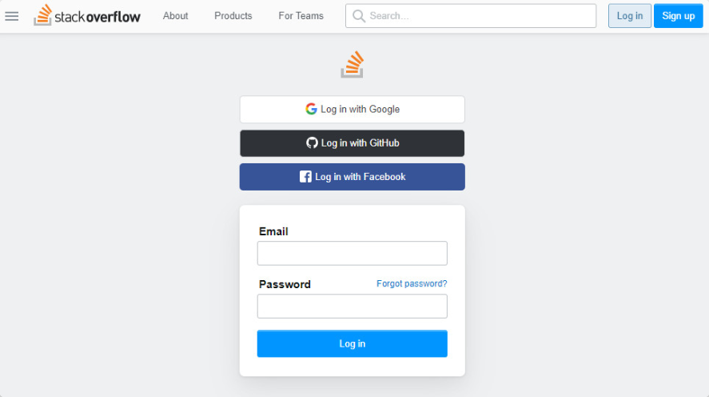
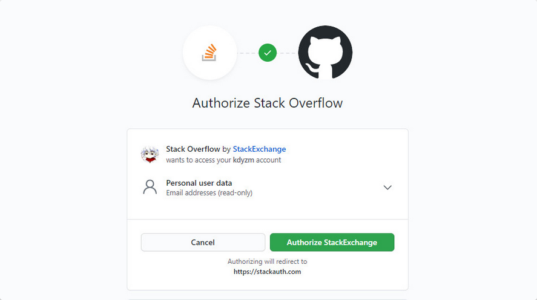
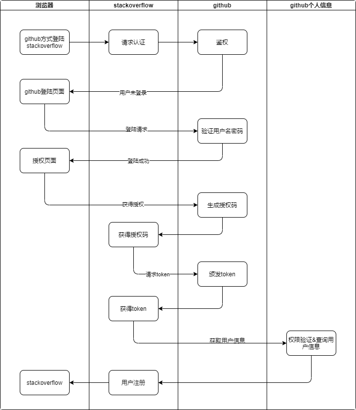
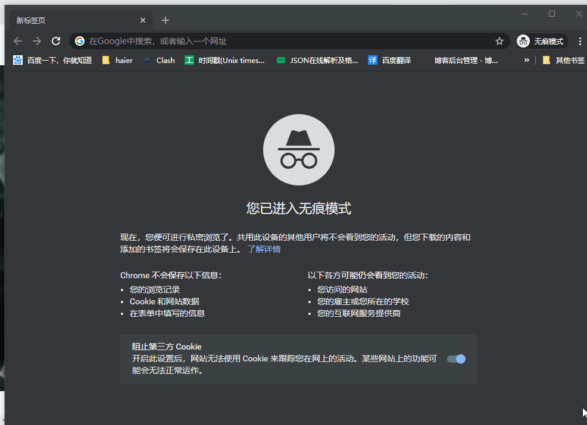

# Spring Security OAuth2.0认证授权一：框架搭建和认证测试

---

# OAuth2.0介绍

OAuth（开放授权）是一个开放标准，允许用户授权第三方应用访问他们存储在另外的服务提供者上的信息，而不 需要将用户名和密码提供给第三方应用或分享他们数据的所有内容。

## stackoverflow和github

听起来挺拗口，不如举个例子说明下，就以stackoverflow登录为例：我们登录stackoverflow，网站上会提示几种登录方式，如下所示



其中有一种github登录的方式，点一下进入以下页面



这个页面实际上是github授权登陆stackoverflow的页面，只要点击授权按钮，就可以使用github上注册的相关信息注册stackoverflow了，仔细看下这个授权页面，这个授权页面上有几个值得注意的点：

1.  图片中介绍了三方角色信息：当前操作人，github以及stackoverflow

2.  stackoverflow想通过github获取你的个人信息，哪些个人信息呢？Email addresses (read-only),邮箱地址，而且是只读，也就是说就算你授权了stackoverflow，它也修改不了你github上的个人信息。

3.  授权按钮，以及下面的一行小字Authorizing will redirect to `**https://stackauth.com**`，也就是说如果你点击了授权按钮，页面将重定向到stackauth.com页面。点击授权按钮之后就仿佛使用github的账号登录上了stackoverflow一样。

这里操作人、github、stackoverflow分别扮演了什么角色，stackoverflow是如何从github获取到个人信息的呢？这里实际上使用的是auth2.0协议进行的认证和授权。

## auth2.0协议

我们看OAuth2.0认证流程：引自OAauth2.0协议rfc6749 https://tools.ietf.org/html/rfc6749

```
 +--------+                               +---------------+
     |        |--(A)- Authorization Request ->|   Resource    |
     |        |                               |     Owner     |
     |        |<-(B)-- Authorization Grant ---|               |
     |        |                               +---------------+
     |        |
     |        |                               +---------------+
     |        |--(C)-- Authorization Grant -->| Authorization |
     | Client |                               |     Server    |
     |        |<-(D)----- Access Token -------|               |
     |        |                               +---------------+
     |        |
     |        |                               +---------------+
     |        |--(E)----- Access Token ------>|    Resource   |
     |        |                               |     Server    |
     |        |<-(F)--- Protected Resource ---|               |
     +--------+                               +---------------+

                     Figure 1: Abstract Protocol Flow

   The abstract OAuth 2.0 flow illustrated in Figure 1 describes the
   interaction between the four roles and includes the following steps:

   (A)  The client requests authorization from the resource owner.  The
        authorization request can be made directly to the resource owner
        (as shown), or preferably indirectly via the authorization
        server as an intermediary.

   (B)  The client receives an authorization grant, which is a
        credential representing the resource owner's authorization,
        expressed using one of four grant types defined in this
        specification or using an extension grant type.  The
        authorization grant type depends on the method used by the
        client to request authorization and the types supported by the
        authorization server.

   (C)  The client requests an access token by authenticating with the
        authorization server and presenting the authorization grant.

   (D)  The authorization server authenticates the client and validates
        the authorization grant, and if valid, issues an access token.

   (E)  The client requests the protected resource from the resource
        server and authenticates by presenting the access token.

   (F)  The resource server validates the access token, and if valid,
        serves the request.

Hardt                        Standards Track                    [Page 7]
```

OAauth2.0包括以下角色：

1.  客户端

本身不存储资源，需要通过资源拥有者的授权去请求资源服务器的资源，比如：Android客户端、Web客户端（浏
览器端）、微信客户端等，在上面的例子中，stackoverflow扮演的正是这个角色。

2.  资源拥有者

通常为用户，也可以是应用程序，即该资源的拥有者。在上面的例子中，资源拥有者指的是在github上已经注册的用户。

3.  授权服务器（也称认证服务器）

用于服务提供商对资源拥有的身份进行认证、对访问资源进行授权，认证成功后会给客户端发放令牌
（access_token），作为客户端访问资源服务器的凭据。本例为github。

4.  资源服务器

存储资源的服务器，本例子为github存储的用户信息。

如此，上面使用github登陆stackoverflow的流程大体上如下图所示：



下面将演示如何使用spring boot搭建OAuth2.0认证中心以实现类似于stackoverflow使用github账号登陆的效果。

# 使用springboot搭建OAuth2.0认证中心

项目目录层次如下：

```
├── docs
│   └── sql
│       └── init.sql
├── pom.xml
└── src
    ├── main
    │   ├── java
    │   │   └── com
    │   │       └── kdyzm
    │   │           └── spring
    │   │               └── security
    │   │                   └── auth
    │   │                       └── center
    │   │                           ├── AuthCenterApplication.java
    │   │                           ├── config
    │   │                           │   ├── AuthorizationServer.java
    │   │                           │   ├── MybatisPlusConfig.java
    │   │                           │   ├── TokenConfig.java
    │   │                           │   └── WebSecurityConfig.java
    │   │                           ├── controller
    │   │                           │   └── GrantController.java
    │   │                           ├── entity
    │   │                           │   └── TUser.java
    │   │                           ├── handler
    │   │                           │   └── MyAuthenticationFailureHandler.java
    │   │                           ├── mapper
    │   │                           │   └── UserMapper.java
    │   │                           └── service
    │   │                               └── MyUserDetailsServiceImpl.java
    │   └── resources
    │       ├── application.yml
    │       ├── static
    │       │   ├── css
    │       │   │   ├── bootstrap.min.css
    │       │   │   └── signin.css
    │       │   └── login.html
    │       └── templates
    │           └── grant.html
```

接下来捡着重点说下搭建过程

## 引入最核心的三个maven依赖
```xml
<dependency>
    <groupId>org.springframework.boot</groupId>
    <artifactId>spring-boot-starter-web</artifactId>
</dependency>
<dependency>
    <groupId>org.springframework.cloud</groupId>
    <artifactId>spring-cloud-starter-security</artifactId>
</dependency>
<dependency>
    <groupId>org.springframework.cloud</groupId>
    <artifactId>spring-cloud-starter-oauth2</artifactId>
</dependency>
```

像是mybatis、mybatis plus、fastjson、lombok、thymeleaf等依赖都是辅助依赖，不赘述

## 编写启动类
```java
@SpringBootApplication
public class AuthCenterApplication {

    public static void main(String[] args) {
        SpringApplication.run(AuthCenterApplication.class, args);
    }
}
```

## 配置文件
```yaml
server:
  port: 30000
spring:
  application:
    name: auth-center
  datasource:
    url: jdbc:mysql://${db}/security?useSSL=false&userUnicode=true&characterEncoding=utf-8&serverTimezone=UTC
    username: root
    password: ${db_password}
    driver-class-name: com.mysql.jdbc.Driver
  thymeleaf:
    prefix: classpath:/templates/
    suffix: .html
    cache: false
```

配置完以上三项，就可以将项目正常启动起来了，但是是一个一片空白的项目。接下来配置核心代码实现

## EnableAuthorizationServer

可以用 @EnableAuthorizationServer 注解并继承AuthorizationServerConfigurerAdapter来配置OAuth2.0 授权服务器。

在config包下创建AuthorizationServer：

```java
@Configuration
@EnableAuthorizationServer
public class AuthorizationServer extends AuthorizationServerConfigurerAdapter{
    ......
}
```

AuthorizationServerConfigurerAdapter要求重写以下三个方法并配置方法中的几个类，这几个类是由Spring创建的独立的配置对象，它们会被Spring传入AuthorizationServerConfigurer中进行配置。

```java
public void configure(AuthorizationServerSecurityConfigurer security) throws Exception {}
public void configure(ClientDetailsServiceConfigurer clients) throws Exception {}
public void configure(AuthorizationServerEndpointsConfigurer endpoints) throws Exception {}
```

+   ClientDetailsServiceConfigurer ：用来配置客户端详情服务（ClientDetailsService），客户端详情信息在这里进行初始化，你能够把客户端详情信息写死在这里或者是通过数据库来存储调取详情信息。
+   AuthorizationServerEndpointsConfigurer ：用来配置令牌（token）的访问端点和令牌服务(tokenservices)。
+   AuthorizationServerSecurityConfigurer ：用来配置令牌端点的安全约束.

## 配置客户端详细信息

ClientDetailsServiceConfigurer 能够使用内存或者JDBC来实现客户端详情服务（ClientDetailsService），ClientDetailsService负责查找ClientDetails，而ClientDetails有几个重要的属性如下列表：

+   clientId ：（必须的）用来标识客户的Id。
+   secret ：（需要值得信任的客户端）客户端安全码，如果有的话。
+   scope ：用来限制客户端的访问范围，如果为空（默认）的话，那么客户端拥有全部的访问范围。
+   authorizedGrantTypes ：此客户端可以使用的授权类型，默认为空。
+   authorities ：此客户端可以使用的权限（基于Spring Security authorities）。

客户端详情（Client Details）能够在应用程序运行的时候进行更新，可以通过访问底层的存储服务（例如将客户端详情存储在一个关系数据库的表中，就可以使用 JdbcClientDetailsService）或者通过自己实现ClientRegistrationService接口（同时你也可以实现 ClientDetailsService 接口）来进行管理。

我们暂时使用内存方式存储客户端详情信息，配置如下:

```java
    @Override
    public void configure(ClientDetailsServiceConfigurer clients) throws Exception {
        clients.inMemory()              //使用in‐memory存储
                .withClient("c1")
                .secret(new BCryptPasswordEncoder().encode("secret"))//$2a$10$0uhIO.ADUFv7OQ/kuwsC1.o3JYvnevt5y3qX/ji0AUXs4KYGio3q6
                .resourceIds("r1")
                .authorizedGrantTypes("authorization_code", "password", "client_credentials", "implicit", "refresh_token")//该client允许的授权类型
                .scopes("all")          //授权范围
                .autoApprove(false)
                .redirectUris("https://www.baidu.com");
    }
```

## 管理令牌

AuthorizationServerTokenServices 接口定义了一些操作使得你可以对令牌进行一些必要的管理，令牌可以被用来加载身份信息，里面包含了这个令牌的相关权限。

自己可以创建 AuthorizationServerTokenServices 这个接口的实现，则需要继承 DefaultTokenServices 这个类，里面包含了一些有用实现，你可以使用它来修改令牌的格式和令牌的存储。默认的，当它尝试创建一个令牌的时候，是使用随机值来进行填充的，除了持久化令牌是委托一个 TokenStore 接口来实现以外，这个类几乎帮你做了所有的事情。并且 TokenStore 这个接口有一个默认的实现，它就是 InMemoryTokenStore ，如其命名，所有的令牌是被保存在了内存中。除了使用这个类以外，你还可以使用一些其他的预定义实现，下面有几个版本，它们都实现了TokenStore接口：

+   InMemoryTokenStore ：这个版本的实现是被默认采用的，它可以完美的工作在单服务器上（即访问并发量压力不大的情况下，并且它在失败的时候不会进行备份），大多数的项目都可以使用这个版本的实现来进行尝试，你可以在开发的时候使用它来进行管理，因为不会被保存到磁盘中，所以更易于调试。
+   JdbcTokenStore ：这是一个基于JDBC的实现版本，令牌会被保存进关系型数据库。使用这个版本的实现时，你可以在不同的服务器之间共享令牌信息，使用这个版本的时候请注意把"spring-jdbc"这个依赖加入到你的classpath当中。
+   JwtTokenStore ：这个版本的全称是 JSON Web Token（JWT），它可以把令牌相关的数据进行编码（因此对于后端服务来说，它不需要进行存储，这将是一个重大优势），但是它有一个缺点，那就是撤销一个已经授权令牌将会非常困难，所以它通常用来处理一个生命周期较短的令牌以及撤销刷新令牌（refresh_token）。另外一个缺点就是这个令牌占用的空间会比较大，如果你加入了比较多用户凭证信息。JwtTokenStore 不会保存任何数据，但是它在转换令牌值以及授权信息方面与 DefaultTokenServices 所扮演的角色是一样的。

### 定义TokenConfig

在config包下定义TokenConfig，我们暂时先使用InMemoryTokenStore，生成一个普通的令牌。

### 定义ClientDetailsService

由于配置了5，所以这里会spring会帮我们生成一个基于内存的 ClientDetailsService

### 定义AuthorizationServerTokenServices

在AuthorizationServer中定义AuthorizationServerTokenServices

```java
@Autowired
private TokenStore tokenStore;

@Autowired
private ClientDetailsService clientDetailsService;

@Bean
public AuthorizationServerTokenServices tokenServices(){
    DefaultTokenServices services = new DefaultTokenServices();
    services.setClientDetailsService(clientDetailsService);
    services.setSupportRefreshToken(true);
    services.setTokenStore(tokenStore);
    services.setAccessTokenValiditySeconds(7200);
    services.setRefreshTokenValiditySeconds(259200);
    return services;
}
```

## 令牌访问端点配置

AuthorizationServerEndpointsConfigurer 这个对象的实例可以完成令牌服务以及令牌endpoint配置。

### AuthorizationServerEndpointsConfigurer 授权类型

AuthorizationServerEndpointsConfigurer 通过设定以下属性决定支持的授权类型（Grant Types）:

+   authenticationManager ：认证管理器，当你选择了资源所有者密码（password）授权类型的时候，请设置这个属性注入一个 AuthenticationManager 对象。
+   userDetailsService ：如果你设置了这个属性的话，那说明你有一个自己的 UserDetailsService 接口的实现，或者你可以把这个东西设置到全局域上面去（例如 GlobalAuthenticationManagerConfigurer 这个配置对象），当你设置了这个之后，那么 "refresh_token" 即刷新令牌授权类型模式的流程中就会包含一个检查，用来确保这个账号是否仍然有效，假如说你禁用了这个账户的话。
+   authorizationCodeServices ：这个属性是用来设置授权码服务的（即 AuthorizationCodeServices 的实例对象），主要用于 "authorization_code" 授权码类型模式。
+   implicitGrantService ：这个属性用于设置隐式授权模式，用来管理隐式授权模式的状态。
+   tokenGranter ：当你设置了这个东西（即 TokenGranter 接口实现），那么授权将会交由你来完全掌控，并且会忽略掉上面的这几个属性，这个属性一般是用作拓展用途的，即标准的四种授权模式已经满足不了你的需求的时候，才会考虑使用这个。

### AuthorizationServerEndpointsConfigurer授权端点

AuthorizationServerEndpointsConfigurer 这个配置对象有一个叫做 pathMapping() 的方法用来配置端点URL链接，它有两个参数：

+   第一个参数： String 类型的，这个端点URL的默认链接。
+   第二个参数： String 类型的，你要进行替代的URL链接。

以上的参数都将以 "/" 字符为开始的字符串，框架的默认URL链接如下列表，可以作为这个 pathMapping() 方法的第一个参数：

+   /oauth/authorize ：授权端点。
+   /oauth/token ：令牌端点。
+   /oauth/confirm_access ：用户确认授权提交端点。
+   /oauth/error ：授权服务错误信息端点。
+   /oauth/check_token ：用于资源服务访问的令牌解析端点。
+   /oauth/token_key ：提供公有密匙的端点，如果你使用JWT令牌的话。

综上AuthorizationServerEndpointsConfigurer配置如下

```java
@Autowired
private AuthenticationManager authenticationManager;

@Autowired
private AuthorizationCodeServices authorizationCodeServices;

@Bean
public AuthorizationCodeServices authorizationCodeServices(){
    return new InMemoryAuthorizationCodeServices();
}

@Override
public void configure(AuthorizationServerEndpointsConfigurer endpoints) throws Exception {
    endpoints
        .authenticationManager(authenticationManager)
        .authorizationCodeServices(authorizationCodeServices)
        .tokenServices(tokenServices())
        .allowedTokenEndpointRequestMethods(HttpMethod.POST);

    endpoints.pathMapping("/oauth/confirm_access","/custom/confirm_access");//自定义授权页面需要
}
```

上面需要的AuthenticationManager的定义在SpringSecurity的配置中，下面会讲到。

## 令牌端点的安全约束

AuthorizationServerSecurityConfigurer 用来配置令牌端点(Token Endpoint)的安全约束，在AuthorizationServer中配置如下。

```java
@Override
public void configure(AuthorizationServerSecurityConfigurer security) throws Exception {
    security
        .tokenKeyAccess("permitAll()") //(1)
        .checkTokenAccess("permitAll()")//(2)
        .allowFormAuthenticationForClients();//(3)
}
```

1.  tokenkey这个endpoint当使用JwtToken且使用非对称加密时，资源服务用于获取公钥而开放的，这里指这个endpoint完全公开。
2.  checkToken这个endpoint完全公开
3.  允许表单认证

## web安全配置

这里可以配置安全拦截机制、自定义登录页面、登录失败拦截器等等

在以下的配置中创建了AuthenticationManager bean，这是 7.2 中所需要的。

```java
@Configuration
@EnableGlobalMethodSecurity(securedEnabled = true,prePostEnabled = true)
public class WebSecurityConfig extends WebSecurityConfigurerAdapter {

    @Autowired
    private MyAuthenticationFailureHandler myAuthenticationFailureHandler;

    //认证管理器
    @Bean
    public AuthenticationManager authenticationManagerBean() throws Exception {
        return super.authenticationManagerBean();
    }
    //密码编码器
    @Bean
    public PasswordEncoder passwordEncoder() {
        return new BCryptPasswordEncoder();
    }

    //安全拦截机制
    @Override
    protected void configure(HttpSecurity http) throws Exception {
        http
                .csrf().disable()
                .authorizeRequests()
                .antMatchers("/login*","/css/*").permitAll()
                .anyRequest().authenticated()
                .and()
                .formLogin()
                .loginPage("/login.html")
                .loginProcessingUrl("/login")
                .failureHandler(myAuthenticationFailureHandler);

    }
}
```

# 自定义登陆页面

spring security默认带的登录页面不可修改，加载速度贼慢，原因是使用的css链接是国外的。所以从各方面来说自定义登录页面都是需要的。

## 创建login.html文件

这个非常简单，只需要将spring security加载速度贼慢的那个页面扒下来就好。

项目中代码链接：https://gitee.com/kdyzm/spring-security-oauth-study/blob/master/auth-center/src/main/resources/static/login.html

## 配置拦截规则

WebSecurityConfig下如下设置

```java
@Override
protected void configure(HttpSecurity http) throws Exception {
    http
        .csrf().disable()
        .authorizeRequests()
        .antMatchers("/login*","/css/*").permitAll()
        .anyRequest().authenticated()
        .and()
        .formLogin()
        .loginPage("/login.html")
        .loginProcessingUrl("/login")
        .failureHandler(myAuthenticationFailureHandler);
}

.antMatchers("/login*","/css/*").permitAll()是必须的，否则没法登陆，会陷入重定向死循环；

.loginPage("/login.html")
.loginProcessingUrl("/login")
```

这两个必须一起配置，否则会login 404。

## 自定义登陆失败页面

自定义登陆页面之后登录失败的原因就不提示了，这里使用拦截器进行简单的拦截并返回给前端结果（非常丑，但能用）

```java
@Component
public class MyAuthenticationFailureHandler implements AuthenticationFailureHandler {
    @Override
    public void onAuthenticationFailure(HttpServletRequest request, HttpServletResponse response, AuthenticationException exception) throws IOException, ServletException {
        response.setStatus(HttpStatus.INTERNAL_SERVER_ERROR.value());
        response.setContentType("application/json;charset=utf-8");
        response.getWriter().write(JSONObject.toJSONString(exception.getMessage()));
    }
}
```

## 自定义授权页面

默认的授权页面非常丑，这里重写该页面，页面代码地址：https://gitee.com/kdyzm/spring-security-oauth-study/blob/master/auth-center/src/main/resources/templates/grant.html

然后配置OAuth访问端点替换掉原来的地址：

endpoints.pathMapping("/oauth/confirm_access","/custom/confirm_access");

同时，由于重写了页面地址，需要实现/custom/confirm_access 接口

```java
@Controller
@SessionAttributes("authorizationRequest")
public class GrantController {

    /**
     * @see WhitelabelApprovalEndpoint#getAccessConfirmation(java.util.Map, javax.servlet.http.HttpServletRequest)
     * @param model
     * @param request
     * @return
     * @throws Exception
     */
    @RequestMapping("/custom/confirm_access")
    public ModelAndView getAccessConfirmation(Map<String, Object> model, HttpServletRequest request) throws Exception {
        AuthorizationRequest authorizationRequest = (AuthorizationRequest) model.get("authorizationRequest");
        ModelAndView view = new ModelAndView();
        view.setViewName("grant");
        view.addObject("clientId", authorizationRequest.getClientId());
        view.addObject("scopes",authorizationRequest.getScope());
        return view;
    }
}
```

## 实现UserDetailsService接口

完成以上配置之后基本上已经配置完了，但是还差一点，那就是实现UserDetailsService接口，不实现该接口，会出现后端死循环导致的stackoverflow问题。

为什么要实现该接口？

该接口通过userName获取用户密码信息用于校验用户密码登陆和权限信息等。

```java
@Service
@Slf4j
public class MyUserDetailsServiceImpl implements UserDetailsService {

    @Autowired
    private UserMapper userMapper;

    @Override
    public UserDetails loadUserByUsername(String username) throws UsernameNotFoundException {

        TUser tUser = userMapper.selectOne(new LambdaQueryWrapper<TUser>().eq(TUser::getUsername, username));
        if (Objects.isNull(tUser)) {
            throw new UsernameNotFoundException(username + "账号不存在");//return null也可以
        }
        List<String> allPermissions = userMapper.findAllPermissions(tUser.getId());
        String[] array = null;
        if (CollectionUtils.isEmpty(allPermissions)) {
            log.warn("{} 无任何权限", tUser.getUsername());
            array = new String[]{};
        } else {
            array = new String[allPermissions.size()];
            allPermissions.toArray(array);
        }
        return User
                .withUsername(tUser.getUsername())
                .password(tUser.getPassword())
                .authorities(array).build();
    }
}
```

# 接口测试

在测试前，需要先执行数据库脚本并启动服务

+   执行auth-center/docs/sql/init.sql 文件，创建数据库并创建相关的表
+   修改auth-center项目下的配置文件中的数据库连接配置

然后运行 AuthCenterApplication 程序，测试几种oauth认证模式

## 授权码认证模式

>   最安全的一种模式。一般用于client是Web服务器端应用或第三方的原生App调用资源服务的时候。因为在这种模式中access_token不会经过浏览器或移动端的App，而是直接从服务端去交换，这样就最大限度的减小了令牌泄漏的风险。该模式下获取token需要分两步走，第一步获取授权码，第二步获取token。

+   获取授权码



接口地址 http://127.0.0.1:30000/oauth/authorize

请求方式 GET

请求参数

|    字段名     |                        描述                       |
|---------------|---------------------------------------------------|
| client_id     | 改值必须和配置在clients中的值保持一致             |
| response_type | 固定传值code表示使用授权码模式进行认证            |
| scope         | 改值必须配置的clients中的值一致                   |
| redirect_uri  | 获取code之后重定向的地址，必须和配置的clients一致 |


   请求示例

http://127.0.0.1:30000/oauth/authorize?client_id=c1&response_type=code&scope=all&redirect_uri=https://www.baidu.com

账号密码分别输入：zhangsan/123，进入授权页面之后点击授权按钮，页面跳转之后获取到code。

+   获取token

在上一步获取到code之后，利用获取到的该code获取token。

接口地址 http://127.0.0.1:30000/oauth/token

请求方式 POST

请求参数
   
|    字段名     |                        描述                       |
|---------------|---------------------------------------------------|
| code          | 上一步获取到的code                                |
| grant_type    | 在授权码模式，固定使用authorization_code          |
| client_id     | 改值必须和配置在clients中的值保持一致             |
| client_secret | 这里的值必须和代码中配置的clients中配置的保持一致 |
| redirect_uri  | 获取token之后重定向的地址，该地址可以随意写       |

请求示例

http://127.0.0.1:30000/oauth/token

请求体

```
code:5Rmc3m
grant_type:authorization_code
client_id:c1
client_secret:secret
redirect_uri:https://www.baidu.com
```

## 简化模式

>   该模式去掉了授权码，用户登陆之后直接获取token并显示在浏览器地址栏中，参数和请求授权码的接口基本上一模一样，唯一的区别就是response_type字段，授权码模式下使用的是code字段，在简化模式下使用的是token字段。一般来说，简化模式用于没有服务器端的第三方单页面应用，因为没有服务器端就无法接收授权码。

接口地址 http://127.0.0.1:30000/oauth/authorize

请求方式 GET

请求参数

|    字段名     |                        描述                       |
|---------------|---------------------------------------------------|
| client_id     | 改值必须和配置在clients中的值保持一致             |
| response_type | 固定传值token表示使用简化模式进行认证             |
| scope         | 该值必须和配置的clients中的值一致                 |
| redirect_uri  | 获取code之后重定向的地址，必须和配置的clients一致 |

请求示例

http://127.0.0.1:30000/oauth/authorize?client_id=c1&response_type=token&scope=all&redirect_uri=https://www.baidu.com


## 密码模式

>   这种模式十分简单，但是却意味着直接将用户敏感信息泄漏给了client，因此这就说明这种模式只能用于client是我们自己开发的情况下。因此密码模式一般用于我们自己开发的，第一方原生App或第一方单页面应用

接口地址 http://127.0.0.1:30000/oauth/token

请求方式 POST

请求参数

|    字段名     |                  描述                 |
|---------------|---------------------------------------|
| client_id     | 改值必须和配置在clients中的值保持一致 |
| client_secret | 改值必须和配置在clients中的值保持一致 |
| grant_type    | 在密码模式下，该值固定为password      |
| username      | 用户名                                |
| password      | 密码                                  |

请求示例

http://127.0.0.1:30000/oauth/token?client_id=c1&client_secret=secret&grant_type=password&username=zhangsan&password=123

## 客户端模式

>   这种模式是最方便但最不安全的模式。因此这就要求我们对client完全的信任，而client本身也是安全的。因此这种模式一般用来提供给我们完全信任的服务器端服务。比如，合作方系统对接，拉取一组用户信息。

接口地址 http://127.0.0.1:30000/oauth/token

请求方式 POST

请求参数

|    字段名     |                    描述                    |
|---------------|--------------------------------------------|
| client_id     | 改值必须和配置在clients中的值保持一致      |
| client_secret | 改值必须和配置在clients中的值保持一致      |
| grant_type    | 在密码模式下，该值固定为client_credentials |

请求示例

http://127.0.0.1:30000/oauth/token?client_id=c1&client_secret=secret&grant_type=client_credentials

## refresh_token换取新token

接口地址 http://127.0.0.1:30000/oauth/token

请求方式 POST

请求参数

|    字段名     |                              描述                             |
|---------------|---------------------------------------------------------------|
| client_id     | 该值必须和配置在clients中的值保持一致                         |
| client_secret | 该值必须和配置在clients中的值保持一致                         |
| grant_type    | 如果想根据refresh_token换新的token，这里固定传值refresh_token |
| refresh_token | 未失效的refresh_token                                         |

请求示例

http://127.0.0.1:30000/oauth/token?grant_type=refresh_token&refresh_token=09c9d11a-525a-4e5f-bac1-4f32e9025301&client_id=c1&client_secret=secret

# 源码地址

源码地址：https://gitee.com/kdyzm/spring-security-oauth-study

# 参考

这个文档来自(主要是为了备份):https://www.cnblogs.com/kuangdaoyizhimei/p/14250374.html


