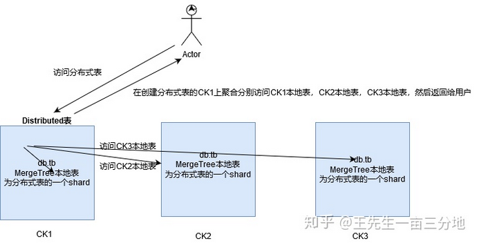

#   Clickhouse最佳实战之分布式集群方案研究

----

#   ClickHouse分布式集群方案研究

官方网站：https://clickhouse.tech/docs/en/introduction/distinctive-features/

Hadoop系列的集群是服务级别的，而Clickhouse的集群是表级别的

##  ClickHouse核心的配置文件解析

1.  /etc/clickhouse-server/config.xml 端口配置、本地机器名配置、内存设置等；config.xml 核心配置文件中文解释

```xml
<?xml version="1.0"?>
<yandex>
   <!-- 日志 -->
   <logger>
       <level>trace</level>
       <log>/data1/clickhouse/log/server.log</log>
       <errorlog>/data1/clickhouse/log/error.log</errorlog>
       <size>1000M</size>
       <count>10</count>
   </logger>

   <!-- 端口 -->
   <http_port>8123</http_port>
   <tcp_port>9000</tcp_port>
   <interserver_http_port>9009</interserver_http_port>

   <!-- 本机域名 -->
   <interserver_http_host>这里需要用域名，如果后续用到复制的话</interserver_http_host>

   <!-- 监听IP -->
   <listen_host>0.0.0.0</listen_host>
   <!-- 最大连接数 -->
   <max_connections>64</max_connections>

   <!-- 没搞懂的参数 -->
   <keep_alive_timeout>3</keep_alive_timeout>

   <!-- 最大并发查询数 -->
   <max_concurrent_queries>16</max_concurrent_queries>

   <!-- 单位是B -->
   <uncompressed_cache_size>8589934592</uncompressed_cache_size>
   <mark_cache_size>10737418240</mark_cache_size>

   <!-- 存储路径 -->
   <path>/data1/clickhouse/</path>
   <tmp_path>/data1/clickhouse/tmp/</tmp_path>

   <!-- user配置 -->
   <users_config>users.xml</users_config>
   <default_profile>default</default_profile>

   <log_queries>1</log_queries>

   <default_database>default</default_database>

   <remote_servers incl="clickhouse_remote_servers" />
   <zookeeper incl="zookeeper-servers" optional="true" />
   <macros incl="macros" optional="true" />

   <!-- 没搞懂的参数 -->
   <builtin_dictionaries_reload_interval>3600</builtin_dictionaries_reload_interval>

   <!-- 控制大表的删除 -->
   <max_table_size_to_drop>0</max_table_size_to_drop>

   <include_from>/data1/clickhouse/metrika.xml</include_from>
</yandex>
```

2.  /etc/clickhouse-server/metrika.xml 集群配置、ZK配置、分片配置等；metrika.xml核心配置文件中文注解

```xml
<yandex>
<!-- 集群配置 -->
<clickhouse_remote_servers>
    <!-- 集群名称-->
    <bip_ck_cluster>
        <shard>
            <internal_replication>false</internal_replication>
            <replica>
                <host>ck1.xxxx.com.cn</host>
                <port>9000</port>
                <user>default</user>
                <password>******</password>
            </replica>
            <replica>
                <host>ck2.xxxx.com.cn</host>
                <port>9000</port>
                <user>default</user>
                <password>******</password>
            </replica>
        </shard>
        <shard>
            <internal_replication>false</internal_replication>
            <replica>
                <host>ck2.xxxx.com.cn</host>
                <port>9000</port>
                <user>default</user>
                <password>******</password>
            </replica>
            <replica>
                <host>ck3.xxxxa.com.cn</host>
                <port>9000</port>
                <user>default</user>
                <password>******</password>
            </replica>
        </shard>
        <shard>
            <internal_replication>false</internal_replication>
            <replica>
                <host>ck3.xxxxa.com.cn</host>
                <port>9000</port>
                <user>default</user>
                <password>******</password>
            </replica>
            <replica>
                <host>ck1.xxxx.com.cn</host>
                <port>9000</port>
                <user>default</user>
                <password>******</password>
            </replica>
        </shard>
    </bip_ck_cluster>
</clickhouse_remote_servers>

<!-- 本节点副本名称（这里无用） -->
<macros>
    <replica>ck1</replica>
</macros>

<!-- 监听网络（貌似重复） -->
<networks>
   <ip>::/0</ip>
</networks>
<!-- ZK  -->
<zookeeper-servers>
  <node index="1">
    <host>1.xxxx.sina.com.cn</host>
    <port>2181</port>
  </node>
  <node index="2">
    <host>2.xxxx.sina.com.cn</host>
    <port>2181</port>
  </node>
  <node index="3">
    <host>3.xxxxp.sina.com.cn</host>
    <port>2181</port>
  </node>
</zookeeper-servers>
<!-- 数据压缩算法  -->
<clickhouse_compression>
<case>
  <min_part_size>10000000000</min_part_size>
  <min_part_size_ratio>0.01</min_part_size_ratio>
  <method>lz4</method>
</case>
</clickhouse_compression>

</yandex>
```

3.  /etc/clickhouse-server/users.xml 权限、配额设置；user.xml核心配置文件中文注解

```xml
<?xml version="1.0"?>
<yandex>
    <profiles>
        <!-- 读写用户设置  -->
        <default>
            <max_memory_usage>10000000000</max_memory_usage>
            <use_uncompressed_cache>0</use_uncompressed_cache>
            <load_balancing>random</load_balancing>
        </default>

        <!-- 只写用户设置  -->
        <readonly>
            <max_memory_usage>10000000000</max_memory_usage>
            <use_uncompressed_cache>0</use_uncompressed_cache>
            <load_balancing>random</load_balancing>
            <readonly>1</readonly>
        </readonly>
    </profiles>

    <!-- 配额  -->
    <quotas>
        <!-- Name of quota. -->
        <default>
            <interval>
                <duration>3600</duration>
                <queries>0</queries>
                <errors>0</errors>
                <result_rows>0</result_rows>
                <read_rows>0</read_rows>
                <execution_time>0</execution_time>
            </interval>
        </default>
    </quotas>

    <users>
        <!-- 读写用户  -->
        <default>
            <password_sha256_hex>967f3bf355dddfabfca1c9f5cab39352b2ec1cd0b05f9e1e6b8f629705fe7d6e</password_sha256_hex>
            <networks incl="networks" replace="replace">
                <ip>::/0</ip>
            </networks>
            <profile>default</profile>
            <quota>default</quota>
        </default>

        <!-- 只读用户  -->
        <ck>
            <password_sha256_hex>967f3bf355dddfabfca1c9f5cab39352b2ec1cd0b05f9e1e6b8f629705fe7d6e</password_sha256_hex>
            <networks incl="networks" replace="replace">
                <ip>::/0</ip>
            </networks>
            <profile>readonly</profile>
            <quota>default</quota>
        </ck>
    </users>
</yandex>
```

##  ClickHouse其他重要配置

1.  /etc/clickhouse-server/config.xml 
2.  /etc/security/limits./clickhouse.conf

数据目录，临时目录位置，日志目录

+   /var/lib/clickhouse clickhouse soft nofile 262144
+   /var/lib/clickhouse/tmp/ clickhouse hard nofile 262144
+   /var/log/clickhouse-server

##  ClickHouse表引擎

参考资料：ClickHouse的表引擎：

https://www.jianshu.com/p/dbca0f5ededb?from=groupmessage

CK里面有非常多的引擎，这里只推荐3个：

MergeTree，是CK里最Advanced的引擎，性能超高，单机写入可以达到50w峰值，查询性能非常快，有兴趣看我其他文章

ReplicatedMergeTree，基于MergeTree，同时引入ZK，做了复制，下文会说

Distributed，分布式引擎，本身不存储数据，可认为就是一张View，如果写入，会把请求丢到集群里的节点（有算法控制），如果查询，会帮你做查询转发再聚合返回

##  ClickHouse数据复制

参考资料：ClickHouse的数据复制：https://www.jianshu.com/p/d1842290bd48

##  总结一下

基于`ReplicatedMergeTree + Zookeeper`的表复制

1.  使用的是复制表ReplicatedMergeTree+Zookeeper的协调一致性完成数据的复制和数据一致性
2.  数据相互复制且会进行数据验证，自动保证数据一致性
3.  建议3个节点做复制，设置至少保证2个节点收到数据才算成功，增强数据的一致性
4.  关于复制引擎，ClickHouse官方建议不搞特别大的集群，建议一个业务就跑一个集群，具体多少分片，自己衡量

基于`cluster + Distributed`的复制

1.  使用分布式表Distributed，集群的分片的副本的自动复制
2.  参数internal_replication要设置 `<internal_replication>false</internal_replication>` 写全部的分片，不建议：poor man replication
3.  仅仅对分布式表写入：并且在internal_replication=false的情况下，会写入分布式表对应的子表
4.  推荐使用的方式：

    -   写分布式表的情况下，设置 `<internal_replication>true</internal_replication>`，即只写一个shard里面的一个副本
    -   开启表级别的复制，无论哪一个副本被写入，副本数据都会被同步到其他副本节点

#   ClickHouse分布式集群方案
在理解了ClickHouse常见的核心配置文件，以及分布式的核心配置文件metrika.xml,Clickhouse的表引擎及其特点，ClickHouse的数据复制的策略后,我们可以有常见的三种集群架构方案

##  方案一：MergeTree + Distributed

### 建表方式

+   本地表：数据存储在建表节点的本地

CREATE TABLE db.tb (date Date, ……) ENGINE = MergeTree(date, (date, hour, datetime), 8192)

+   分布式表：查询这个表，引擎自动把整个集群数据计算后返回

CREATE TABLE db.tb_all (date Date, ……) ENGINE = Distributed(bip_ck_cluster, 'ck_cluster', 'test', rand())"

### 架构图



### metrika.xml核心配置：


### 架构解析
MergeTree + Distributed的分布式架构方案，利用的是`Distributed表的特性 + MergeTree表的特性`

+   读取
    -   分布式表不存储数据，数据来自本地表
    -   将分布式表的数据分为3个shard，每台节点存储三分之一的数据
    -   用户查询的时候是从分布式表所在的节点聚合从Ck1，CK2，CK3的查询结果，然后返回用户

+   写入
    -   数据可以写入分布式表，当然这样的写入方式问题很多，`一般是禁止写入分布式表`的
    -   那么选择写入本地表的化，需要`将数据轮询或者其他方式，将数据分散写入Ck1，CK2，CK3`，当然你也可以只写入其中一台，那么使用方式就是单机版的

+   优势
    -   架构简单，可以单机使用，可以分布式使用，关键在于表引擎的选择，并行的查询分布式表，性能非常棒

+   问题
    -   本地表+分布式表，分布式表如果某个节点当机就会丢失数据，用户查询服务就会报错，如果节点磁盘损坏，那么数据将大概率丢失，无法恢复，即使恢复也会付出极大的成本
    -   对于查询节点的选择需要慎重的考虑，毕竟需要聚合所有查询节点的结果

##  方案二：MergeTree + Distributed + 集群复制

结合分布式方案一的优势和问题，分布式方案二，考虑数据的安全性，设置了副本

### 建表方式

+   本地表：数据存储在建表节点的本地
    -   CREATE TABLE db.tb (date Date, ……) ENGINE = MergeTree(date, (date, hour, datetime), 8192)
+   分布式表：查询这个表，引擎自动把整个集群数据计算后返回
    -   CREATE TABLE db.tb_all (date Date, ……) ENGINE = Distributed(bip_ck_cluster, 'ck_cluster', 'test', rand())"

### 架构图


### metrika.xml配置文件


### 架构解析

分布式架构2采用了架构1的特点和解决了架构1的问题，数据安全性得到了解决，集合CLickHouse集群的复制，有了副本，3个shard各自拥有三分之一的数据，每个shard有2个副本，数据一样。其中CK1的Shard有两副本，分别在CK1，CK2；CK2的shard也有两副本，分别在CK2，CK3；CK3的shard也是两副本，分别在CK1和CK3

+   优势
    -   数据的安全性有了保障，每一个shard有两个副本；数据的查询的并行度没有改变，但是因为副本的存在，shard节点数据的查询选择性多了。即使CK1挂了，不影响集群的查询服务
+   问题
    -   如果IP1临时宕机，从宕机开始到恢复，期间的增量数据是可以补全的，依赖的IP2上的推送机制，会有临时目录，但是，如果IP1彻底玩完，硬盘坏了，无法恢复，只能重做，引入一个IP5来替换IP1，这时候问题就来了，存量数据无法恢复

这个方案社区有过争议，从CK原理上来讲，的确存在上述的问题，根据社区的相关的使用者遇到的问题，经常会遇到DistrDirMonitor导致的故障

##  方案三：ReplicatedMergeTree + Distributed

### 建表方式

+   本地表
    -   CREATE TABLE db.tb (date Date, ……) ENGINE = ReplicatedMergeTree('/clickhouse/db/tb/name', 'ck_name', date, (date, hour, datetime), 8192)
+   分布式表
    -   CREATE TABLE db.tb_all (date Date, ……) ENGINE = Distributed(bip_ck_cluster, 'test', 'test', rand())"

### 架构图


跨IDC的架构：


### metrika.xml配置文件

metrika.xml配置文件和架构2的配置文件一样

### 架构解析

ReplicatedMergeTree + Distributed的架构把MergeTree换成了ReplicatedMergeTree，本质上是将副本的数据同步的策略，从基于Cluster的方式换成了基于复制表引擎+Zookeeper的方式，基于ReplicatedMergeTree + Distributed的架构方案，在查询并行度，数据的安全性，副本的安全性，数据的一致性上都考虑的比较好，也避免了社区提出的DistrDirMonitor的故障问题

+   优点
    -   ReplicatedMergeTree里，共享同一个ZK路径的表，会相互，注意是，相互同步数据，数据安全，查询性能不会有太大的问题
    -   如果能机器再考虑IDC的化，那么数据的容灾就能跨机房，数据安全性能得到更好的保证

+   问题
    -   需要注意：写本地表，读分布式表
    -   结合业务及数据的特性及所需的机器的资源，合理的选择分布式表的建表的CK节点
    -   SELECT 查询并不需要借助 ZooKeeper ，复本并不影响 SELECT 的性能，查询复制表与非复制表速度是一样的。查询分布式表时，ClickHouse的处理方式可通过设置 max_replica_delay_for_distributed_queries 和 fallback_to_stale_replicas_for_distributed_queries 修改。
    -   对于数据的写入需要注意：对于每个 INSERT 语句，会通过几个事务将十来个记录添加到 ZooKeeper。（确切地说，这是针对每个插入的数据块; 每个 INSERT 语句的每 max_insert_block_size = 1048576 行和最后剩余的都各算作一个块。）相比非复制表，写 zk 会导致 INSERT 的延迟略长一些。但只要你按照建议每秒不超过一个 INSERT 地批量插入数据，不会有任何问题。一个 ZooKeeper 集群能给整个 ClickHouse 集群支撑协调每秒几百个 INSERT。数据插入的吞吐量（每秒的行数）可以跟不用复制的数据一样高。
    -   集群配置里，我们用了域名，本想着方便切换，但是CK只有在启动的时候，才会做解析。那故障了怎么切换? CK有一个厉害的地方，节点变动，无需重启，会自动加载。利用上述特性，我们先去掉一个节点的配置，再加上这个节点的配置（DNS变更后），即可不重启就完成fail over

#   ClickHouse分布式集群常见方案分析总结

基于ClickHouse的集群的常见方案，结合业界的架构方案，`优质的选择是基于ReplicatedMergeTree + Distributed的集群架构方案`，也是分布式高可用的集群架构方案，但是在使用该集群架构的过程中，需要注意：

##  写表的方式
写本地表，读分布式表

由于分布式表的逻辑简单，仅仅是转发请求，所以在转发安全性上，会有风险，并且rand的方式，可能会造成不均衡，业界建议，通过DNS轮训，写本地表，这样最保险和均衡

##  统一的建表

CK的分布式，完全依赖配置文件，即每个节点，都共享同样的配置文件，建表要区分集群，又要区分副本，建议写一个脚本来统一建表，或者开发一个可视化的页面，操作管理CK表

建议结合查询的负载均衡做，分布式查询的节点可以在每一个节点都建分布式表，查询的选择性更多

##  建立标准的ZK的目录使用规范

ReplicatedMergeTree + Distributed的分布式的方案，副本的复制依赖zk，需要统一的规划Zookeeper的使用规范

一台或者多台查询机？建立分布式表，平衡好查询节点机器资源和数据量之间的关系

`ClickHouse查询使用并行处理机制，对CPU和内存的要求比较高，不建议单台机器部署多个节点，同时建议建Zookeeper的节点和CK的节点分开部署，防止高负载下的相互影响`

`介于ClickHouse对并发的支持有限，建议查询做LB`

CK默认的查询并发是100，当并发达到一定的程度，会存在一个排队的现象，介于多shard，多副本的情况，做查询的负载均衡能很好的提高查询的并发有限的问题

##  副本的设置的建议
+   同一份数据，日常至少有2份即可，如果其中一份挂掉，新建一个表，把另一份及时通过过来就好
+   重要的数据建议3个节点做复制，设置至少保证2个节点收到数据才算成功，增强数据的一致性

##  机器选择的建议
+   ClickHouse的节点故障，出现问题，在节点恢复的过程中：故障恢复的过程中的确存在带宽的问题
+   ClickHouse目前不支持多数据盘，选择合适的RAID方式，建议使用RAID5，配置热备盘，对数据的可靠性，数据恢复，运维难度都有比较好的保障
+   关闭Linux虚拟内存。在ClickHouse服务器内存耗尽的情况下，Kill掉占用内存最多的Query之后发现，这台ClickHouse服务器并没有如预期的那样恢复正常，所有的查询依然运行的十分缓慢。
+   通过查看服务器的各项指标，发现虚拟内存占用量异常。因为存在大量的物理内存和虚拟内存的数据交换，导致查询速度十分缓慢。关闭虚拟内存，并重启服务后，应用恢复正常。
+   由于CK查询性能在单节点查询的时候基本能跑满CPU，所以建议CPU的核数高一点，建议选择48核，内存选择192G

##  集群规模的建议

ClickHouse官方建议不搞特别大的集群，建议一个业务就跑一个集群，具体多少分片，自己衡量

请务必使用hostname，并在所有/etc/hosts下加入对应的host规则，否则可能一定导致zookeeper无法同步复制表信息！！！！

规划好和ClickHouse的数据交换服务及相关设置

##  实时写入ClicHouse的时候需要注意的问题

尽量做1000条以上批量的写入，避免逐行insert或小批量的insert，update，delete操作，因为ClickHouse底层会不断的做异步的数据合并，会影响查询性能，这个在做实时数据写入的时候要尽量避开；

#   最终的CLickHouse的分布式高可用的架构方案

`Load Balance + Distributed table + ReplicatedMergeTree + Multiple clusters`

大致架构图


#   来源与参考
+   [Clickhouse最佳实战之分布式集群方案研究](https://zhuanlan.zhihu.com/p/161242274)
