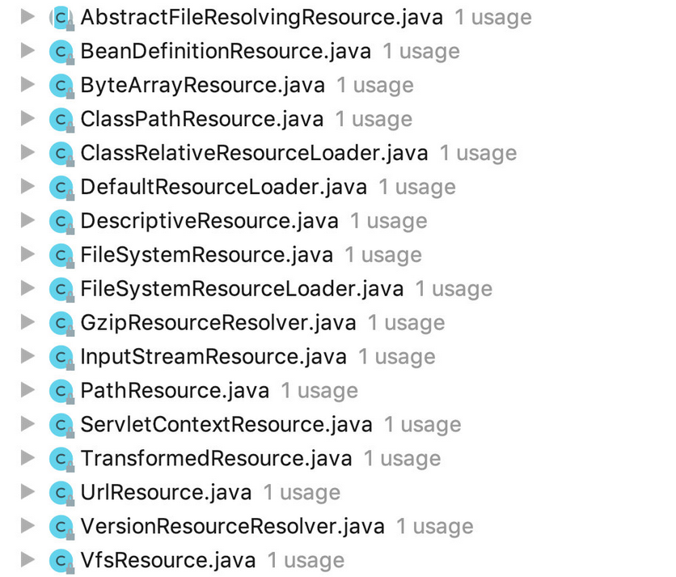

#   RestTemplate通过InputStreamResource上传文件

----

##  上传文件File

碰到一个需求，在代码中通过HTTP方式做一个验证的请求，请求的参数包含了文件类型。想想其实很简单，直接使用定义好的MultiValueMap，把文件参数传入即可。

我们知道，restTemplate 默认定义了几个通用的消息转换器，见org.springframework.web.client.RestTemplate#RestTemplate()，那么文件应该对应哪种资源呢？

看了上面这个方法之后，可以很快联想到是ResourceHttpMessageConverter，从类签名也可以看出来：

Implementation of {@link HttpMessageConverter} that can read/write {@link Resource Resources}
and supports byte range requests.

这个转换器主要是用来读写各种类型的字节请求的。

既然是Resource，那么我们来看一下它的实现类有哪些：



以上是AbstractResource的实现类，有各种各样的实现类，从名称上来说应该比较有用的应该是：InputStreamResource和FileSystemResource，还有ByteArrayResource 和 UrlResource等。


##  使用FileSystemResource上传文件

这种方式使用起来比较简单，直接把文件转换成对应的形式即可。

```java
MultiValueMap<String, Object> resultMap = new LinkedMultiValueMap<>();
Resource resource = new FileSystemResource(file);
param.put("file", resource);
```

网上使用RestTemplate上传文件大多数是这种方式，简单，方便，不用做过多的转换，直接传递参数即可。

但是为什么会写这篇博客来记录呢？因为，`有一个不喜欢的地方就是，它需要传递一个文件。而我得到是文件源是一个流，我需要在本地创建一个临时文件，然后把InputStream写入到文件中去。使用完之后，还需要把文件删除`。

那么既然这么麻烦，有没有更好的方式呢？

##  使用InputStreamResource上传文件

这个类的构造函数可以直接传入流文件。那么就直接试试吧！

```java
MultiValueMap<String, Object> resultMap = new LinkedMultiValueMap<>();
Resource resource = new InputStreamResource(inputStream);
param.put("file", resource);
```

没有想到，服务端报错了，返回的是：没有传递文件。这可就纳闷了，明明已经有了啊。

网上使用这种方式上传的方式不多，只找到这么一个文件，但已经够了：[RestTemplate通过InputStreamResource上传文件](https://www.cnblogs.com/DXDE443/p/10308059.html).

博主的疑问和我一样，不想去创建本地文件，然后就使用了这个流的方式。但是也碰到了问题。

文章写得很清晰：使用InputStreamResource 上传文件时，需要重写该类的两个方法

+   contentLength
+   getFilename

果然按照这个文章的思路尝试之后，就成功了。代码如下：

```java
public class CommonInputStreamResource extends InputStreamResource {
    private int length;

    public CommonInputStreamResource(InputStream inputStream) {
        super(inputStream);
    }

    public CommonInputStreamResource(InputStream inputStream, int length) {
        super(inputStream);
        this.length = length;
    }

    /**
     * 覆写父类方法
     * 如果不重写这个方法，并且文件有一定大小，那么服务端会出现异常
     * {@code The multi-part request contained parameter data (excluding uploaded files) that exceeded}
     *
     * @return
     */
    @Override
    public String getFilename() {
        return "temp";
    }

    /**
     * 覆写父类 contentLength 方法
     * 因为 {@link org.springframework.core.io.AbstractResource#contentLength()}方法会重新读取一遍文件，
     * 而上传文件时，restTemplate 会通过这个方法获取大小。然后当真正需要读取内容的时候，发现已经读完，会报如下错误。
     * <code>
     * java.lang.IllegalStateException: InputStream has already been read - do not use InputStreamResource if a stream needs to be read multiple times
     * at org.springframework.core.io.InputStreamResource.getInputStream(InputStreamResource.java:96)
     * </code>
     * <p>
     * ref:com.amazonaws.services.s3.model.S3ObjectInputStream#available()
     *
     * @return
     */
    @Override
    public long contentLength() {
        int estimate = length;
        return estimate == 0 ? 1 : estimate;
    }
}
```

关于contentLength文章里说的很清楚：上传文件时resttemplate会通过这个方法得到inputstream的大小。

而InputStreamResource的contentLength方法是继承AbstractResource，它的实现如下：

```java
    InputStream is = getInputStream();
    Assert.state(is != null, "Resource InputStream must not be null");
    try {
        long size = 0;
        byte[] buf = new byte[255];
        int read;
        while ((read = is.read(buf)) != -1) {
            size += read;
        }
        return size;
    }
    finally {
        try {
            is.close();
        }
        catch (IOException ex) {
        }
    }
```

已经读完了流，导致会报错，其实InputStreamResource的类签名是已经注明了：如果需要把流读多次，不要使用它。

```
 Do not use an {@code InputStreamResource} if you need to
 keep the resource descriptor somewhere, or if you need to read from a stream
 multiple times.
```

所以需要像我上面一样改写一下，然后就可以完成了。那么原理到底是不是这样呢？继续看。

##  RestTemplate上传文件时的处理

上面我们说到RestTemplate初始化时，需要注册几个消息转换器，那么其中有一个就是ResourceHTTPMessageConverter，那么我们看看它完成了哪些功能呢：
方法很少，一下子就可以看完：关于文件大小（contentLength），文件类型（ContentType），读（readInternal），写（org.springframework.http.converter.ResourceHttpMessageConverter#writeInternal）等方法。

上面的第二点，我们说InputStreamResource不做任何处理时，会导致文件多次读取，那么是怎么做的呢，我们看看源码：
### 第一次读取

InputStreamResouce中有两个读取流的方法，上面讲过，一个是contentLength，第二个是getInputStream

我们从读取到了一下代码：

```java
public final void write(final T t, MediaType contentType, HttpOutputMessage outputMessage)
            throws IOException, HttpMessageNotWritableException {

        final HttpHeaders headers = outputMessage.getHeaders();
        addDefaultHeaders(headers, t, contentType); //1

        if (outputMessage instanceof StreamingHttpOutputMessage) {
            StreamingHttpOutputMessage streamingOutputMessage = (StreamingHttpOutputMessage) outputMessage;
            streamingOutputMessage.setBody(new StreamingHttpOutputMessage.Body() {
                @Override
                public void writeTo(final OutputStream outputStream) throws IOException {
                    writeInternal(t, new HttpOutputMessage() {
                        @Override
                        public OutputStream getBody() throws IOException {
                            return outputStream;
                        }
                        @Override
                        public HttpHeaders getHeaders() {
                            return headers;
                        }
                    });
                }
            });
        }
        else {
            writeInternal(t, outputMessage);//2
            outputMessage.getBody().flush();
        }
    }
```

注释中的两个标记处，分别会调用 contentLength 和 getInputStream 方法，但是第一个方法会直接返回null，不会调用。但是第二个方法会调用一次。

这里说明上传时，流会被读第一次。

##  服务端上传文件时的处理

文件源
AbstractMultipartHttpServletRequest # multipartFiles

赋值
StandardMultipartHttpServletRequest # parseRequest
需要 disposition （"content-disposition"）里有“filename=” 字段或者“filename*=”，从里面获取 fileName

io.undertow.servlet.spec.HttpServletRequestImpl#loadParts 里对 getParts 赋值

MultiPartParserDefinition #io.undertow.servlet.spec.HttpServletRequestImpl#loadParts 解析 表单数据
- 其中获取流 ServletInputStreamImpl

按照上面的流程排查下来，没有发现有什么问题，唯一出问题的地方是请求中的“diposition”字段设置有问题，没有把filename=放入，导致解析不到文件。
### 重新回到请求体写入FormHttpMessageConverter#writePart

从这个方法中，我们可以看到各个转换器的遍历调用。看看下面的代码：

```java
private void writePart(String name, HttpEntity<?> partEntity, OutputStream os) throws IOException {
        Object partBody = partEntity.getBody();
        Class<?> partType = partBody.getClass();
        HttpHeaders partHeaders = partEntity.getHeaders();
        MediaType partContentType = partHeaders.getContentType();
        for (HttpMessageConverter<?> messageConverter : this.partConverters) {
            if (messageConverter.canWrite(partType, partContentType)) {
                HttpOutputMessage multipartMessage = new MultipartHttpOutputMessage(os);
                multipartMessage.getHeaders().setContentDispositionFormData(name, getFilename(partBody)); // 1
                if (!partHeaders.isEmpty()) {
                    multipartMessage.getHeaders().putAll(partHeaders);
                }
                ((HttpMessageConverter<Object>) messageConverter).write(partBody, partContentType, multipartMessage);
                return;
            }
        }
        throw new HttpMessageNotWritableException("Could not write request: no suitable HttpMessageConverter " +
                "found for request type [" + partType.getName() + "]");
    }
```

从中我们可以看setContentDispositionFormData 这一行：getFileName方法，这里会走到各个Resource的getFileName方法。

真相即将得到：InputStreamResource 的这个方法是继承自org.springframework.core.io.AbstractResource#getFilename，这个方法直接返回null。之后的就很简单了：当fileName为null时，不会在setContentDispositionFormData中把filename=拼入。所以服务端不会解析到文件，导致报错。

##  结论

+   使用RestTemplate上传文件使用FileSystemResource在直接是文件的情况下很简单。
+   如果不想在本地新建临时文件可以使用：InputStreamResource，但是需要覆写FileName方法。
+   由于2的原因，2.2.1 中的contentLength方法，不会对InputStreamResource做特殊处理，而是直接去读取流，导致流被读取多次；按照类签名，会报错。所以也需要覆写contentLength方法。
+    是由于2的原因，才需要3的存在，不过使用方式是对的：使用InputStreamResource需要覆写两个方法contentLength和getFileName。

##  代码实现
```java
public class CommonInputStreamResource extends InputStreamResource {
    private int length;

    public CommonInputStreamResource(InputStream inputStream) {
        super(inputStream);
    }

    public CommonInputStreamResource(InputStream inputStream, int length) {
        super(inputStream);
        this.length = length;
    }

    /**
     * 没有重写这个方法，当文件有一定大小，服务端会出现异常
     * @return
     */
    @Override
    public String getFilename() {
        return "temp.docx";
    }

    /**
     * 因为 {@link org.springframework.core.io.AbstractResource#contentLength()}方法会重新读取一遍文件，
     * 而上传文件时，restTemplate 会通过这个方法获取大小。然后当真正需要读取内容的时候，发现已经读完，会报如下错误。
     *
     * @return
     */
    @Override
    public long contentLength() {
        int estimate = length;
        return estimate == 0 ? 1 : estimate;
    }
}
```

```java
@RestController
public class JavaTest01Controller {
    @GetMapping(value = "/JavaTest01")
    public int JavaTest01() throws IOException {
        RestTemplate restTemplate = new RestTemplate();
        HttpHeaders headers = new HttpHeaders();
        headers.setContentType(MediaType.APPLICATION_OCTET_STREAM);
        InputStream inputStream = null;
        //下载文件
        String url = "http://xxx/yyy.docx";
        inputStream = returnBitMap(url);

        MultiValueMap<String, Object> param = new LinkedMultiValueMap<>();
        Resource resource = new CommonInputStreamResource(inputStream);
        param.add("file", resource); //相当于MultipartFile的名称
        String result =  restTemplate.postForObject("http://xxxxxx/upload", param, String.class);
        System.out.println(result);

        return 1;
    }

    public InputStream returnBitMap(String path) {
        URL url = null;
        InputStream is = null;
        try {
            url = new URL(path);
        } catch (MalformedURLException e) {
            e.printStackTrace();
        }
        try {
            HttpURLConnection conn = (HttpURLConnection) url.openConnection();//利用HttpURLConnection对象,我们可以从网络中获取网页数据.
            conn.setDoInput(true);
            conn.connect();
            is = conn.getInputStream();    //得到网络返回的输入流

        } catch (IOException e) {
            e.printStackTrace();
        }
        return is;
    }
}
```

##  参考
+   [通过`RestTemplate`上传文件(InputStreamResource详解)](https://www.cnblogs.com/paxing/p/11485049.html)
+   [RestTemplate通过InputStreamResource上传文件](https://www.cnblogs.com/DXDE443/p/10308059.html)
