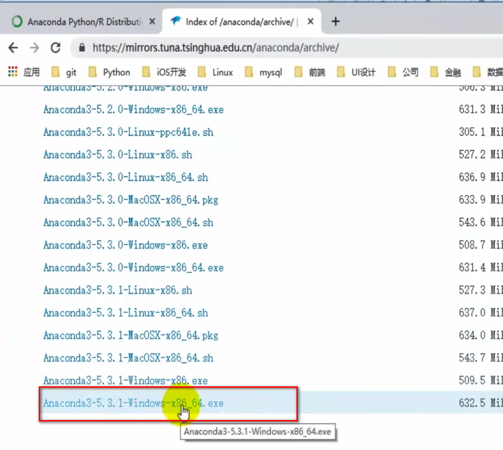
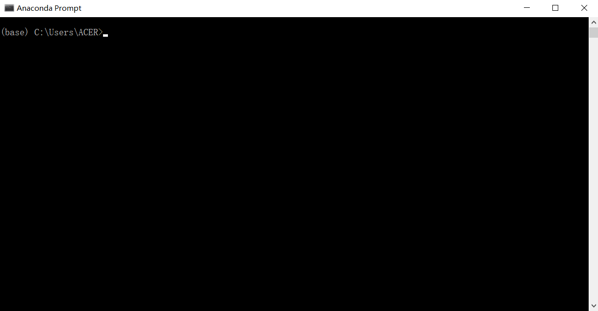
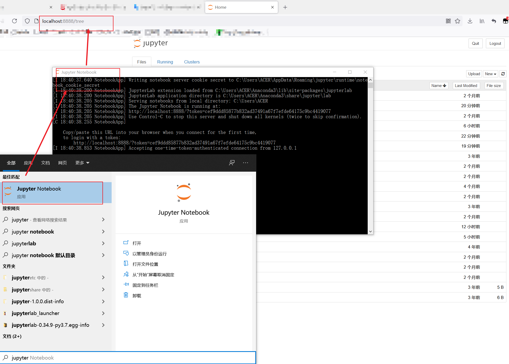

#   Python数据分析_01_前奏

----

#   什么是数据分析
##  数据分析介绍
什么是数据分析:
数据分析是指用适当的统计分析方法对收集来的大量数据进行分析，提取有用信息和形成结论而对数据加以详细研究和概括总结的过程。数据分析的目的有多种，概括起来有三种:现状分析、原因分析、预测分析。现状分析简单来说就是告诉你过去发生了什么。原因分析简单来说就是告诉你某--现状为什么发生。预测分析简单来说就是预测未来会发生什么。

##  数据分析步骤 

数据分析主要有六个过程:

1.  需求明确:明确做数据分析的目标。为后面的分析过程做好铺垫。
2.  数据收集I通过爬虫、商务合作的方式，获取想要的数据。
3.  数据处理:对获取来的数据进行处理和清洗，把不需要的剔除掉，把需要的加工成我们想要的。方便后面的分析。
4.  数据分析:根据自己的目的，以及现有的数据确定好分析的方法。
5.  数据展现:将数据按照确定好的分析方法进行展示出来。
6.  撰写报告:将分析的结果通过图表和文字的方式形成报告文档。

##  数据分析的误区:
1.  分析目的不明确，分析而分析: 一定要找准自己分析数据的目标而去分析，比如是要了解现状，还是找出原因，还是预测未来发展等，千万不要为了分析而分析，这样就偏离主题了。
2.  缺乏业务知识，分析结果偏离实际:分析数据的时候，一定要和公司的业务结合起来。如果脱离业务，即使数据分析方法再牛逼，图标再优美，也无济于事。
3.  追求高级分析方法: 一些人喜欢用一些高级的分析方法，认为只有这样才能体现专业性。其实高级的数据分析方法不一定是最好的，能够简单有效的解决问题的方法才是最好的。

##  数据分析的方法和工具:
数据分析可以通过工具，也可以通过代码来实现。以下分别列出这些常用的:

1.  工具: Excel、 Tableau、 SPSS、 百度图说等。
2.  编程: Python语言、R语言、数据库的SQL语言、Excel的VBA语言等。

##  工具和代码该怎么选:
两者没有好坏之分，只有合适之分。数据分析总体来讲有两个模块，一个是数据处理，一个是可视化。如果数据已经经过处理了，并且手头上的软件可以直接非常方便的做可视化处理，那么我们用软件实现就可以。如果数据没有经过处理，那么最好通过python或者r对 数据进行有一-些处理， 然后再通过软件可视化。或者软件的可视化无法满足我们的要求，那么可以通过代码来实现。总而言之，工具功能无法100%的满足你的要求，但是效率高。代码做数据处理比较好，最数据可视化比较繁琐，但是DIY属性强!

#   环境搭建

##  Python版本 
本课程用到的Python版本都是3.X。要有一定的Python基础， 知道列表、字符串、函数等的用法。

##  Anaconda
Anaconda(水蟒)是一 一个捆绑了Python 、conda 、其他相关依赖包的一一个软件。包含了180多个可学计算包及其依赖。Anaconda3 是集成了Python3 的环境，Anaconda2 是集成了Python2 的环境。Anaconda 认集成的包，是属于内置的Python的包。并且支持绝大部分操作系统(比如:Windows、Mac、Linux等) 。下 载地址如下: https://www.anaconda.com/distribution/ ( 如果官网下载太慢，可以在清华大学开源软件站中下载: https://mirrors.tuna.tsinghua.edu.cn/anaconda/archive/ )。根据自己的操作系统，下载相应的版本，因为Anaconda内置了许多的包，所以安装过程需要耗费相当长的时间，大家在安装的时候需要耐心等待。在安装完成后，会有以下几个模块: Anaconda prompt 、Anaconda Navigator、Spyder 、jupyter notebook,以下分别做一些介绍。

##  Anaconda prompt
Anaconda prompt是专门用来操作anaconda的终端。如果你安装完Anaconda后没有在环境变量的PATH中添加相关的环境变量，那么以后你想在终端使用anaconda 相关的命令，则必须要在Anaconda prompt 中完成。

##  Anaconda Navigator:
这个相当于是一个导航面板，上面组织了Anaconda 相关的软件。

##  Spyder:
一个专门开发Python 的软件，熟悉MATLAB 的同学会比较有亲切感，但在后期的学习过程中，我们将不会使用这个工具写代码，因为还有更好的可替代的工具。

##  Jupyter notebook:
一个Python编辑环境，可以实时的查看代码的运行效果。

##  使用jupyter notebook的姿势:
1.  先打开Anaconda Prompt ，然后进入到项目所在的目录。
2.  输入命令jupyter notebook 打开jupyter notebook浏览器。

   
