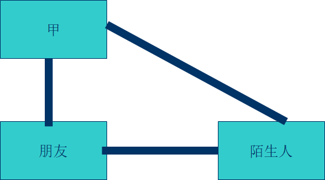
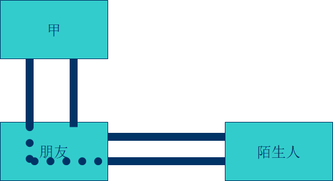
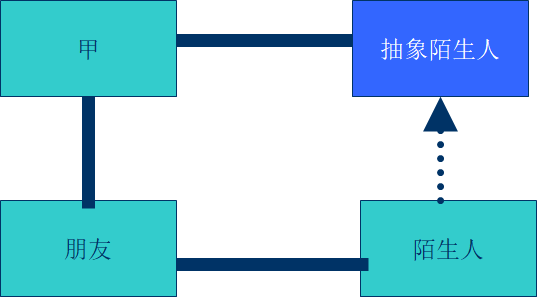

#   迪米特法则

---

#   什么是迪米特法则

迪米特法则(Law of Demeter )又叫做最少知识原则，也就是说，一个对象应当对其他对象尽可能少的了解。不和陌生人说话。英文简写为: LoD。

迪米特法则最初是用来作为面向对象的系统设计风格的一种法则，于1987年秋天由lan holland在美国东北大学为一个叫做迪米特的项目设计提出的。

#   迪米特法则的模式与意义

迪米特法则可以简单说成：talk only to your immediate friends。 对于OOD来说，又被解释为下面几种方式：一个软件实体应当尽可能少的与其他实体发生相互作用。每一个软件单位对其他的单位都只有最少的知识，而且局限于那些与本单位密切相关的软件单位。

迪米特法则的初衷在于降低类之间的耦合。由于每个类尽量减少对其他类的依赖，因此，很容易使得系统的功能模块功能独立，相互之间不存在（或很少有）依赖关系。

迪米特法则不希望类之间建立直接的联系。如果真的有需要建立联系，也希望能通过它的友元类来转达。因此，应用迪米特法则有可能造成的一个后果就是：系统中存在大量的中介类，这些类之所以存在完全是为了传递类之间的相互调用关系——这在一定程度上增加了系统的复杂度。

#   狭义的迪米特法则

如果两个类不必彼此直接通信，那么这两个类就不应当发生直接的相互作用。如果其中一个类需要调用另一类的某一个方法的话，可以通过第三者转发这个调用。

这么看不太形象，我们来举个例子，和陌生人说话，甲和朋友认识，朋友和陌生人认识，而甲和陌生人不认识，这时甲可以直接和朋友说话，朋友可以直接和陌生人说话，而如果甲想和陌生人说话，就必须通过朋友

##  第一种方式

```java
public class Jia{
    public void play(Friend friend){
        friend.play();
    }

    public void play(Stranger stranger) {
        stranger.play();
    }
}
```

```java
//朋友
public class Friend {
    public void play(){
        System.out.println("朋友");
    }
}
```

```java
//陌生人
public class Stranger {
    public void play(){
        System.out.println("陌生人");
    }
}
```

这种方式是肯定不对的，甲根本没有通过朋友，直接引用了陌生人的方法，不符合迪米特法则


##  第二种方式



```java
//甲
public class Jia{
    public void play(Friend friend){
        friend.play();
        Stranger stranger = friend.getStranger();
        stranger.play();
    }
}
```

```java
//朋友
public class Friend {
    public void play(){
        System.out.println("朋友");
    }

    public Stranger getStranger() {
        return new Stranger();
    }
}
```

```java
//陌生人
public class Stranger {
    public void play(){
        System.out.println("陌生人");
    }
}
```

这样的方式呢，看上去陌生人的实例是通过朋友来创建了，但还是不行，因为甲中包含的陌生人的引用，甲还是和陌生人直接关联上了，所以，不符合迪米特法则，我们要的是甲和陌生人没有一丁点直接关系

##  第三种方式



```java
//甲
public class Jia{
    private Friend friend;

    public Friend getFriend() {
        return friend;
    }

    public void setFriend(Friend friend) {
        this.friend = friend;
    }

    public void play(Friend friend){
        friend.play();
    }
}
```

```java
//朋友
public class Friend {
    public void play(){
        System.out.println("朋友");
    }

    public void playWithStranger() {
        Stranger stranger = new Stranger();
        stranger.play();
    }
}
```

```java
public class Stranger {
    public void play(){
        System.out.println("陌生人");
    }
}
```

这种方式，甲和陌生人之间就没有了任何直接联系，这样就避免了甲和陌生人的耦合度过高

##  第四种方式

当然还有一种更好的方式，与依赖倒转原则结合，为陌生人创建一个接口



```java
//甲
public class Jia{
    private Friend friend;
    private Stranger stranger;

    public Stranger getStranger() {
        return stranger;
    }

    public void setStranger(Stranger stranger) {
        this.stranger = stranger;
    }

    public Friend getFriend() {
        return friend;
    }

    public void setFriend(Friend friend) {
        this.friend = friend;
    }

    public void play() {
        System.out.println("someone play");
        friend.play();
        stranger.play();
    }
}
```

```java
public class Friend {
    public void play(){
        System.out.println("朋友");
    }
}
```

```java
//陌生人抽象类
public abstract class Stranger {
    public abstract void play();
}
```

```java
//具体陌生人
public class StrangerA extends Stranger {

    public void play() {
        System.out.println("陌生人");
    }

}
```

这样的方式，和甲直接通信的是陌生人的抽象父类，和具体陌生人没有直接关系，所以符合迪米特法则
　　
#   狭义的迪米特法则的缺点：
1.  在系统里造出大量的小方法，这些方法仅仅是传递间接的调用，与系统的商务逻辑无关。
2.  遵循类之间的迪米特法则会是一个系统的局部设计简化，因为每一个局部都不会和远距离的对象有直接的关联。但是，这也会造成系统的不同模块之间的通信效率降低，也会使系统的不同模块之间不容易协调。

#   迪米特法则应用实例

1.  [外观模式](https://www.cnblogs.com/xiaobai1226/p/8566231.html)
2.  [中介者模式](http://www.cnblogs.com/xiaobai1226/p/8609719.html)
