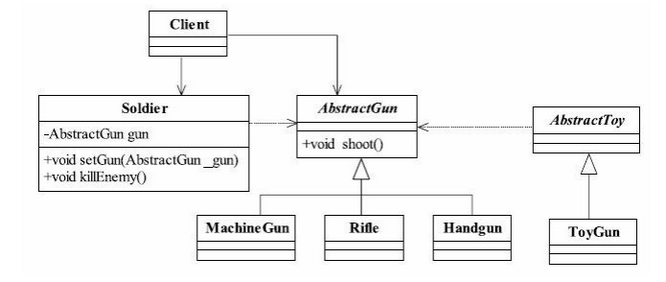

#   里氏替换原则

---

#   问题引出

有一功能P1，由类A完成。现需要将功能P1进行扩展，扩展后的功能为P，其中P由原功能P1与新功能P2组成。新功能P由类A的子类B来完成，则子类B在完成新功能P2的同时，有可能会导致原有功能P1发生故障。

解决方案

1.  当使用继承时，遵循里氏替换原则。
2.  类B继承类A时，除添加新的方法完成新增功能P2外，尽量不要重写父类A的方法，也尽量不要重载父类A的方法。
3.  指的是任何基类可以出现的地方，子类一定可以出现。

#   定义
##  定义1

如果对每一个类型为T1的对象o1，都有类型为T2的对象o2，使得以T1定义的所有程序P在所有的对象o1都替换成o2时，程序p的行为没有发生变化，那么类型T2是类型T1的子类型。

##  定义2

所有引用基类的地方必须能透明地使用其子类对象。

`里氏替换原则通俗的来讲就是：子类可以扩展父类的功能，但不能改变父类原有的功能。`

它包含以下4层含义：

1.  子类可以实现父类的抽象方法，但不能覆盖父类的非抽象方法。
2.  子类中可以增加自己特有的方法。
3.  当子类的方法重载父类的方法时，方法的前置条件（即方法的形参）要比父类方法的输入参数更宽松。
4.  当子类的方法实现父类的抽象方法时，方法的后置条件（即方法的返回值）要比父类更严格。

#   举例说明4层含义
##  子类可以实现父类的抽象方法，但是不能覆盖父类的非抽象方法。

实践，以枪为例，看一下类图


枪支的抽象类：
```java
public abstract class AbstractGun {
    public abstract  void shoot();
}
```

手枪，步枪实现类：
```java
public class HandGun extends AbstractGun {
    public void shoot() {
       System.out.println("手机射击");     
   }
}
public class Rifle extends AbstractGun {
    public void shoot() {
       System.out.println("步枪射击");     
   }
}
```

士兵实现类：
```java
public class Soldier {
  private AbstractGun gun;
  public void setGun(AbstractGun gun) {
    this.gun = gun;
  }
  public void killEnemy() {
    System.out.println("士兵杀敌人");
    gun.shoot();
  }
}
```

场景类：
```java
  public class Client {
    public static void main(String[] args) {
      Soldier sanMao = new Soldier();
      sanMao.setGun(new Rifle());
      sanMao.killEnemy();
  }
}
```

注意

在类中调用其他类时务必要使用父类或者接口（例如Solider类的setGun(AbstractGun gun)方法），否则说明类的设计已经违背了LSP原则。

现在有个玩具枪该怎么定义？直接继承AbstractGun类吗？如下：
```java
public class ToyGun extends AbstractGun {
  @Override
  public void shoot() {
    //玩具枪不能像真枪杀敌，不实现
  }
}
```

现在的场景类：

```java
  public class Client {
    public static void main(String[] args) {
      Soldier sanMao = new Soldier();
      sanMao.setGun(new ToyGun());
      sanMao.killEnemy();
  }
}
```

在这种情况下，士兵拿着玩具枪杀敌，发现业务调用类已经出现了问题，正常的业务逻辑运行结果是不正确的。（因为玩具枪并不能杀敌）ToyGun应该脱离继承，建立一个独立的类，可以与AbstractGun建立关联委托关系。类图如下：



玩具枪与真实枪分离

按照继承的原则，ToyGun继承AbstractGun是没有问题的，但是在具体应用场景中就需考虑：子类是否能够完整地实现父类的业务，否则就会出现上面的情况拿玩具枪杀敌。

**注意**:`如果子类不能完整地实现父类的方法，或者父类的某些方法在子类中发生重写或者重载，则建议断开父子继承关系，采用依赖、聚集、组合等关系代替继承`。

##  子类中可以增加自己特性

子类当然可有自己的方法和属性。里氏替换原则可以正着用，但是不能反着用，在子类出现的地方，父类未必可以胜任。

再说下面两层含义之前先要明白 重载 重写(覆盖) 的区别:

重写（覆盖）的规则：

1.  重写方法的参数列表必须完全与被重写的方法的相同,否则不能称其为重写而是重载.
2.  重写方法的访问修饰符一定要大于被重写方法的访问修饰符（public > protected > default > private）。
3.  重写的方法的返回值必须和被重写的方法的返回一致；
4.  重写的方法所抛出的异常必须和被重写方法的所抛出的异常一致，或者是其子类；
5.  被重写的方法不能为private，否则在其子类中只是新定义了一个方法，并没有对其进行重写。
6.  静态方法不能被重写为非静态的方法（会编译出错）。

重载的规则：

1.  在使用重载时只能通过相同的方法名、不同的参数形式实现。不同的参数类型可以是不同的参数类型，不同的参数个数，不同的参数顺序（参数类型必须不一样）；
2.  不能通过访问权限、返回类型、抛出的异常进行重载；
3.  方法的异常类型和数目不会对重载造成影响；

##  类的方法重载父类的方法时，方法的前置条件(形参)要比父类方法的输入参数更宽松.

实例：
```java
public class Father {
    public Collection doSomething(HashMap  map){
        System.out.println("父类被执行了");
        return map.values();
    }
}
```

```java
public class Son  extends Father{
    public Collection doSomething(Map  map){
        System.out.println("子类被执行了");
        return map.values();
    }
}
```

```java
public class Client{
    public static void main(String[] args) {
        invoker();
    }

    public  static void invoker(){
           Son son = new  Son();//子类对象
           HashMap  map=new HashMap<>();
           son.doSomething(map);
    }
}
```

运行结果


运行是"父类被执行了"，这是正确的，父类方法的参数是HashMap类型，而子类的方法参数是Map类型，子类的参数类型范围比父类大，那么子类的方法永远也不会执行。

如果我们反过来让父类的参数类型范围大于子类，并在调用时用子类去调用，我们会发现打印时的结果是”子类被执行了”，这就违反了里氏替换原则，在开发中很容易引起业务逻辑的混乱，所以类的方法重载父类的方法时，方法的前置条件(形参)要比父类方法的输入参数更宽松(相同也可以)。

##  覆写或者实现父类的方法时输出结果(返回值)可以被缩小

父类的一个方法的返回值是一个类型T，子类的相同方法（重载或者重写）的返回值为S，那么里氏替换原则就要求S必须小于等于T。

#   总结
1.  子类不能完整地实现父类的方法则断开继承关系,即保证父类不会被子类覆盖
2.  重载父类方法时,参数要更宽松(或者参数个数更多),即保证父类不会被子类覆盖
3.  子类的返回值是父类返回值的子集

`一句话:子类可以扩展父类的功能，但不能改变(覆盖)父类原有的功能`

#   参考
+   https://www.jianshu.com/p/8d48a550cae4
+   https://www.jianshu.com/p/3947d17e40bd
