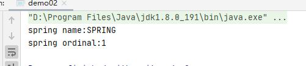
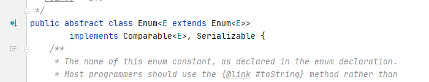

#   Java中的枚举类型详解

---

#   枚举类型初探

枚举类型，其语法总让人觉着怪怪的，如下：

```java
public enum Season {
    SPRING, SUMMER, AUTUMN, WINTER;
}
```

简单的一行，就定义了包含四个值的枚举类型，缺总让人觉着语法有点怪异。而在使用时

```java
public class demo02 {
    public static void main(String[] args) {
        System.out.println("spring name:" + Season.SPRING.name());
        System.out.println("spring ordinal:" + Season.SUMMER.ordinal());
    }
}
```

就可以得到输出：



那我们简单的一行定义中，到底发生了什么？枚举类型在编译时是怎样实现的？它还有着怎样的特点？

我们将会分几节对Java中的枚举类型进行介绍。

#   枚举产生之前

如果不使用枚举，我们要对“春夏秋冬”这四个值分别赋予一个数字，则常见的操作为：

```java
class Season {
    public static final int SPRING = 0;
    public static final int SUMMER = 1;
    public static final int AUTUMN = 2;
    public static final int WINTER = 3;
}
```

上述方法定义十分繁琐，而且容易出错。例如我们定义的int数字出现重复，编译器也不会给出任何的警示。同时，这样的操作是实在太频繁了，最终Java 5中增加了枚举类型。

而是用枚举类型后，一切就变成了如下所示的简单几行：

```java
public enum Season {
    SPRING, SUMMER, AUTUMN, WINTER;
}
```

而且，Java自动给按照枚举值出现的顺序，从0开始分配了编号。通过name()可以获得枚举值的名称，通过ordinal()可以获得枚举值的编号。

#   枚举实现原理

那我们定义枚举类型后，到底发生了什么呢？我们对枚举的实现原理进行探究。

首先，我们在实现Season枚举类时，并没有定义name()和ordinal()方法。我们从这里入手，点击该方法后，发现进入了一个抽象类：



并且，我们发现编译器不允许我们自行实现该抽象类从而构造一个新的类。但是，既然我们的Season枚举类可以调用其中的方法，因此Season枚举类应该是继承了该抽象类。

为了验证这一猜想，我们让Season类继承一个其他的类，发现果然不可以，因为Java是不允许多继承的。

具体，我们对Season类进行反编译，即：`javap Season.class`,得到反编译后的结果：

```asm
final class com.learn.demo02.Season extends java.lang.Enum<com.learn.demo02.Season> {
  public static final com.learn.demo02.Season SPRING;
  public static final com.learn.demo02.Season SUMMER;
  public static final com.learn.demo02.Season AUTUMN;
  public static final com.learn.demo02.Season WINTER;
  public static com.learn.demo02.Season[] values();
  public static com.learn.demo02.Season valueOf(java.lang.String);
  static {};
}
```

我们看到，对与枚举类，有很多值的注意的点：

+   枚举类在经过编译后确实是生成了一个扩展了java.lang.Enum的类
+   枚举类是final的，因此我们无法再继承它了
+   我们定义的每个枚举值都是该类中的一个成员，且成员的类型仍然是Season类型
+   枚举类中被默认增加了许多静态方法，例如values()等

为了进一步了解每个方法中的操作，我们使用`javap -c Season.class`每个方法中的字节码：

```asm
final class com.learn.demo02.Season extends java.lang.Enum<com.learn.demo02.Season> {
  public static final com.learn.demo02.Season SPRING;

  public static final com.learn.demo02.Season SUMMER;

  public static final com.learn.demo02.Season AUTUMN;

  public static final com.learn.demo02.Season WINTER;

  public static com.learn.demo02.Season[] values();
    Code:
       0: getstatic     #1                  // Field $VALUES:[Lcom/learn/demo02/Season;
       3: invokevirtual #2                  // Method "[Lcom/learn/demo02/Season;".clone:()Ljava/lang/Object;
       6: checkcast     #3                  // class "[Lcom/learn/demo02/Season;"
       9: areturn

  public static com.learn.demo02.Season valueOf(java.lang.String);
    Code:
       0: ldc           #4                  // class com/learn/demo02/Season
       2: aload_0
       3: invokestatic  #5                  // Method java/lang/Enum.valueOf:(Ljava/lang/Class;Ljava/lang/String;)Ljava/lang/Enum;
       6: checkcast     #4                  // class com/learn/demo02/Season
       9: areturn

  static {};
    Code:
       0: new           #4                  // class com/learn/demo02/Season
       3: dup
       4: ldc           #7                  // String SPRING
       6: iconst_0
       7: invokespecial #8                  // Method "<init>":(Ljava/lang/String;I)V
      10: putstatic     #9                  // Field SPRING:Lcom/learn/demo02/Season;
      13: new           #4                  // class com/learn/demo02/Season
      16: dup
      17: ldc           #10                 // String SUMMER
      19: iconst_1
      20: invokespecial #8                  // Method "<init>":(Ljava/lang/String;I)V
      23: putstatic     #11                 // Field SUMMER:Lcom/learn/demo02/Season;
      26: new           #4                  // class com/learn/demo02/Season
      29: dup
      30: ldc           #12                 // String AUTUMN
      32: iconst_2
      33: invokespecial #8                  // Method "<init>":(Ljava/lang/String;I)V
      36: putstatic     #13                 // Field AUTUMN:Lcom/learn/demo02/Season;
      39: new           #4                  // class com/learn/demo02/Season
      42: dup
      43: ldc           #14                 // String WINTER
      45: iconst_3
      46: invokespecial #8                  // Method "<init>":(Ljava/lang/String;I)V
      49: putstatic     #15                 // Field WINTER:Lcom/learn/demo02/Season;
      52: iconst_4
      53: anewarray     #4                  // class com/learn/demo02/Season
      56: dup
      57: iconst_0
      58: getstatic     #9                  // Field SPRING:Lcom/learn/demo02/Season;
      61: aastore
      62: dup
      63: iconst_1
      64: getstatic     #11                 // Field SUMMER:Lcom/learn/demo02/Season;
      67: aastore
      68: dup
      69: iconst_2
      70: getstatic     #13                 // Field AUTUMN:Lcom/learn/demo02/Season;
      73: aastore
      74: dup
      75: iconst_3
      76: getstatic     #15                 // Field WINTER:Lcom/learn/demo02/Season;
      79: aastore
      80: putstatic     #1                  // Field $VALUES:[Lcom/learn/demo02/Season;
      83: return
}
```

根据字节码，我们还原其操作代码，大致如下：

**注意：以下代码为手动翻译**

```java
final class com.learn.demo02.Season extends java.lang.Enum<com.learn.demo02.Season> extends java.lang.Enum<com.learn.demo02.Season>{
    public static final com.learn.demo02.Season SPRING;
    public static final com.learn.demo02.Season SUMMER;
    public static final com.learn.demo02.Season AUTUMN;
    public static final com.learn.demo02.Season WINTER;

    private static final com.learn.demo02.Season[] $VALUES;

    public static com.learn.demo02.Season[] values() {
        return (Season[]) $VALUES.clone();
    }

    public static com.learn.demo02.Season valueOf(java.lang.String s) {
        return (Season) Enum.valueOf(java/lang/String, s);
    }
    
    private com.learn.demo02.Season(String s, int i) {
        super(s, i);    
    }
    
    static {
        SPRING = new Season("SPRING", 0);
        SUMMER = new Season("SUMMER", 1);
        AUTUMN = new Season("AUTUMN", 2);
        WINTER = new Season("WINTER", 3);
        
        $VALUES = (new Season[] {
           SPRING, SUMMER, AUTUMN, WINTER     
        });
    }
}
```

通过这里我们可以看到，在类的static操作中，编译器帮助我们生成每个枚举值的对象。

#   总结

我们使用enum定义的枚举类型，会在编译之后转化为一个继承了java.lang.Enum的类，而我们定义的每个枚举值都会在类的初始化阶段被实例化为我们所定义的枚举类的一个对象。

同时，编译器还帮我们在类中增加了两个方法，分别是：values()和valueOf()。

至此，我们对Java的枚举对象有了彻底的认识。

#   参考
+   https://zhuanlan.zhihu.com/p/51296740
