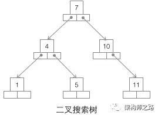

#   MySQL索引为什么设计成这样

----

#   问题1. 数据库为什么要设计索引？

图书馆存了1000W本图书，要从中找到《架构师之路》，一本本查，要查到什么时候去？

于是，图书管理员设计了一套规则：

1.  一楼放历史类，二楼放文学类，三楼放IT类…
2.  IT类，又分软件类，硬件类…
3.  软件类，又按照书名音序排序…

以便快速找到一本书。

与之类比，数据库存储了1000W条数据，要从中找到name="zhangsan"的记录，一条条查，要查到什么时候去？

于是，要有索引，用于提升数据库的查找速度。

#   问题2. 哈希(hash)比树(tree)更快，索引结构为什么要设计成树型？

加速查找速度的数据结构，常见的有两类：

(1)哈希，例如HashMap，查询/插入/修改/删除的平均时间复杂度都是O(1)；

(2)树，例如平衡二叉搜索树，查询/插入/修改/删除的平均时间复杂度都是O(lg(n))；

可以看到，不管是读请求，还是写请求，哈希类型的索引，都要比树型的索引更快一些，那为什么，索引结构要设计成树型呢？

>   画外音：80%的同学，面试都答不出来。

索引设计成树形，和SQL的需求相关。

对于这样一个单行查询的SQL需求：

```sql
select * from t where name="zhangsan";
```

确实是哈希索引更快，因为每次都只查询一条记录。

>   画外音：所以，如果业务需求都是单行访问，例如passport，确实可以使用哈希索引。

但是对于排序查询的SQL需求：

+   分组：group by
+   排序：order by
+   比较：<、>
+   …

哈希型的索引，时间复杂度会退化为O(n)，而树型的“有序”特性，依然能够保持O(log(n)) 的高效率。

InnoDB并不支持哈希索引。但 InnoDB 支持 Adaptive Hash Indexes

InnoDB存储引擎会监控对表上索引的查找，如果观察到建立哈希索引可以带来速度的提升，则建立哈希索引，所以称之为自适应（adaptive） 的。自适应哈希索引通过缓冲池的B+树构造而来，因此建立的速度很快。而且不需要将整个表都建哈希索引，InnoDB存储引擎会自动根据访问的频率和模式 来为某些页建立哈希索引。

根据InnoDB的官方文档显示，启用自适应哈希索引后，读取和写入速度可以提高2倍；对于辅助索引的连接操作，性能可以提高5倍。自适应哈希索引是非常好的优化模式，其设计思想是数据库自优化（self-tuning），即无需DBA对数据库进行调整。

#   问题3. 数据库索引为什么使用B+树？

为了保持知识体系的完整性，简单介绍下几种树。

##  第一种：二叉搜索树



二叉搜索树，如上图，是最为大家所熟知的一种数据结构，就不展开介绍了，它为什么不适合用作数据库索引？

+   当数据量大的时候，树的高度会比较高，数据量大的时候，查询会比较慢；
+   每个节点只存储一个记录，可能导致一次查询有很多次磁盘IO；

>   画外音：这个树经常出现在大学课本里，所以最为大家所熟知。 

##  第二种：B树


B树，如上图，它的特点是：

+   不再是二叉搜索，而是m叉搜索；
+   叶子节点，非叶子节点，都存储数据；
+   中序遍历，可以获得所有节点；

画外音，实在不想介绍这个特性：非根节点包含的关键字个数j满足，`(┌m/2┐)-1 <= j <= m-1`，节点分裂时要满足这个条件。

>   ┌m/2┐意思是ceil(m/2) 即向正无穷大取整

B树被作为实现索引的数据结构被创造出来，是因为它能够完美的利用“局部性原理”。

### 什么是局部性原理？

局部性原理的逻辑是这样的：

1.  内存读写块，磁盘读写慢，而且慢很多；

2.  磁盘预读：磁盘读写并不是按需读取，而是按页预读，一次会读一页的数据，每次加载更多的数据，如果未来要读取的数据就在这一页中，可以避免未来的磁盘IO，提高效率；

>   画外音：InnoDB一页数据默认是16K。

3.  局部性原理：软件设计要尽量遵循“数据读取集中”与“使用到一个数据，大概率会使用其附近的数据”，这样磁盘预读能充分提高磁盘IO；

### B树为何适合做索引？

1.  由于是m分叉的，高度能够大大降低；

2.  每个节点可以存储j个记录，如果将节点大小设置为页大小，例如16K，能够充分的利用预读的特性，极大减少磁盘IO；

##  第三种：B+树


B+树，如上图，仍是m叉搜索树，在B树的基础上，做了一些改进：

1.  非叶子节点不再存储数据，数据只存储在同一层的叶子节点上；

>   画外音：B+树中根到每一个节点的路径长度一样，而B树不是这样。

2.  叶子之间，增加了链表，获取所有节点，不再需要中序遍历；

这些改进让B+树比B树有更优的特性：

+   范围查找，定位min与max之后，中间叶子节点，就是结果集，不用中序回溯；范围查询在SQL中用得很多，这是B+树比B树最大的优势。
+   叶子节点存储实际记录行，记录行相对比较紧密的存储，适合大数据量磁盘存储；非叶子节点存储记录的PK，用于查询加速，适合内存存储；
+   非叶子节点，不存储实际记录，而只存储记录的KEY的话，那么在相同内存的情况下，B+树能够存储更多索引；

最后，量化说下，为什么m叉的B+树比二叉搜索树的高度大大大大降低？

大概计算一下：

1.  局部性原理，将一个节点的大小设为一页，一页4K，假设一个KEY有8字节，一个节点可以存储500个KEY，即j=500
2.  m叉树，大概m/2<= j <=m，即可以差不多是1000叉树
3.  那么：
    -   一层树：1个节点，1500个KEY，大小4K
    -   二层树：1000个节点，1000500=50W个KEY，大小10004K=4M
    -   三层树：10001000个节点，10001000500=5亿个KEY，大小100010004K=4G

可以看到，存储大量的数据（5亿），并不需要太高树的深度（高度3），索引也不是太占内存（4G）。
总结

+   数据库索引用于加速查询
+   虽然哈希索引是O(1)，树索引是O(log(n))，但SQL有很多“有序”需求，故数据库使用树型索引
+   InnoDB不支持哈希索引，支持自适应哈希索引
+   数据预读的思路是：磁盘读写并不是按需读取，而是按页预读，一次会读一页的数据，每次加载更多的数据，以便未来减少磁盘IO
+   局部性原理：软件设计要尽量遵循“数据读取集中”与“使用到一个数据，大概率会使用其附近的数据”，这样磁盘预读能充分提高磁盘IO
+   数据库的索引最常用B+树：
    -   很适合磁盘存储，能够充分利用局部性原理，磁盘预读；
    -   很低的树高度，能够存储大量数据；
    -   索引本身占用的内存很小；
    -   能够很好的支持单点查询，范围查询，有序性查询；

#   来源与参考
+   [数据库索引，到底是什么做的？ ](https://mp.weixin.qq.com/s?__biz=MjM5ODYxMDA5OQ==&mid=2651961486&idx=1&sn=b319a87f87797d5d662ab4715666657f&chksm=bd2d0d528a5a84446fb88da7590e6d4e5ad06cfebb5cb57a83cf75056007ba29515c85b9a24c&scene=21#wechat_redirect)
