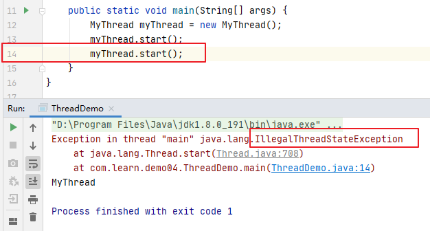
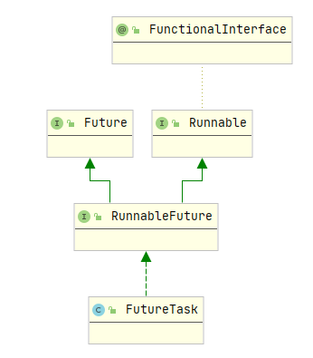

#   Java多线程入门类和接口

---

#   Thread类和Runnable接口

上一章我们了解了操作系统中多线程的基本概念。那么在Java中，我们是如何使用多线程的呢？

首先，我们需要有一个“线程”类。JDK提供了`Thread`类和`Runnable`接口来让我们实现自己的“线程”类。

+   继承Thread类，并重写run方法；
+   实现Runnable接口的run方法；

##  继承Thread类

先学会怎么用，再学原理。首先我们来看看怎么用Thread和Runnable来写一个Java多线程程序。

首先是继承Thread类：

```java
public class Demo {
    public static class MyThread extends Thread {
        @Override
        public void run() {
            System.out.println("MyThread");
        }
    }

    public static void main(String[] args) {
        Thread myThread = new MyThread();
        myThread.start();
    }
}
```

注意要调用start()方法后，该线程才算启动！

+   我们在程序里面调用了start()方法后，虚拟机会先为我们创建一个线程，然后等到这个线程第一次得到时间片时再调用run()方法。
+   注意`不可多次调用start()`方法。在第一次调用start()方法后，再次调用start()方法会抛出IllegalThreadStateException异常。



##  实现Runnable接口

接着我们来看一下Runnable接口(JDK 1.8 +)：
```java
@FunctionalInterface
public interface Runnable {
    public abstract void run();
}
```

可以看到Runnable是一个函数式接口，这意味着我们可以使用`Java 8的函数式编程`来简化代码。

示例代码：

```java
public class Demo {
    public static class MyThread implements Runnable {
        @Override
        public void run() {
            System.out.println("MyThread");
        }
    }

    public static void main(String[] args) {

        new Thread(new MyThread()).start();

        // Java 8 函数式编程，可以省略MyThread类
        new Thread(() -> {
            System.out.println("Java 8 匿名内部类");
        }).start();
    }
}
```


##  Thread类构造方法

Thread类是一个Runnable接口的实现类，我们来看看Thread类的源码。

查看Thread类的构造方法，发现其实是简单调用一个私有的init方法来实现初始化。init的方法签名：

```java
// Thread类源码 

// 片段1 - init方法
private void init(ThreadGroup g, Runnable target, String name,
                      long stackSize, AccessControlContext acc,
                      boolean inheritThreadLocals)

// 片段2 - 构造函数调用init方法
public Thread(Runnable target) {
    init(null, target, "Thread-" + nextThreadNum(), 0);
}

// 片段3 - 使用在init方法里初始化AccessControlContext类型的私有属性
this.inheritedAccessControlContext = 
    acc != null ? acc : AccessController.getContext();

// 片段4 - 两个对用于支持ThreadLocal的私有属性
ThreadLocal.ThreadLocalMap threadLocals = null;
ThreadLocal.ThreadLocalMap inheritableThreadLocals = null;
```

我们挨个来解释一下`init`方法的这些参数：

+   g：线程组，指定这个线程是在哪个线程组下；
+   target：指定要执行的任务；
+   name：线程的名字，多个线程的名字是可以重复的。如果不指定名字，见片段2；
+   acc：见片段3，用于初始化私有变量`inheritedAccessControlContext`。

>   这个变量有点神奇。它是一个私有变量，但是在Thread类里只有init方法对它进行初始化，在exit方法把它设为null。其它没有任何地方使用它。一般我们是不会使用它的，那什么时候会使用到这个变量呢？可以参考这个stackoverflow的问题：[Restrict permissions to threads which execute third party software](https://stackoverflow.com/questions/13516766/restrict-permissions-to-threads-which-execute-third-party-software)

+   inheritThreadLocals：可继承的ThreadLocal，见片段4，Thread类里面有两个私有属性来支持ThreadLocal，我们会在后面的章节介绍ThreadLocal的概念。

实际情况下，我们大多是直接调用下面两个构造方法：

```java
Thread(Runnable target)
Thread(Runnable target, String name)
```

##  Thread类的几个常用方法

这里介绍一下Thread类的几个常用的方法：

+   currentThread()：静态方法，返回对当前正在执行的线程对象的引用；
+   start()：开始执行线程的方法，java虚拟机会调用线程内的run()方法；
+   yield()：yield在英语里有放弃的意思，同样，这里的yield()指的是当前线程愿意让出对当前处理器的占用。这里需要注意的是，就算当前线程调用了yield()方法，程序在调度的时候，也还有可能继续运行这个线程的；
+   sleep()：静态方法，使当前线程睡眠一段时间；
+   join()：使当前线程等待另一个线程执行完毕之后再继续执行，内部调用的是Object类的wait方法实现的；

### Thread类与Runnable接口的比较：

实现一个自定义的线程类，可以有继承Thread类或者实现Runnable接口这两种方式，它们之间有什么优劣呢？

+   由于Java“单继承，多实现”的特性，Runnable接口使用起来比Thread更灵活。
+   Runnable接口出现更符合面向对象，将线程单独进行对象的封装。
+   Runnable接口出现，降低了线程对象和线程任务的耦合性。
+   如果使用线程时不需要使用Thread类的诸多方法，显然使用Runnable接口更为轻量。

所以，我们`通常优先使用“实现Runnable接口”`这种方式来自定义线程类。

#   Callable、Future与FutureTask

通常来说，我们`使用Runnable和Thread来创建一个新的线程。但是它们有一个弊端，就是run方法是没有返回值的`。而有时候我们希望开启一个线程去执行一个任务，并且这个任务执行完成后有一个返回值。

JDK提供了`Callable接口与Future接口为我们解决这个问题`，这也是所谓的“异步”模型。

##  Callable接口

Callable与Runnable类似，同样是只有一个抽象方法的函数式接口。不同的是，`Callable提供的方法是有返回值的，而且支持泛型`。

```java
@FunctionalInterface
public interface Callable<V> {
    V call() throws Exception;
}
```

那一般是怎么使用Callable的呢？

Callable一般是配合线程池工具ExecutorService来使用的。我们会在后续章节解释线程池的使用。这里只介绍ExecutorService可以使用submit方法来让一个Callable接口执行。它会返回一个Future，我们后续的程序可以通过这个Future的get方法得到结果。

这里可以看一个简单的使用demo：

```java
// 自定义Callable
class Task implements Callable<Integer>{
    @Override
    public Integer call() throws Exception {
        // 模拟计算需要一秒
        Thread.sleep(1000);
        return 2;
    }
    public static void main(String args[]) throws Exception {
        // 使用
        ExecutorService executor = Executors.newCachedThreadPool();
        Task task = new Task();
        Future<Integer> result = executor.submit(task);
        // 注意调用get方法会阻塞当前线程，直到得到结果。
        // 所以实际编码中建议使用可以设置超时时间的重载get方法。
        System.out.println(result.get()); 
    }
}
```

输出结果：

```
2
```

##  Future接口
总的来说Future，能够控制Callable对象的执行，检测是否做完，可以阻塞式获取结果，也可以等待一段时间内获取结果，具体的方法含义如下

Future接口只有几个比较简单的方法：

```java
public abstract interface Future<V> {
    // 用来取消任务,如果取消任务成功则返回true,
    public abstract boolean cancel(boolean paramBoolean);
    public abstract boolean isCancelled();
    public abstract boolean isDone();
    public abstract V get() throws InterruptedException, ExecutionException;
    public abstract V get(long paramLong, TimeUnit paramTimeUnit)
            throws InterruptedException, ExecutionException, TimeoutException;
}
```


`cancel`方法是试图取消一个线程的执行。

注意是`试图`取消，`并不一定能取消成功`。因为任务可能已完成、已取消、或者一些其它因素不能取消，存在取消失败的可能。boolean类型的返回值是“是否取消成功”的意思。参数paramBoolean表示是否采用中断的方式取消线程执行。

所以有时候，为了让任务有能够取消的功能，就使用Callable来代替Runnable。如果为了可取消性而使用 Future但又不提供可用的结果，则可以声明 Future<?>形式类型、并返回 null作为底层任务的结果。

##  FutureTask类

上面介绍了Future接口。这个接口有一个实现类叫FutureTask。FutureTask是实现的RunnableFuture接口的，而RunnableFuture接口同时继承了Runnable接口和Future接口：

```java
public interface RunnableFuture<V> extends Runnable, Future<V> {
    /**
     * Sets this Future to the result of its computation
     * unless it has been cancelled.
     */
    void run();
}
```



那FutureTask类有什么用？为什么要有一个FutureTask类？

前面说到了`Future只是一个接口，而它里面的cancel，get，isDone等方法要自己实现起来都是非常复杂的`。所以JDK提供了一个FutureTask类来供我们使用。

示例代码：

```java
// 自定义Callable，与上面一样
class Task implements Callable<Integer>{
    @Override
    public Integer call() throws Exception {
        // 模拟计算需要一秒
        Thread.sleep(1000);
        return 2;
    }
    public static void main(String args[]) throws Exception {
        // 使用
        ExecutorService executor = Executors.newCachedThreadPool();
        // 这行有区别
        FutureTask<Integer> futureTask = new FutureTask<>(new Task());
        executor.submit(futureTask);
        System.out.println(futureTask.get());
    }
}
```

使用上与第一个Demo有一点小的区别。首先，调用submit方法是没有返回值的。这里实际上是调用的submit(Runnable task)方法，而上面的Demo，调用的是submit(Callable<T> task)方法。

然后，这里是使用FutureTask直接取get取值，而上面的Demo是通过submit方法返回的Future去取值。

在很多高并发的环境下，有可能Callable和FutureTask会创建多次。FutureTask能够在高并发环境下确保任务只执行一次。这块有兴趣的同学可以参看FutureTask源码。

2.2.4 FutureTask的几个状态

/**
  *
  * state可能的状态转变路径如下：
  * NEW -> COMPLETING -> NORMAL
  * NEW -> COMPLETING -> EXCEPTIONAL
  * NEW -> CANCELLED
  * NEW -> INTERRUPTING -> INTERRUPTED
  */
private volatile int state;
private static final int NEW          = 0;
private static final int COMPLETING   = 1;
private static final int NORMAL       = 2;
private static final int EXCEPTIONAL  = 3;
private static final int CANCELLED    = 4;
private static final int INTERRUPTING = 5;
private static final int INTERRUPTED  = 6;

    state表示任务的运行状态，初始状态为NEW。运行状态只会在set、setException、cancel方法中终止。COMPLETING、INTERRUPTING是任务完成后的瞬时状态。

以上就是Java多线程几个基本的类和接口的介绍。可以打开JDK看看源码，体会这几个类的设计思路和用途吧！

参考资料

    Java语言定义的线程状态分析
    Java线程状态分析
    FutureTask源码分析
