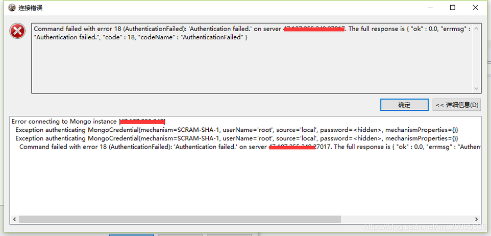
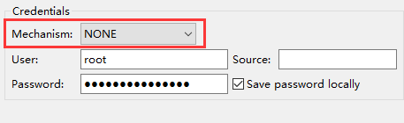
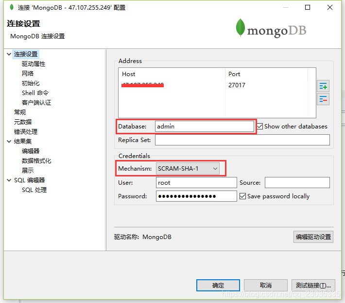
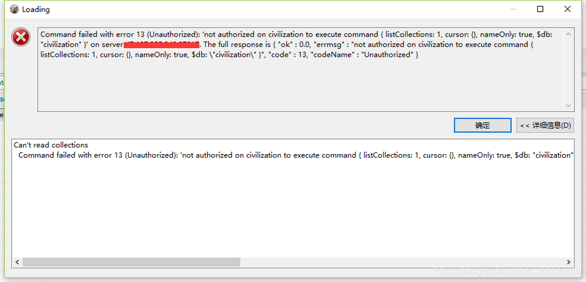

#	DBeaver连接MongoDB

---

>	DBeaver企业版支持连接MongoDB数据库

#	连接遇到的问题
由于第一次使用DBeaver连接MongoDB，出现一些坑，以此文档记录下坑坑洼洼
需求是：建立与MongoDB的连接后可以看到MongoDB里面的所有数据库

!> 	坑1、如果，这里建立连接时使用某一个数据库的用户名密码，创建后就只能看到自己有权限看到的数据库。

!>	坑2、如果使用root用户密码，且用户root的角色是root，或角色是userAdminAnyDatabase（并不是一定要求用户名是root，重点是角色，角色影响着权限，影响着能看到和操作哪些数据库），且root用户是属于admin数据库（系统自带）。

使用上面的root连接时，Database必须选择admin，否则报如下错：



由于MongoDB的用户在不同数据库是可以重名的，所有用户是跟数据库相关的，这里选择的是哪个数据库，用户登录验证就是去哪个数据库验证，如上面的root用户是admin数据库的，在其他数据库就肯定会认证失败。

!>	坑3、如下图，如果这里选择的Mechanism为NONE，就会导致不验证，也就会导致虽然能连接成功，但是看不到任何数据库。



```bash
> use admin
switched to db admin
> db.system.users.find({user:"root"})
{ "_id" : "admin.root", "user" : "root", "db" : "admin", "credentials" : { "SCRAM-SHA-1" : { "iterationCount" : 10000, "salt" : "dBRpy8QbuPr5z2Ph0NC81Q==", "storedKey" : "BenFLJRZdZHDNqyAxST49ZqXuzY=", "serverKey" : "S/F5KxDOcD1T9gsNEfxeZdGL4mQ=" } }, "roles" : [ { "role" : "userAdminAnyDatabase", "db" : "admin" } ] }
> 
```

从上面可以看到，默认用户的credentials是SCRAM-SHA-1，所以Mechanism要选择SCRAM-SHA-1去验证用户名密码。

#	正确的连接方式

?>	最后，正确的连接方式如下图，这样连接后就可以看到所有的数据库：



?>	切记：如果root的权限只是userAdminAnyDatabase：有分配角色和用户的权限，但没有查写的权限。当查看数据库里的集合时，就会出如下的错误。角色是root才是超级管理员，才可以查写任何数据库里的数据。

