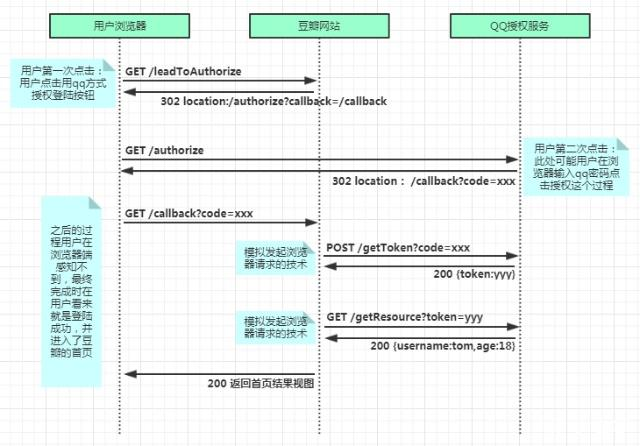
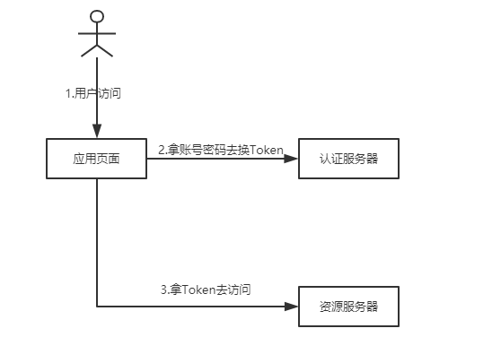
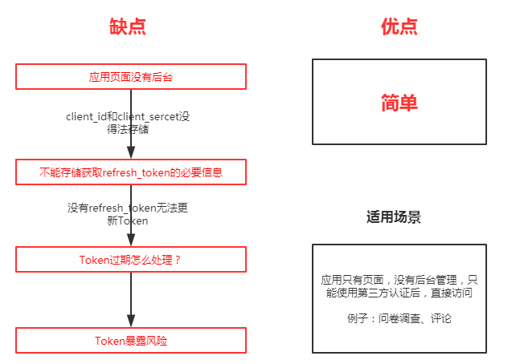
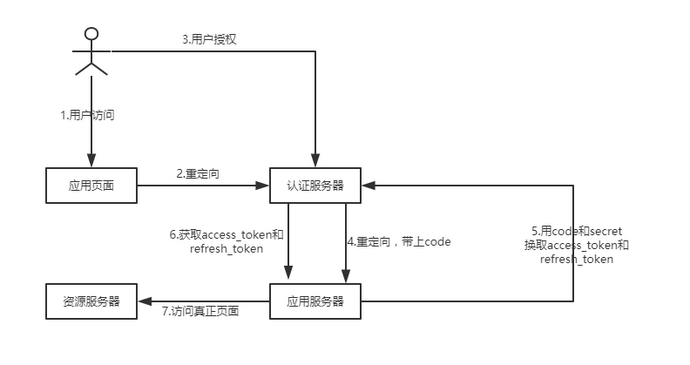
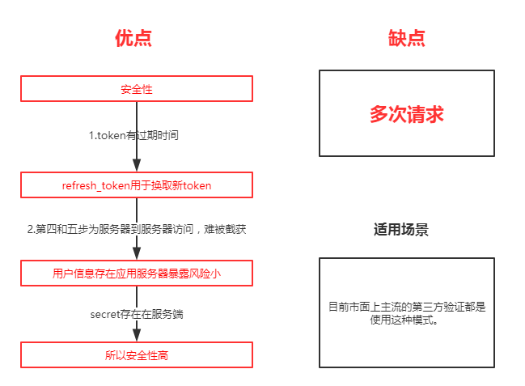
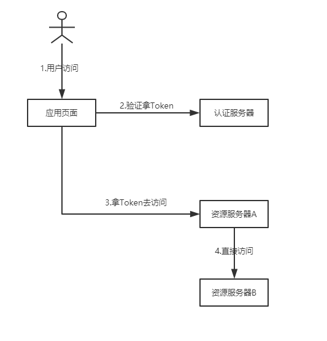

# OAuth2.0的四种授权模式

---

# 什么是OAuth2

OAuth（开放授权）是一个开放标准，允许用户授权第三方移动应用访问他们存储在另外的服务提供者上的信息，而不需要将用户名和密码提供给第三方移动应用或分享他们数据的所有内容，OAuth2.0是OAuth协议的延续版本，但不向后兼容OAuth 1.0即完全废止了OAuth1.0。

# 应用场景

第三方应用授权登录：在APP或者网页接入一些第三方应用时，时长会需要用户登录另一个合作平台，比如QQ，微博，微信的授权登录。

原生app授权：app登录请求后台接口，为了安全认证，所有请求都带token信息，如果登录验证、请求后台数据。

前后端分离单页面应用（spa）：前后端分离框架，前端请求后台数据，需要进行oauth2安全认证，比如使用vue、react后者h5开发的app。

# 名词定义
+   Third-party application：第三方应用程序，本文中又称"客户端"（client），比如打开知乎，使用第三方登录，选择qq登录，这时候知乎就是客户端。
+   HTTP service：HTTP服务提供商，本文中简称"服务提供商"，即上例的qq。
+   Resource Owner：资源所有者，本文中又称"用户"（user）,即登录用户。
+   User Agent：用户代理，本文中就是指浏览器。
+   Authorization server：认证服务器，即服务提供商专门用来处理认证的服务器。
+   Resource server：资源服务器，即服务提供商存放用户生成的资源的服务器。它与认证服务器，可以是同一台服务器，也可以是不同的服务器。

# OAuth2.0四种模式

## 隐式授权模式（Implicit Grant）

+   第一步：用户访问页面时，重定向到认证服务器。
+   第二步：认证服务器给用户一个认证页面，等待用户授权。
+   第三步：用户授权，认证服务器想应用页面返回Token
+   第四步：验证Token，访问真正的资源页面

## 授权码授权模式（Authorization code Grant）

+   第一步：用户访问页面
+   第二步：访问的页面将请求重定向到认证服务器
+   第三步：认证服务器向用户展示授权页面，等待用户授权
+   第四步：用户授权，认证服务器生成一个code和带上client_id发送给应用服务器,然后，应用服务器拿到code，并用client_id去后台查询对应的client_secret
+   第五步：将code、client_id、client_secret传给认证服务器换取access_token和refresh_token
+   第六步：将access_token和refresh_token传给应用服务器
+   第七步：验证token，访问真正的资源页面

案例Github自取:https://github.com/PinkPig-cq/springSecurityoAuth

## 密码模式（Resource Owner Password Credentials Grant）

+   第一步：用户访问用页面时，输入第三方认证所需要的信息(QQ/微信账号密码)
+   第二步：应用页面那种这个信息去认证服务器授权
+   第三步：认证服务器授权通过，拿到token，访问真正的资源页面

优点：不需要多次请求转发，额外开销，同时可以获取更多的用户信息。(都拿到账号密码了)

缺点：局限性，认证服务器和应用方必须有超高的信赖。(比如亲兄弟？)

应用场景：自家公司搭建的认证服务器

## 客户端凭证模式（Client Credentials Grant）

+   第一步：用户访问应用客户端
+   第二步：通过客户端定义的验证方法，拿到token，无需授权
+   第三步：访问资源服务器A
+   第四步：拿到一次token就可以畅通无阻的访问其他的资源页面。

这是一种最简单的模式，只要client请求，我们就将AccessToken发送给它。这种模式是最方便但最不安全的模式。因此这就要求我们对client完全的信任，而client本身也是安全的。

因此这种模式一般用来提供给我们完全信任的服务器端服务。在这个过程中不需要用户的参与。

# 参考
+   [OAuth2.0的四种授权模式](https://www.cnblogs.com/alittlesmile/p/11531577.html)
