# Jenkins配置选择commit选择服务器构建springcloud微服务项目

1. 选择commit
2. 选择springcloud项目
3. 选择服务器

---

# 安装插件

+ 安装 `Extended Choice Parameter`
+ 安装`Git Parameter`
+ 安装`Publish Over SSH`用于连接远程服务器
+ 安装`Deploy to container`插件用于把打包的应用发布到远程服务器

# Jenkins配置

## 新建任务

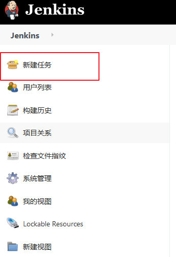

## 构建一个多配置项目

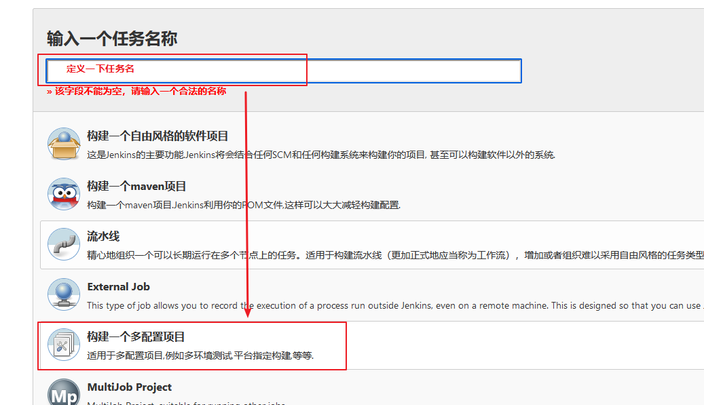

## 参数化配置

### 配置多个微服务可选择
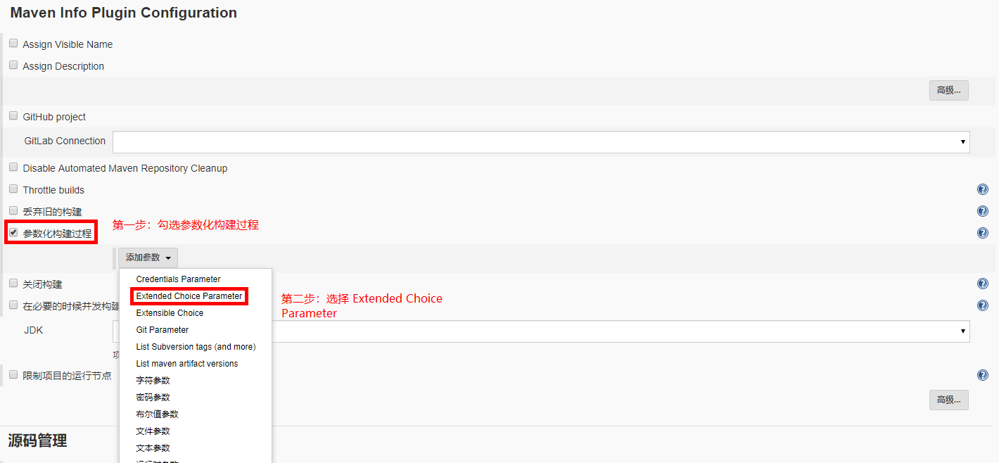

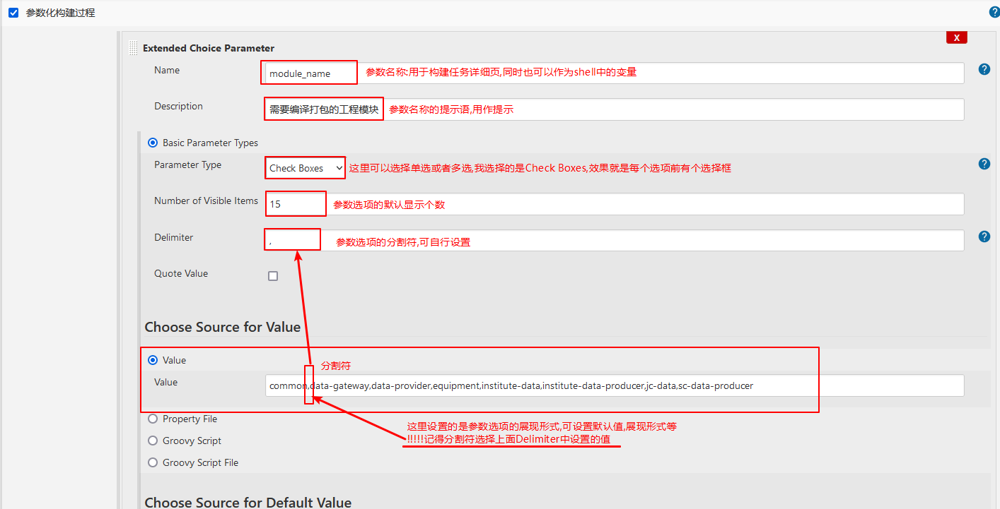

### 配置可选择git commit
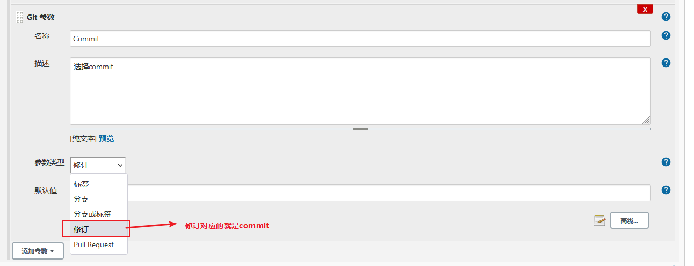

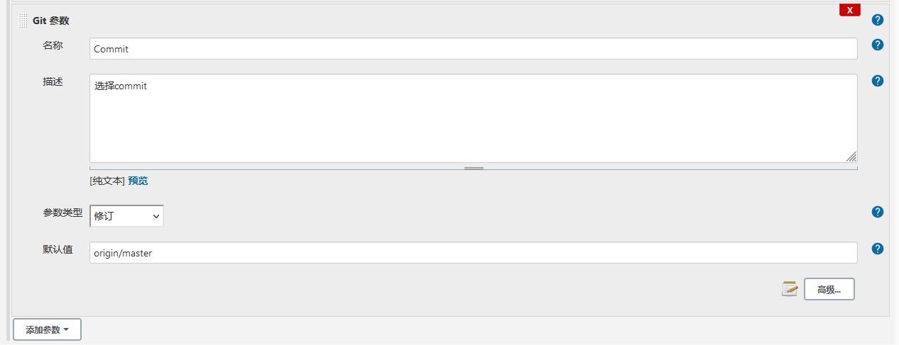

### 配置可选服务器

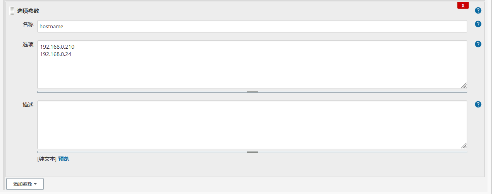

## 配置源码管理

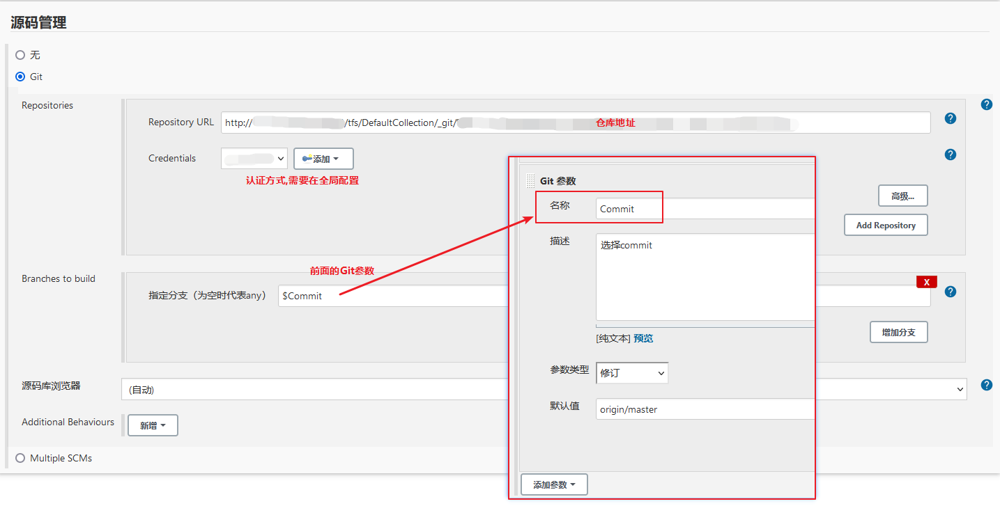

## 编写 Shell

按如下图片设置各参数的细节

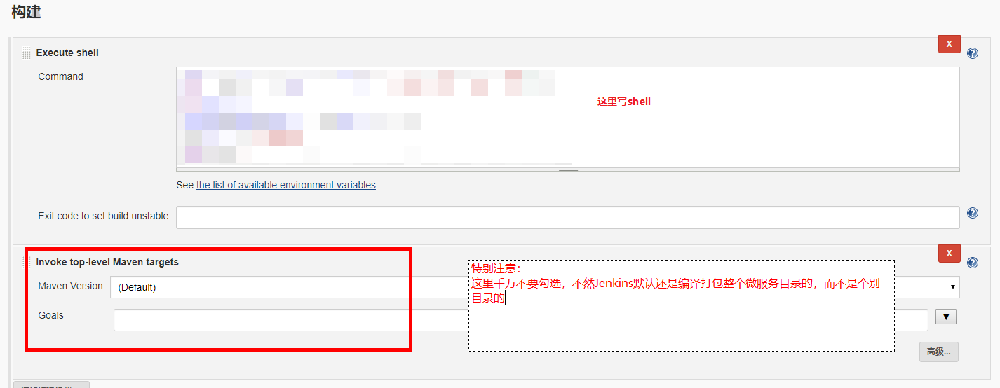

+ 其中，Shell 脚本的变量 WORKSPACE 就是指的工作区目录，也是制定到拉取git仓库后的目录
+ 变量 module_name 是 上一步配置的那个参数名称
+ 这里因为是多选项， ${module_name }输出是 common,data-gateway 这种形式，所以要做一下格式化处理，这里用的是 awk 切割
+ 此外，`Maven执行的命令最好使用绝对路径`，使用系统环境变量有可能会找不到

这里我写了一份,仅供参考

!> 注意:`BUILD_ID=dontKillMe`一定要加,因为Jenkins默认会在Build结束后Kill掉所有的衍生进程,参考这个https://blog.csdn.net/u011781521/article/details/80210985

```bash
echo ${module_name} | awk -F',' -v OFS='\n' '{var=$1;$1=var;print $0}' > model_name.txt

OLD_BUILD_ID=$BUILD_ID
BUILD_ID=dontKillMe

while read line
do
  echo "修改配置文件"
  resourcesDir=${WORKSPACE}/textile-equipment-internet/${line}/src/main/resources/
  if [ -d $resourcesDir ]; then
    cd ${resourcesDir}

    if [ -f "bootstrap.yml" ]; then
      sed -i 's/group.*DEV_GROUP/group: PRO_GROUP/g' bootstrap.yml
      echo "修改配置文件成功"
    else
      echo "bootstrap.yml文件不存在"
    fi

    if [ -f "application.properties" ]; then
      sed -i 's/spring\.profiles\.active.*dev/spring.profiles.active=pro/g' application.properties
    else
      echo "application.properties文件不存在"
    fi
  fi

  echo "构建模块"
  cd ${WORKSPACE}/textile-equipment-internet/${line}
  buildTarget=`/opt/module/maven/bin/mvn clean install -Dmaven.test.skip`
  echo "${line} 模块构建好了"

done < model_name.txt

BUILD_ID=$OLD_BUILD_ID
```

+ 这一段代码主要是jenkins所在机器对文件进行拉取和mvn构建

## 配置要发送的服务器

参考:
+ [jenkins根据参数不同配置发布到不同的主机](https://blog.csdn.net/baidu_38432732/article/details/103389449)
+ [jenkins-参数化发布到不同机器上](https://blog.csdn.net/tjstar/article/details/94733674)


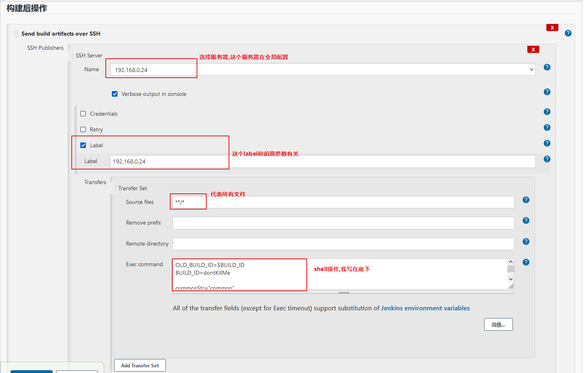

```bash
OLD_BUILD_ID=$BUILD_ID
BUILD_ID=dontKillMe

commonStr="common"
if [ "${commonStr}" != "${module_name}" ] ; then
  pid=`ps -ef | grep ${module_name}-1.0-SNAPSHOT.jar | grep -v  grep | awk '{print $2}'`

  if [ -z $pid ] ; then
    echo "no this process"
  else
      kill -9 $pid
  fi

  # 这里的/root/software是全局配置中的ssh的Remote Directory
  cd /root/software/textile-equipment-internet/${module_name}/target/
  res=`nohup java -jar ${module_name}-1.0-SNAPSHOT.jar > /dev/null 2>&1 &`
fi

BUILD_ID=$OLD_BUILD_ID
```

多个服务器要配置多个

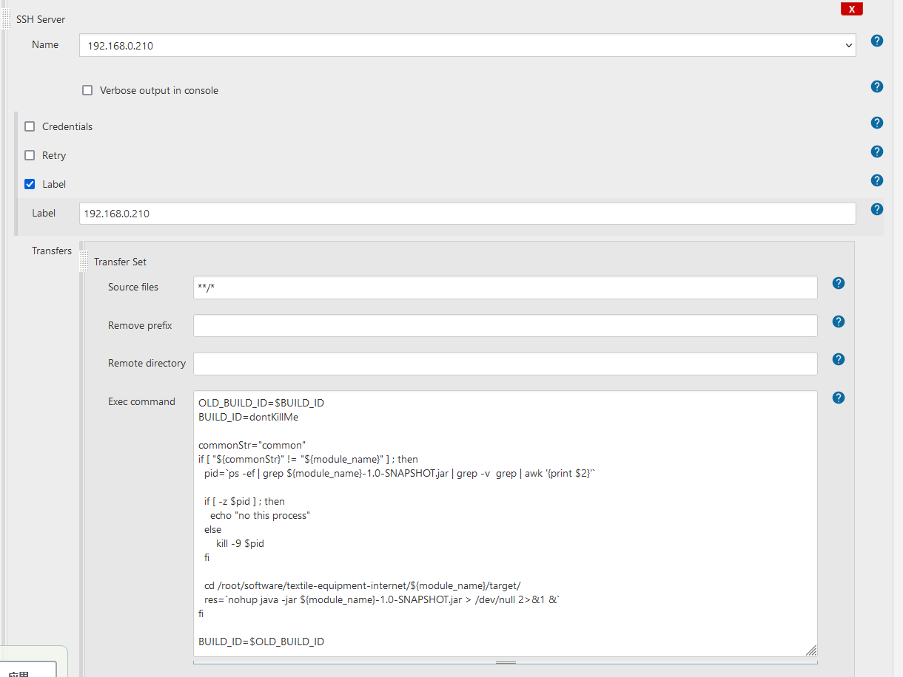

点击高级,配置参数化推送`Parameterized publishing`

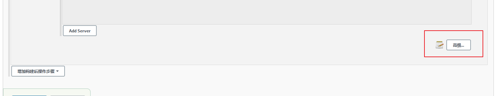

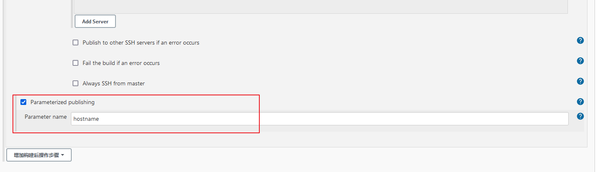

# 查看效果

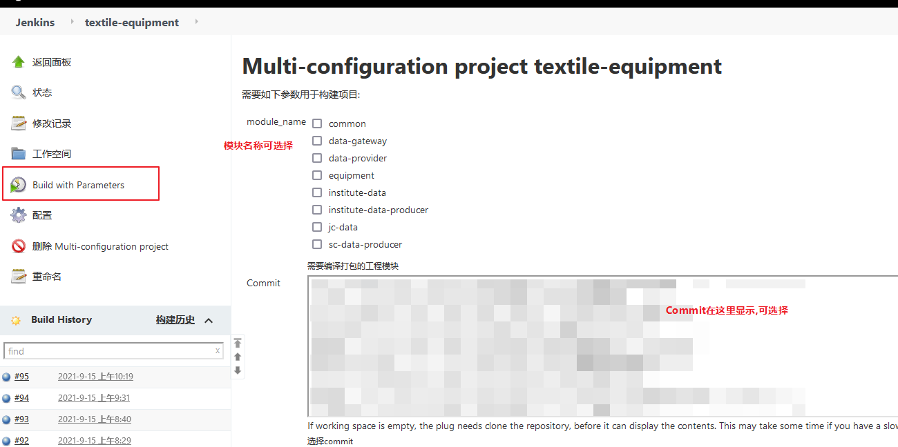


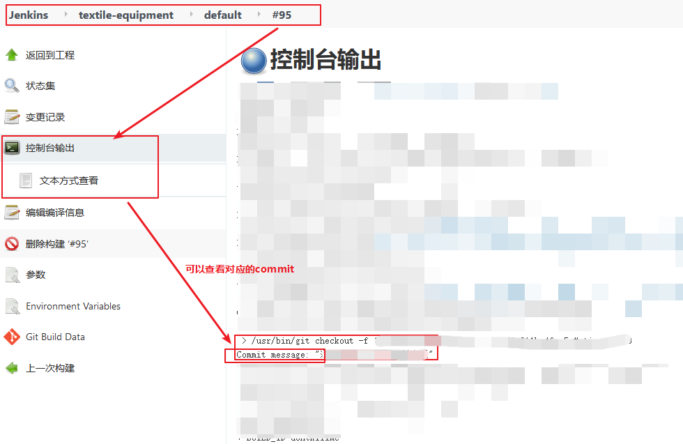

# 参考

+ [Jenkins 构建springcloud 微服务项目](https://www.jianshu.com/p/aeea9c7b67cf)
+ [jenkins使用Git参数化构建——指定branch、commit、tag上线](https://blog.csdn.net/hbbdgyb/article/details/109312105)
