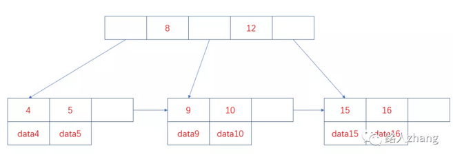
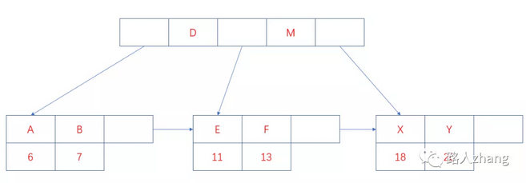
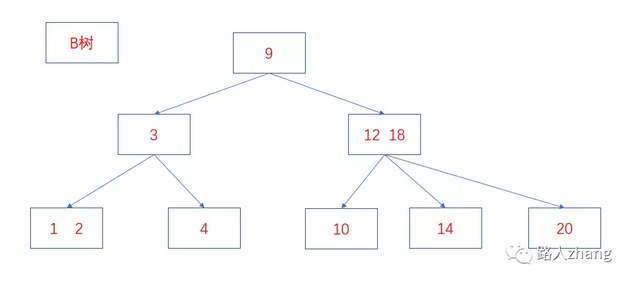
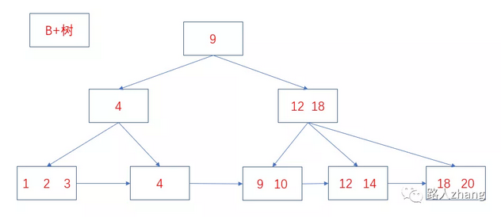
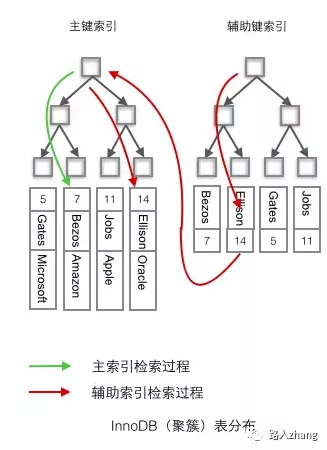
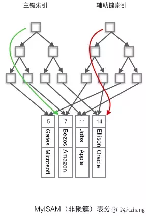
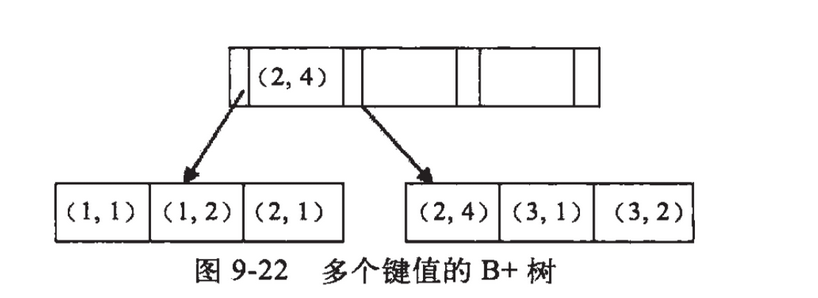

# MySQL知识点总结

---

# 什么是MySQL？　＊

百度百科上的解释：MySQL是一种开放源代码的关系型数据库管理系统（RDBMS），使用最常用的数据库管理语言--结构化查询语言（SQL）进行数据库管理。MySQL是开放源代码的，因此任何人都可以在General Public License的许可下下载并根据个性化的需要对其进行修改。

# MySQL常用的存储引擎有什么？它们有什么区别？　＊＊＊

+   InnoDB
    -   InnoDB是MySQL的默认存储引擎，支持事务、行锁和外键等操作。
+   MyISAM
    -   MyISAM是MySQL5.1版本前的默认存储引擎，MyISAM的并发性比较差，不支持事务和外键等操作，默认的锁的粒度为表级锁。


|          |               InnoDB               |                   MyISAM                   |
|----------|------------------------------------|--------------------------------------------|
|          |                                    |                                            |
| 外键     | 支持                               | 不支持                                     |
| 事务     | 支持                               | 不支持                                     |
| 锁       | 支持表锁和行锁                     | 支持表锁                                   |
| 可恢复性 | 根据事务日志进行恢复               | 无事务日志                                 |
| 表结构   | 数据和索引是集中存储的，.ibd和.frm | 数据和索引是分开存储的，数据.MYD，索引.MYI |
| 查询性能 | 一般情况相比于MyISAM较差           | 一般情况相比于InnoDB较差                   |
| 索引     | 聚簇索引                           | 非聚簇索引                                 |


# 数据库的三大范式　＊＊

+ 第一范式：确保每列保持原子性，数据表中的所有字段值都是不可分解的原子值。
+ 第二范式：确保表中的每列都和主键相关
+ 第三范式：确保每列都和主键列直接相关而不是间接相关

# MySQL的数据类型有哪些　＊＊

## 整数

TINYINT、SMALLINT、MEDIUMINT、INT、BIGINT分别占用8、16、24、32、64位存储空间。

值得注意的是，`INT(10)中的10只是表示显示字符的个数，并无实际意义`。一般和UNSIGNED ZEROFILL配合使用才有实际意义，例如，数据类型INT(3)，属性为UNSIGNED ZEROFILL，如果插入的数据为3的话，实际存储的数据为003。

## 浮点数

FLOAT、DOUBLE及DECIMAL为浮点数类型，`DECIMAL是利用字符串进行处理的，能存储精确的小数`。相比于FLOAT和DOUBLE，DECIMAL的效率更低些。FLOAT、DOUBLE及DECIMAL都可以指定列宽，例如`FLOAT(5,2)表示一共5位，两位存储小数部分，三位存储整数部分`。

## 字符串

字符串常用的主要有CHAR和VARCHAR，VARCHAR主要用于存储可变长字符串，相比于定长的CHAR更节省空间。CHAR是定长的，根据定义的字符串长度分配空间。

应用场景：
+   对于经常变更的数据使用CHAR更好，CHAR不容易产生碎片。
+   对于非常短的列也是使用CHAR更好些，CHAR相比于VARCHAR在效率上更高些。
+   一般`避免使用TEXT/BLOB等类型`，因为查询时会使用临时表，造成严重的性能开销。

## 日期

比较常用的有year、time、date、datetime、timestamp等

+   datetime保存从1000年到9999年的时间，精度到秒，使用8字节的存储空间，与时区无关。
+   timestamp和UNIX的时间戳相同，保存从1970年1月1日午夜到2038年的时间，精度到秒，使用四个字节的存储空间，并且与时区相关。

应用场景：`尽量使用timestamp，相比于datetime它有着更高的空间效率`。


# 索引　＊＊＊


## 什么是索引？

百度百科的解释：索引是对数据库表的一列或者多列的值进行排序一种结构，使用索引可以快速访问数据表中的特定信息。

## 索引的优缺点？

优点：

+   大大加快数据检索的速度。
+   将随机I/O变成顺序I/O(因为B+树的叶子节点是连接在一起的)
+   加速表与表之间的连接

缺点：

+   从空间角度考虑，建立索引需要占用物理空间
+   从时间角度 考虑，创建和维护索引都需要花费时间，例如对数据进行增删改的时候都需要维护索引。

## 索引的种类有哪些？

+   主键索引：数据列不允许重复，不能为NULL，一个表只能有一个主键索引
+   组合索引：由多个列值组成的索引。
+   唯一索引：数据列不允许重复，可以为NULL，索引列的值必须唯一的，如果是组合索引，则列值的组合必须唯一。
+   全文索引：对文本的内容进行搜索。
+   普通索引：基本的索引类型，可以为NULL

## 索引的数据结构

### 根据数据结构分类索引的类型有哪些?

MySQL主要的索引类型主要有FULLTEXT，HASH，BTREE，RTREE。

+   FULLTEXT
    -   FULLTEXT即全文索引，MyISAM存储引擎和InnoDB存储引擎在MySQL5.6.4以上版本支持全文索引，一般用于查找文本中的关键字，而不是直接比较是否相等，多在CHAR，VARCHAR，TAXT等数据类型上创建全文索引。全文索引主要是`用来解决WHERE name LIKE "%zhang%"等针对文本的模糊查询效率低的问题`。

+   HASH
    -   HASH即哈希索引，哈希索引多用于等值查询，`时间复杂度为o(1)，效率非常高，但不支持排序、范围查询及模糊查询`等。

+   BTREE
    -   BTREE即B+树索引，INnoDB存储引擎默认的索引，`支持排序、分组、范围查询、模糊查询等，并且性能稳定`。

+   RTREE
    -   RTREE即空间数据索引，多用于地理数据的存储，相比于其他索引，空间数据索引的`优势在于范围查找`

索引的数据结构主要有B+树和哈希表，对应的索引分别为B+树索引和哈希索引。InnoDB引擎的索引类型有B+树索引和哈希索引，默认的索引类型为B+树索引。

### Hash索引和B+树

#### B+树结构

熟悉数据结构的同学都知道，B+树、平衡二叉树、红黑树都是经典的数据结构。在B+树中，所有的记录节点都是按照键值大小的顺序放在叶子节点上，如下图。



从上图可以看出 ，因为B+树具有有序性，并且所有的数据都存放在叶子节点，所以查找的效率非常高，并且支持排序和范围查找。

B+树的索引又可以分为主索引和辅助索引。其中主索引为聚簇索引，辅助索引为非聚簇索引。
+   聚簇索引是以主键作为B+ 树索引的键值所构成的B+树索引，聚簇索引的叶子节点存储着完整的数据记录；
+   非聚簇索引是以非主键的列作为B+树索引的键值所构成的B+树索引，非聚簇索引的叶子节点存储着主键值。所以`使用非聚簇索引进行查询时，会先找到主键值，然后到根据聚簇索引找到主键对应的数据域`。上图中叶子节点存储的是数据记录，为聚簇索引的结构图，非聚簇索引的结构图如下：



上图中的字母为数据的非主键的列值，假设要查询该列值为B的信息，则需先找到主键7，在到聚簇索引中查询主键7所对应的数据域。

#### 哈希结构

哈希索引是基于哈希表实现的，对于每一行数据，存储引擎会对索引列通过哈希算法进行哈希计算得到哈希码，并且哈希算法要尽量保证不同的列值计算出的哈希码值是不同的，将哈希码的值作为哈希表的key值，将指向数据行的指针作为哈希表的value值。这样查找一个数据的时间复杂度就是o(1)，`一般多用于精确查找`。

#### Hash索引和B+树的区别？

因为两者数据结构上的差异导致它们的使用场景也不同，哈希索引一般多用于精确的等值查找，B+索引则多用于除了精确的等值查找外的其他查找。在大多数情况下，会选择使用B+树索引。

+   哈希索引不支持排序，因为哈希表是无序的。
+   哈希索引不支持范围查找。
+   哈希索引不支持模糊查询及多列索引的最左前缀匹配。
+   因为哈希表中会存在哈希冲突，所以哈希索引的性能是不稳定的，而B+树索引的性能是相对稳定的，每次查询都是从根节点到叶子节点

#### B树和B+树的区别？

B树和B+树最主要的区别主要有两点：

+   B树中的内部节点和叶子节点均存放键和值，而B+树的内部节点只有键没有值，叶子节点存放所有的键和值。
+   B＋树的叶子节点是通过相连在一起的，方便顺序检索。
+   两者的结构图如下。





#### 数据库为什么使用B+树而不是B树？

+   B树适用于随机检索，而B+树适用于随机检索和顺序检索
+   B+树的空间利用率更高，因为B树每个节点要存储键和值，而B+树的内部节点只存储键，这样B+树的一个节点就可以存储更多的索引，从而使树的高度变低，减少了I/O次数，使得数据检索速度更快。
+   B+树的叶子节点都是连接在一起的，所以范围查找，顺序查找更加方便
+   B+树的性能更加稳定，因为在B+树中，每次查询都是从根节点到叶子节点，而在B树中，要查询的值可能不在叶子节点，在内部节点就已经找到。

那在什么情况适合使用B树呢，因为B树的内部节点也可以存储值，所以可以把一些频繁访问的值放在距离根节点比较近的地方，这样就可以提高查询效率。综上所述，B+树的性能更加适合作为数据库的索引。


## 什么是聚簇索引，什么是非聚簇索引？

?>  聚簇索引和非聚簇索引最主要的区别是叶子节点的数据是整行数据还是指向数据的指针

+   聚簇索引：将数据和索引放到一起存储，索引结构的叶子节点保留了数据行。
+   非聚簇索引：将数据进和索引分开存储，索引叶子节点存储的是指向数据行的地址。

在InnoDB存储引擎中，默认的索引为B+树索引，利用主键创建的索引为主索引，也是聚簇索引，在主索引之上创建的索引为辅助索引，也是非聚簇索引。为什么说辅助索引是在主索引之上创建的呢，因为辅助索引中的叶子节点存储的是主键。

在MyISAM存储引擎中，默认的索引也是B+树索引，但主索引和辅助索引都是非聚簇索引，也就是说索引结构的叶子节点存储的都是一个指向数据行的地址。并且使用辅助索引检索无需访问主键的索引。

可以从非常经典的两张图看看它们的区别(图片来源于网络)：





## 非聚簇索引一定会进行回表查询吗？

上面是说了非聚簇索引的叶子节点存储的是主键，也就是说要先通过非聚簇索引找到主键，再通过聚簇索引找到主键所对应的数据，后面这个再通过聚簇索引找到主键对应的数据的过程就是回表查询，那么非聚簇索引就一定会进行回表查询吗？

答案是不一定的，这里涉及到一个索引覆盖的问题，`如果查询的数据在辅助索引上完全能获取到便不需要回表查询`。

例如有一张表存储着个人信息包括id、name、age等字段。假设聚簇索引是以ID为键值构建的索引，非聚簇索引是以name为键值构建的索引，select id,name from user where name = 'zhangsan';这个查询便不需要进行回表查询，因为，通过非聚簇索引已经能全部检索出数据，这就是索引覆盖的情况。如果查询语句是这样，select id,name,age from user where name = 'zhangsan';则需要进行回表查询，因为通过非聚簇索引不能检索出age的值。那应该如何解决那呢？只需要将索引覆盖即可，建立age和name的联合索引再使用select id,name,age from user where name = 'zhangsan';进行查询即可。

所以通过索引覆盖能解决非聚簇索引回表查询的问题。

## 索引的设计原则？

+   最适合索引的列是`在where后面出现的列或者连接句子中指定的列`，而不是出现在SELECT关键字后面的选择列表中的列。
+   索引列的基数越大，索引的效果越好，换句话说就是`索引列的区分度越高，索引的效果越好`。比如使用性别这种区分度很低的列作为索引，效果就会很差，因为列的基数最多也就是三种，大多不是男性就是女性。
+   `尽量使用短索引，对于较长的字符串进行索引时应该指定一个较短的前缀长度`，因为较小的索引涉及到的磁盘I/O较少，并且索引高速缓存中的块可以容纳更多的键值，会使得查询速度更快。
+   `尽量利用最左前缀`。
+   不要过度索引，每个索引都需要额外的物理空间，维护也需要花费时间，所以索引不是越多越好。

## 索引的使用场景有哪些？

+   对于中大型表建立索引非常有效，对于非常小的表，一般全部表扫描速度更快些。
+   对于超大型的表，建立和维护索引的代价也会变高，这时可以考虑分区技术。
+   如何表的增删改非常多，而查询需求非常少的话，那就没有必要建立索引了，因为维护索引也是需要代价的。
+   一般不会出现在where条件中的字段就没有必要建立索引了。
+   多个字段经常被查询的话可以考虑联合索引。
+   字段多且字段值没有重复的时候考虑唯一索引。
+   字段多且有重复的时候考虑普通索引。

## 如何对索引进行优化？

对索引的优化其实最关键的就是要符合索引的设计原则和应用场景，将不符合要求的索引优化成符合索引设计原则和应用场景的索引。

除了索引的设计原则和应用场景那几点外，还可以从以下两方面考虑。

+   在进行查询时，索引列不能是表达式的一部分，也不能是函数的参数，因为这样无法使用索引。例如select * from table_name where a + 1 = 2
+   将区分度最高的索引放在前面
+   尽量少使用select *

索引的使用场景、索引的设计原则和如何对索引进行优化可以看成一个问题。

## 如何创建/删除索引？

创建索引：

+   使用CREATE INDEX 语句

```sql
CREATE INDEX index_name ON table_name (column_list);
```

+   在CREATE TABLE时创建

```sql
CREATE TABLE user(
    id INT PRIMARY KEY,
    information text,
    FULLTEXT KEY (information)
);
```

+   使用ALTER TABLE创建索引

```sql
ALTER TABLE table_name ADD INDEX index_name (column_list);
```

删除索引

+   删除主键索引

```sql
alter table 表名 drop primary key
```

+   删除其他索引

```sql
alter table 表名 drop key 索引名
```

## 使用索引查询时性能一定会提升吗？

不一定，前面在索引的使用场景和索引的设计原则中已经提到了如何合理地使用索引，因为创建和维护索引需要花费空间和时间上的代价，如果不合理地使用索引反而会使查询性能下降。

## 什么是前缀索引？

前缀索引是指对文本或者字符串的前几个字符建立索引，这样索引的长度更短，查询速度更快。

使用场景：前缀的区分度比较高的情况下。

建立前缀索引的方式

```sql
ALTER TABLE table_name ADD KEY(column_name(prefix_length));
```

这里面有个prefix_length参数很难确定，这个参数就是前缀长度的意思。通常可以使用以下方法进行确定，先计算全列的区分度

```sql
SELECT COUNT(DISTINCT column_name) / COUNT(*) FROM table_name;
```

然后在计算前缀长度为多少时和全列的区分度最相似。

```sql
SELECT COUNT(DISTINCT LEFT(column_name, prefix_length)) / COUNT(*) FROM table_name;
```

不断地调整prefix_length的值，直到和全列计算出区分度相近。


## 最左匹配元素

### 什么是最左匹配原则？

最左匹配原则是针对组合(联合)索引来说的

最左匹配原则：从最左边为起点开始连续匹配，遇到范围查询（<、>、between、like）会停止匹配。

例如建立索引(a,b,c)，大家可以猜测以下几种情况是否用到了索引。

+   第一种

```sql
select * from table_name where a = 1 and b = 2 and c = 3
select * from table_name where b = 2 and a = 1 and c = 3
```

上面两次查询过程中所有值都用到了索引，where后面字段调换不会影响查询结果，因为MySQL中的优化器会自动优化查询顺序。

+   第二种

```sql
select * from table_name where a = 1
select * from table_name where a = 1 and b = 2
select * from table_name where a = 1 and b = 2 and c = 3
```

答案是三个查询语句都用到了索引，因为三个语句都是从最左开始匹配的。

+   第三种

```sql
select * from table_name where  b = 1
select * from table_name where  b = 1 and c = 2
```

答案是这两个查询语句都没有用到索引，因为不是从最左边开始匹配的

+   第四种

```sql
select * from table_name where a = 1 and c = 2
```

这个查询语句只有a列用到了索引，c列没有用到索引，因为中间跳过了b列，不是从最左开始连续匹配的。

+   第五种

```sql
select * from table_name where  a = 1 and b < 3 and c < 1
```

这个查询中只有a列和b列使用到了索引，而c列没有使用索引，因为根据最左匹配查询原则，遇到范围查询会停止。

+   第六种

```sql
select * from table_name where a like 'ab%';
select * from table_name where a like '%ab'
select * from table_name where a like '%ab%'
```

对于列为字符串的情况，只有前缀匹配可以使用索引，中缀匹配和后缀匹配只能进行全表扫描。

### 为什么是最左匹配原则

我们都知道索引的底层是一颗B+树，那么联合索引当然还是一颗B+树，只不过联合索引的健值数量不是一个，而是多个。构建一颗B+树只能根据一个值来构建，因此数据库依据联合索引最左的字段来构建B+树。

例子：假如创建一个（a,b)的联合索引，那么它的索引树是这样的



可以看到a的值是有顺序的，1，1，2，2，3，3，而b的值是没有顺序的1，2，1，4，1，2。所以b = 2这种查询条件没有办法利用索引，因为联合索引首先是按a排序的，b是无序的。

同时我们还可以发现在a值相等的情况下，b值又是按顺序排列的，但是这种顺序是相对的。所以最左匹配原则遇上范围查询就会停止，剩下的字段都无法使用索引。例如a = 1 and b = 2 a,b字段都可以使用索引，因为在a值确定的情况下b是相对有序的，而 a>1 and b=2，a字段可以匹配上索引，但b值不可以，因为a的值是一个范围，在这个范围中b是无序的。

### 组合索引在什么情况下会失效？

在上面介绍了几种不符合最左匹配原则的情况会导致索引失效，除此之外，以下这几种情况也会导致索引失效。

+   条件中有`or`，例如`select * from table_name where a = 1 or b = 3`
+   在索引上`进行计算`会导致索引失效，例如`select * from table_name where a + 1 = 2`
+   在索引的类型上进行`数据类型的隐形转换`，会导致索引失效，例如字符串一定要加引号，假设 `select * from table_name where a = '1'`会使用到索引，如果写成`select * from table_name where a = 1`则会导致索引失效。
+   在索引中`使用函数`会导致索引失效，例如`select * from table_name where abs(a) = 1`
+   在使用like查询时`以%开头`会导致索引失效
+   索引上`使用！、=、<>`进行判断时会导致索引失效，例如`select * from table_name where a != 1`
+   索引字段上`使用 is null/is not null`判断时会导致索引失效，例如`select * from table_name where a is null`

# 来源
https://mp.weixin.qq.com/s/wtK9fCmMEArvhWt5Z6EG2A