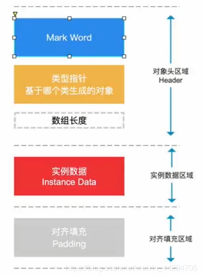
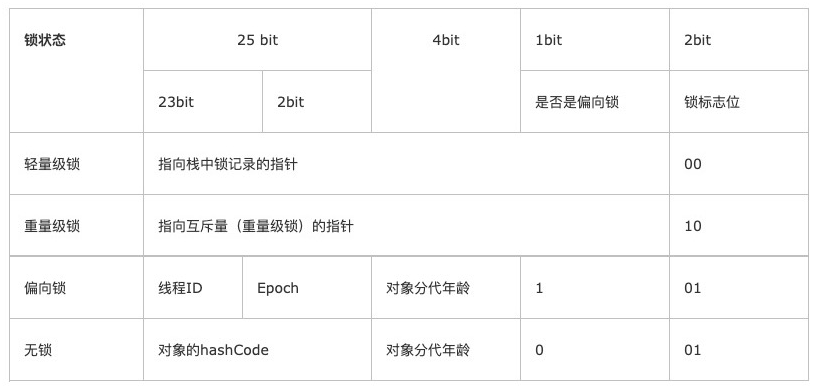
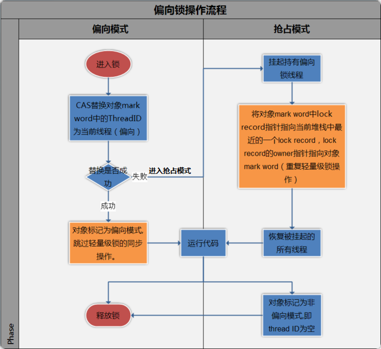
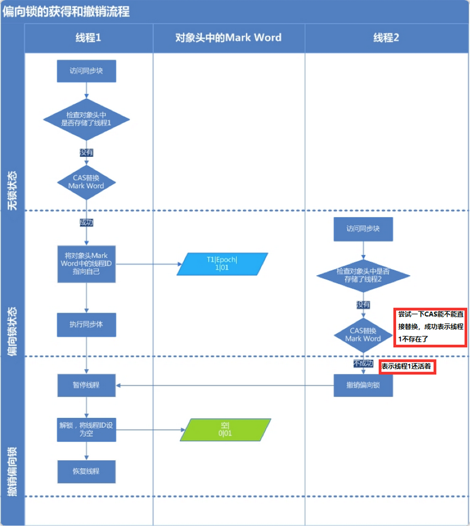
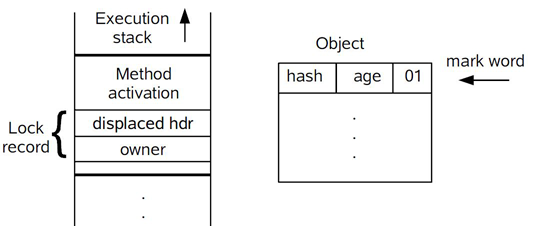
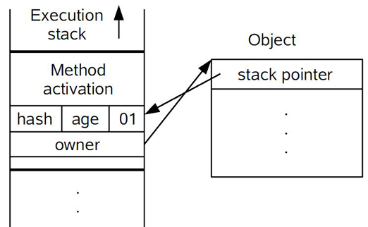
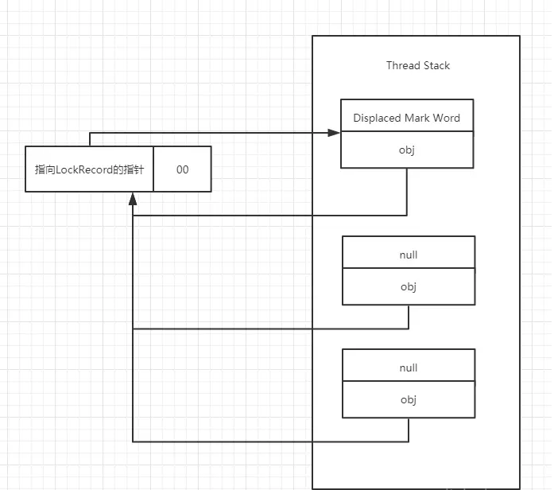
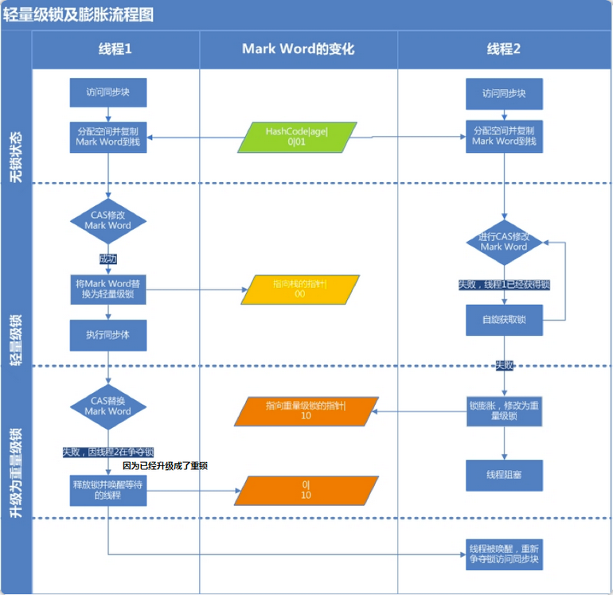
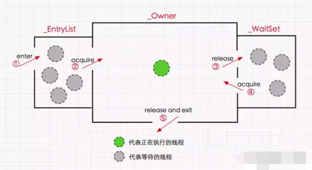

# synchronized与锁

基于 http://concurrent.redspider.group/article/02/9.html 修订

----

这篇文章我们来聊一聊Java多线程里面的“锁”。

首先需要明确的一点是：`Java多线程的锁都是基于对象的，Java中的每一个对象都可以作为一个锁`。

还有一点需要注意的是，我们常听到的`类锁`其实也是对象锁。

Java类只有一个Class对象（可以有多个实例对象，多个实例共享这个Class对象），而Class对象也是特殊的Java对象。所以我们常说的类锁，其实就是Class对象的锁。


# Synchronized关键字

说到锁，我们通常会谈到 `synchronized` 这个关键字。它翻译成中文就是“同步”的意思。

我们通常使用synchronized关键字来给一段代码或一个方法上锁。

## 锁的三种形式

### 锁为括号里面的对象

```java
// 关键字在代码块上，锁为括号里面的对象
public void blockLock() {
    Object o = new Object();
    synchronized (o) {
        // code
    }
}
```

### 锁为当前实例

```java
// 关键字在实例方法上，锁为当前实例
public synchronized void instanceLock() {
    // code
}

////////////////////////////////////////////////////
//////// 等价于 ////////////////////////////////////
///////////////////////////////////////////////////

// 关键字在代码块上，锁为括号里面的对象
public void blockLock() {
    synchronized (this) {
        // code
    }
}
```

### 锁为当前Class对象

```java
// 关键字在静态方法上，锁为当前Class对象
public static synchronized void classLock() {
    // code
}

////////////////////////////////////////////////////
//////// 等价于 ////////////////////////////////////
///////////////////////////////////////////////////

// 关键字在代码块上，锁为括号里面的对象
public void blockLock() {
    synchronized (this.getClass()) {
        // code
    }
}
```

## 临界区概念

所谓“临界区”，`指的是某一块代码区域，它同一时刻只能由一个线程执行`。

在上面的例子中，如果synchronized关键字在方法上，那临界区就是整个方法内部。而如果是使用synchronized代码块，那临界区就指的是代码块内部的区域。


# 几种锁

Java 6 为了减少获得锁和释放锁带来的性能消耗，引入了"偏向锁"和"轻量级锁"。在Java 6 以前，所有的锁都是"重量级"锁。所以在Java 6 及其以后，一个对象其实有四种锁状态，它们级别由低到高依次是：

1. 无锁状态
2. 偏向锁状态
3. 轻量级锁状态
4. 重量级锁状态

无锁就是没有对资源进行锁定，任何线程都可以尝试去修改它，无锁在这里不再细讲。

几种锁会随着竞争情况逐渐升级，`锁的升级很容易发生，但是锁降级发生的条件会比较苛刻`，锁降级发生在Stop The World期间，当JVM进入安全点的时候，会检查是否有闲置的锁，然后进行降级。

关于锁降级有两点说明：

1. 不同于大部分文章说锁不能降级，实际上HotSpot JVM 是支持锁降级的，文末有链接。
2. 上面提到的Stop The World期间，以及安全点，这些知识是属于JVM的知识范畴，本文不做细讲。

下面分别介绍这几种锁以及它们之间的升级。


##  对象的内部结构



+   Mark Word:从名字就能知道它`是一个记录和描述对象的部分`,占八字节内存。
+   类型指针:也叫元数据指针什么的，`主要是存储元数据的地址`,占八字节内存，jvm有默认开启指针压缩，因为发现类型指针部分用不了64位那么多，所以被指针压缩后，成为了四字节，指针压缩的原理，这里我就不说了，非本文重点。
    -   对于对象的类型信息，指向方法区的类信息部分
    -   对于对象的成员变量部分，基本类型就指向方法区的运行时常量池，String类型指向在jdk1.7之后从方法区移到堆区的字符串常量池
    -   其他的对象类型，则指向堆区的对象存储地址。
+   数组数据部分，专门用来存储数组数据。
+   实例数据:这里才是最大的数据存储区，没有什么可说的int a =3，就存个int类型的a值为3，如果值是常量或静态的则直接指向方法区中的对应数据
+   对齐填充:整个对象都要以8字节为基准，比如前面为12字节，那对齐填充就是4字节，加起来是16，可以被8整除，至于为什么，因为操作系统总线带宽是以8字节为基础传输，所以提高传输效率之类的

### Java对象头

前面我们提到，Java的锁都是基于对象的。

对象是在堆中创建的

每个Java对象都有对象头(一个字宽是32位；在64位虚拟机中，一个字宽是64位)。

+   如果是非数组类型，则用2个字宽来存储对象头，
+   如果是数组，则会用3个字宽来存储对象头。在32位处理器中，

对象头的内容如下表：

|   长度   |          内容          |             说明             |
|----------|------------------------|------------------------------|
| 32/64bit | Mark Word              | 存储对象的hashCode或锁信息等 |
| 32/64bit | Class Metadata Address | 存储到对象类型数据的指针     |
| 32/64bit | Array length           | 数组的长度（如果是数组）     |


我们主要来看看`Mark Word的格式`(为了能在有限的空间里存储下更多的数据，其存储格式是不固定的)：

|  锁状态  |       29 bit 或 61 bit       |    1 bit 是否是偏向锁？    | 2 bit 锁标志位 |
|----------|------------------------------|----------------------------|----------------|
| 无锁     |                              | 0                          |             01 |
| 偏向锁   | 线程ID                       | 1                          |             01 |
| 轻量级锁 | 指向栈中锁记录的指针         | 此时这一位不用于标识偏向锁 |             00 |
| 重量级锁 | 指向互斥量（重量级锁）的指针 | 此时这一位不用于标识偏向锁 |             10 |
| GC标记   |                              | 此时这一位不用于标识偏向锁 |             11 |

再具体看一下32位系统上各状态的格式：



可以看到，当对象状态为偏向锁时，Mark Word存储的是偏向的线程ID；当状态为轻量级锁时，Mark Word存储的是指向线程栈中Lock Record的指针；当状态为重量级锁时，Mark Word为指向堆中的monitor对象的指针。

##  全局安全点（safepoint）

safepoint这个词我们在GC中经常会提到，简单来说就是其代表了一个状态，在该状态下所有线程都是暂停的。

## 偏向锁

### 为什么引入偏向锁

1. Hotspot的作者经过以往的研究发现`大多数情况下锁不仅不存在多线程竞争，而且总是由同一线程多次获得`
2. 在无多线程竞争的情况下尽量减少不必要的轻量级锁执行路径，因为`轻量级锁的获取及释放依赖多次CAS原子指令，而偏向锁只需要在置换ThreadID的时候依赖一次CAS原子指令`。
当只有一个线程去竞争锁的时候，我们不需要阻塞，也不需要自旋，因为只有一个线程在竞争，我们只要去判断该偏向锁中的ThreadID是否为当前线程即可。如果是就执行同步代码，不是就尝试使用CAS修改ThreadID，修改成功执行同步代码，不成功就将偏向锁升级成轻量锁。

### 什么是偏向锁

>   名词解释 => CAS: Compare and Swap 比较并设置,用于在硬件层面上提供原子性操作。在 Intel 处理器中，比较并交换通过指令cmpxchg实现,`比较是否和给定的数值一致，如果一致则修改，不一致则不修改`。

偏向锁会偏向于第一个访问锁的线程，如果在接下来的运行过程中，该锁没有被其他的线程访问，则持有偏向锁的线程将永远不需要触发同步。即偏向锁在获取资源的时候会在资源对象上记录该对象是偏向该线程的，`偏向锁并不会主动释放`，这样每次偏向锁进入的时候都会判断改资源是否是偏向自己的，如果是偏向自己的则不需要进行额外的操作，直接可以进入同步操作

也就是说:`偏向锁在资源无竞争情况下消除了同步语句，连CAS操作都不做了，提高了程序的运行性能`。

?> 大白话:就是一个if语句，如果为true，代表资源无竞争，则无需再走各种加锁/解锁流程。如果为false，代表存在其他线程竞争资源，那么就会走后面的流程。

### 偏向锁获取过程

+   （1）访问Mark Word中偏向锁标志位是否设置成1，锁标志位是否为01——确认为可偏向状态。
+   （2）如果为可偏向状态，则测试线程ID是否指向当前线程，如果是，进入步骤（5），否则进入步骤（3）。
+   （3）如果线程ID并未指向当前线程，则通过CAS操作竞争锁。如果竞争成功,表示之前的线程不存在了，则将Mark Word中线程ID设置为当前线程ID，然后执行（5）；如果竞争失败，执行（4）。
+   （4）如果CAS获取偏向锁失败，则表示有竞争。当到达全局安全点（safepoint）时获得偏向锁的线程被挂起，偏向锁升级为轻量级锁，然后被阻塞在安全点的线程继续往下执行同步代码。
+   （5）执行同步代码。

?>  大白话:我首先判断是不是轻量锁,再判断这个锁是不是我的,如果不是,就产生竞争,由于偏向锁有竞争就会释放,现有我去竞争,如果竞争成功,说明没有其他线程在用,就直接执行,如果失败了,锁升级成轻量锁

线程竞争偏向锁的过程如下：




图中涉及到了lock record指针指向当前堆栈中的最近一个lock record，是轻量级锁按照先来先服务的模式进行了轻量级锁的加锁。

### 偏向锁的释放

偏向锁使用了一种等到竞争出现才释放锁的机制，所以`偏向锁只有遇到其他线程尝试竞争偏向锁时，持有偏向锁的线程才会释放锁，线程不会主动去释放偏向锁。`

偏向锁的撤销，需要等待全局安全点safepoint，它会首先暂停拥有偏向锁的线程A，然后判断这个线程A，此时有两种情况：

1. A 线程已经退出了同步代码块，或者是已经不在存活了，如果是上面两种情况之一的，此时就会直接
撤销偏向锁，变成无锁状态。

2. A 线程还在同步代码块中，此时将 A 线程的偏向锁升级为轻量级锁。具体怎么升级的看下面的偏向锁
升级轻量级锁的过程。

偏向锁升级成轻量级锁时，会暂停拥有偏向锁的线程，重置偏向锁标识，这个过程看起来容易，实则开销还是很大的，所以，`如果应用程序里所有的锁通常处于竞争状态，那么偏向锁就会是一种累赘`，对于这种情况，我们可以一开始就把偏向锁这个默认功能给关闭：

```
-XX:UseBiasedLocking=false。
```

下面这个经典的图总结了偏向锁的获得和撤销：




### 批量重偏向

为什么有批量重偏向?

当只有一个线程反复进入同步块时，偏向锁带来的性能开销基本可以忽略，但是当有其他线程尝试获得锁时，就需要等到safe point时将偏向锁撤销为无锁状态或升级为轻量级/重量级锁。这个过程是要消耗一定的成本的，所以如果说运行时的场景本身存在多线程竞争的，那偏向锁的存在不仅不能提高性能，而且会导致性能下降。因此，JVM中增加了一种批量重偏向/撤销的机制。

### 批量重偏向的原理

1. 首先引入一个概念epoch，其本质是一个时间戳，代表了偏向锁的有效性，epoch存储在可偏向对象的MarkWord中。除了对象中的epoch,对象所属的类class信息中，也会保存一个epoch值。
2. 每当遇到一个全局安全点时(这里的意思是说批量重偏向没有完全替代了全局安全点，全局安全点是一直存在的)，比如要对class C 进行批量再偏向，则首先对 class C中保存的epoch进行增加操作，得到一个新的epoch_new
3. 然后扫描所有持有 class C 实例的线程栈，根据线程栈的信息判断出该线程是否锁定了该对象，仅将epoch_new的值赋给被锁定的对象中，也就是现在偏向锁还在被使用的对象才会被赋值epoch_new。
4. 退出安全点后，当有线程需要尝试获取偏向锁时，直接检查 class C 中存储的 epoch 值是否与目标对象中存储的 epoch 值相等，如果不相等，则说明该对象的偏向锁已经无效了（因为（3）步骤里面已经说了只有偏向锁还在被使用的对象才会有epoch_new，这里不相等的原因是class C里面的epoch值是epoch_   new,而当前对象的epoch里面的值还是epoch），此时竞争线程可以尝试对此对象重新进行偏向操作。

## 轻量级锁

轻量级锁的实现方式表现为自旋锁

### 为什么要引入轻量级锁

因为确实存在多个线程竞争锁的情况,且谁都不让谁,这种场景偏向锁搞不定

### 轻量级锁的获取过程

JVM会为每个线程`在当前线程的栈帧中创建用于存储锁记录的空间，我们称为Displaced Mark Word`。如果一个线程获得锁的时候发现是轻量级锁，会把锁的Mark Word复制到自己的Displaced Mark Word里面。

然后线程尝试用CAS将锁的Mark Word替换为指向锁记录的指针。如果成功，当前线程获得锁，如果失败，表示Mark Word已经被替换成了其他线程的锁记录，说明在与其它线程竞争锁，当前线程就尝试使用自旋来获取锁。

>   自旋：不断尝试去获取锁，一般用循环来实现。

自旋是需要消耗CPU的，如果一直获取不到锁的话，那该线程就一直处在自旋状态，白白浪费CPU资源。解决这个问题最简单的办法就是指定自旋的次数，例如让其循环10次，如果还没获取到锁就进入阻塞状态。

但是JDK采用了更聪明的方式——适应性自旋，简单来说就是线程如果自旋成功了，则下次自旋的次数会更多，如果自旋失败了，则自旋的次数就会减少。

自旋也不是一直进行下去的，如果自旋到一定程度（和JVM、操作系统相关），依然没有获取到锁，称为自旋失败，那么这个线程会阻塞。同时这个锁就会升级成重量级锁。

**具体过程如下**

+   （1）在代码进入同步块的时候，如果同步对象锁状态为偏向状态（就是锁标志位为“01”状态，是否为偏向锁标志位为“1”），虚拟机首先将`在当前线程的栈帧中建立一个名为锁记录（Lock Record）的空间`，用于存储锁对象目前的Mark Word的拷贝。`官方称之为 Displaced Mark Word`（所以这里我们认为Lock Record和 Displaced Mark Word其实是同一个概念）。这时候线程堆栈与对象头的状态如图所示：

+   （2）拷贝对象头中的Mark Word复制到锁记录中。
+   （3）拷贝成功后，虚拟机将使用CAS操作尝试将对象头的Mark Word更新为指向Lock Record的指针，并将Lock record里的owner指针指向对象头的mark word。如果更新成功，则执行步骤（4），否则执行步骤（5）。
+   （4）如果这个更新动作成功了，那么这个线程就拥有了该对象的锁，并且对象Mark Word的锁标志位设置为“00”，即表示此对象处于轻量级锁定状态，这时候线程堆栈与对象头的状态如下所示：

+   （5）如果这个更新操作失败了，虚拟机首先会检查对象的Mark Word是否指向当前线程的栈帧，如果是就说明当前线程已经拥有了这个对象的锁，现在是重入状态，那么设置Lock Record第一部分（Displaced Mark Word）为null，起到了一个重入计数器的作用。下图为重入三次时的lock record示意图，左边为锁对象，右边为当前线程的栈帧，重入之后然后结束。接着就可以直接进入同步块继续执行。


如果不是说明这个锁对象已经被其他线程抢占了，说明此时有多个线程竞争锁，那么它就会自旋等待锁，一定次数后仍未获得锁对象，说明发生了竞争，需要膨胀为重量级锁。


### 轻量级锁的解锁过程

+   （1）当前线程会通过CAS操作尝试把线程中将Displaced Mark Word的内容复制回锁的Mark Word里面。
+   （2）如果替换成功,也就是说没有发生竞争,则这个复制的操作会成功,整个同步过程就完成了。
+   （3）如果替换失败,也就是说有其他线程因为自旋多次导致轻量级锁升级成了重量级锁,那么CAS操作会失败，那此时会释放锁并唤醒被阻塞的线程。

### 一张图说明加锁和释放锁的过程




## 重量级锁

重量级锁依赖于操作系统的`互斥量（mutex）` 实现的，而`操作系统中线程间状态的转换需要相对比较长的时间，所以重量级锁效率很低，但被阻塞的线程不会消耗CPU`。

前面说到，每一个对象都可以当做一个锁，当多个线程同时请求某个对象锁时，对象锁会设置几种状态用来区分请求的线程：

+   Contention List：所有请求锁的线程将被首先放置到该竞争队列
+   Entry List：Contention List中那些有资格成为候选人的线程被移到Entry List
+   Wait Set：那些调用wait方法被阻塞的线程被放置到Wait Set
+   OnDeck：任何时刻最多只能有一个线程正在竞争锁，该线程称为OnDeck
+   Owner：获得锁的线程称为Owner
+   !Owner：释放锁的线程

当一个线程尝试获得锁时，如果该锁已经被占用，则会将该线程封装成一个ObjectWaiter对象插入到Contention List的队列的队首，然后调用park函数挂起当前线程。

当线程释放锁时，会从Contention List或EntryList中挑选一个线程唤醒，被选中的线程叫做Heir presumptive即假定继承人，假定继承人被唤醒后会尝试获得锁，但synchronized是非公平的，所以假定继承人不一定能获得锁。这是因为对于重量级锁，线程先自旋尝试获得锁，这样做的目的是为了减少执行操作系统同步操作带来的开销。如果自旋不成功再进入等待队列。这对那些已经在等待队列中的线程来说，稍微显得不公平，还有一个不公平的地方是自旋线程可能会抢占了Ready线程的锁。

如果线程获得锁后调用Object.wait方法，则会将线程加入到WaitSet中，当被Object.notify唤醒后，会将线程从WaitSet移动到Contention List或EntryList中去。需要注意的是，当调用一个锁对象的wait或notify方法时，`如当前锁的状态是偏向锁或轻量级锁则会先膨胀成重量级锁`。



## 总结锁的升级流程

每一个线程在准备获取共享资源时：

+   第一步，检查MarkWord里面是不是放的自己的ThreadId ,如果是，表示当前线程是处于 “偏向锁” 。
+   第二步，如果MarkWord不是自己的ThreadId，锁升级，这时候，用CAS来执行切换，新的线程根据MarkWord里面现有的ThreadId，通知之前线程暂停，之前线程将Markword的内容置为空。
+   第三步，两个线程都把锁对象的HashCode复制到自己新建的用于存储锁的记录空间，接着开始通过CAS操作， 把锁对象的MarKword的内容修改为自己新建的记录空间的地址的方式竞争MarkWord。
+   第四步，第三步中成功执行CAS的获得资源，失败的则进入自旋 。
+   第五步，自旋的线程在自旋过程中，成功获得资源(即之前获的资源的线程执行完成并释放了共享资源)，则整个状态依然处于 轻量级锁的状态，如果自旋失败 。
+   第六步，进入重量级锁的状态，这个时候，自旋的线程进行阻塞，等待之前线程执行完成并唤醒自己。

## 各种锁的优缺点对比

下表来自《Java并发编程的艺术》：

|    锁    |                                优点                                |                       缺点                       |               适用场景               |
|----------|--------------------------------------------------------------------|--------------------------------------------------|--------------------------------------|
| 偏向锁   | 加锁和解锁不需要额外的消耗，和执行非同步方法比仅存在纳秒级的差距。 | 如果线程间存在锁竞争，会带来额外的锁撤销的消耗。 | 适用于只有一个线程访问同步块场景。   |
| 轻量级锁 | 竞争的线程不会阻塞，提高了程序的响应速度。                         | 如果始终得不到锁竞争的线程使用自旋会消耗CPU。    | 追求响应时间。同步块执行速度非常快。 |
| 重量级锁 | 线程竞争不使用自旋，不会消耗CPU。                                  | 线程阻塞，响应时间缓慢。                         | 追求吞吐量。同步块执行时间较长。     |

# 参考文章

+   [Java锁优化--JVM锁降级](https://www.jianshu.com/p/9932047a89be)
+   [Java中的锁机制](https://www.cnblogs.com/charlesblc/p/5994162.html)
+   [死磕Synchronized底层实现](https://github.com/farmerjohngit/myblog/issues/12)
+   《Java并发编程的艺术》
+   [彻底搞懂Java中的偏向锁,轻量级锁,重量级锁](https://www.itqiankun.com/article/bias-lightweight-synchronized-lock)
+   [Java-对象头详解](https://blog.csdn.net/weixin_44284706/article/details/112463768)
