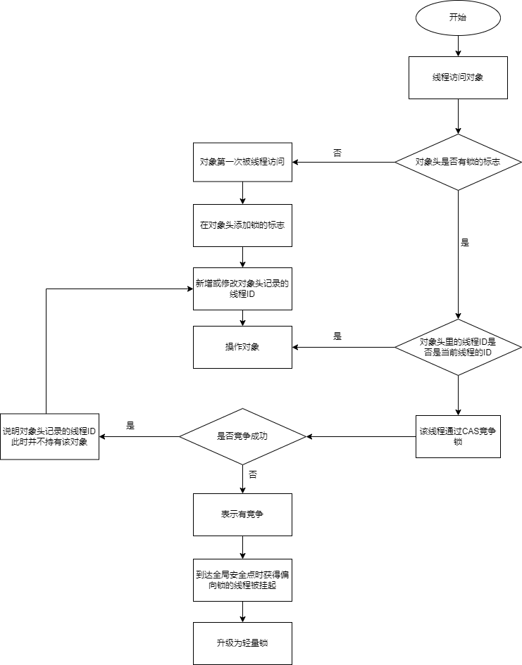

# synchronized与锁

----

这篇文章我们来聊一聊Java多线程里面的“锁”。

首先需要明确的一点是：`Java多线程的锁都是基于对象的，Java中的每一个对象都可以作为一个锁`。

还有一点需要注意的是，我们常听到的`类锁`其实也是对象锁。

Java类只有一个Class对象（可以有多个实例对象，多个实例共享这个Class对象），而Class对象也是特殊的Java对象。所以我们常说的类锁，其实就是Class对象的锁。

# Synchronized一招鲜吃遍天时代

说到锁，我们通常会谈到 `synchronized` 这个关键字。它翻译成中文就是“同步”的意思。

在 JDK1.5 之前，面对 Java 并发问题， synchronized 是一招鲜的解决方案，我们通常使用synchronized关键字来给一段代码或一个方法上锁。：

+   普通同步方法，锁上当前实例对象
+   静态同步方法，锁上当前类 Class 对象
+   同步块，锁上括号里面配置的对象

## Synchronized三种形式的使用

### 锁为括号里面的对象

```java
// 关键字在代码块上，锁为括号里面的对象
public void blockLock() {
    Object o = new Object();
    synchronized (o) {
        // code
    }
}
```

### 锁为当前实例

```java
// 关键字在实例方法上，锁为当前实例
public synchronized void instanceLock() {
    // code
}

////////////////////////////////////////////////////
//////// 等价于 ////////////////////////////////////
///////////////////////////////////////////////////

// 关键字在代码块上，锁为括号里面的对象
public void blockLock() {
    synchronized (this) {
        // code
    }
}
```

### 锁为当前Class对象

```java
// 关键字在静态方法上，锁为当前Class对象
public static synchronized void classLock() {
    // code
}

////////////////////////////////////////////////////
//////// 等价于 ////////////////////////////////////
///////////////////////////////////////////////////

// 关键字在代码块上，锁为括号里面的对象
public void blockLock() {
    synchronized (this.getClass()) {
        // code
    }
}
```

##  Synchronized为什么很重

?>  因为要频繁的切换 user mode 和 kernel mode 两种模式，即表现为有点竞争就找内核，这会引起很大的开销，所以大家都叫它重量级锁

拿同步块来举例:

```java
public void test(){
  synchronized (object) {
    i++;
  }
}
```

经过 `javap -v` 编译后的指令如下


monitorenter 指令是在编译后插入到同步代码块的开始位置；monitorexit是插入到方法结束和异常的位置(实际隐藏了try-finally)，每个对象都有一个 monitor 与之关联，当一个线程执行到 monitorenter 指令时，就会获得对象所对应的 monitor 的所有权，也就获得到了对象的锁

当另外一个线程执行到同步块的时候，由于它没有对应 monitor 的所有权，就会被阻塞，此时控制权只能交给操作系统，也就会从 user mode 切换到 kernel mode， 由操作系统来负责线程间的调度和线程的状态变更， 需要频繁的在这两个模式下切换（`上下文转换`）。这种`有点竞争就找内核的行为很不好，会引起很大的开销，所以大家都叫它重量级锁`，`自然效率也很低`，这也就给很多童鞋留下了一个根深蒂固的印象 —— `synchronized关键字相比于其他同步机制性能不好`


#   几个前置知识点

当然，在认识其他锁之前要先预备几个知识点

##  临界区概念

所谓“临界区”，`指的是某一块代码区域，它同一时刻只能由一个线程执行`。

在上面的例子中，如果synchronized关键字在方法上，那临界区就是整个方法内部。而如果是使用synchronized代码块，那临界区就指的是代码块内部的区域。

##  对象的内部结构


|     结构     |                                                                                  说明                                                                                  |
|--------------|------------------------------------------------------------------------------------------------------------------------------------------------------------------------|
| Mark Word    | 是一个记录和描述对象的部分，占八字节内存                                                                                                                                |
| 类型指针     | 也叫元数据指针什么的，主要是存储元数据的地址，占八字节内存，jvm有默认开启指针压缩，因为发现类型指针部分用不了64位那么多，所以被指针压缩后，成为了四字节                 |
|              | => 1. 对于对象的类型信息，指向方法区的类信息部分                                                                                                                       |
|              | => 2. 对于对象的成员变量部分，基本类型就指向方法区的运行时常量池，String类型指向在jdk1.7之后从方法区移到堆区的字符串常量池                                             |
|              | => 3. 其他的对象类型，则指向堆区的对象存储地址。                                                                                                                       |
| 数组数据部分 | 专门用来存储数组数据（如果对象是数组才会有这部分）                                                                                                                     |
| 实例数据     | 这里才是最大的数据存储区，没有什么可说的int a =3，就存个int类型的a值为3，如果值是常量或静态的则直接指向方法区中的对应数据                                              |
| 对齐填充     | 整个对象都要以8字节为基准，比如前面为12字节，那对齐填充就是4字节，加起来是16，可以被8整除，至于为什么，因为操作系统总线带宽是以8字节为基础传输，所以提高传输效率之类的 |

### 认识Java对象头

按照常规理解，识别线程 ID 需要一组 mapping 映射关系来搞定，如果单独维护这个 mapping 关系又要考虑线程安全的问题。奥卡姆剃刀原理，Java 万物皆是对象，对象皆可用作锁(前面我们提到，Java的锁都是基于对象的。)，与其单独维护一个 mapping 关系，不如中心化将锁的信息维护在 Java 对象本身上

对象是在堆中创建的

每个Java对象都有对象头(在32位虚拟机中，一个字宽是32位；在64位虚拟机中，一个字宽是64位)。

Java 对象头最多由三部分构成：

|          类型         |                             说明                            |   长度   |
|-----------------------|-------------------------------------------------------------|----------|
| MarkWord              | 存储对象的hashCode或锁信息等                                | 32/64bit |
| ClassMetadata Address | 存储到对象类型数据的指针                                    | 32/64bit |
| Array Length          | 数组的长度（如果是数组，且对象是数组才会有这部分)            | 32/64bit |
|                       | => 1. 如果是非数组类型，则用2个字宽来存储对象头，           |          |
|                       | => 2. 如果是数组，则会用3个字宽来存储对象头。在32位处理器中 |          |


其中 Markword 是保存锁状态的关键，对象锁状态可以从偏向锁升级到轻量级锁，再升级到重量级锁，加上初始的无锁状态，可以理解为有 4 种状态。想在一个对象中表示这么多信息自然就要用位存储，在 64 位操作系统中，是这样存储的（注意颜色标记），想看具体注释的可以看 hotspot(1.8) 源码文件 path/hotspot/src/share/vm/oops/markOop.hpp 第 30 行


|  锁状态  |       29 bit 或 61 bit       |    1 bit 是否是偏向锁？    | 2 bit 锁标志位 |
|----------|------------------------------|----------------------------|----------------|
| 无锁     |                              | 0                          |             01 |
| 偏向锁   | 线程ID                       | 1                          |             01 |
| 轻量级锁 | 指向栈中锁记录的指针         | 此时这一位不用于标识偏向锁 |             00 |
| 重量级锁 | 指向互斥量（重量级锁）的指针 | 此时这一位不用于标识偏向锁 |             10 |
| GC标记   |                              | 此时这一位不用于标识偏向锁 |             11 |

可以看到，当对象状态为偏向锁时，Mark Word存储的是偏向的线程ID；当状态为轻量级锁时，Mark Word存储的是指向线程栈中Lock Record的指针；当状态为重量级锁时，Mark Word为指向堆中的monitor对象的指针。

### 如何通过代码确认当前是什么锁

单纯的看上图，还是显得十分抽象，作为程序员的我们最喜欢用代码说话，使用 openjdk 官网提供了可以查看对象内存布局的工具 JOL (java object layout)

+   maven package

```java
<dependency>
  <groupId>org.openjdk.jol</groupId>
  <artifactId>jol-core</artifactId>
  <version>0.14</version>
</dependency>
```

+   gradle package

```
implementation 'org.openjdk.jol:jol-core:0.14'
```

####    场景一

```java
 public static void main(String[] args) {
  Object o = new Object();
  log.info("未进入同步块，MarkWord 为：");
  log.info(ClassLayout.parseInstance(o).toPrintable());
  synchronized (o){
   log.info(("进入同步块，MarkWord 为："));
   log.info(ClassLayout.parseInstance(o).toPrintable());
  }
 }
```


上面我们用到的 JOL 版本为 0.14， 带领大家快速了解一下位具体值，接下来我们就要用 0.16 版本查看输出结果，因为这个版本给了我们更友好的说明，同样的代码，来看输出结果：


看到这个结果，你应该是有疑问的，JDK 1.6 之后默认是开启偏向锁的，为什么初始化的代码是无锁状态，进入同步块产生竞争就绕过偏向锁直接变成轻量级锁了呢？

>   虽然默认开启了偏向锁，但是开启有延迟，大概 4s。原因是 JVM 内部的代码有很多地方用到了synchronized，如果直接开启偏向，产生竞争就要有锁升级，会带来额外的性能损耗，所以就有了延迟策略


我们可以通过参数 -XX:BiasedLockingStartupDelay=0 将延迟改为0，但是不建议这么做。

####    场景二

那我们就代码延迟 5 秒来创建对象，来看看偏向是否生效

```java
 public static void main(String[] args) throws InterruptedException {
  // 睡眠 5s
  Thread.sleep(5000);
  Object o = new Object();
  log.info("未进入同步块，MarkWord 为：");
  log.info(ClassLayout.parseInstance(o).toPrintable());
  synchronized (o){
   log.info(("进入同步块，MarkWord 为："));
   log.info(ClassLayout.parseInstance(o).toPrintable());
  }
 }
```

重新查看运行结果：


这样的结果是符合我们预期的，但是结果中的 biasable 状态，在 MarkWord 表格中并不存在，其实这是一种匿名偏向状态，是对象初始化中，JVM 帮我们做的

这样当有线程进入同步块：

+   可偏向状态：直接就 CAS 替换 ThreadID，如果成功，就可以获取偏向锁了
+   不可偏向状态：就会变成轻量级锁

那问题又来了，现在锁对象有具体偏向的线程，如果新的线程过来执行同步块会偏向新的线程吗？

####    场景三

```java
 public static void main(String[] args) throws InterruptedException {
  // 睡眠 5s
  Thread.sleep(5000);
  Object o = new Object();
  log.info("未进入同步块，MarkWord 为：");
  log.info(ClassLayout.parseInstance(o).toPrintable());
  synchronized (o){
   log.info(("进入同步块，MarkWord 为："));
   log.info(ClassLayout.parseInstance(o).toPrintable());
  }

  Thread t2 = new Thread(() -> {
   synchronized (o) {
    log.info("新线程获取锁，MarkWord为：");
    log.info(ClassLayout.parseInstance(o).toPrintable());
   }
  });

  t2.start();
  t2.join();
  log.info("主线程再次查看锁对象，MarkWord为：");
  log.info(ClassLayout.parseInstance(o).toPrintable());

  synchronized (o){
   log.info(("主线程再次进入同步块，MarkWord 为："));
   log.info(ClassLayout.parseInstance(o).toPrintable());
  }
 }
```

来看运行结果，奇怪的事情发生了：


+   标记1: 初始可偏向状态
+   标记2：偏向主线程后，主线程退出同步代码块
+   标记3: 新线程进入同步代码块，升级成了轻量级锁
+   标记4: 新线程轻量级锁退出同步代码块，主线程查看，变为不可偏向状态
+   标记5: 由于对象不可偏向，同场景1主线程再次进入同步块，自然就会用轻量级锁

至此，场景一二三可以总结为一张图：


`从这样的运行结果上来看，偏向锁像是“一锤子买卖”，只要偏向了某个线程，后续其他线程尝试获取锁，都会变为轻量级锁，这样的偏向非常有局限性。事实上并不是这样`，如果你仔细看标记2（已偏向状态），还有个 epoch 我们没有提及，这个值就是打破这种局限性的关键，在了解 epoch 之前，我们还要了解一个概念`偏向撤销`,这些在后文会说明

##  全局安全点（safepoint）

safepoint这个词我们在GC中经常会提到，简单来说就是其代表了一个状态，是 JVM 为了保证在垃圾回收的过程中引用关系不会发生变化设置的一种安全状态，`在这个状态上会暂停所有线程工作`。

##  CAS: Compare and Swap

比较并设置，用于在硬件层面上提供原子性操作。在 Intel 处理器中，比较并交换通过指令cmpxchg实现，`比较是否和给定的数值一致，如果一致则修改，不一致则不修改`。

#   锁的演变

?>  大白话:就是synchronized太重，所以弄了更轻量的锁。锁由重到轻：synchronized > CPU CAS(轻量级锁) > 偏向锁 > 无锁状态

前面讲到 jdk1.5以前，只有synchronized，且synchronized很重，那么要怎样优化才能让锁变的轻量级一些?

答案就是:**轻量级锁：CPU CAS**

如果 CPU 通过简单的 CAS 能处理加锁/释放锁，这样就不会有上下文的切换，较重量级锁而言自然就轻了很多。但是当竞争很激烈，CAS 尝试再多也是浪费 CPU，权衡一下，不如升级成重量级锁，阻塞线程排队竞争，也就有了轻量级锁升级成重量级锁的过程

又因为HotSpot 的作者经过研究发现，大多数情况下，锁不仅不存在多线程竞争，而且总是由同一个线程多次获得，同一个线程反复获取锁，如果还按照轻量级锁的方式获取锁（CAS），也是有一定代价的，是不是可以使得代价还能更小一些呢？

答案就是:**偏向锁**

偏向锁实际就是锁对象潜意识「偏心」同一个线程来访问，让锁对象记住线程 ID，当线程再次获取锁时，亮出身份，如果同一个 ID 直接就获取锁就好了，是一种 load-and-test 的过程，相较 CAS 自然又轻量级了一些

# 几种锁具体说明

依照前文，Java 6 为了减少获得锁和释放锁带来的性能消耗，引入了"偏向锁"和"轻量级锁"。在Java 6 以前，所有的锁都是"重量级"锁。所以在Java 6 及其以后，一个对象其实有四种锁状态(算上无锁状态)，它们级别由低到高依次是：

1. 无锁状态
2. 偏向锁状态
3. 轻量级锁状态
4. 重量级锁状态

无锁就是没有对资源进行锁定，任何线程都可以尝试去修改它，无锁在这里不再细讲。

几种锁会随着竞争情况逐渐升级，`锁的升级很容易发生，但是锁降级发生的条件会比较苛刻`，锁降级发生在Stop The World期间，当JVM进入安全点的时候，会检查是否有闲置的锁，然后进行降级。

关于锁降级有两点说明：

1. 不同于大部分文章说锁不能降级，实际上HotSpot JVM 是支持锁降级的，文末有链接。
2. 上面提到的Stop The World期间，以及安全点，这些知识是属于JVM的知识范畴，本文不做细讲。

下面分别介绍这几种锁以及它们之间的升级。


## 偏向锁

### 什么是偏向锁

锁是用来保证不同线程获取同一资源是互斥的，而我现在想有一种逻辑既能保证互斥，又能相对的节省系统资源，于是我设计的逻辑如下：



那么上图逻辑就称为`偏向锁`，只要满足上图逻辑，就能保证互斥性且节省系统资源

`偏向锁会偏向于第一个访问锁的线程`，如果在接下来的运行过程中，`该锁没有被其他的线程访问，则持有偏向锁的线程将永远不需要触发同步`。即偏向锁在获取资源的时候会在资源对象上记录该对象是偏向该线程的，偏向锁并不会主动释放，这样`每次偏向锁进入的时候都会判断该资源是否是偏向自己的，如果是偏向自己的则不需要进行额外的操作，直接可以进入同步操作`

也就是说:`偏向锁在资源无竞争情况下消除了同步语句，连CAS操作都不做了，提高了程序的运行性能`。

### 为什么可以引入偏向锁

1. Hotspot的作者经过以往的研究发现`大多数情况下锁不仅不存在多线程竞争，而且总是由同一线程多次获得`
2. 在无多线程竞争的情况下尽量减少不必要的轻量级锁执行路径，因为`轻量级锁的获取及释放依赖多次CAS原子指令，而偏向锁只需要在置换ThreadID的时候依赖一次CAS原子指令`。
当只有一个线程去竞争锁的时候，我们不需要阻塞，也不需要自旋，因为只有一个线程在竞争，我们只要去判断该偏向锁中的ThreadID是否为当前线程即可。如果是就执行同步代码，不是就尝试使用CAS修改ThreadID，修改成功执行同步代码，不成功就将偏向锁升级成轻量锁。

### 偏向锁获取过程

其实就是[前面](/2021/20210917-synchronized与锁?id=什么是偏向锁)中画的流程图

+   （1）访问Mark Word中偏向锁标志位是否设置成1，锁标志位是否为01——确认为可偏向状态。
+   （2）如果为可偏向状态，则测试线程ID是否指向当前线程，如果是，进入步骤（5），否则进入步骤（3）。
+   （3）如果线程ID并未指向当前线程，则通过CAS操作竞争锁。如果竞争成功，表示之前的线程不存在了，则将Mark Word中线程ID设置为当前线程ID，然后执行（5）；如果竞争失败，执行（4）。
+   （4）如果CAS获取偏向锁失败，则表示有竞争。当到达全局安全点（safepoint）时获得偏向锁的线程被挂起，偏向锁升级为轻量级锁，然后被阻塞在安全点的线程继续往下执行同步代码。
+   （5）执行同步代码。


线程竞争偏向锁的过程如下：


图中涉及到了lock record指针指向当前堆栈中的最近一个lock record，是轻量级锁按照先来先服务的模式进行了轻量级锁的加锁。

### 偏向撤销

在真正讲解偏向撤销之前，需要和大家明确一个概念——偏向锁撤销和偏向锁释放是两码事

+   撤销：笼统的说就是多个线程竞争导致不能再使用偏向模式的时候，主要是告知这个锁对象不能再用偏向模式
+   释放：和你的常规理解一样，对应的就是 synchronized 方法的退出或 synchronized 块的结束

什么是偏向撤销：`偏向撤销就是将 MarkWord 的第 3 位（是否偏向撤销）的值，从 1 变回 0`

那么什么情况才会将 MarkWord 的第 3 位（是否偏向撤销）的值，从 1 变回 0呢?

+   如果只是一个线程获取锁，再加上「偏心」的机制，是没有理由撤销偏向的
+   所以`偏向的撤销只能发生在有竞争的情况下`，偏向锁只有遇到其他线程尝试竞争偏向锁时，持有偏向锁的线程才会释放锁，线程不会主动去释放偏向锁

想要撤销偏向锁，还不能对持有偏向锁的线程有影响，所以就要等待持有偏向锁的线程到达一个 safepoint 安全点 (这里的安全点是 JVM 为了保证在垃圾回收的过程中引用关系不会发生变化设置的一种安全状态，在这个状态上会暂停所有线程工作)， 在这个安全点会挂起获得偏向锁的线程

在这个安全点，它会首先暂停拥有偏向锁的线程A， 同时线程A可能还是处在不同状态的，有两种情况

+   A 线程已经退出了同步代码块，或者是已经不在存在了，很简单，直接撤销偏向就好了，变成无锁状态
+   A 线程活着且还在同步代码块中，那就要升级成轻量级锁（偏向锁升级成轻量级锁时，会暂停拥有偏向锁的线程，重置偏向锁标识，这个过程看起来容易，实则开销还是很大的）

下面这个经典的图总结了偏向锁的获得和撤销：


偏向锁是特定场景下提升程序效率的方案，可并不代表程序员写的程序都满足这些特定场景，比如这些场景（在开启偏向锁的前提下）：

+   一个线程创建了大量对象并执行了初始的同步操作，之后在另一个线程中将这些对象作为锁进行之后的操作。这种case下，会导致大量的偏向锁撤销操作
+   明知有多线程竞争（生产者/消费者队列），还要使用偏向锁，也会导致各种撤销

很显然，这两种场景肯定会导致偏向撤销的，一个偏向撤销的成本无所谓，大量偏向撤销的成本是不能忽视的。那怎么办？

`如果应用程序里所有的锁通常处于竞争状态，那么偏向锁就会是一种累赘`，此时可以禁用偏向锁这个默认功能

```
-XX:UseBiasedLocking=false。
```

既不想禁用偏向锁，还不想忍受大量撤销偏向增加的成本，这种方案就是设计一个`有阶梯的底线`


### 批量重偏向

####    为什么有批量重偏向?

当只有一个线程反复进入同步块时，偏向锁带来的性能开销基本可以忽略，但是当有其他线程尝试获得锁时，就需要等到safe point时将偏向锁撤销为无锁状态或升级为轻量级/重量级锁。这个过程是要消耗一定的成本的，所以如果说运行时的场景本身存在多线程竞争的，那偏向锁的存在不仅不能提高性能，而且会导致性能下降。因此，JVM中增加了一种批量重偏向/撤销的机制。

####    什么时候触发批量重偏向

(这是第一种场景的快速解决方案)以 class 为单位，为每个 class 维护一个偏向锁撤销计数器，每一次该class的对象发生偏向撤销操作时，该计数器 +1，当这个值达到重偏向阈值（默认20）时：

```
BiasedLockingBulkRebiasThreshold = 20
```

JVM 就认为该class的偏向锁有问题，因此会进行批量重偏向, 它的实现方式就用到了我们上面说的 epoch

####    批量重偏向的原理

接下来我们看一下如何进行批量重偏向

它的实现方式就用到了我们上面说的 epoch (epoch，如其含义「纪元」一样，就是一个时间戳)

+   每个 class 对象会有一个对应的epoch字段
+   每个对象也拥有epoch,每个处于偏向锁状态对象的mark word 中也有该字段，其初始值为创建该对象时 class 中的epoch的值

（此时二者是相等的）每次发生批量重偏向时，就将该值加1，同时遍历JVM中所有线程的栈

+   每当遇到一个全局安全点时(这里的意思是说批量重偏向没有完全替代了全局安全点，全局安全点是一直存在的)，比如要对class C 进行批量再偏向，则首先对 class C中保存的epoch进行增加操作，得到一个新的epoch_new
+   然后扫描所有持有 class C 实例的线程栈，根据线程栈的信息判断出该线程是否锁定了该对象，
    -   若偏向锁对象正处于加锁状态，则将其epoch字段变为epoch_new
    -   若偏向锁对象不处于加锁状态（没被任何线程持有，但之前是被线程持有过的，这种锁对象的 markword 肯定也是有偏向的）,则保持 epoch 字段值不变
+   退出安全点后，当有线程需要尝试获取偏向锁时，直接检查 class C 中存储的 epoch 值是否与目标对象中存储的 epoch
    -   值相等,说明没有发生过批量重偏向, 如果 markword 有线程ID，还有其他锁来竞争，那锁自然是要升级的(如同前面举的例子 epoch=0)
    -   如果不相等，说明该对象的偏向锁已经是上一个纪元的事情了,即说明该对象的偏向锁已经无效了（因为只有偏向锁还在被使用的对象才会有epoch_new，这里不相等的原因是class C里面的epoch值是epoch_   new，而当前对象的epoch里面的值还是epoch），此时竞争线程可以尝试对此对象重新进行偏向操作(即直接通过 CAS 操作将其mark word的线程 ID 改成当前线程 ID，这也算是一定程度的优化，毕竟没升级锁)。

上述流程图如下


批量重偏向是第一阶梯底线，还有第二阶梯底线

### 批量撤销（bulk revoke）

当达到重偏向阈值后，假设该 class 计数器继续增长，当其达到批量撤销的阈值后（默认40）时，

```
BiasedLockingBulkRevokeThreshold = 40
```

JVM就认为该 class 的使用场景存在多线程竞争，会标记该 class 为不可偏向。之后对于该 class 的锁，直接走轻量级锁的逻辑

这就是第二阶梯底线，但是在第一阶梯到第二阶梯的过渡过程中，也就是在彻底禁用偏向锁之前，还给一次改过自新的机会，那就是另外一个计时器：

```
BiasedLockingDecayTime = 25000
```

+   如果在距离上次批量重偏向发生的 25 秒之内，并且累计撤销计数达到40，就会发生批量撤销（偏向锁彻底 game over）
+   如果在距离上次批量重偏向发生超过 25 秒之外，那么就会重置在 [20, 40) 内的计数, 再给次机会

## 轻量级锁

轻量级锁的实现方式表现为自旋锁

### 为什么要引入轻量级锁

因为确实存在多个线程竞争锁的情况，且谁都不让谁，这种场景偏向锁搞不定

### 轻量级锁的获取过程

JVM会为每个线程`在当前线程的栈帧中创建用于存储锁记录的空间，我们称为Displaced Mark Word`。如果一个线程获得锁的时候发现是轻量级锁，会把锁的Mark Word复制到自己的Displaced Mark Word里面。

然后线程尝试用CAS将锁的Mark Word替换为指向锁记录的指针。如果成功，当前线程获得锁，如果失败，表示Mark Word已经被替换成了其他线程的锁记录，说明在与其它线程竞争锁，当前线程就尝试使用自旋来获取锁。

>   自旋：不断尝试去获取锁，一般用循环来实现。

自旋是需要消耗CPU的，如果一直获取不到锁的话，那该线程就一直处在自旋状态，白白浪费CPU资源。解决这个问题最简单的办法就是指定自旋的次数，例如让其循环10次，如果还没获取到锁就进入阻塞状态。

但是JDK采用了更聪明的方式——适应性自旋，简单来说就是线程如果自旋成功了，则下次自旋的次数会更多，如果自旋失败了，则自旋的次数就会减少。

自旋也不是一直进行下去的，如果自旋到一定程度（和JVM、操作系统相关），依然没有获取到锁，称为自旋失败，那么这个线程会阻塞。同时这个锁就会升级成重量级锁。

**具体过程如下**

+   （1）在代码进入同步块的时候，如果同步对象锁状态为偏向状态（就是锁标志位为“01”状态，是否为偏向锁标志位为“1”），虚拟机首先将`在当前线程的栈帧中建立一个名为锁记录（Lock Record）的空间`，用于存储锁对象目前的Mark Word的拷贝。`官方称之为 Displaced Mark Word`（所以这里我们认为Lock Record和 Displaced Mark Word其实是同一个概念）。这时候线程堆栈与对象头的状态如图所示：
    -   

+   （2）拷贝对象头中的Mark Word到锁记录（Lock Record）中。
    -   

+   （3）拷贝成功后，虚拟机将使用CAS操作尝试将对象头的Mark Word更新为指向Lock Record的指针，并将Lock record里的owner指针指向对象头的mark word。
    -   如果更新成功，则执行步骤（4）
    -   否则执行步骤（5）。

+   （4）如果这个更新动作成功了，那么这个线程就拥有了该对象的锁，并且对象Mark Word的锁标志位设置为“00”，即表示此对象处于轻量级锁定状态，这时候线程堆栈与对象头的状态如下所示：
    -   

+   （5）如果这个更新操作失败了，虚拟机首先会检查对象的Mark Word是否指向当前线程的栈帧
    -   如果是就说明当前线程已经拥有了这个对象的锁，现在是重入状态，那么设置Lock Record第一部分（Displaced Mark Word）为null，起到了一个重入计数器的作用。下图为重入三次时的lock record示意图，左边为锁对象，右边为当前线程的栈帧，重入之后然后结束。接着就可以直接进入同步块继续执行。
    -   
    -   如果不是说明这个锁对象已经被其他线程抢占了，说明此时有多个线程竞争锁，那么它就会自旋等待锁，一定次数后仍未获得锁对象，说明发生了竞争，需要膨胀为重量级锁。
    -   

总的图解


### 轻量级锁的解锁过程

+   （1）当前线程会通过CAS操作尝试把线程中将Displaced Mark Word的内容复制回锁的Mark Word里面。
+   （2）如果替换成功，也就是说没有发生竞争，则这个复制的操作会成功，整个同步过程就完成了。
+   （3）如果替换失败，也就是说有其他线程因为自旋多次导致轻量级锁升级成了重量级锁，那么CAS操作会失败，那此时会释放锁并唤醒被阻塞的线程。

### 一张图说明加锁和释放锁的过程


## 重量级锁

重量级锁依赖于操作系统的`互斥量（mutex）` 实现的，而`操作系统中线程间状态的转换需要相对比较长的时间，所以重量级锁效率很低，但被阻塞的线程不会消耗CPU`。

前面说到，每一个对象都可以当做一个锁，当多个线程同时请求某个对象锁时，对象锁会设置几种状态用来区分请求的线程：

+   Contention List：所有请求锁的线程将被首先放置到该竞争队列
+   Entry List：Contention List中那些有资格成为候选人的线程被移到Entry List
+   Wait Set：那些调用wait方法被阻塞的线程被放置到Wait Set
+   OnDeck：任何时刻最多只能有一个线程正在竞争锁，该线程称为OnDeck
+   Owner：获得锁的线程称为Owner
+   !Owner：释放锁的线程

当一个线程尝试获得锁时，如果该锁已经被占用，则会将该线程封装成一个ObjectWaiter对象插入到Contention List的队列的队首，然后调用park函数挂起当前线程。

当线程释放锁时，会从Contention List或EntryList中挑选一个线程唤醒，被选中的线程叫做Heir presumptive即假定继承人，假定继承人被唤醒后会尝试获得锁，但synchronized是非公平的，所以假定继承人不一定能获得锁。这是因为对于重量级锁，线程先自旋尝试获得锁，这样做的目的是为了减少执行操作系统同步操作带来的开销。如果自旋不成功再进入等待队列。这对那些已经在等待队列中的线程来说，稍微显得不公平，还有一个不公平的地方是自旋线程可能会抢占了Ready线程的锁。

如果线程获得锁后调用Object.wait方法，则会将线程加入到WaitSet中，当被Object.notify唤醒后，会将线程从WaitSet移动到Contention List或EntryList中去。需要注意的是，当调用一个锁对象的wait或notify方法时，`如当前锁的状态是偏向锁或轻量级锁则会先膨胀成重量级锁`。


## 总结锁的升级流程

每一个线程在准备获取共享资源时：

+   第一步，检查MarkWord里面是不是放的自己的ThreadId ，如果是，表示当前线程是处于 “偏向锁” 。
+   第二步，如果MarkWord不是自己的ThreadId，锁升级，这时候，用CAS来执行切换，新的线程根据MarkWord里面现有的ThreadId，通知之前线程暂停，之前线程将Markword的内容置为空。
+   第三步，两个线程都把锁对象的HashCode复制到自己新建的用于存储锁的记录空间，接着开始通过CAS操作， 把锁对象的MarKword的内容修改为自己新建的记录空间的地址的方式竞争MarkWord。
+   第四步，第三步中成功执行CAS的获得资源，失败的则进入自旋 。
+   第五步，自旋的线程在自旋过程中，成功获得资源(即之前获的资源的线程执行完成并释放了共享资源)，则整个状态依然处于 轻量级锁的状态，如果自旋失败 。
+   第六步，进入重量级锁的状态，这个时候，自旋的线程进行阻塞，等待之前线程执行完成并唤醒自己。

## 各种锁的优缺点对比

下表来自《Java并发编程的艺术》：

|    锁    |                                优点                                |                       缺点                       |               适用场景               |
|----------|--------------------------------------------------------------------|--------------------------------------------------|--------------------------------------|
| 偏向锁   | 加锁和解锁不需要额外的消耗，和执行非同步方法比仅存在纳秒级的差距。 | 如果线程间存在锁竞争，会带来额外的锁撤销的消耗。 | 适用于只有一个线程访问同步块场景。   |
| 轻量级锁 | 竞争的线程不会阻塞，提高了程序的响应速度。                         | 如果始终得不到锁竞争的线程使用自旋会消耗CPU。    | 追求响应时间。同步块执行速度非常快。 |
| 重量级锁 | 线程竞争不使用自旋，不会消耗CPU。                                  | 线程阻塞，响应时间缓慢。                         | 追求吞吐量。同步块执行时间较长。     |

# 参考文章

+   http://concurrent.redspider.group/article/02/9.html
+   [Java锁优化--JVM锁降级](https://www.jianshu.com/p/9932047a89be)
+   [Java中的锁机制](https://www.cnblogs.com/charlesblc/p/5994162.html)
+   [死磕Synchronized底层实现](https://github.com/farmerjohngit/myblog/issues/12)
+   《Java并发编程的艺术》
+   [彻底搞懂Java中的偏向锁，轻量级锁，重量级锁](https://www.itqiankun.com/article/bias-lightweight-synchronized-lock)
+   [Java-对象头详解](https://blog.csdn.net/weixin_44284706/article/details/112463768)