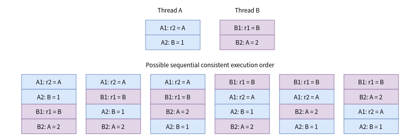
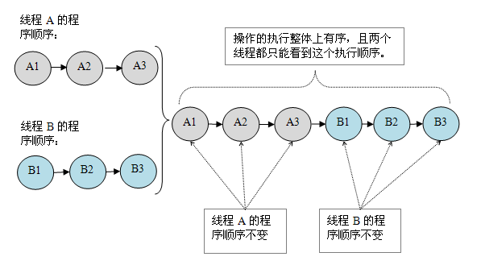
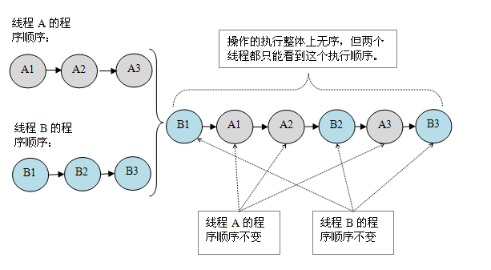
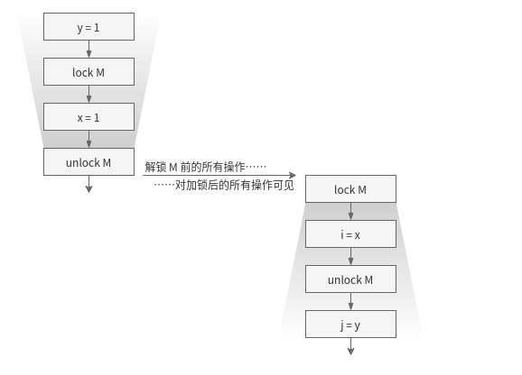

#   从零开始设计一个Java内存模型

----

先抛开所有你所知道的看到的与Java内存模型有关的知识,如果让你设计,你要如何设计这个内存模型?

# 两个基础知识
## 什么是重排序？

计算机在执行程序时，为了提高性能，编译器和处理器常常会对指令做重排。

### 为什么指令重排序可以提高性能

简单地说，每一个指令都会包含多个步骤，每个步骤可能使用不同的硬件。因此，`流水线技术`产生了，它的原理是指令1还没有执行完，就可以开始执行指令2，而不用等到指令1执行结束之后再执行指令2，这样就大大提高了效率。

但是，流水线技术最害怕`中断`，恢复中断的代价是比较大的，所以我们要想尽办法不让流水线中断。`指令重排就是减少中断的一种技术`。

我们分析一下下面这个代码的执行情况：

```
a = b + c;
d = e - f ;
```

先加载b、c（注意，即有可能先加载b，也有可能先加载c），但是在执行add(b,c)的时候，需要等待b、c装载结束才能继续执行，也就是增加了停顿，那么后面的指令也会依次有停顿,这降低了计算机的执行效率。

为了减少这个停顿，我们可以先加载e和f,然后再去加载add(b,c),这样做对程序（串行）是没有影响的,但却减少了停顿。既然add(b,c)需要停顿，那还不如去做一些有意义的事情。

综上所述，`指令重排对于提高CPU处理性能十分必要。虽然由此带来了乱序的问题，但是这点牺牲是值得的`。

### 指令重排分类

指令重排一般分为以下三种：

+ 编译器优化重排
    * 编译器在`不改变单线程程序语义`的前提下，可以重新安排语句的执行顺序。
+ 指令并行重排
    * 现代处理器采用了指令级并行技术来将多条指令重叠执行。如果`不存在数据依赖性`(即后一个执行的语句无需依赖前面执行的语句的结果)，处理器可以改变语句对应的机器指令的执行顺序。
+ 内存系统重排
    * 由于处理器使用缓存和读写缓存冲区，这使得加载(load)和存储(store)操作看上去可能是在乱序执行，因为三级缓存的存在，导致内存与缓存的数据同步存在时间差。

`指令重排可以保证串行语义一致，但是没有义务保证多线程间的语义也一致`。所以在多线程下，指令重排序可能会导致一些问题。


##  什么是数据竞争

当程序未正确同步的时候，就可能存在数据竞争。

`数据竞争`：在一个线程中写一个变量，在另一个线程读同一个变量，并且写和读没有通过同步来排序。

如果程序中包含了数据竞争，那么运行的结果往往充满了`不确定性`，比如读发生在了写之前，可能就会读到错误的值；如果一个线程程序能够正确同步，那么就不存在数据竞争。


#   从零开始设计一个Java内存模型

由于存在"重排"和"数据竞争",那么程序员写的java代码和编译器处理器处理过的代码`并不是同一套`且处理逻辑也`不是同一个思路`,这样我们就急需一套标准来告诉规范程序员和编译器处理器,以保证一个相同的预期,即程序员对系统的预期和系统的实际行为是一致的

##  设计内存模型中一对相互对立的矛盾

+ 程序员需要JMM提供一个强的内存模型来编写代码；
+ 编译器和处理器希望JMM对它们的束缚越少越好，这样它们就可以最可能多的做优化来提高性能，希望的是一个弱的内存模型。

##  方案一:顺序一致性模型

### 什么是顺序一致性

Leslie Lamport 提出了 [Sequential Consistency (顺序一致)](https://www.microsoft.com/en-us/research/uploads/prod/2016/12/How-to-Make-a-Multiprocessor-Computer-That-Correctly-Executes-Multiprocess-Programs.pdf)

我们先了解一下顺序一致性模型

`顺序一致性模型有两大特性`:

+ 一个线程中的所有操作必须按照程序的顺序来执行。(这里特指按照我们写的Java代码的顺序)
    - 每个线程内部的指令都是按照程序规定的顺序（program order）执行的（单个线程的视角）
+ 所有线程都只能看到一个单一的操作执行顺序。(即在顺序一致性模型中，每个操作必须是原子性的，且立刻对所有线程可见)
    - 线程执行的交错顺序可以是任意的，但是所有线程所看见的整个程序的总体执行顺序都是一样的（整个程序的视角）


为了理解这两个特性，我们举个例子,例如，下图中有两个线程 A 和 B，它们各自要执行两个操作，则符合 Sequential Consistency 的顺序如下所示：



可以看到，这些顺序里，A1 永远在 A2 之前，B1 永远在 B2 之前，而 A 和 B 的相对顺序是没有指定的。换句话说，我们会希望，在并发的情况下，每个线程自己操作的执行顺序，在汇总的全局排序下依旧保持不变（代码撰写的顺序）。

可以理解为 Sequential Consistency 就是将多个线程要执行的代码交错(interleave)排成一个新的序列。

注意的是，Sequential Consistency 其实有两很强的隐藏假设：

+   每一个操作都要是原子的，操作在执行过程中不能被打断。
+   操作对下一个操作可见2。如 r1 = B 执行结束后，后续操作读取 r1 时要读到 B 这个值。


再举个例子:

1. 假设有两个线程A和B并发执行
2. 线程A有3个操作，他们在程序中的顺序是A1->A2->A3
3. 线程B也有3个操作，B1->B2->B3。

假设正确使用了同步，A线程的3个操作执行后释放锁，B线程获取同一个锁。那么在顺序一致性模型中的执行效果如下所示：



操作的执行整体上有序，并且两个线程都只能看到这个执行顺序。

假设没有使用同步，那么在顺序一致性模型中的执行效果如下所示：




操作的执行整体上无序,从排列角度来看,不止上面一种排列方式,比如还有可能是"A1->B1->A2->B2->A3->B3"这样的顺序。但对于这么多排列结果,`线程A和线程B看到的顺序只会是同一种执行顺序`
。之所以可以得到这个保证，是因为`顺序一致性模型中的每个操作必须立即对任意线程可见`。

!> 顺序一致性内存模型是一个`理想化的理论参考模型`，它为程序员提供了极强的内存可见性保证。

### 顺序一致性模型如何做线程同步

Sequential Consistency 很好地描述了我们对多线程代码执行逻辑的合理预期，但 Sequential Consistency 对线程之间的操作先后并没有规定。如果我们希望先执行线程A 的某些操作，之后才允许执行线程 B 的某些操作（即线程同步）要怎么做呢？我们会看到，如果底层能满足 Sequential Consistency 的约定，则我们可以通过一些算法自己来实现同步。

考虑临界区(critical section)问题：希望其中的代码（一般包含多个操作）“同时”只有一个线程在执行。从微观层面，即希望这些代码所代表的操作整体上“原子地”执行，这些操作进行时不被其它线程的操作插队。下面是 Dekker 算法（该算法不理解也没关系，实际上用不到）：

```
----------- Thread A --------+--------- Thread B -----------
1. a = 1;                    | 1. b = 1;
2. turn = 1;                 | 2. turn = 2;
3. if (b == 1)               | 3. if (a == 1)
4.    if (turn == 1)         | 4.    if (turn == 2)
5.        goto #3            | 5.        goto #3
6. <critical section>        | 6. <critical section>
7. a = 0                     | 7. b = 0
```

我们希望“同一时刻”，只有一个线程进入临界区(#6)，所以我们在 #6 之前写了很多同步的逻辑，如果程序执行能满足 Sequential Consistency，那么上面的算法就能满足，在任意时刻，线程 A/B 只有一个能进入临界区，执行 #6 中的代码（实际可能有多行）。

`下面会尝试证明（不理解也不影响阅读）`。

```
不考虑一方先执行到 #7 的情况，因为此时无冲突。

假设线程 A 先进入临界区，则 A3（线程 A 第 3 行）和 A4 条件必有一个不成立。

先考虑 A3 不成立，则可以确定 A3 > B1（A3 排序在 B1 之前），由于底层满足 Sequential Consistency，则有 A1 > A3, B1 > B2 > B3，可以确认 A1 > A2 > B2 > B3，则此时 B3, B4肯定成立，线程 B 进入不了临界区 B6；

考虑 A4 不成立，由于考虑的是 A 先进入临界区，则有 A4 > B4，由于 A4 不成立，则有 B1 > A3保证 A3成立，同时 B2 > A2使 A4 不成立，则推出A1 | B2 > A2 > A4 > B4，可以确定B3 B4 都是成立的，线程B 无法进入临界区。

同理，任意一方的 #3 或#4条件不满足，先进入了临界区，则另一方肯定进不了临界区。
```

我们看到，`如果系统提供了 Sequential Consistency，则我们可以通过一些（不容易想到的）算法来达到线程间的同步`，即人为地对多个线程间的相对执行顺序做约束。

### 顺序一致模型优缺点分析

若JMM满足顺序一致性可以保证程序员对系统的预期和系统的实际行为是一致的,也满足了程序员所需的"简单易懂，并且提供了足够强的内存可见性保证",但是编译器和处理器根本不能进行重排。

(后话:使用顺序一致性这个标准来规范程序员代码和编译器处理器的最终预期并不合理,对编译器和处理器的束缚太大了,大到所有的编译器和处理器都没有实现)


##  方案二:happens-before模型

### 解构上述矛盾

虽然无法使用顺序一致作为约定来保证程序员对系统的预期和系统的实际行为是一致的,但我们可以弱化上述矛盾,具体如下:

+ 对编译器和处理器来说，只要不改变程序的执行结果（单线程程序和正确同步了的多线程程序），编译器和处理器怎么优化都行。

### 什么是happens-before

happens-before是用以定制两个操作之间的执行顺序,这两个操作可以在一个线程以内，也可以是不同的线程之间。

happens-before关系有如下规定:

如果说操作 A "Happens Before" B，则有两个含义：

+   可见性：A 的操作对 B 可见
+   顺序性：A 要在 B 之前执行

我们把 Happens Before 关系记为 hb(A, B)

### happens-before关系本质上和as-if-serial语义是一回事

+ as-if-serial语义保证单线程内重排序后的执行结果和程序代码本身应有的结果是一致的
+ happens-before关系保证正确同步的多线程程序的执行结果不被重排序改变。


### happens-before模型优缺点分析

程序员只要遵循happens-before规则，那他写的程序就能保证在JMM中具有强的内存可见性。这满足了程序员所需的"简单易懂，并且提供了足够强的内存可见性保证",又使得编译器和处理器能够进行优化


#   happens-before模型和顺序一致性模型进行比较

+   Java内存模型本质上是实现了happens-before规则 (JMM提供了happens-before规则（JSR-133规范）)
+   底下JMM特指现行各Java版本的内存模型,且底下直接用JMM和顺序一致进行比较

## JMM模型是否保证顺序一致性模型

JMM没有这样的保证。

比如，在当前线程把写过的数据缓存在本地内存中，在没有刷新到主内存之前，这个写操作仅对当前线程可见；从其他线程的角度来观察，这个写操作根本没有被当前线程所执行。只有当前线程把本地内存中写过的数据刷新到主内存之后，这个写操作才对其他线程可见。在这种情况下，当前线程和其他线程看到的执行顺序是不一样的。

## JMM中的同步程序与顺序一致性比较

JMM的具体实现方针是：在不改变（正确同步的）程序执行结果的前提下，尽量为编译期和处理器的优化打开方便之门。

这里的同步包括了使用volatile、final、synchronized等关键字来实现多线程下的同步。

具体说来:

+ JMM中的同步程序在临界区内（同步块或同步方法中）的代码可以发生重排序（但不允许临界区内的代码“逃逸”到临界区之外，因为会破坏锁的内存语义）。
+ 虽然线程A在临界区做了重排序，但是因为锁的特性，线程B无法观察到线程A在临界区的重排序。这种重排序既提高了执行效率，又没有改变程序的执行结果。
+ 同时，JMM会在退出临界区和进入临界区做特殊的处理，使得在临界区内程序获得与顺序一致性模型相同的内存视图。

## JMM中的未同步程序与顺序一致性比较

如果程序员没有正确使用volatile、final、synchronized，那么即便是使用了同步（单线程下的同步），JMM也不会有内存可见性的保证，可能会导致你的程序出错，并且具有不可重现性，很难排查。

对于未同步的多线程程序，`JMM只提供最小安全性：线程读取到的值，要么是之前某个线程写入的值，要么是默认值，不会无中生有`。

为了实现这个安全性，JVM在堆上分配对象时，首先会对内存空间清零，然后才会在上面分配对象（这两个操作是同步的）。

`JMM没有保证未同步程序的执行结果与该程序在顺序一致性中执行结果一致`。因为如果要保证执行结果一致，那么JMM需要禁止大量的优化，对程序的执行性能会产生很大的影响。

未同步程序在JMM和顺序一致性内存模型中的执行特性有如下差异：

1. 顺序一致性模型要求单线程内的操作会按程序的顺序执行；JMM不保证单线程内的操作会按程序的顺序执行。（因为重排序，但是JMM保证单线程下的重排序不影响执行结果）
2. 顺序一致性模型保证所有线程只能看到一致的操作执行顺序，而JMM不保证所有线程能看到一致的操作执行顺序。（因为JMM不保证所有操作立即可见）
3. JMM不保证对64位的long型和double型变量的写操作具有原子性，而顺序一致性模型保证对所有的内存读写操作都具有原子性。

#   Java中 Happens-Before 规则包括

参考《Java 并发编程实战》第 16 章，我觉得它比 JLS 17 章和 JSR 133 中的描述都要清晰

+   程序顺序规则：如果程序中操作 A 在操作 B 之前，那么在线程中操作 A Happens Before 操作 B
+   监视器锁规则：监视器上的 unlock 操作 Happens Before 同一个监视器的 lock 操作
+   volatile 变量规则：写入 volatile 变量 Happens Before 读取该变量
+   线程启动规则：对线程 Thread.start 方法的调用 Happens Before 线程内的所有操作
+   线程结束规则：线程中的任何操作 Happens Before 其它线程中检测到该线程的结束操作，要么是调用 join 方法成功返回，要么是调用 Thread.isAlive 时返回 false
+   中断规则：一个线程在另一个线程上调用 interrupt Happens Before 被中断线程检测到 interrupt 调用（通过抛出 InterruptedExceptioin 或调用 isInterrupted 和 interrupted)
+   finalizer 规则：对象的构造函数 Happens Before 该对象的 finalizer
+   传递性：如果 hb(A, B) 且 hb(B, C)，则 hb(A, C)

举例:

```java
int a = 1; // A操作
int b = 2; // B操作
int sum = a + b;// C 操作
System.out.println(sum);
```

根据以上介绍的happens-before规则，假如只有一个线程，那么不难得出：

```
1> A happens-before B
2> B happens-before C
3> A happens-before C
```

注意，真正在执行指令的时候，其实JVM有可能对操作A & B进行重排序，因为无论先执行A还是B，他们都对对方是可见的，并且不影响执行结果。

如果这里发生了重排序，这在视觉上违背了happens-before原则，但是JMM是允许这样的重排序的。

所以，我们只关心happens-before规则，不用关心JVM到底是怎样执行的。只要确定操作A happens-before操作B就行了。

重排序有两类，JMM对这两类重排序有不同的策略：

+ 会改变程序执行结果的重排序，比如 A -> C，JMM要求编译器和处理器都不许禁止这种重排序。
+ 不会改变程序执行结果的重排序，比如 A -> B，JMM对编译器和处理器不做要求，允许这种重排序。


举例:

如下例中使用了 synchronized 在同一对象上同步，如下图



Java 并没有定义两个 lock 操作的先后顺序，这意味着上图中编译器无法确定哪个线程先进入临界区，但如果如图左边线程先进入，我们就可以通过 unlock 和 lock 的 HB 关系做出一些推论：

+   可见性：右边线程在执行时，可以确定 x = 1, y = 1，因为左边线程 unlock 前的修改必须可见
+   顺序性：右边线程对 i, j 的赋值不能先于右边线程对 x, y 的赋值

两者一起让我们可以推断出，右边线程执行后，结果一定是 i = 1, j = 1。

#   小结

我们的理想是 Sequential Consistency，只可惜由于现实原因 JVM 无法为我们提供这样的保证，因此我们一直努力寻找多线程下的合理顺序保证。

介绍了Happens Before 的（非正式）的规则，以及 HB 规则如何帮助我们对程序运行结果做出推论。

现在，只要我们能正确地使用这些同步的原语，我们就能写出正确的（符合与 JVM 预期）的代码了。

!>  另外，对于想深入了解的同学，`Happens Before 这个保证对于 JVM 而言还是太弱了`，所以 `JSR 133 里又提到了 Causality Model（因果模型）`。这块对我们使用方来说不重要，我也不能全看懂，有兴趣的可以看看 JSR 133。

# 参考资料

+   [理想的并发世界](https://lotabout.me/books/Java-Concurrency/Ideal-World/index.html)
+   [Happens Before](https://lotabout.me/books/Java-Concurrency/Happens-Before/index.html#java-concurrency-book)
+   [JSL Chapter 17](https://docs.oracle.com/javase/specs/jls/se8/html/jls-17.html) Java 语言规范，第 17 章专门讲并发问题
+   [深入分析 java 8 编程语言规范：Threads and Locks](https://www.javadoop.com/post/Threads-And-Locks-md) 对上面这篇规范的讲解，对其中一些关键点的分析很不错
+   [JSR 133](http://www.cs.umd.edu/%7Epugh/java/memoryModel/CommunityReview.pdf) 正式和学术的文档，可以先看看其中非学习证明的部分。
+   书《Java 并发编程实战》，不多说了，必看书籍


