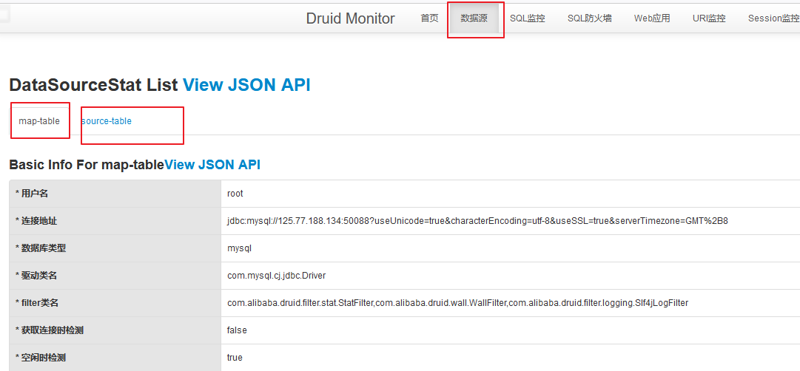

#	SpringBoot中多数据源的jdbc和druid配置

----


##  导入相关依赖

```xml
<dependency>
    <groupId>org.springframework.boot</groupId>
    <artifactId>spring-boot-starter-jdbc</artifactId>
</dependency>

<dependency>
    <groupId>mysql</groupId>
    <artifactId>mysql-connector-java</artifactId>
    <scope>compile</scope>
</dependency>

<!-- 使用 阿里的druid 数据源作为数据库连接池，代替springboot中默认的 Hikari 数据源-->
<!-- 可以不配置，根据自己的需要是否需要 ， 不过做后台任务一般建议使用 -->
<dependency>
    <groupId>com.alibaba</groupId>
    <artifactId>druid</artifactId>
    <version>1.1.23</version>
</dependency>
```

##  配置 application.yml
```yaml
spring:
  datasource:
    first:
        name: source-table
        url: jdbc:mysql://localhost:3306/zmkm?useUnicode=true&characterEncoding=UTF-8&zeroDateTimeBehavior=convertToNull&allowMultiQueries=true&useSSL=false&allowPublicKeyRetrieval=true&serverTimezone=Asia/Shanghai&autoReconnect=true&failOverReadOnly=false&rewriteBatchedStatements=true
        username: root
        password: "123456"
        driver-class-name: com.mysql.cj.jdbc.Driver
    second:
        name: map-table
        url: jdbc:mysql://localhost:3306/rom?useUnicode=true&characterEncoding=UTF-8&zeroDateTimeBehavior=convertToNull&allowMultiQueries=true&useSSL=false&allowPublicKeyRetrieval=true&serverTimezone=Asia/Shanghai&autoReconnect=true&failOverReadOnly=false&rewriteBatchedStatements=true
        username: root
        password: "123456"
        driver-class-name: com.mysql.cj.jdbc.Driver
```

##  配置 DruidDataSource 并绑定到容器

```java
package com.wangjun.daxingxing.configuration;

import com.alibaba.druid.pool.DruidDataSource;
import com.alibaba.druid.support.http.StatViewServlet;
import com.alibaba.druid.support.http.WebStatFilter;
import org.springframework.beans.factory.annotation.Qualifier;
import org.springframework.beans.factory.annotation.Value;
import org.springframework.boot.context.properties.ConfigurationProperties;
import org.springframework.boot.jdbc.DataSourceBuilder;
import org.springframework.boot.web.servlet.FilterRegistrationBean;
import org.springframework.boot.web.servlet.ServletRegistrationBean;
import org.springframework.context.annotation.Bean;
import org.springframework.context.annotation.Configuration;
import org.springframework.jdbc.core.JdbcTemplate;

import javax.servlet.Filter;
import javax.sql.DataSource;
import java.sql.SQLException;
import java.util.Arrays;
import java.util.HashMap;
import java.util.Map;

/**
 * 子站点数据源
 */
@Configuration
public class MysqlSiteConfiguration {
    @Bean
    @ConfigurationProperties(prefix = "spring.datasource.first")
    public DataSource first(){
        // return DataSourceBuilder.create().build();
        DruidDataSource dataSource = new DruidDataSource();
        dataSource.setInitialSize(10);
        dataSource.setMinIdle(10);
        dataSource.setMaxActive(200);
        dataSource.setMaxWait(60000);
        dataSource.setTimeBetweenEvictionRunsMillis(60000);
        dataSource.setMinEvictableIdleTimeMillis(30000);
        dataSource.setValidationQuery("select 1");
        dataSource.setTestWhileIdle(true);
        dataSource.setTestOnBorrow(false);
        dataSource.setTestOnReturn(false);
        dataSource.setPoolPreparedStatements(true);
        dataSource.setMaxPoolPreparedStatementPerConnectionSize(20);

        /**
         * 这个是用来配置 druid 监控sql语句的 非常有用 如果你有两个数据源 这个配置哪个数据源就监控哪个数据源的sql 同时配置那就都监控
         */
        try {
            dataSource.setFilters("stat,wall,slf4j");
        } catch (SQLException e) {
            e.printStackTrace();
        }
        dataSource.setName(firstName);
        dataSource.setConnectionProperties("druid.stat.mergeSql=true;druid.stat.slowSqlMillis=5000");
        return dataSource;
    }

    @Bean
    public JdbcTemplate firstJdbcTemplate(@Qualifier("first") DataSource dataSource){
        return new JdbcTemplate(dataSource);
    }


    @Bean
    @ConfigurationProperties(prefix = "spring.datasource.second")
    public DataSource second(){
        DruidDataSource dataSource = new DruidDataSource();
        dataSource.setInitialSize(10);
        dataSource.setMinIdle(10);
        dataSource.setMaxActive(200);
        dataSource.setMaxWait(60000);
        dataSource.setTimeBetweenEvictionRunsMillis(60000);
        dataSource.setMinEvictableIdleTimeMillis(30000);
        dataSource.setValidationQuery("select 1");
        dataSource.setTestWhileIdle(true);
        dataSource.setTestOnBorrow(false);
        dataSource.setTestOnReturn(false);
        dataSource.setPoolPreparedStatements(true);
        dataSource.setMaxPoolPreparedStatementPerConnectionSize(20);

        /**
         * 这个是用来配置 druid 监控sql语句的 非常有用 如果你有两个数据源 这个配置哪个数据源就监控哪个数据源的sql 同时配置那就都监控
         */
        try {
            dataSource.setFilters("stat,wall,slf4j");
        } catch (SQLException e) {
            e.printStackTrace();
        }
        dataSource.setName(secondName);
        dataSource.setConnectionProperties("druid.stat.mergeSql=true;druid.stat.slowSqlMillis=5000");
        return dataSource;
    }
    @Bean
    public JdbcTemplate secondJdbcTemplate(@Qualifier("second") DataSource dataSource){     // 这里
        return new JdbcTemplate(dataSource);
    }

    // 配置 druid 监控 的web面板
    @Bean
    public ServletRegistrationBean staViewServlet(){
        //创建一个servlet,并定义请求路径
        ServletRegistrationBean<StatViewServlet> servlet = new ServletRegistrationBean<>(new StatViewServlet(), "/druid/*");

        Map<String,String> initParams = new HashMap<>();
        //设置servlet初始化参数
        initParams.put("loginUsername","admin");// druid登陆名
        initParams.put("loginPassword","123456");// druid密码
        initParams.put("allow","");//默认就是允许所有访问
        // initParams.put("deny","192.168.15.21");//拒绝相对应的id访问
        initParams.put("allow", "localhost");   //设置允许访问的人:这里表示只有本机可以访问(后面参数为空则所有人都可以访问)

        servlet.setInitParameters(initParams);
        //加载到容器中
        return servlet;
    }

    /**
     * 方法名: removeDruidAdFilterRegistrationBean
     * 方法描述:  除去页面底部的广告
     *
     * @param properties
     * @return org.springframework.boot.web.servlet.FilterRegistrationBean
     * @throws
     */
    @Bean
    public FilterRegistrationBean removeDruidAdFilterRegistrationBean(DruidStatProperties properties) {
        // 获取web监控页面的参数
        DruidStatProperties.StatViewServlet config = properties.getStatViewServlet();
        // 提取common.js的配置路径
        String pattern = config.getUrlPattern() != null ? config.getUrlPattern() : "/druid/*";
        String commonJsPattern = pattern.replaceAll("\\*", "js/common.js");

        final String filePath = "support/http/resources/js/common.js";

        //创建filter进行过滤
        Filter filter = new Filter() {
            @Override
            public void init(FilterConfig filterConfig) throws ServletException {
            }

            @Override
            public void doFilter(ServletRequest request, ServletResponse response, FilterChain chain) throws IOException, ServletException {
                chain.doFilter(request, response);
                // 重置缓冲区，响应头不会被重置
                response.resetBuffer();
                // 获取common.js
                String text = Utils.readFromResource(filePath);
                // 正则替换banner, 除去底部的广告信息
                text = text.replaceAll("<a.*?banner\"></a><br/>", "");
                text = text.replaceAll("powered.*?shrek.wang</a>", "");
                response.getWriter().write(text);
            }

            @Override
            public void destroy() {
            }
        };
        FilterRegistrationBean registrationBean = new FilterRegistrationBean();
        registrationBean.setFilter(filter);
        registrationBean.addUrlPatterns(commonJsPattern);
        return registrationBean;
    }

}
```

配置成功后,访问 `http://localhost:端口/druid` 即可以查看druid监控面板



##  基本使用

```java

    @Autowired  // 依赖注入 日本站点数据库
    @Qualifier("firstJdbcTemplate")
    JdbcTemplate firstJdbcTemplate;

    @Autowired  // 依赖注入 jdbcTemplate
    @Qualifier("secondJdbcTemplate")
    JdbcTemplate secondJdbcTemplate;


    @Override
    public void run(String... args) {
        logger.error("框架初始化加载执行的代码");

        String sql = "insert into user(name,password,is_active,createtime) values (?,?,?,?)";
        KeyHolder keyHolder = new GeneratedKeyHolder();
        int r = 0;
        try{
            r = template.update(new PreparedStatementCreator() {
                @Override
                public PreparedStatement createPreparedStatement(Connection connection) throws SQLException {
                    String name = "wangjun";
                    String pwd = "123456";
                    String password = null;
                    try {
                        password = DigestUtils.sha1Hex(pwd.getBytes("UTF-8"));
                    } catch (UnsupportedEncodingException e) {
                        logger.error("sha1Hex failed"); // 记录日志
                    }
                    byte is_active = 0;
                    PreparedStatement preparedStatement = connection.prepareStatement(sql, new String[]{"id"});
                    preparedStatement.setString(1, name);
                    preparedStatement.setString(2, password);
                    preparedStatement.setByte(3,is_active);
                    preparedStatement.setDate(4,new java.sql.Date(System.currentTimeMillis()));
                    return preparedStatement;
                }
            }, keyHolder);
        }catch(Throwable e){
            logger.error("execute error: " + e.getMessage()); // 记录日志
        }
        if(r > 0){
            long id =  keyHolder.getKey().longValue();
            System.out.println("主键 -> " + id);
        } else{
            System.out.println("写入数据库失败");
        }
        // 数据源如果为 HikariDataSource,则表示使用默认的 jdbc操作mysql
        System.out.println("数据源:"+firstJdbcTemplate.getDataSource().getClass().toString()); // 查看数据源是否为 Druid

    }
```

#   参考
+   [springboot中整合 jdbc ,druid 多数据源操作mysql](https://www.jianshu.com/p/d12f61f58cf2)