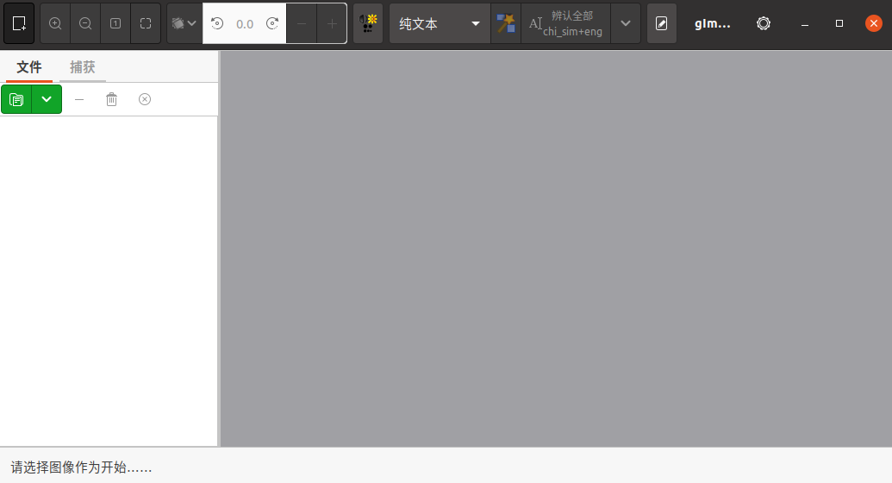

# Ubuntu上安装OCR扫描软件gImageReader

----

## 安装

gImageReader 是一款开放源码的 OCR（光学字符识别）扫描工具软件，支持 Linux 和 Windows 系统，用户可用来扫描 JPEG，PNG，TIFF，GIFF 或 PDF 文件或者从扫描仪直接导入的文件，并识别字符。

[GitHub 地址](https://github.com/manisandro/gImageReader)

添加 PPA --> 更新软件源 --> 安装软件：

```
sudo add-apt-repository ppa:sandromani/gimagereader
sudo apt update
sudo apt install gimagereader tesseract-ocr tesseract-ocr-eng tesseract-ocr-chi-sim tesseract-ocr-chi-tra  -y
sudo apt install tesseract-ocr-chi-sim-vert tesseract-ocr-chi-tra-vert  -y
```

卸载软件 --> 移除 PPA：

```
sudo apt remove gimagereader -y
sudo apt install ppa-purge -y
sudo ppa-purge ppa:sandromani/gimagereader
```

## 界面



## 操作步骤

+   打开 gImageReader
+   添加上面两页图片
+   识别语言选择 多种语言（Multilingual）=chi_sim+eng
+   依次选择图一图二进行识别
+   复制或保存识别文本

## See also

+   [GImageReader: An open-source PDF app with OCR capability](https://www.fosslinux.com/27198/gimagereader-an-open-source-pdf-app-with-ocr-capability.htm)
