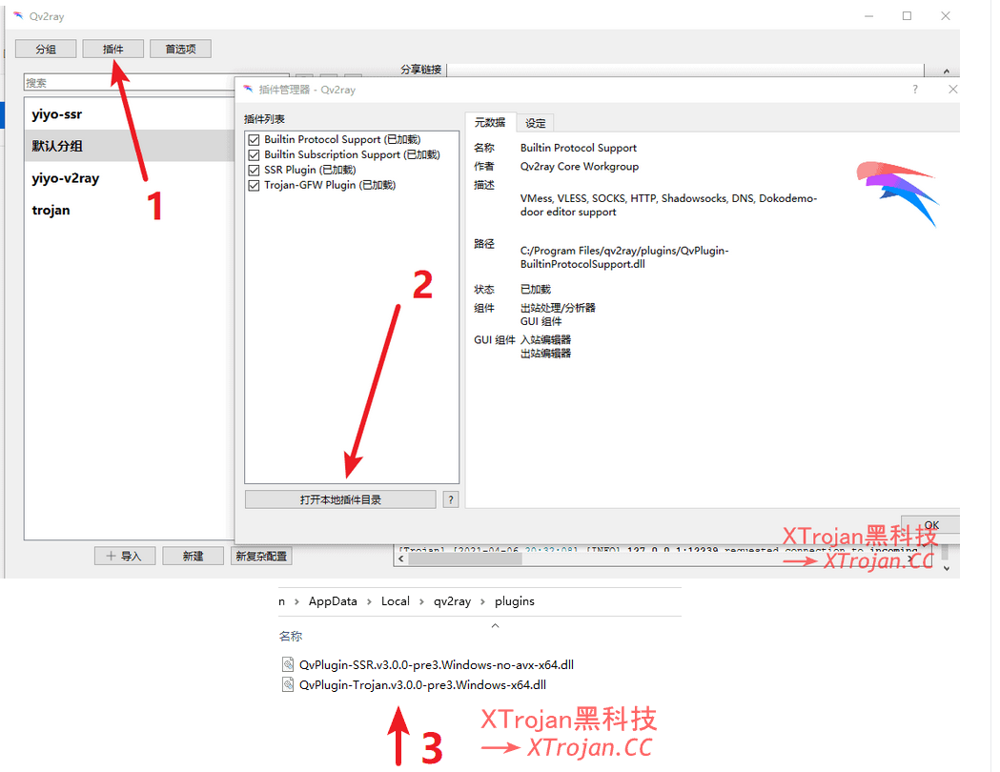
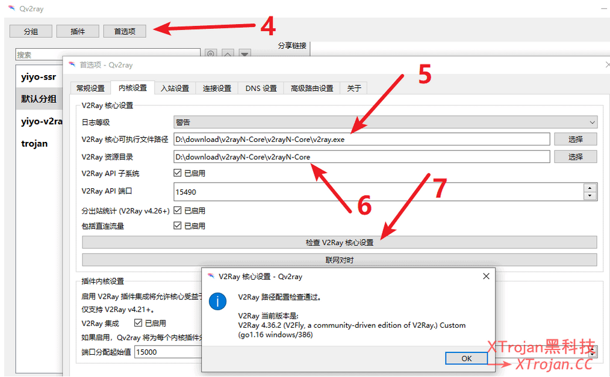
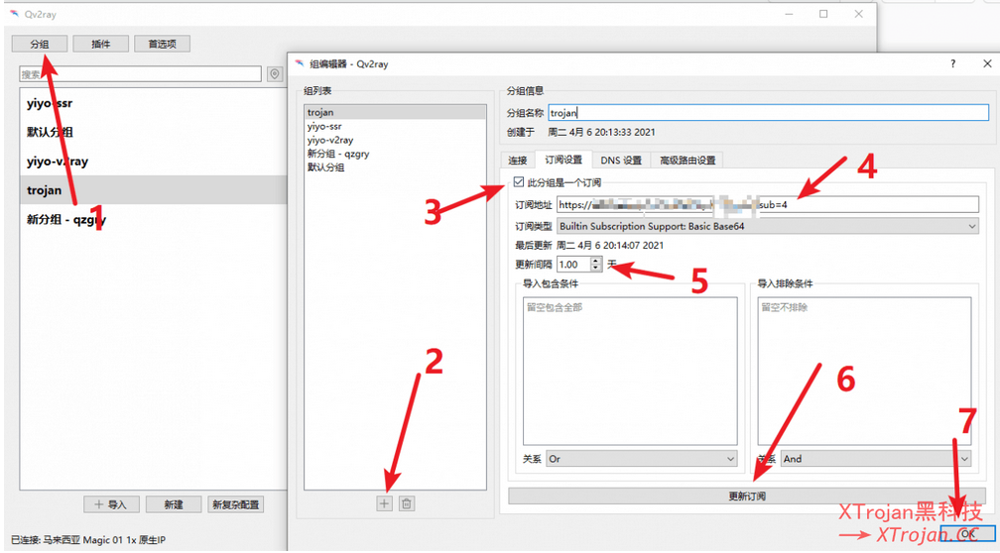
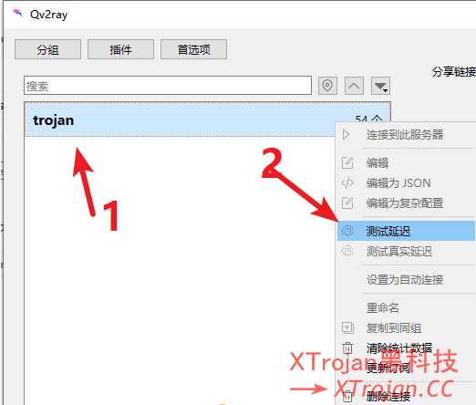
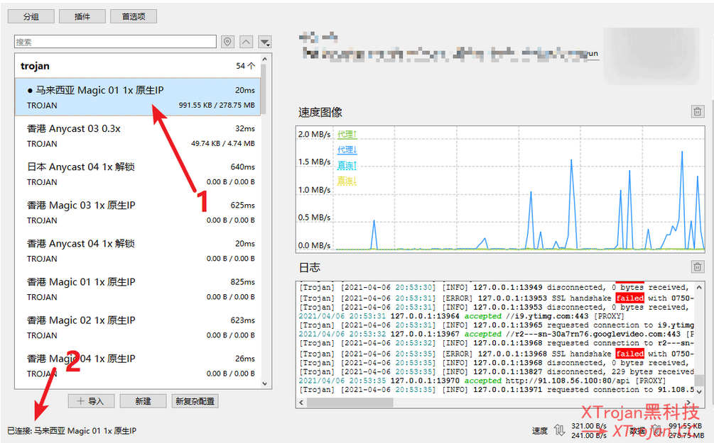

# 梯子搭建Qv2ray

-----

## 修订

+   [Qv2ray使用教程](https://xtrojan.cc/client/qv2ray%e4%bd%bf%e7%94%a8%e6%95%99%e7%a8%8b.html)

## 下载软件与插件

+   [软件Qv2ray](https://github.com/Qv2ray/Qv2ray)

+   ssr/trojan插件安装
    *   QvPlugin默认只支持V2ray与SS，所以要使用ssr/trojan需要安装对应的插件
    *   [QvPlugin-SSR，让Qv2ray支持SSR](https://github.com/Qv2ray/QvPlugin-SSR/releases/)
    *   [trojan:让Qv2ray支持trojan](https://github.com/Qv2ray/QvPlugin-Trojan/releases/)
    *   [trojan-GO:让Qv2ray支持trojan-go](https://github.com/Qv2ray/QvPlugin-Trojan-Go/releases)

+   [v2ray-core](https://github.com/v2fly/v2ray-core)

## 具体步骤

### 插件

点击插件–打开本地插件目录–然后把下载的插件文件拷贝到弹出的目录中–重启！需要重启才生效

我这里只需要trojan和v2ray，因此只安装了vPlugin-SSR和QvPlugin-Trojan

### v2ray核心安装

点击首选项–内核设置–填入v2ray.exe路径–点击检查v2ray核心设置，弹窗如图所以则表示正常

### 导入机场订阅–选择线路节点

+   导入机场订阅

点击分组–下方加号–点击订阅设置–此分组是一个订阅–粘贴订阅地址–设置更新间隔为1–更新订阅–ok

+   选择线路节点

右键分组–测速延迟

双击分组展示各个节点线路–双击选择一个节点–完成！

