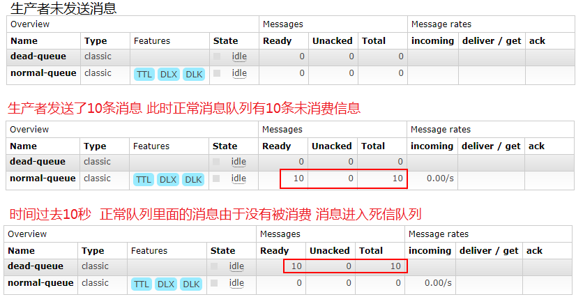
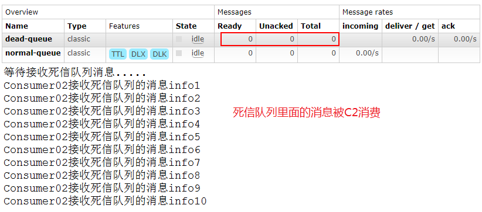
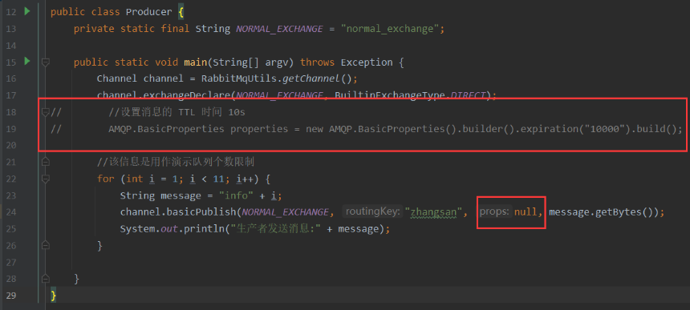
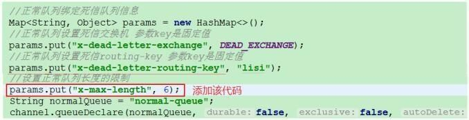
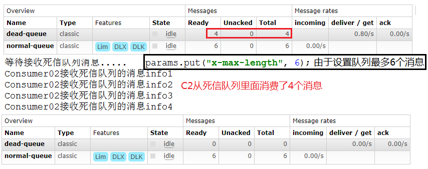
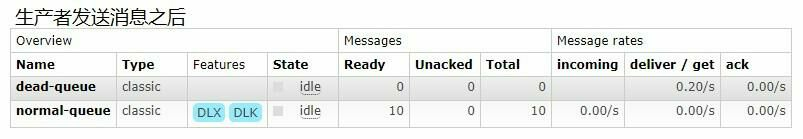
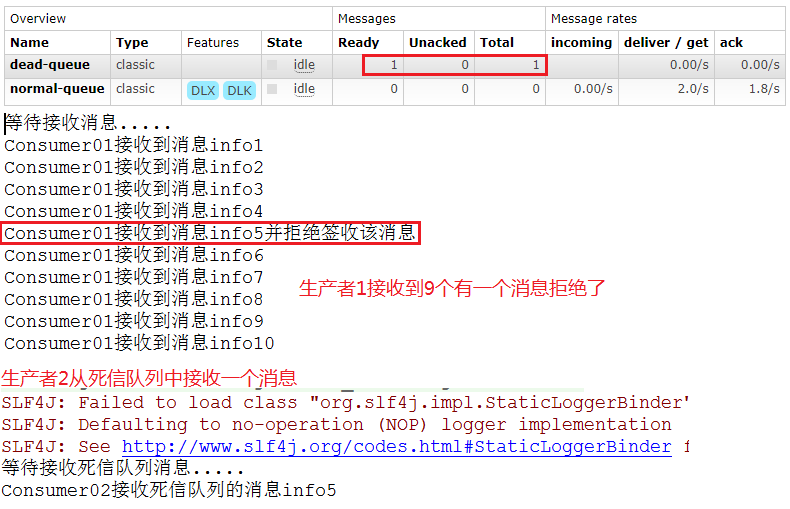

#	RabbitMQ_死信队列

--------

#   死信的概念

先从概念解释上搞清楚这个定义

+   死信，顾名思义就是`无法被消费的消息`，字面意思可以这样理解，一般来说，producer 将消息投递到 broker 或者直接到queue 里了，consumer 从 queue 取出消息 进行消费，但某些时候由于特定的原因导致 queue 中的某些消息`无法被消费`，这样的消息如果`没有后续的处理`，就变成了死信，有死信自然就有了死信队列。

!>  **应用场景**：为了保证订单业务的消息数据不丢失，需要使用到 RabbitMQ 的死信队列机制，当消息消费发生异常时，将消息投入死信队列中。还有比如说：用户在商城下单成功并点击去支付后在指定时间未支付时自动失效

#   要加入死信的几种分类

+   消息 TTL 过期
    -   TTL是Time To Live的缩写, 也就是生存时间
+   队列达到最大长度
    -   队列满了，无法再添加数据到 mq 中
+   消息被拒绝
    -   (basic.reject 或 basic.nack) 并且 requeue=false


#   死信实战

##  过期消息加入死信队列

消费者 C1 代码：

```java
/**
 * 死信队列 - 消费者01
 */
public class Consumer01 {

    //普通交换机名称
    private static final String NORMAL_EXCHANGE = "normal_exchange";
    //死信交换机名称
    private static final String DEAD_EXCHANGE = "dead_exchange";

    public static void main(String[] args) throws Exception {
        Channel channel = RabbitMqUtils.getChannel();

        //声明死信和普通交换机 类型为 direct
        channel.exchangeDeclare(NORMAL_EXCHANGE, BuiltinExchangeType.DIRECT);
        channel.exchangeDeclare(DEAD_EXCHANGE, BuiltinExchangeType.DIRECT);

        //声明死信队列
        String deadQueue = "dead-queue";
        channel.queueDeclare(deadQueue, false, false, false, null);
        //死信队列绑定：队列、交换机、路由键（routingKey）
        channel.queueBind(deadQueue, DEAD_EXCHANGE, "lisi");

        //正常队列绑定死信队列信息
        Map<String, Object> params = new HashMap<>();
        //正常队列设置死信交换机 参数 key 是固定值
        params.put("x-dead-letter-exchange", DEAD_EXCHANGE);
        //正常队列设置死信 routing-key 参数 key 是固定值
        params.put("x-dead-letter-routing-key", "lisi");

        //正常队列
        String normalQueue = "normal-queue";
        channel.queueDeclare(normalQueue, false, false, false, params);
        channel.queueBind(normalQueue, NORMAL_EXCHANGE, "zhangsan");

        System.out.println("等待接收消息........... ");
        DeliverCallback deliverCallback = (consumerTag, delivery) -> {
            String message = new String(delivery.getBody(), "UTF-8");
            System.out.println("Consumer01 接收到消息" + message);
        };
        channel.basicConsume(normalQueue, true, deliverCallback, consumerTag -> {
        });
    }

}
```

生产者代码

```java
public class Producer {
    private static final String NORMAL_EXCHANGE = "normal_exchange";

    public static void main(String[] argv) throws Exception {
        Channel channel = RabbitMqUtils.getChannel();

        channel.exchangeDeclare(NORMAL_EXCHANGE, BuiltinExchangeType.DIRECT);
        //设置消息的 TTL 时间 10s
        AMQP.BasicProperties properties = new AMQP.BasicProperties().builder().expiration("10000").build();
        //该信息是用作演示队列个数限制
        for (int i = 1; i < 11; i++) {
            String message = "info" + i;
            channel.basicPublish(NORMAL_EXCHANGE, "zhangsan", properties, message.getBytes());
            System.out.println("生产者发送消息:" + message);
        }

    }
}
```

消费者 C2 代码

```java
public class Consumer02 {
    //死信交换机名称
    private static final String DEAD_EXCHANGE = "dead_exchange";

    public static void main(String[] args) throws Exception {
        Channel channel = RabbitMqUtils.getChannel();

        //声明交换机
        channel.exchangeDeclare(DEAD_EXCHANGE, BuiltinExchangeType.DIRECT);
        //声明队列
        String deadQueue = "dead-queue";
        channel.queueDeclare(deadQueue, false, false, false, null);
        channel.queueBind(deadQueue, DEAD_EXCHANGE, "lisi");

        System.out.println("等待接收死信消息........... ");
        DeliverCallback deliverCallback = (consumerTag, delivery) -> {
            String message = new String(delivery.getBody(), "UTF-8");
            System.out.println("Consumer02 接收到消息" + message);
        };
        channel.basicConsume(deadQueue, true, deliverCallback, consumerTag -> {
        });
    }
}
```

启动顺序

1.  启动 C1,然后关闭C1(模拟其接收不到消息)
2.  再启动 Producer



3.  以上步骤完成后，启动 C2 消费者，它消费死信队列里面的消息




##  队列达到最大长度旧数据移入死信队列

1.  消息生产者代码去掉 TTL 属性



2.  C1 消费者修改以下代码**(启动之后关闭该消费者 模拟其接收不到消息)**



```java
//设置正常队列的长度限制，例如发10个，4个则为死信
params.put("x-max-length",6);
```

3.  C2 消费者代码不变(启动 C2 消费者)




##  被拒绝消息放入死信队列


1.  消息生产者代码同上生产者一致

2.  C1 消费者代码(启动之后关闭该消费者 模拟其接收不到消息)

拒收消息 "info5"

```java
public class Consumer01 {

    //普通交换机名称
    private static final String NORMAL_EXCHANGE = "normal_exchange";
    //死信交换机名称
    private static final String DEAD_EXCHANGE = "dead_exchange";

    public static void main(String[] args) throws Exception {
        Channel channel = RabbitMqUtils.getChannel();

        //声明死信和普通交换机 类型为 direct
        channel.exchangeDeclare(NORMAL_EXCHANGE, BuiltinExchangeType.DIRECT);
        channel.exchangeDeclare(DEAD_EXCHANGE, BuiltinExchangeType.DIRECT);

        //声明死信队列
        String deadQueue = "dead-queue";
        channel.queueDeclare(deadQueue, false, false, false, null);
        //死信队列绑定：队列、交换机、路由键（routingKey）
        channel.queueBind(deadQueue, DEAD_EXCHANGE, "lisi");

        //正常队列绑定死信队列信息
        Map<String, Object> params = new HashMap<>();
        //正常队列设置死信交换机 参数 key 是固定值
        params.put("x-dead-letter-exchange", DEAD_EXCHANGE);
        //正常队列设置死信 routing-key 参数 key 是固定值
        params.put("x-dead-letter-routing-key", "lisi");
//        //设置正常队列的长度限制，例如发10个，4个则为死信
//        params.put("x-max-length",6);

        //正常队列
        String normalQueue = "normal-queue";
        channel.queueDeclare(normalQueue, false, false, false, params);
        channel.queueBind(normalQueue, NORMAL_EXCHANGE, "zhangsan");

        System.out.println("等待接收消息........... ");

        DeliverCallback deliverCallback = (consumerTag, delivery) -> {
            String message = new String(delivery.getBody(), "UTF-8");
            if (message.equals("info5")) {
                System.out.println("Consumer01 接收到消息" + message + "并拒绝签收该消息");
                //requeue 设置为 false 代表拒绝重新入队 该队列如果配置了死信交换机将发送到死信队列中
                channel.basicReject(delivery.getEnvelope().getDeliveryTag(), false);
            } else {
                System.out.println("Consumer01 接收到消息" + message);
                channel.basicAck(delivery.getEnvelope().getDeliveryTag(), false);
            }

        };
        //开启手动应答
        channel.basicConsume(normalQueue, false, deliverCallback, consumerTag -> {
        });
    }

}
```



3.  C2 消费者代码不变

启动消费者 1 然后再启动消费者 2

