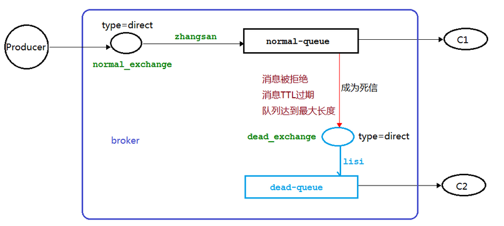

#	RabbitMQ_死信队列

--------

#   死信的概念

先从概念解释上搞清楚这个定义

+   死信，顾名思义就是`无法被消费的消息`，字面意思可以这样理解，一般来说，producer 将消息投递到 broker 或者直接到queue 里了，consumer 从 queue 取出消息 进行消费，但某些时候由于特定的原因导致 queue 中的某些消息`无法被消费`，这样的消息如果`没有后续的处理`，就变成了死信，有死信自然就有了死信队列。

!>  **应用场景**：为了保证订单业务的消息数据不丢失，需要使用到 RabbitMQ 的死信队列机制，当消息消费发生异常时，将消息投入死信队列中。还有比如说：用户在商城下单成功并点击去支付后在指定时间未支付时自动失效

#   死信的来源

+   消息 TTL 过期
    -   TTL是Time To Live的缩写, 也就是生存时间
+   队列达到最大长度
    -   队列满了，无法再添加数据到 mq 中
+   消息被拒绝
    -   (basic.reject 或 basic.nack) 并且 requeue=false

#   死信实战

#   死信之TTL

