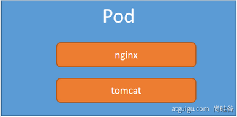

# Kubernetes核心实战

--------

## 资源创建方式

+   命令行
+   YAML 

## Namespace

名称空间用来隔离资源

### 命令行方式

```bash
# 创建namespace
kubectl create ns hello
# 删除namespace
kubectl delete ns hello
```

### yaml方式

```bash
vim hello.yml
```

```yaml
apiVersion: v1
kind: Namespace
metadata:
  name: hello
```

```bash
# 创建namespace
kubectl apply -f hello.yml
# 删除namespace
kubectl delete -f hello.yml
```

## Pod


运行中的一组容器，Pod是kubernetes中应用的最小单位.


### 命令行方式

+   启动一个pod

```bash
# 启动一个pod,指定pod名为mynginx,里面的镜像为nginx,默认是在default命名空间
kubectl run mynginx --image=nginx
```

+   查看default名称空间的Pod

```bash
kubectl get pod 
kubectl get pod -n default  # 上一句和这一句是一样的,因为不写命名空间这默认命名空间是default
```

+   描述

```bash
kubectl describe pod 你自己的Pod名字
```

就是看详细过程,打开后我们拉到最低下主要看`Enents`


+   删除

```bash
kubectl delete pod Pod名字
```

+   查看Pod的运行日志

```bash
kubectl logs Pod名字
```

+   内网调用pod内容器的服务

```bash
# 每个Pod - k8s都会分配一个ip
kubectl get pod -owide
# 使用Pod的ip+pod里面运行容器的端口
curl 192.168.169.136

# 集群中的任意一个机器以及任意的应用都能通过Pod分配的ip来访问这个Pod
```

### yaml方式

```yaml
apiVersion: v1
kind: Pod
metadata:
  labels:
    run: mynginx
  name: mynginx
#  namespace: default
spec:
  containers:
  - image: nginx
    name: mynginx
```

```yaml
apiVersion: v1
kind: Pod
metadata:
  labels:
    run: myapp
  name: myapp
spec:
  containers:
  - image: nginx
    name: nginx
  - image: tomcat:8.5.68
    name: tomcat
```



此时的应用还不能外部访问
