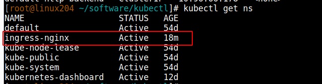
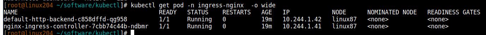
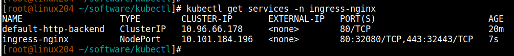

# Kubernetes核心实战

--------

## 资源创建方式

+   命令行
+   YAML 

## Namespace

名称空间用来隔离资源

### 命令行方式

```bash
# 创建namespace
kubectl create ns hello
# 删除namespace
kubectl delete ns hello
```

### yaml方式

```bash
vim hello.yml
```

```yaml
apiVersion: v1
kind: Namespace
metadata:
  name: hello   # 命名空间的名字
```

```bash
# 创建namespace
kubectl apply -f hello.yml
# 删除namespace
kubectl delete -f hello.yml
```

## Pod

运行中的一组容器，Pod是kubernetes中应用的最小单位.


### 命令行方式

#### 启动一个pod

```bash
# 启动一个pod,指定pod名为mynginx,里面的镜像为nginx,默认是在default命名空间
# 这里学习用,更多的是使用deployment进行部署,后面会说到
kubectl run mynginx --image=nginx
```

#### 查看Pod

```bash
kubectl get pod 
kubectl get pod -n default  # 上一句和这一句是一样的,因为不写命名空间这默认命名空间是default
```

```bash
# 查看pod的变化过程
kubectl get pod -w
```

查看更详细的pod的信息

```bash
# k8s会给每个Pod会分配一个ip
kubectl get pod -owide

# 使用 pod的ip + pod里面运行容器的端口
curl 192.168.169.136

# 集群中的任意一个机器以及任意的应用都能通过Pod分配的ip来访问这个Pod
# 为什么是192.168.x.x网段,是因为我们初始化的时候设置的
```


#### 查看pod创建的详细过程

```bash
kubectl describe pod 你自己的Pod名字
```

就是看详细过程,打开后我们拉到最低下主要看`Enents`


#### 删除pod

```bash
kubectl delete pod Pod名字
```

#### 查看Pod的运行日志

```bash
kubectl logs Pod名字
```

#### 查看pod的标签

```bash
kubectl get pod --show-labels
```

#### 进入pod

```bash
kubectl exec -it pod名称 -- /bin/bash
```

也可以通过图形化界面


### yaml方式

+ 一个pod一个容器

```yaml
apiVersion: v1
kind: Pod
metadata:
  labels:
    run: mynginx
  name: mynginx
#  namespace: default
spec:
  containers:
  - image: nginx
    name: mynginx
```

+ 一个pod多个容器

```yaml
apiVersion: v1
kind: Pod
metadata:
  labels:
    run: myapp
  name: myapp
spec:
  containers:   # pod内容器内容
  - image: nginx
    name: nginx
  - image: tomcat:8.5.68
    name: tomcat
```

对于pod内的多个容器,k8s会分配不同的ip,宿主机访问pod可以通过这个内网ip进行访问(比如:curl 192.168.36.68:8080)

对于pod内部的容器相互访问,只需要使用127.0.0.1进行访问就行(比如:curl 127.0.0.1:8080)


如果一个pod内启动两个端口相同的容器,会启动失败


+ 使用yaml文件

```bash
# 创建
kubectl apply -f xxx.yml
# 删除pod
kubectl delete -f xxx.yml
```

此时的应用还不能外部访问

## Deployment

### 基础命令

控制Pod，使Pod拥有多副本，自愈，扩缩容等能力

#### 部署应用

```bash
kubectl create deployment mytomcat --image=tomcat:8.5.68
```

和我们直接创建pod(`kubectl run mynginx --image=tomcat:8.5.68`)是不一样的,用deployment进行部署会拥有治愈能力


#### 查看所有deployment

```bash
kubectl get deploy    # deployment单词不用写全
```

#### 删除deployment

```bash
kubectl delete deploy Deployment名字
```

#### 修改yaml文件

```bash
kubectl edit deployment Deployment名字
```

### 多副本

```bash
kubectl create deployment my-dep --image=nginx --replicas=3
```

```yaml
apiVersion: apps/v1
kind: Deployment
metadata:
  labels:
    app: my-dep
  name: my-dep
spec:
  replicas: 3
  selector:
    matchLabels:
      app: my-dep
  template:
    metadata:
      labels:
        app: my-dep
    spec:
      containers:
      - image: nginx
        name: nginx
```

### 扩缩容

命令行

```bash
kubectl scale --replicas=5 deployment/my-dep
```

修改yaml文件

```bash
# 在打开的文件中修改replicas
kubectl edit deployment my-dep
```

使用图形界面


这里是手动操作,k8s是可以动态扩缩容的

### 自愈&故障转移

+ 停机
+ 删除Pod
+ 容器崩溃
+ ....


### 滚动更新

```bash
# 查看旧的部署的yaml => 用以查看正在运行的是哪个pod
kubectl get deploy my-dep -oyaml

# 滚动更新 => 其实就是用新的镜像启动一个pod,再将旧的pod杀死,并将流量引到新的pod
# => set image 表明要更新镜像
# => deployment/my-dep nginx=nginx:1.16.1 将my-dep应用中,名为nginx容器的镜像更新为ginx:1.16.1
# => --record 表示记录一下这次版本的更新
kubectl set image deployment/my-dep nginx=nginx:1.16.1 --record

kubectl rollout status deployment/my-dep
````


### 版本回退

```bash
# 查看历史记录
kubectl rollout history deployment/my-dep

#查看某个历史详情
kubectl rollout history deployment/my-dep --revision=2

#回滚(回到上次)
kubectl rollout undo deployment/my-dep

#回滚(回到指定版本)
kubectl rollout undo deployment/my-dep --to-revision=2
````

### 更多

除了Deployment，k8s还有 StatefulSet 、DaemonSet 、Job  等 类型资源。我们都称为工作负载。

有状态应用使用 StatefulSet 部署，无状态应用使用 Deployment 部署

https://kubernetes.io/zh/docs/concepts/workloads/controllers/


## Service

将一组 Pods 公开为网络服务的抽象方法。

### 命令行

#### 将pod内容器的端口通过service进行暴露

```bash
kubectl expose deployment my-dep --port=8000 --target-port=80

# 上面命令等价于如下
# => 默认为ClusterIP,表明暴露的IP只能在集群内访问
kubectl expose deployment my-dep --port=8000 --target-port=80 --type=ClusterIP
```


#### 使用标签检索Pod

```bash
kubectl get pod -l app=my-dep
```

#### 查看service

```bash
kubectl get service
```

#### 删除service
```bash
kubectl delete service my-dep
```

### yaml文件

service是一组pods公开为网络服务的抽象方法,而service如何知道自己对应的是哪几个pod,通过的是`标签`

查看pod的标签

```bash
kubectl get pod --show-labels
```


yaml中的选择器(selector)里需要填写对应的标签

```yaml
apiVersion: v1
kind: Service
metadata:
  labels:
    app: my-dep
  name: my-dep
spec:
  selector:   # 要填写该service要暴露的pod的标签
    app: my-dep
  ports:
  - port: 8000
    protocol: TCP
    targetPort: 80
```


### ClusterIP类型和NodePort类型说明

#### ClusterIP类型

该类型集群内部的访问

```bash
# 等同于没有--type的
kubectl expose deployment my-dep --port=8000 --target-port=80 --type=ClusterIP
```

```yaml
apiVersion: v1
kind: Service
metadata:
  labels:
    app: my-dep
  name: my-dep
spec:
  ports:
  - port: 8000
    protocol: TCP
    targetPort: 80
  selector:
    app: my-dep
  type: ClusterIP
```

##### 访问service


###### 方式一: 使用IP地址


###### 方式二: 域名方式

service的NAME.所在命名空间.svc => 比如这里:my-dep.default.svc

!>  使用域名的方式是在容器内部操作,在宿主机上是不行的

这里创建了一个tomcat服务的pod


#### NodePort类型

该类型集群外也可以访问

使用NodePort,是在每一台机器都开一个Port对外

```bash
kubectl expose deployment my-dep --port=8000 --target-port=80 --type=NodePort
```

```yaml
apiVersion: v1
kind: Service
metadata:
  labels:
    app: my-dep
  name: my-dep
spec:
  ports:
  - port: 8000
    protocol: TCP
    targetPort: 80
  selector:
    app: my-dep
  type: NodePort
```


这个对外的IP也可以自己指定

```bash
kubectl edit service my-dep
```

`NodePort范围在 30000-32767 之间`


修改NodePort的指定范围

```bash
vim /etc/kubernetes/manifests/kube-apiserver.yaml

# 添加
--service-node-port-range=1-65535
```


#### ClusterIP类型和NodePort类型互相转换

```bash
kubectl edit service my-dep
```

##### ClusterIP类型转成NodePort类型


##### NodePort类型转成ClusterIP类型


## Ingress

+ 参考[Centos7 kubeadm安装Kubernetes:1.15.11三节点集群（含dashboard、flannel和canal网络、Helm、ingress-nginx）](https://blog.csdn.net/waltertan1988/article/details/104715254#t16)


### 安装ingress-nginx

```bash
#######################################
# 下载yaml文件
#######################################
# 这里不要盲目的下载使用
# 要和版本对应
# 我使用的是k8s的版本是1.51.1,所以下载的是如下版本,这个文件内容拷贝一份在下文
wget https://raw.githubusercontent.com/kubernetes/ingress-nginx/nginx-0.20.0/deploy/mandatory.yaml

#######################################
# 由于无法访问k8s的google库，我们还是先从其他镜像仓库下载并打tag，得到ingress nginx的依赖镜像
#######################################
# 手动下载镜像
# 由于pod会分布在不同服务器启动,手动下载镜像的时候要注意在每台服务器上都手动下载一遍
# 拉镜像
docker pull registry.cn-qingdao.aliyuncs.com/kubernetes_xingej/defaultbackend-amd64:1.5
docker pull registry.cn-qingdao.aliyuncs.com/kubernetes_xingej/nginx-ingress-controller:0.20.0
# 打tag
docker tag registry.cn-qingdao.aliyuncs.com/kubernetes_xingej/defaultbackend-amd64:1.5 k8s.gcr.io/defaultbackend-amd64:1.5
docker tag registry.cn-qingdao.aliyuncs.com/kubernetes_xingej/nginx-ingress-controller:0.20.0 quay.io/kubernetes-ingress-controller/nginx-ingress-controller:0.20.0
# 删原标签
docker rmi registry.cn-qingdao.aliyuncs.com/kubernetes_xingej/defaultbackend-amd64:1.5
docker rmi registry.cn-qingdao.aliyuncs.com/kubernetes_xingej/nginx-ingress-controller:0.20.0

#######################################
# 安装
#######################################
kubectl apply -f mandatory.yaml

#######################################
# 检查安装的结果
#######################################
kubectl get pod,svc -n ingress-nginx

# 最后别忘记把svc暴露的端口要放行
```

如果下载不到，用以下文件

```yaml
apiVersion: v1
kind: Namespace
metadata:
  name: ingress-nginx

---

apiVersion: extensions/v1beta1
kind: Deployment
metadata:
  name: default-http-backend
  labels:
    app.kubernetes.io/name: default-http-backend
    app.kubernetes.io/part-of: ingress-nginx
  namespace: ingress-nginx
spec:
  replicas: 1
  selector:
    matchLabels:
      app.kubernetes.io/name: default-http-backend
      app.kubernetes.io/part-of: ingress-nginx
  template:
    metadata:
      labels:
        app.kubernetes.io/name: default-http-backend
        app.kubernetes.io/part-of: ingress-nginx
    spec:
      terminationGracePeriodSeconds: 60
      containers:
        - name: default-http-backend
          # Any image is permissible as long as:
          # 1. It serves a 404 page at /
          # 2. It serves 200 on a /healthz endpoint
          image: k8s.gcr.io/defaultbackend-amd64:1.5
          livenessProbe:
            httpGet:
              path: /healthz
              port: 8080
              scheme: HTTP
            initialDelaySeconds: 30
            timeoutSeconds: 5
          ports:
            - containerPort: 8080
          resources:
            limits:
              cpu: 10m
              memory: 20Mi
            requests:
              cpu: 10m
              memory: 20Mi

---
apiVersion: v1
kind: Service
metadata:
  name: default-http-backend
  namespace: ingress-nginx
  labels:
    app.kubernetes.io/name: default-http-backend
    app.kubernetes.io/part-of: ingress-nginx
spec:
  ports:
    - port: 80
      targetPort: 8080
  selector:
    app.kubernetes.io/name: default-http-backend
    app.kubernetes.io/part-of: ingress-nginx

---

kind: ConfigMap
apiVersion: v1
metadata:
  name: nginx-configuration
  namespace: ingress-nginx
  labels:
    app.kubernetes.io/name: ingress-nginx
    app.kubernetes.io/part-of: ingress-nginx

---

kind: ConfigMap
apiVersion: v1
metadata:
  name: tcp-services
  namespace: ingress-nginx
  labels:
    app.kubernetes.io/name: ingress-nginx
    app.kubernetes.io/part-of: ingress-nginx

---

kind: ConfigMap
apiVersion: v1
metadata:
  name: udp-services
  namespace: ingress-nginx
  labels:
    app.kubernetes.io/name: ingress-nginx
    app.kubernetes.io/part-of: ingress-nginx

---

apiVersion: v1
kind: ServiceAccount
metadata:
  name: nginx-ingress-serviceaccount
  namespace: ingress-nginx
  labels:
    app.kubernetes.io/name: ingress-nginx
    app.kubernetes.io/part-of: ingress-nginx

---
apiVersion: rbac.authorization.k8s.io/v1beta1
kind: ClusterRole
metadata:
  name: nginx-ingress-clusterrole
  labels:
    app.kubernetes.io/name: ingress-nginx
    app.kubernetes.io/part-of: ingress-nginx
rules:
  - apiGroups:
      - ""
    resources:
      - configmaps
      - endpoints
      - nodes
      - pods
      - secrets
    verbs:
      - list
      - watch
  - apiGroups:
      - ""
    resources:
      - nodes
    verbs:
      - get
  - apiGroups:
      - ""
    resources:
      - services
    verbs:
      - get
      - list
      - watch
  - apiGroups:
      - "extensions"
    resources:
      - ingresses
    verbs:
      - get
      - list
      - watch
  - apiGroups:
      - ""
    resources:
      - events
    verbs:
      - create
      - patch
  - apiGroups:
      - "extensions"
    resources:
      - ingresses/status
    verbs:
      - update

---
apiVersion: rbac.authorization.k8s.io/v1beta1
kind: Role
metadata:
  name: nginx-ingress-role
  namespace: ingress-nginx
  labels:
    app.kubernetes.io/name: ingress-nginx
    app.kubernetes.io/part-of: ingress-nginx
rules:
  - apiGroups:
      - ""
    resources:
      - configmaps
      - pods
      - secrets
      - namespaces
    verbs:
      - get
  - apiGroups:
      - ""
    resources:
      - configmaps
    resourceNames:
      # Defaults to "<election-id>-<ingress-class>"
      # Here: "<ingress-controller-leader>-<nginx>"
      # This has to be adapted if you change either parameter
      # when launching the nginx-ingress-controller.
      - "ingress-controller-leader-nginx"
    verbs:
      - get
      - update
  - apiGroups:
      - ""
    resources:
      - configmaps
    verbs:
      - create
  - apiGroups:
      - ""
    resources:
      - endpoints
    verbs:
      - get

---
apiVersion: rbac.authorization.k8s.io/v1beta1
kind: RoleBinding
metadata:
  name: nginx-ingress-role-nisa-binding
  namespace: ingress-nginx
  labels:
    app.kubernetes.io/name: ingress-nginx
    app.kubernetes.io/part-of: ingress-nginx
roleRef:
  apiGroup: rbac.authorization.k8s.io
  kind: Role
  name: nginx-ingress-role
subjects:
  - kind: ServiceAccount
    name: nginx-ingress-serviceaccount
    namespace: ingress-nginx

---
apiVersion: rbac.authorization.k8s.io/v1beta1
kind: ClusterRoleBinding
metadata:
  name: nginx-ingress-clusterrole-nisa-binding
  labels:
    app.kubernetes.io/name: ingress-nginx
    app.kubernetes.io/part-of: ingress-nginx
roleRef:
  apiGroup: rbac.authorization.k8s.io
  kind: ClusterRole
  name: nginx-ingress-clusterrole
subjects:
  - kind: ServiceAccount
    name: nginx-ingress-serviceaccount
    namespace: ingress-nginx

---

apiVersion: extensions/v1beta1
kind: Deployment
metadata:
  name: nginx-ingress-controller
  namespace: ingress-nginx
  labels:
    app.kubernetes.io/name: ingress-nginx
    app.kubernetes.io/part-of: ingress-nginx
spec:
  replicas: 1
  selector:
    matchLabels:
      app.kubernetes.io/name: ingress-nginx
      app.kubernetes.io/part-of: ingress-nginx
  template:
    metadata:
      labels:
        app.kubernetes.io/name: ingress-nginx
        app.kubernetes.io/part-of: ingress-nginx
      annotations:
        prometheus.io/port: "10254"
        prometheus.io/scrape: "true"
    spec:
      serviceAccountName: nginx-ingress-serviceaccount
      containers:
        - name: nginx-ingress-controller
          image: quay.io/kubernetes-ingress-controller/nginx-ingress-controller:0.20.0
          args:
            - /nginx-ingress-controller
            - --default-backend-service=$(POD_NAMESPACE)/default-http-backend
            - --configmap=$(POD_NAMESPACE)/nginx-configuration
            - --tcp-services-configmap=$(POD_NAMESPACE)/tcp-services
            - --udp-services-configmap=$(POD_NAMESPACE)/udp-services
            - --publish-service=$(POD_NAMESPACE)/ingress-nginx
            - --annotations-prefix=nginx.ingress.kubernetes.io
          securityContext:
            capabilities:
              drop:
                - ALL
              add:
                - NET_BIND_SERVICE
            # www-data -> 33
            runAsUser: 33
          env:
            - name: POD_NAME
              valueFrom:
                fieldRef:
                  fieldPath: metadata.name
            - name: POD_NAMESPACE
              valueFrom:
                fieldRef:
                  fieldPath: metadata.namespace
          ports:
            - name: http
              containerPort: 80
            - name: https
              containerPort: 443
          livenessProbe:
            failureThreshold: 3
            httpGet:
              path: /healthz
              port: 10254
              scheme: HTTP
            initialDelaySeconds: 10
            periodSeconds: 10
            successThreshold: 1
            timeoutSeconds: 1
          readinessProbe:
            failureThreshold: 3
            httpGet:
              path: /healthz
              port: 10254
              scheme: HTTP
            periodSeconds: 10
            successThreshold: 1
            timeoutSeconds: 1
---
```

### 添加ingress-nginx-controller的service，以NodePoart方式暴露到集群外面

最新的版本是不需要多这一步的,前面全部ingress的时候全部安装好了

```bash
cat service-nodeport.yaml
```

```yaml
apiVersion: v1
kind: Service
metadata:
  name: ingress-nginx
  namespace: ingress-nginx
  labels:
    app.kubernetes.io/name: ingress-nginx
    app.kubernetes.io/part-of: ingress-nginx
spec:
  type: NodePort
  ports:
    - name: http
      port: 80
      targetPort: 80
      protocol: TCP
      nodePort: 32080  #http
    - name: https
      port: 443
      targetPort: 443
      protocol: TCP
      nodePort: 32443  #https
  selector:
    app.kubernetes.io/name: ingress-nginx
    app.kubernetes.io/part-of: ingress-nginx
```

```bash
kubectl apply -f service-nodeport.yaml
```

### 安装完成后检查namespace、pod及service的情况

```bash
kubectl get ns
```




```bash
kubectl get pod -n ingress-nginx  -o wide
```




```bash
kubectl get services -n ingress-nginx
```



### 使用

+ 官网地址：https://kubernetes.github.io/ingress-nginx/
+ 就是nginx做的
+ https://139.198.163.211:32401/
+ http://139.198.163.211:31405/

### ingress命令

```bash

```

#### 测试环境
应用如下yaml，准备好测试环境

```yaml
apiVersion: apps/v1
kind: Deployment
metadata:
  name: hello-server
spec:
  replicas: 2
  selector:
    matchLabels:
      app: hello-server
  template:
    metadata:
      labels:
        app: hello-server
    spec:
      containers:
      - name: hello-server
        image: registry.cn-hangzhou.aliyuncs.com/lfy_k8s_images/hello-server
        ports:
        - containerPort: 9000
---
apiVersion: apps/v1
kind: Deployment
metadata:
  labels:
    app: nginx-demo
  name: nginx-demo
spec:
  replicas: 2
  selector:
    matchLabels:
      app: nginx-demo
  template:
    metadata:
      labels:
        app: nginx-demo
    spec:
      containers:
      - image: nginx
        name: nginx
---
apiVersion: v1
kind: Service
metadata:
  labels:
    app: nginx-demo
  name: nginx-demo
spec:
  selector:
    app: nginx-demo
  ports:
  - port: 8000
    protocol: TCP
    targetPort: 80
---
apiVersion: v1
kind: Service
metadata:
  labels:
    app: hello-server
  name: hello-server
spec:
  selector:
    app: hello-server
  ports:
  - port: 8000
    protocol: TCP
    targetPort: 9000
```

#### 域名访问

```yaml
apiVersion: networking.k8s.io/v1
kind: Ingress
metadata:
  name: ingress-host-bar
spec:
  ingressClassName: nginx
  rules:
  - host: "hello.atguigu.com"
    http:
      paths:
      - pathType: Prefix
        path: "/"
        backend:
          service:
            name: hello-server
            port:
              number: 8000
  - host: "demo.atguigu.com"
    http:
      paths:
      - pathType: Prefix
        path: "/nginx"  # 把请求会转给下面的服务，下面的服务一定要能处理这个路径，不能处理就是404
        backend:
          service:
            name: nginx-demo  ## java，比如使用路径重写，去掉前缀nginx
            port:
              number: 8000
```

问题： path: "/nginx" 与  path: "/" 为什么会有不同的效果？


#### 路径重写

```yaml
apiVersion: networking.k8s.io/v1
kind: Ingress
metadata:
  annotations:
    nginx.ingress.kubernetes.io/rewrite-target: /$2
  name: ingress-host-bar
spec:
  ingressClassName: nginx
  rules:
  - host: "hello.atguigu.com"
    http:
      paths:
      - pathType: Prefix
        path: "/"
        backend:
          service:
            name: hello-server
            port:
              number: 8000
  - host: "demo.atguigu.com"
    http:
      paths:
      - pathType: Prefix
        path: "/nginx(/|$)(.*)"  # 把请求会转给下面的服务，下面的服务一定要能处理这个路径，不能处理就是404
        backend:
          service:
            name: nginx-demo  ## java，比如使用路径重写，去掉前缀nginx
            port:
              number: 8000
```

#### 流量限制

```yaml
apiVersion: networking.k8s.io/v1
kind: Ingress
metadata:
  name: ingress-limit-rate
  annotations:
    nginx.ingress.kubernetes.io/limit-rps: "1"
spec:
  ingressClassName: nginx
  rules:
  - host: "haha.atguigu.com"
    http:
      paths:
      - pathType: Exact
        path: "/"
        backend:
          service:
            name: nginx-demo
            port:
              number: 8000
```
