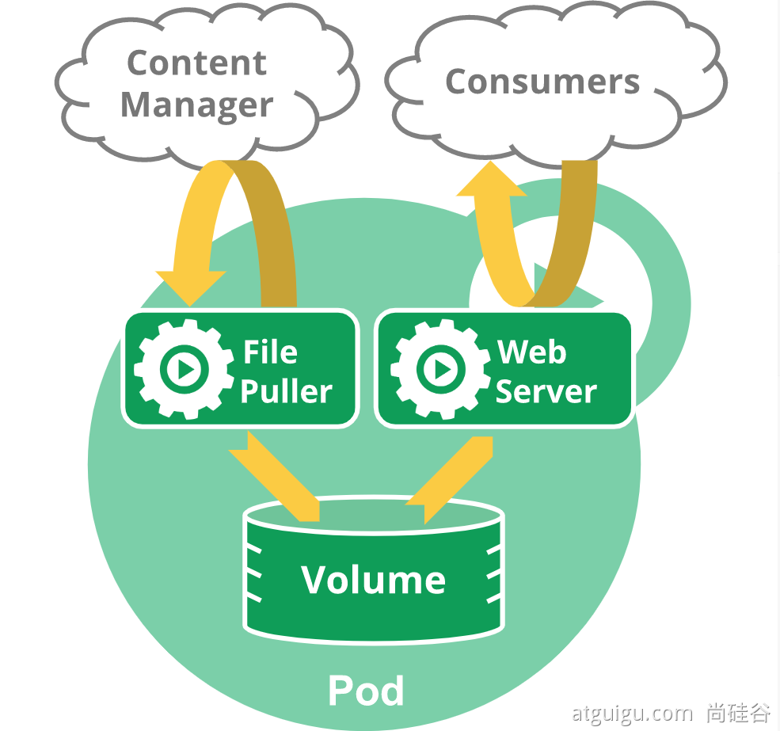
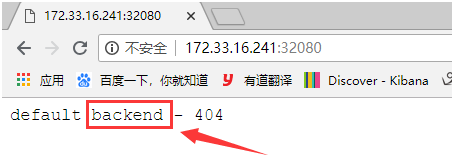

# Kubernetes核心实战

--------

## 资源创建方式

+   命令行
+   YAML

## Namespace

名称空间用来隔离资源

### 命令行方式

```bash
# 创建namespace
kubectl create ns hello
# 删除namespace
kubectl delete ns hello
```

### yaml方式

```bash
vim hello.yml
```

```yaml
apiVersion: v1
kind: Namespace
metadata:
  name: hello   # 命名空间的名字
```

```bash
# 创建namespace
kubectl apply -f hello.yml
# 删除namespace
kubectl delete -f hello.yml
```

## Pod

运行中的一组容器，Pod是kubernetes中应用的最小单位.




### 命令行方式

#### 启动一个pod

```bash
# 启动一个pod,指定pod名为mynginx,里面的镜像为nginx,默认是在default命名空间
# 这里学习用,更多的是使用deployment进行部署,后面会说到
kubectl run mynginx --image=nginx
```

#### 查看Pod

```bash
kubectl get pod
kubectl get pod -n default  # 上一句和这一句是一样的,因为不写命名空间这默认命名空间是default
```

```bash
# 查看pod的变化过程
kubectl get pod -w
```

查看更详细的pod的信息

```bash
# k8s会给每个Pod会分配一个ip
kubectl get pod -owide

# 使用 pod的ip + pod里面运行容器的端口
curl 192.168.169.136

# 集群中的任意一个机器以及任意的应用都能通过Pod分配的ip来访问这个Pod
# 为什么是192.168.x.x网段,是因为我们初始化的时候设置的
```


#### 查看pod创建的详细过程

```bash
kubectl describe pod 你自己的Pod名字
```

就是看详细过程,打开后我们拉到最低下主要看`Enents`


#### 删除pod

```bash
kubectl delete pod Pod名字
```

#### 查看Pod的运行日志

```bash
kubectl logs Pod名字
```

#### 查看pod的标签

```bash
kubectl get pod --show-labels
```

#### 进入pod

```bash
kubectl exec -it pod名称 -- /bin/bash
```

也可以通过图形化界面


### yaml方式

+ 一个pod一个容器

```yaml
apiVersion: v1
kind: Pod
metadata:
  labels:
    run: mynginx
  name: mynginx
#  namespace: default
spec:
  containers:
  - image: nginx
    name: mynginx
```

+ 一个pod多个容器

```yaml
apiVersion: v1
kind: Pod
metadata:
  labels:
    run: myapp
  name: myapp
spec:
  containers:   # pod内容器内容
  - image: nginx
    name: nginx
  - image: tomcat:8.5.68
    name: tomcat
```

对于pod内的多个容器,k8s会分配不同的ip,宿主机访问pod可以通过这个内网ip进行访问(比如:curl 192.168.36.68:8080)

对于pod内部的容器相互访问,只需要使用127.0.0.1进行访问就行(比如:curl 127.0.0.1:8080)


如果一个pod内启动两个端口相同的容器,会启动失败


+ 使用yaml文件

```bash
# 创建
kubectl apply -f xxx.yml
# 删除pod
kubectl delete -f xxx.yml
```

此时的应用还不能外部访问

## Deployment

### 基础命令

控制Pod，使Pod拥有多副本，自愈，扩缩容等能力

#### 部署应用

```bash
kubectl create deployment mytomcat --image=tomcat:8.5.68
```

和我们直接创建pod(`kubectl run mynginx --image=tomcat:8.5.68`)是不一样的,用deployment进行部署会拥有治愈能力


#### 查看所有deployment

```bash
kubectl get deploy    # deployment单词不用写全
```

#### 删除deployment

```bash
kubectl delete deploy Deployment名字
```

#### 修改yaml文件

```bash
kubectl edit deployment Deployment名字
```

### 多副本

```bash
kubectl create deployment my-dep --image=nginx --replicas=3
```

```yaml
apiVersion: apps/v1
kind: Deployment
metadata:
  labels:
    app: my-dep
  name: my-dep
spec:
  replicas: 3
  selector:
    matchLabels:
      app: my-dep
  template:
    metadata:
      labels:
        app: my-dep
    spec:
      containers:
      - image: nginx
        name: nginx
```

### 扩缩容

命令行

```bash
kubectl scale --replicas=5 deployment/my-dep
```

修改yaml文件

```bash
# 在打开的文件中修改replicas
kubectl edit deployment my-dep
```

使用图形界面


这里是手动操作,k8s是可以动态扩缩容的

### 自愈&故障转移

+ 停机
+ 删除Pod
+ 容器崩溃
+ ....


### 滚动更新

```bash
# 查看旧的部署的yaml => 用以查看正在运行的是哪个pod
kubectl get deploy my-dep -oyaml

# 滚动更新 => 其实就是用新的镜像启动一个pod,再将旧的pod杀死,并将流量引到新的pod
# => set image 表明要更新镜像
# => deployment/my-dep nginx=nginx:1.16.1 将my-dep应用中,名为nginx容器的镜像更新为ginx:1.16.1
# => --record 表示记录一下这次版本的更新
kubectl set image deployment/my-dep nginx=nginx:1.16.1 --record

kubectl rollout status deployment/my-dep
````


### 版本回退

```bash
# 查看历史记录
kubectl rollout history deployment/my-dep

#查看某个历史详情
kubectl rollout history deployment/my-dep --revision=2

#回滚(回到上次)
kubectl rollout undo deployment/my-dep

#回滚(回到指定版本)
kubectl rollout undo deployment/my-dep --to-revision=2
````

### 更多

除了Deployment，k8s还有 StatefulSet 、DaemonSet 、Job  等 类型资源。我们都称为工作负载。

有状态应用使用 StatefulSet 部署，无状态应用使用 Deployment 部署

https://kubernetes.io/zh/docs/concepts/workloads/controllers/


## Service

将一组 Pods 公开为网络服务的抽象方法。

### 命令行

#### 将pod内容器的端口通过service进行暴露

```bash
kubectl expose deployment my-dep --port=8000 --target-port=80

# 上面命令等价于如下
# => 默认为ClusterIP,表明暴露的IP只能在集群内访问
kubectl expose deployment my-dep --port=8000 --target-port=80 --type=ClusterIP
```


#### 使用标签检索Pod

```bash
kubectl get pod -l app=my-dep
```

#### 查看service

```bash
kubectl get service
```

#### 删除service
```bash
kubectl delete service my-dep
```

### yaml文件

service是一组pods公开为网络服务的抽象方法,而service如何知道自己对应的是哪几个pod,通过的是`标签`

查看pod的标签

```bash
kubectl get pod --show-labels
```


yaml中的选择器(selector)里需要填写对应的标签

```yaml
apiVersion: v1
kind: Service
metadata:
  labels:
    app: my-dep
  name: my-dep
spec:
  selector:   # 要填写该service要暴露的pod的标签
    app: my-dep
  ports:
  - port: 8000
    protocol: TCP
    targetPort: 80
```


### ClusterIP类型和NodePort类型说明

#### ClusterIP类型

该类型集群内部的访问

```bash
# 等同于没有--type的
kubectl expose deployment my-dep --port=8000 --target-port=80 --type=ClusterIP
```

```yaml
apiVersion: v1
kind: Service
metadata:
  labels:
    app: my-dep
  name: my-dep
spec:
  ports:
  - port: 8000
    protocol: TCP
    targetPort: 80
  selector:
    app: my-dep
  type: ClusterIP
```

##### 访问service


###### 方式一: 使用IP地址


###### 方式二: 域名方式

service的NAME.所在命名空间.svc => 比如这里:my-dep.default.svc

!>  使用域名的方式是在容器内部操作,在宿主机上是不行的

这里创建了一个tomcat服务的pod


#### NodePort类型

该类型集群外也可以访问

使用NodePort,是在每一台机器都开一个Port对外

```bash
kubectl expose deployment my-dep --port=8000 --target-port=80 --type=NodePort
```

```yaml
apiVersion: v1
kind: Service
metadata:
  labels:
    app: my-dep
  name: my-dep
spec:
  ports:
  - port: 8000
    protocol: TCP
    targetPort: 80
  selector:
    app: my-dep
  type: NodePort
```


这个对外的IP也可以自己指定

```bash
kubectl edit service my-dep
```

`NodePort范围在 30000-32767 之间`


修改NodePort的指定范围

```bash
vim /etc/kubernetes/manifests/kube-apiserver.yaml

# 添加
--service-node-port-range=1-65535
```


#### ClusterIP类型和NodePort类型互相转换

```bash
kubectl edit service my-dep
```

##### ClusterIP类型转成NodePort类型


##### NodePort类型转成ClusterIP类型


## Ingress(Service的统一网关入口)


###  k8s 1.15.1版本安装ingress-nginx

+ 参考[Centos7 kubeadm安装Kubernetes:1.15.11三节点集群（含dashboard、flannel和canal网络、Helm、ingress-nginx）](https://blog.csdn.net/waltertan1988/article/details/104715254#t16)
+ 参考 [kubernetes安装ingress-nginx](https://www.cnblogs.com/hailun1987/p/14162278.html)

#### 安装

```bash
#######################################
# 由于无法访问k8s的google库，我们还是先从其他镜像仓库下载并打tag，得到ingress nginx的依赖镜像
#######################################
# 手动下载镜像
# !!!由于pod会分布在不同服务器启动,手动下载镜像的时候要注意在每台服务器上都手动下载一遍
# 拉镜像
docker pull registry.cn-qingdao.aliyuncs.com/kubernetes_xingej/defaultbackend-amd64:1.5
docker pull registry.cn-qingdao.aliyuncs.com/kubernetes_xingej/nginx-ingress-controller:0.20.0
# 打tag
docker tag registry.cn-qingdao.aliyuncs.com/kubernetes_xingej/defaultbackend-amd64:1.5 k8s.gcr.io/defaultbackend-amd64:1.5
docker tag registry.cn-qingdao.aliyuncs.com/kubernetes_xingej/nginx-ingress-controller:0.20.0 quay.io/kubernetes-ingress-controller/nginx-ingress-controller:0.20.0
# 删原标签
docker rmi registry.cn-qingdao.aliyuncs.com/kubernetes_xingej/defaultbackend-amd64:1.5
docker rmi registry.cn-qingdao.aliyuncs.com/kubernetes_xingej/nginx-ingress-controller:0.20.0

#######################################
# 下载yaml文件
#######################################
# 这里不要盲目的下载使用
# 要和版本对应
# 我使用的是k8s的版本是1.51.1,所以下载的是如下版本,这个文件内容拷贝一份在下文
# !!!这个文件对于1.15.1版本安装ingress后是有bug的,原因是因为新版本的权限比老版本多许多导致,要用我底下整理好的文件
wget https://raw.githubusercontent.com/kubernetes/ingress-nginx/nginx-0.20.0/deploy/mandatory.yaml

#######################################
# 安装
#######################################
kubectl apply -f mandatory.yaml

#######################################
# 检查安装的结果
#######################################
kubectl get pod,svc -n ingress-nginx

# 最后别忘记把svc暴露的端口要放行
```

整理好的mandatory.yaml用以下文件

```yaml
apiVersion: v1
kind: Namespace
metadata:
  name: ingress-nginx

---

apiVersion: extensions/v1beta1
kind: Deployment
metadata:
  name: default-http-backend
  labels:
    app.kubernetes.io/name: default-http-backend
    app.kubernetes.io/part-of: ingress-nginx
  namespace: ingress-nginx
spec:
  replicas: 1
  selector:
    matchLabels:
      app.kubernetes.io/name: default-http-backend
      app.kubernetes.io/part-of: ingress-nginx
  template:
    metadata:
      labels:
        app.kubernetes.io/name: default-http-backend
        app.kubernetes.io/part-of: ingress-nginx
    spec:
      terminationGracePeriodSeconds: 60
      containers:
        - name: default-http-backend
          # Any image is permissible as long as:
          # 1. It serves a 404 page at /
          # 2. It serves 200 on a /healthz endpoint
          image: k8s.gcr.io/defaultbackend-amd64:1.5
          livenessProbe:
            httpGet:
              path: /healthz
              port: 8080
              scheme: HTTP
            initialDelaySeconds: 30
            timeoutSeconds: 5
          ports:
            - containerPort: 8080
          resources:
            limits:
              cpu: 10m
              memory: 20Mi
            requests:
              cpu: 10m
              memory: 20Mi

---
apiVersion: v1
kind: Service
metadata:
  name: default-http-backend
  namespace: ingress-nginx
  labels:
    app.kubernetes.io/name: default-http-backend
    app.kubernetes.io/part-of: ingress-nginx
spec:
  ports:
    - port: 80
      targetPort: 8080
  selector:
    app.kubernetes.io/name: default-http-backend
    app.kubernetes.io/part-of: ingress-nginx

---

kind: ConfigMap
apiVersion: v1
metadata:
  name: nginx-configuration
  namespace: ingress-nginx
  labels:
    app.kubernetes.io/name: ingress-nginx
    app.kubernetes.io/part-of: ingress-nginx

---

kind: ConfigMap
apiVersion: v1
metadata:
  name: tcp-services
  namespace: ingress-nginx
  labels:
    app.kubernetes.io/name: ingress-nginx
    app.kubernetes.io/part-of: ingress-nginx

---

kind: ConfigMap
apiVersion: v1
metadata:
  name: udp-services
  namespace: ingress-nginx
  labels:
    app.kubernetes.io/name: ingress-nginx
    app.kubernetes.io/part-of: ingress-nginx

---

apiVersion: v1
kind: ServiceAccount
metadata:
  name: nginx-ingress-serviceaccount
  namespace: ingress-nginx
  labels:
    app.kubernetes.io/name: ingress-nginx
    app.kubernetes.io/part-of: ingress-nginx

---
apiVersion: rbac.authorization.k8s.io/v1beta1
kind: ClusterRole
metadata:
  name: nginx-ingress-clusterrole
  labels:
    app.kubernetes.io/name: ingress-nginx
    app.kubernetes.io/part-of: ingress-nginx
rules:
  - apiGroups:
      - ""
    resources:
      - configmaps
      - endpoints
      - nodes
      - pods
      - secrets
    verbs:
      - list
      - watch
  - apiGroups:
      - ""
    resources:
      - nodes
    verbs:
      - get
  - apiGroups:
      - ""
    resources:
      - services
    verbs:
      - get
      - list
      - watch
  - apiGroups:
      - "extensions"
    resources:
      - ingresses
    verbs:
      - get
      - list
      - watch
  - apiGroups:
      - ""
    resources:
      - events
    verbs:
      - create
      - patch
  - apiGroups:
      - "extensions"
    resources:
      - ingresses/status
    verbs:
      - update

---
apiVersion: rbac.authorization.k8s.io/v1beta1
kind: Role
metadata:
  name: nginx-ingress-role
  namespace: ingress-nginx
  labels:
    app.kubernetes.io/name: ingress-nginx
    app.kubernetes.io/part-of: ingress-nginx
rules:
  - apiGroups:
      - ""
    resources:
      - configmaps
      - pods
      - secrets
      - namespaces
    verbs:
      - get
  - apiGroups:
      - ""
    resources:
      - configmaps
    resourceNames:
      # Defaults to "<election-id>-<ingress-class>"
      # Here: "<ingress-controller-leader>-<nginx>"
      # This has to be adapted if you change either parameter
      # when launching the nginx-ingress-controller.
      - "ingress-controller-leader-nginx"
    verbs:
      - get
      - update
  - apiGroups:
      - ""
    resources:
      - configmaps
    verbs:
      - create
  - apiGroups:
      - ""
    resources:
      - endpoints
    verbs:
      - get

---
apiVersion: rbac.authorization.k8s.io/v1beta1
kind: RoleBinding
metadata:
  name: nginx-ingress-role-nisa-binding
  namespace: ingress-nginx
  labels:
    app.kubernetes.io/name: ingress-nginx
    app.kubernetes.io/part-of: ingress-nginx
roleRef:
  apiGroup: rbac.authorization.k8s.io
  kind: Role
  name: nginx-ingress-role
subjects:
  - kind: ServiceAccount
    name: nginx-ingress-serviceaccount
    namespace: ingress-nginx

---
apiVersion: rbac.authorization.k8s.io/v1beta1
kind: ClusterRoleBinding
metadata:
  name: nginx-ingress-clusterrole-nisa-binding
  labels:
    app.kubernetes.io/name: ingress-nginx
    app.kubernetes.io/part-of: ingress-nginx
roleRef:
  apiGroup: rbac.authorization.k8s.io
  kind: ClusterRole
  name: nginx-ingress-clusterrole
subjects:
  - kind: ServiceAccount
    name: nginx-ingress-serviceaccount
    namespace: ingress-nginx

---

apiVersion: extensions/v1beta1
kind: Deployment
metadata:
  name: nginx-ingress-controller
  namespace: ingress-nginx
  labels:
    app.kubernetes.io/name: ingress-nginx
    app.kubernetes.io/part-of: ingress-nginx
spec:
  replicas: 1
  selector:
    matchLabels:
      app.kubernetes.io/name: ingress-nginx
      app.kubernetes.io/part-of: ingress-nginx
  template:
    metadata:
      labels:
        app.kubernetes.io/name: ingress-nginx
        app.kubernetes.io/part-of: ingress-nginx
      annotations:
        prometheus.io/port: "10254"
        prometheus.io/scrape: "true"
    spec:
      serviceAccountName: nginx-ingress-serviceaccount
      containers:
        - name: nginx-ingress-controller
          image: quay.io/kubernetes-ingress-controller/nginx-ingress-controller:0.20.0
          args:
            - /nginx-ingress-controller
            - --default-backend-service=$(POD_NAMESPACE)/default-http-backend
            - --configmap=$(POD_NAMESPACE)/nginx-configuration
            - --tcp-services-configmap=$(POD_NAMESPACE)/tcp-services
            - --udp-services-configmap=$(POD_NAMESPACE)/udp-services
            - --publish-service=$(POD_NAMESPACE)/ingress-nginx
            - --annotations-prefix=nginx.ingress.kubernetes.io
          securityContext:
            capabilities:
              drop:
                - ALL
              add:
                - NET_BIND_SERVICE
            # www-data -> 33
            runAsUser: 33
          env:
            - name: POD_NAME
              valueFrom:
                fieldRef:
                  fieldPath: metadata.name
            - name: POD_NAMESPACE
              valueFrom:
                fieldRef:
                  fieldPath: metadata.namespace
          ports:
            - name: http
              containerPort: 80
            - name: https
              containerPort: 443
          livenessProbe:
            failureThreshold: 3
            httpGet:
              path: /healthz
              port: 10254
              scheme: HTTP
            initialDelaySeconds: 10
            periodSeconds: 10
            successThreshold: 1
            timeoutSeconds: 1
          readinessProbe:
            failureThreshold: 3
            httpGet:
              path: /healthz
              port: 10254
              scheme: HTTP
            periodSeconds: 10
            successThreshold: 1
            timeoutSeconds: 1
---
apiVersion: v1
kind: Namespace
metadata:
  name: ingress-nginx
  labels:
    app.kubernetes.io/name: ingress-nginx
    app.kubernetes.io/part-of: ingress-nginx
---
kind: ConfigMap
apiVersion: v1
metadata:
  name: nginx-configuration
  namespace: ingress-nginx
  labels:
    app.kubernetes.io/name: ingress-nginx
    app.kubernetes.io/part-of: ingress-nginx
---
kind: ConfigMap
apiVersion: v1
metadata:
  name: tcp-services
  namespace: ingress-nginx
  labels:
    app.kubernetes.io/name: ingress-nginx
    app.kubernetes.io/part-of: ingress-nginx
---
kind: ConfigMap
apiVersion: v1
metadata:
  name: udp-services
  namespace: ingress-nginx
  labels:
    app.kubernetes.io/name: ingress-nginx
    app.kubernetes.io/part-of: ingress-nginx
---
apiVersion: v1
kind: ServiceAccount
metadata:
  name: nginx-ingress-serviceaccount
  namespace: ingress-nginx
  labels:
    app.kubernetes.io/name: ingress-nginx
    app.kubernetes.io/part-of: ingress-nginx
---
apiVersion: rbac.authorization.k8s.io/v1beta1
kind: ClusterRole
metadata:
  name: nginx-ingress-clusterrole
  labels:
    app.kubernetes.io/name: ingress-nginx
    app.kubernetes.io/part-of: ingress-nginx
rules:
  - apiGroups:
      - ""
    resources:
      - configmaps
      - endpoints
      - nodes
      - pods
      - secrets
    verbs:
      - list
      - watch
  - apiGroups:
      - ""
    resources:
      - nodes
    verbs:
      - get
  - apiGroups:
      - ""
    resources:
      - services
    verbs:
      - get
      - list
      - watch
  - apiGroups:
      - ""
    resources:
      - events
    verbs:
      - create
      - patch
  - apiGroups:
      - "extensions"
      - "networking.k8s.io"
    resources:
      - ingresses
    verbs:
      - get
      - list
      - watch
  - apiGroups:
      - "extensions"
      - "networking.k8s.io"
    resources:
      - ingresses/status
    verbs:
      - update
---
apiVersion: rbac.authorization.k8s.io/v1beta1
kind: Role
metadata:
  name: nginx-ingress-role
  namespace: ingress-nginx
  labels:
    app.kubernetes.io/name: ingress-nginx
    app.kubernetes.io/part-of: ingress-nginx
rules:
  - apiGroups:
      - ""
    resources:
      - configmaps
      - pods
      - secrets
      - namespaces
    verbs:
      - get
  - apiGroups:
      - ""
    resources:
      - configmaps
    resourceNames:
      # Defaults to "<election-id>-<ingress-class>"
      # Here: "<ingress-controller-leader>-<nginx>"
      # This has to be adapted if you change either parameter
      # when launching the nginx-ingress-controller.
      - "ingress-controller-leader-nginx"
    verbs:
      - get
      - update
  - apiGroups:
      - ""
    resources:
      - configmaps
    verbs:
      - create
  - apiGroups:
      - ""
    resources:
      - endpoints
    verbs:
      - get
---
apiVersion: rbac.authorization.k8s.io/v1beta1
kind: RoleBinding
metadata:
  name: nginx-ingress-role-nisa-binding
  namespace: ingress-nginx
  labels:
    app.kubernetes.io/name: ingress-nginx
    app.kubernetes.io/part-of: ingress-nginx
roleRef:
  apiGroup: rbac.authorization.k8s.io
  kind: Role
  name: nginx-ingress-role
subjects:
  - kind: ServiceAccount
    name: nginx-ingress-serviceaccount
    namespace: ingress-nginx
---
apiVersion: rbac.authorization.k8s.io/v1beta1
kind: ClusterRoleBinding
metadata:
  name: nginx-ingress-clusterrole-nisa-binding
  labels:
    app.kubernetes.io/name: ingress-nginx
    app.kubernetes.io/part-of: ingress-nginx
roleRef:
  apiGroup: rbac.authorization.k8s.io
  kind: ClusterRole
  name: nginx-ingress-clusterrole
subjects:
  - kind: ServiceAccount
    name: nginx-ingress-serviceaccount
    namespace: ingress-nginx
---
apiVersion: apps/v1
kind: Deployment
metadata:
  name: nginx-ingress-controller
  namespace: ingress-nginx
  labels:
    app.kubernetes.io/name: ingress-nginx
    app.kubernetes.io/part-of: ingress-nginx
spec:
  replicas: 1
  selector:
    matchLabels:
      app.kubernetes.io/name: ingress-nginx
      app.kubernetes.io/part-of: ingress-nginx
  template:
    metadata:
      labels:
        app.kubernetes.io/name: ingress-nginx
        app.kubernetes.io/part-of: ingress-nginx
      annotations:
        prometheus.io/port: "10254"
        prometheus.io/scrape: "true"
    spec:
      # wait up to five minutes for the drain of connections
      terminationGracePeriodSeconds: 300
      serviceAccountName: nginx-ingress-serviceaccount
      containers:
        - name: nginx-ingress-controller
          image: registry.aliyuncs.com/google_containers/nginx-ingress-controller:0.26.1
          args:
            - /nginx-ingress-controller
            - --configmap=$(POD_NAMESPACE)/nginx-configuration
            - --tcp-services-configmap=$(POD_NAMESPACE)/tcp-services
            - --udp-services-configmap=$(POD_NAMESPACE)/udp-services
            - --publish-service=$(POD_NAMESPACE)/ingress-nginx
            - --annotations-prefix=nginx.ingress.kubernetes.io
          securityContext:
            allowPrivilegeEscalation: true
            capabilities:
              drop:
                - ALL
              add:
                - NET_BIND_SERVICE
            # www-data -> 33
            runAsUser: 33
          env:
            - name: POD_NAME
              valueFrom:
                fieldRef:
                  fieldPath: metadata.name
            - name: POD_NAMESPACE
              valueFrom:
                fieldRef:
                  fieldPath: metadata.namespace
          ports:
            - name: http
              containerPort: 80
            - name: https
              containerPort: 443
          livenessProbe:
            failureThreshold: 3
            httpGet:
              path: /healthz
              port: 10254
              scheme: HTTP
            initialDelaySeconds: 10
            periodSeconds: 10
            successThreshold: 1
            timeoutSeconds: 10
          readinessProbe:
            failureThreshold: 3
            httpGet:
              path: /healthz
              port: 10254
              scheme: HTTP
            periodSeconds: 10
            successThreshold: 1
            timeoutSeconds: 10
          lifecycle:
            preStop:
              exec:
                command:
                  - /wait-shutdown
```

添加ingress-nginx-controller的service，以NodePoart方式暴露到集群外面

```bash
cat service-nodeport.yaml
```

```yaml
apiVersion: v1
kind: Service
metadata:
  name: ingress-nginx
  namespace: ingress-nginx
  labels:
    app.kubernetes.io/name: ingress-nginx
    app.kubernetes.io/part-of: ingress-nginx
spec:
  type: NodePort
  ports:
    - name: http
      port: 80
      targetPort: 80
      protocol: TCP
      nodePort: 32080  #http
    - name: https
      port: 443
      targetPort: 443
      protocol: TCP
      nodePort: 32443  #https
  selector:
    app.kubernetes.io/name: ingress-nginx
    app.kubernetes.io/part-of: ingress-nginx
```

```bash
kubectl apply -f service-nodeport.yaml
```

查看ingress-nginx组件状态

```bash
[root@k8s-master ingress-nginx]#  kubectl get pods -n ingress-nginx    #pod状态
NAME                                        READY     STATUS    RESTARTS   AGE
default-http-backend-66c4fbf5b4-x2n8w       1/1       Running   0          58s
nginx-ingress-controller-64bcff8657-5gdrd   1/1       Running   0          58s
```

```bash
[root@k8s-master ingress-nginx]#  kubectl get svc -n ingress-nginx  #service状态及暴露端口
NAME                   TYPE        CLUSTER-IP      EXTERNAL-IP   PORT(S)                      AGE
default-http-backend   ClusterIP   10.96.87.65     <none>        80/TCP                       1m
ingress-nginx          NodePort    10.100.48.237   <none>        80:32080/TCP,443:32443/TCP   1m
```



可以看到，提示404，这个因为当前ingress-nginx服务现在还没有后端服务，这是正常的。如果k8s版本较新，使用上面提供的mandatory.yaml配置，只能看到404提示


#### 使用

##### 域名访问

创建一个Service及后端Deployment(以nginx为例)

```bash
vim deploy-demon.yaml
```

```yaml
apiVersion: v1
kind: Service
metadata:
  name: myapp
  namespace: default
spec:
  selector:
    app: myapp
    release: canary
  ports:
  - name: http
    port: 80
    targetPort: 80
---
apiVersion: apps/v1
kind: Deployment
metadata:
  name: myapp-deploy
spec:
  replicas: 5
  selector:
    matchLabels:
      app: myapp
      release: canary
  template:
    metadata:
      labels:
        app: myapp
        release: canary
    spec:
      containers:
      - name: myapp
        image: ikubernetes/myapp:v2
        ports:
        - name: httpd
          containerPort: 80
```

创建ingress-nginx后端服务及检查状态是否就绪

```bash
[root@k8s-master ingress-nginx]# kubectl apply -f deploy-demon.yaml
service "myapp" created
deployment.apps "myapp-deploy" created
```

```bash
[root@k8s-master nginx-ingress-controller]# kubectl get pods
NAME                            READY   STATUS    RESTARTS   AGE
myapp-deploy-77c5c86fdb-l7c4f   1/1     Running   0          35s
myapp-deploy-77c5c86fdb-m5lnl   1/1     Running   0          35s
myapp-deploy-77c5c86fdb-nq6vl   1/1     Running   0          35s
myapp-deploy-77c5c86fdb-v2vpp   1/1     Running   0          35s
myapp-deploy-77c5c86fdb-w2d59   1/1     Running   0          35s
```

```bash
[root@k8s-master nginx-ingress-controller]# kubectl get svc
NAME         TYPE        CLUSTER-IP     EXTERNAL-IP   PORT(S)   AGE
kubernetes   ClusterIP   10.96.0.1      <none>        443/TCP   50d
myapp        ClusterIP   10.98.49.121   <none>        80/TCP    43s
```

将myapp添加至ingress-nginx中

```bash
[root@k8s-master ingress-nginx]# cat ingress-myapp.yaml
```

```yaml
apiVersion: extensions/v1beta1
kind: Ingress
metadata:
  name: ingress-myapp
  namespace: default
  annotations:
    kubernetes.io/ingress.class: "nginx"
spec:
  rules:
  - host: myapp.magedu.com #生产中该域名应当可以被公网解析
    http:
      paths:
      - path:
        backend:
          serviceName: myapp
          servicePort: 80
```

```bash
[root@k8s-master ingress-nginx]# kubectl apply -f ingress-myapp.yaml
ingress.extensions "ingress-myapp" created
```

配置域名解析，当前测试环境我们使用hosts文件进行解析

```
192.168.10.77  myapp.magedu.com
```

使用域名进行访问


##### 为tomcat服务添加httpds服务

再创建一个Service及后端Deployment(以tomcat为例)

```bash
[root@k8s-master ingress-nginx]# cat tomcat-deploy.yaml
```

```yaml
apiVersion: v1
kind: Service
metadata:
  name: tomcat
  namespace: default
spec:
  selector:
    app: tomcat
    release: canary
  ports:
  - name: http
    port: 8080
    targetPort: 8080
  - name: ajp
    port: 8009
    targetPort: 8009

---
apiVersion: apps/v1
kind: Deployment
metadata:
  name: tomcat-deploy
spec:
  replicas: 3
  selector:
    matchLabels:
      app: tomcat
      release: canary
  template:
    metadata:
      labels:
        app: tomcat
        release: canary
    spec:
      containers:
      - name: tomcat
        image: tomcat:7-alpine
        ports:
        - name: httpd
          containerPort: 8080
        - name: ajp
          containerPort: 8009
```

```bash
[root@k8s-master ingress-nginx]# kubectl apply -f tomcat-deploy.yaml
service "tomcat" created
deployment.apps "tomcat-deploy" created
```

```bash
[root@k8s-master ingress-nginx]# kubectl get pod #等待pod状态就绪
```

将tomcat添加至ingress-nginx中

```bash
[root@k8s-master ingress-nginx]# cat ingress-tomcat.yaml
```

```yaml
apiVersion: extensions/v1beta1
kind: Ingress
metadata:
  name: ingress-tomcat
  namespace: default
  annotations:
    kubernets.io/ingress.class: "nginx"
spec:
  rules:
  - host: tomcat.magedu.com
    http:
      paths:
      - path:
        backend:
          serviceName: tomcat
          servicePort: 8080
```

```bash
[root@k8s-master ingress-nginx]# kubectl apply -f ingress-tomcat.yaml
ingress.extensions "ingress-tomcat" created
```

添加域名解析及访问服务


下面我们对tomcat服务添加httpds服务

创建私有证书及secret

```bash
[root@k8s-master ingress-nginx]# openssl genrsa -out tls.key 2048
Generating RSA private key, 2048 bit long modulus
.......+++
..............................+++
e is 65537 (0x10001)

[root@k8s-master ingress-nginx]# openssl req -new -x509 -key tls.key -out tls.crt -subj /C=CN/ST=Beijing/L=Beijing/O=DevOps/CN=tomcat.magedu.com #注意域名要和服务的域名一致

[root@k8s-master ingress-nginx]# kubectl create secret tls tomcat-ingress-secret --cert=tls.crt --key=tls.key #创建secret
secret "tomcat-ingress-secret" created

[root@k8s-master ingress-nginx]# kubectl get secret
NAME                    TYPE                                  DATA      AGE
default-token-bf52l     kubernetes.io/service-account-token   3         9d
tomcat-ingress-secret   kubernetes.io/tls                     2         7s

[root@k8s-master ingress-nginx]# kubectl describe secret tomcat-ingress-secret
Name:         tomcat-ingress-secret
Namespace:    default
Labels:       <none>
Annotations:  <none>

Type:  kubernetes.io/tls

Data
====
tls.crt:  1294 bytes  #base64加密
tls.key:  1679 bytes
将证书应用至tomcat服务中
[root@k8s-master01 ingress]# cat ingress-tomcat-tls.yaml
apiVersion: extensions/v1beta1
kind: Ingress
metadata:
  name: ingress-tomcat-tls
  namespace: default
  annotations:
    kubernets.io/ingress.class: "nginx"
spec:
  tls:
  - hosts:
    - tomcat.magedu.com        #与secret证书的域名需要保持一致
    secretName: tomcat-ingress-secret   #secret证书的名称
  rules:
  - host: tomcat.magedu.com
    http:
      paths:
      - path:
        backend:
          serviceName: tomcat
          servicePort: 8080

[root@k8s-master01 ingress]#  kubectl apply -f ingress-tomcat-tls.yaml
```

访问服务


### k8s1.20.9安装ingress-nginx

####  安装

```bash
wget https://raw.githubusercontent.com/kubernetes/ingress-nginx/controller-v0.47.0/deploy/static/provider/baremetal/deploy.yaml

#修改镜像
vi deploy.yaml
#将image的值改为如下值：
registry.cn-hangzhou.aliyuncs.com/lfy_k8s_images/ingress-nginx-controller:v0.46.0

# 检查安装的结果
kubectl get pod,svc -n ingress-nginx

# 最后别忘记把svc暴露的端口要放行
```


如果下载不到，用以下文件

```yaml
apiVersion: v1
kind: Namespace
metadata:
  name: ingress-nginx
  labels:
    app.kubernetes.io/name: ingress-nginx
    app.kubernetes.io/instance: ingress-nginx

---
# Source: ingress-nginx/templates/controller-serviceaccount.yaml
apiVersion: v1
kind: ServiceAccount
metadata:
  labels:
    helm.sh/chart: ingress-nginx-3.33.0
    app.kubernetes.io/name: ingress-nginx
    app.kubernetes.io/instance: ingress-nginx
    app.kubernetes.io/version: 0.47.0
    app.kubernetes.io/managed-by: Helm
    app.kubernetes.io/component: controller
  name: ingress-nginx
  namespace: ingress-nginx
automountServiceAccountToken: true
---
# Source: ingress-nginx/templates/controller-configmap.yaml
apiVersion: v1
kind: ConfigMap
metadata:
  labels:
    helm.sh/chart: ingress-nginx-3.33.0
    app.kubernetes.io/name: ingress-nginx
    app.kubernetes.io/instance: ingress-nginx
    app.kubernetes.io/version: 0.47.0
    app.kubernetes.io/managed-by: Helm
    app.kubernetes.io/component: controller
  name: ingress-nginx-controller
  namespace: ingress-nginx
data:
---
# Source: ingress-nginx/templates/clusterrole.yaml
apiVersion: rbac.authorization.k8s.io/v1
kind: ClusterRole
metadata:
  labels:
    helm.sh/chart: ingress-nginx-3.33.0
    app.kubernetes.io/name: ingress-nginx
    app.kubernetes.io/instance: ingress-nginx
    app.kubernetes.io/version: 0.47.0
    app.kubernetes.io/managed-by: Helm
  name: ingress-nginx
rules:
  - apiGroups:
      - ''
    resources:
      - configmaps
      - endpoints
      - nodes
      - pods
      - secrets
    verbs:
      - list
      - watch
  - apiGroups:
      - ''
    resources:
      - nodes
    verbs:
      - get
  - apiGroups:
      - ''
    resources:
      - services
    verbs:
      - get
      - list
      - watch
  - apiGroups:
      - extensions
      - networking.k8s.io   # k8s 1.14+
    resources:
      - ingresses
    verbs:
      - get
      - list
      - watch
  - apiGroups:
      - ''
    resources:
      - events
    verbs:
      - create
      - patch
  - apiGroups:
      - extensions
      - networking.k8s.io   # k8s 1.14+
    resources:
      - ingresses/status
    verbs:
      - update
  - apiGroups:
      - networking.k8s.io   # k8s 1.14+
    resources:
      - ingressclasses
    verbs:
      - get
      - list
      - watch
---
# Source: ingress-nginx/templates/clusterrolebinding.yaml
apiVersion: rbac.authorization.k8s.io/v1
kind: ClusterRoleBinding
metadata:
  labels:
    helm.sh/chart: ingress-nginx-3.33.0
    app.kubernetes.io/name: ingress-nginx
    app.kubernetes.io/instance: ingress-nginx
    app.kubernetes.io/version: 0.47.0
    app.kubernetes.io/managed-by: Helm
  name: ingress-nginx
roleRef:
  apiGroup: rbac.authorization.k8s.io
  kind: ClusterRole
  name: ingress-nginx
subjects:
  - kind: ServiceAccount
    name: ingress-nginx
    namespace: ingress-nginx
---
# Source: ingress-nginx/templates/controller-role.yaml
apiVersion: rbac.authorization.k8s.io/v1
kind: Role
metadata:
  labels:
    helm.sh/chart: ingress-nginx-3.33.0
    app.kubernetes.io/name: ingress-nginx
    app.kubernetes.io/instance: ingress-nginx
    app.kubernetes.io/version: 0.47.0
    app.kubernetes.io/managed-by: Helm
    app.kubernetes.io/component: controller
  name: ingress-nginx
  namespace: ingress-nginx
rules:
  - apiGroups:
      - ''
    resources:
      - namespaces
    verbs:
      - get
  - apiGroups:
      - ''
    resources:
      - configmaps
      - pods
      - secrets
      - endpoints
    verbs:
      - get
      - list
      - watch
  - apiGroups:
      - ''
    resources:
      - services
    verbs:
      - get
      - list
      - watch
  - apiGroups:
      - extensions
      - networking.k8s.io   # k8s 1.14+
    resources:
      - ingresses
    verbs:
      - get
      - list
      - watch
  - apiGroups:
      - extensions
      - networking.k8s.io   # k8s 1.14+
    resources:
      - ingresses/status
    verbs:
      - update
  - apiGroups:
      - networking.k8s.io   # k8s 1.14+
    resources:
      - ingressclasses
    verbs:
      - get
      - list
      - watch
  - apiGroups:
      - ''
    resources:
      - configmaps
    resourceNames:
      - ingress-controller-leader-nginx
    verbs:
      - get
      - update
  - apiGroups:
      - ''
    resources:
      - configmaps
    verbs:
      - create
  - apiGroups:
      - ''
    resources:
      - events
    verbs:
      - create
      - patch
---
# Source: ingress-nginx/templates/controller-rolebinding.yaml
apiVersion: rbac.authorization.k8s.io/v1
kind: RoleBinding
metadata:
  labels:
    helm.sh/chart: ingress-nginx-3.33.0
    app.kubernetes.io/name: ingress-nginx
    app.kubernetes.io/instance: ingress-nginx
    app.kubernetes.io/version: 0.47.0
    app.kubernetes.io/managed-by: Helm
    app.kubernetes.io/component: controller
  name: ingress-nginx
  namespace: ingress-nginx
roleRef:
  apiGroup: rbac.authorization.k8s.io
  kind: Role
  name: ingress-nginx
subjects:
  - kind: ServiceAccount
    name: ingress-nginx
    namespace: ingress-nginx
---
# Source: ingress-nginx/templates/controller-service-webhook.yaml
apiVersion: v1
kind: Service
metadata:
  labels:
    helm.sh/chart: ingress-nginx-3.33.0
    app.kubernetes.io/name: ingress-nginx
    app.kubernetes.io/instance: ingress-nginx
    app.kubernetes.io/version: 0.47.0
    app.kubernetes.io/managed-by: Helm
    app.kubernetes.io/component: controller
  name: ingress-nginx-controller-admission
  namespace: ingress-nginx
spec:
  type: ClusterIP
  ports:
    - name: https-webhook
      port: 443
      targetPort: webhook
  selector:
    app.kubernetes.io/name: ingress-nginx
    app.kubernetes.io/instance: ingress-nginx
    app.kubernetes.io/component: controller
---
# Source: ingress-nginx/templates/controller-service.yaml
apiVersion: v1
kind: Service
metadata:
  annotations:
  labels:
    helm.sh/chart: ingress-nginx-3.33.0
    app.kubernetes.io/name: ingress-nginx
    app.kubernetes.io/instance: ingress-nginx
    app.kubernetes.io/version: 0.47.0
    app.kubernetes.io/managed-by: Helm
    app.kubernetes.io/component: controller
  name: ingress-nginx-controller
  namespace: ingress-nginx
spec:
  type: NodePort
  ports:
    - name: http
      port: 80
      protocol: TCP
      targetPort: http
    - name: https
      port: 443
      protocol: TCP
      targetPort: https
  selector:
    app.kubernetes.io/name: ingress-nginx
    app.kubernetes.io/instance: ingress-nginx
    app.kubernetes.io/component: controller
---
# Source: ingress-nginx/templates/controller-deployment.yaml
apiVersion: apps/v1
kind: Deployment
metadata:
  labels:
    helm.sh/chart: ingress-nginx-3.33.0
    app.kubernetes.io/name: ingress-nginx
    app.kubernetes.io/instance: ingress-nginx
    app.kubernetes.io/version: 0.47.0
    app.kubernetes.io/managed-by: Helm
    app.kubernetes.io/component: controller
  name: ingress-nginx-controller
  namespace: ingress-nginx
spec:
  selector:
    matchLabels:
      app.kubernetes.io/name: ingress-nginx
      app.kubernetes.io/instance: ingress-nginx
      app.kubernetes.io/component: controller
  revisionHistoryLimit: 10
  minReadySeconds: 0
  template:
    metadata:
      labels:
        app.kubernetes.io/name: ingress-nginx
        app.kubernetes.io/instance: ingress-nginx
        app.kubernetes.io/component: controller
    spec:
      dnsPolicy: ClusterFirst
      containers:
        - name: controller
          image: registry.cn-hangzhou.aliyuncs.com/lfy_k8s_images/ingress-nginx-controller:v0.46.0
          imagePullPolicy: IfNotPresent
          lifecycle:
            preStop:
              exec:
                command:
                  - /wait-shutdown
          args:
            - /nginx-ingress-controller
            - --election-id=ingress-controller-leader
            - --ingress-class=nginx
            - --configmap=$(POD_NAMESPACE)/ingress-nginx-controller
            - --validating-webhook=:8443
            - --validating-webhook-certificate=/usr/local/certificates/cert
            - --validating-webhook-key=/usr/local/certificates/key
          securityContext:
            capabilities:
              drop:
                - ALL
              add:
                - NET_BIND_SERVICE
            runAsUser: 101
            allowPrivilegeEscalation: true
          env:
            - name: POD_NAME
              valueFrom:
                fieldRef:
                  fieldPath: metadata.name
            - name: POD_NAMESPACE
              valueFrom:
                fieldRef:
                  fieldPath: metadata.namespace
            - name: LD_PRELOAD
              value: /usr/local/lib/libmimalloc.so
          livenessProbe:
            failureThreshold: 5
            httpGet:
              path: /healthz
              port: 10254
              scheme: HTTP
            initialDelaySeconds: 10
            periodSeconds: 10
            successThreshold: 1
            timeoutSeconds: 1
          readinessProbe:
            failureThreshold: 3
            httpGet:
              path: /healthz
              port: 10254
              scheme: HTTP
            initialDelaySeconds: 10
            periodSeconds: 10
            successThreshold: 1
            timeoutSeconds: 1
          ports:
            - name: http
              containerPort: 80
              protocol: TCP
            - name: https
              containerPort: 443
              protocol: TCP
            - name: webhook
              containerPort: 8443
              protocol: TCP
          volumeMounts:
            - name: webhook-cert
              mountPath: /usr/local/certificates/
              readOnly: true
          resources:
            requests:
              cpu: 100m
              memory: 90Mi
      nodeSelector:
        kubernetes.io/os: linux
      serviceAccountName: ingress-nginx
      terminationGracePeriodSeconds: 300
      volumes:
        - name: webhook-cert
          secret:
            secretName: ingress-nginx-admission
---
# Source: ingress-nginx/templates/admission-webhooks/validating-webhook.yaml
# before changing this value, check the required kubernetes version
# https://kubernetes.io/docs/reference/access-authn-authz/extensible-admission-controllers/#prerequisites
apiVersion: admissionregistration.k8s.io/v1
kind: ValidatingWebhookConfiguration
metadata:
  labels:
    helm.sh/chart: ingress-nginx-3.33.0
    app.kubernetes.io/name: ingress-nginx
    app.kubernetes.io/instance: ingress-nginx
    app.kubernetes.io/version: 0.47.0
    app.kubernetes.io/managed-by: Helm
    app.kubernetes.io/component: admission-webhook
  name: ingress-nginx-admission
webhooks:
  - name: validate.nginx.ingress.kubernetes.io
    matchPolicy: Equivalent
    rules:
      - apiGroups:
          - networking.k8s.io
        apiVersions:
          - v1beta1
        operations:
          - CREATE
          - UPDATE
        resources:
          - ingresses
    failurePolicy: Fail
    sideEffects: None
    admissionReviewVersions:
      - v1
      - v1beta1
    clientConfig:
      service:
        namespace: ingress-nginx
        name: ingress-nginx-controller-admission
        path: /networking/v1beta1/ingresses
---
# Source: ingress-nginx/templates/admission-webhooks/job-patch/serviceaccount.yaml
apiVersion: v1
kind: ServiceAccount
metadata:
  name: ingress-nginx-admission
  annotations:
    helm.sh/hook: pre-install,pre-upgrade,post-install,post-upgrade
    helm.sh/hook-delete-policy: before-hook-creation,hook-succeeded
  labels:
    helm.sh/chart: ingress-nginx-3.33.0
    app.kubernetes.io/name: ingress-nginx
    app.kubernetes.io/instance: ingress-nginx
    app.kubernetes.io/version: 0.47.0
    app.kubernetes.io/managed-by: Helm
    app.kubernetes.io/component: admission-webhook
  namespace: ingress-nginx
---
# Source: ingress-nginx/templates/admission-webhooks/job-patch/clusterrole.yaml
apiVersion: rbac.authorization.k8s.io/v1
kind: ClusterRole
metadata:
  name: ingress-nginx-admission
  annotations:
    helm.sh/hook: pre-install,pre-upgrade,post-install,post-upgrade
    helm.sh/hook-delete-policy: before-hook-creation,hook-succeeded
  labels:
    helm.sh/chart: ingress-nginx-3.33.0
    app.kubernetes.io/name: ingress-nginx
    app.kubernetes.io/instance: ingress-nginx
    app.kubernetes.io/version: 0.47.0
    app.kubernetes.io/managed-by: Helm
    app.kubernetes.io/component: admission-webhook
rules:
  - apiGroups:
      - admissionregistration.k8s.io
    resources:
      - validatingwebhookconfigurations
    verbs:
      - get
      - update
---
# Source: ingress-nginx/templates/admission-webhooks/job-patch/clusterrolebinding.yaml
apiVersion: rbac.authorization.k8s.io/v1
kind: ClusterRoleBinding
metadata:
  name: ingress-nginx-admission
  annotations:
    helm.sh/hook: pre-install,pre-upgrade,post-install,post-upgrade
    helm.sh/hook-delete-policy: before-hook-creation,hook-succeeded
  labels:
    helm.sh/chart: ingress-nginx-3.33.0
    app.kubernetes.io/name: ingress-nginx
    app.kubernetes.io/instance: ingress-nginx
    app.kubernetes.io/version: 0.47.0
    app.kubernetes.io/managed-by: Helm
    app.kubernetes.io/component: admission-webhook
roleRef:
  apiGroup: rbac.authorization.k8s.io
  kind: ClusterRole
  name: ingress-nginx-admission
subjects:
  - kind: ServiceAccount
    name: ingress-nginx-admission
    namespace: ingress-nginx
---
# Source: ingress-nginx/templates/admission-webhooks/job-patch/role.yaml
apiVersion: rbac.authorization.k8s.io/v1
kind: Role
metadata:
  name: ingress-nginx-admission
  annotations:
    helm.sh/hook: pre-install,pre-upgrade,post-install,post-upgrade
    helm.sh/hook-delete-policy: before-hook-creation,hook-succeeded
  labels:
    helm.sh/chart: ingress-nginx-3.33.0
    app.kubernetes.io/name: ingress-nginx
    app.kubernetes.io/instance: ingress-nginx
    app.kubernetes.io/version: 0.47.0
    app.kubernetes.io/managed-by: Helm
    app.kubernetes.io/component: admission-webhook
  namespace: ingress-nginx
rules:
  - apiGroups:
      - ''
    resources:
      - secrets
    verbs:
      - get
      - create
---
# Source: ingress-nginx/templates/admission-webhooks/job-patch/rolebinding.yaml
apiVersion: rbac.authorization.k8s.io/v1
kind: RoleBinding
metadata:
  name: ingress-nginx-admission
  annotations:
    helm.sh/hook: pre-install,pre-upgrade,post-install,post-upgrade
    helm.sh/hook-delete-policy: before-hook-creation,hook-succeeded
  labels:
    helm.sh/chart: ingress-nginx-3.33.0
    app.kubernetes.io/name: ingress-nginx
    app.kubernetes.io/instance: ingress-nginx
    app.kubernetes.io/version: 0.47.0
    app.kubernetes.io/managed-by: Helm
    app.kubernetes.io/component: admission-webhook
  namespace: ingress-nginx
roleRef:
  apiGroup: rbac.authorization.k8s.io
  kind: Role
  name: ingress-nginx-admission
subjects:
  - kind: ServiceAccount
    name: ingress-nginx-admission
    namespace: ingress-nginx
---
# Source: ingress-nginx/templates/admission-webhooks/job-patch/job-createSecret.yaml
apiVersion: batch/v1
kind: Job
metadata:
  name: ingress-nginx-admission-create
  annotations:
    helm.sh/hook: pre-install,pre-upgrade
    helm.sh/hook-delete-policy: before-hook-creation,hook-succeeded
  labels:
    helm.sh/chart: ingress-nginx-3.33.0
    app.kubernetes.io/name: ingress-nginx
    app.kubernetes.io/instance: ingress-nginx
    app.kubernetes.io/version: 0.47.0
    app.kubernetes.io/managed-by: Helm
    app.kubernetes.io/component: admission-webhook
  namespace: ingress-nginx
spec:
  template:
    metadata:
      name: ingress-nginx-admission-create
      labels:
        helm.sh/chart: ingress-nginx-3.33.0
        app.kubernetes.io/name: ingress-nginx
        app.kubernetes.io/instance: ingress-nginx
        app.kubernetes.io/version: 0.47.0
        app.kubernetes.io/managed-by: Helm
        app.kubernetes.io/component: admission-webhook
    spec:
      containers:
        - name: create
          image: docker.io/jettech/kube-webhook-certgen:v1.5.1
          imagePullPolicy: IfNotPresent
          args:
            - create
            - --host=ingress-nginx-controller-admission,ingress-nginx-controller-admission.$(POD_NAMESPACE).svc
            - --namespace=$(POD_NAMESPACE)
            - --secret-name=ingress-nginx-admission
          env:
            - name: POD_NAMESPACE
              valueFrom:
                fieldRef:
                  fieldPath: metadata.namespace
      restartPolicy: OnFailure
      serviceAccountName: ingress-nginx-admission
      securityContext:
        runAsNonRoot: true
        runAsUser: 2000
---
# Source: ingress-nginx/templates/admission-webhooks/job-patch/job-patchWebhook.yaml
apiVersion: batch/v1
kind: Job
metadata:
  name: ingress-nginx-admission-patch
  annotations:
    helm.sh/hook: post-install,post-upgrade
    helm.sh/hook-delete-policy: before-hook-creation,hook-succeeded
  labels:
    helm.sh/chart: ingress-nginx-3.33.0
    app.kubernetes.io/name: ingress-nginx
    app.kubernetes.io/instance: ingress-nginx
    app.kubernetes.io/version: 0.47.0
    app.kubernetes.io/managed-by: Helm
    app.kubernetes.io/component: admission-webhook
  namespace: ingress-nginx
spec:
  template:
    metadata:
      name: ingress-nginx-admission-patch
      labels:
        helm.sh/chart: ingress-nginx-3.33.0
        app.kubernetes.io/name: ingress-nginx
        app.kubernetes.io/instance: ingress-nginx
        app.kubernetes.io/version: 0.47.0
        app.kubernetes.io/managed-by: Helm
        app.kubernetes.io/component: admission-webhook
    spec:
      containers:
        - name: patch
          image: docker.io/jettech/kube-webhook-certgen:v1.5.1
          imagePullPolicy: IfNotPresent
          args:
            - patch
            - --webhook-name=ingress-nginx-admission
            - --namespace=$(POD_NAMESPACE)
            - --patch-mutating=false
            - --secret-name=ingress-nginx-admission
            - --patch-failure-policy=Fail
          env:
            - name: POD_NAMESPACE
              valueFrom:
                fieldRef:
                  fieldPath: metadata.namespace
      restartPolicy: OnFailure
      serviceAccountName: ingress-nginx-admission
      securityContext:
        runAsNonRoot: true
        runAsUser: 2000
```

####  使用

官网地址：https://kubernetes.github.io/ingress-nginx/
就是nginx做的

+ https://139.198.163.211:32401/
+ http://139.198.163.211:31405/

##### 测试环境

应用如下yaml，准备好测试环境

```yaml
apiVersion: apps/v1
kind: Deployment
metadata:
  name: hello-server
spec:
  replicas: 2
  selector:
    matchLabels:
      app: hello-server
  template:
    metadata:
      labels:
        app: hello-server
    spec:
      containers:
      - name: hello-server
        image: registry.cn-hangzhou.aliyuncs.com/lfy_k8s_images/hello-server
        ports:
        - containerPort: 9000
---
apiVersion: apps/v1
kind: Deployment
metadata:
  labels:
    app: nginx-demo
  name: nginx-demo
spec:
  replicas: 2
  selector:
    matchLabels:
      app: nginx-demo
  template:
    metadata:
      labels:
        app: nginx-demo
    spec:
      containers:
      - image: nginx
        name: nginx
---
apiVersion: v1
kind: Service
metadata:
  labels:
    app: nginx-demo
  name: nginx-demo
spec:
  selector:
    app: nginx-demo
  ports:
  - port: 8000
    protocol: TCP
    targetPort: 80
---
apiVersion: v1
kind: Service
metadata:
  labels:
    app: hello-server
  name: hello-server
spec:
  selector:
    app: hello-server
  ports:
  - port: 8000
    protocol: TCP
    targetPort: 9000
```

##### 域名访问

```yaml
apiVersion: networking.k8s.io/v1
kind: Ingress
metadata:
  name: ingress-host-bar
spec:
  ingressClassName: nginx
  rules:
  - host: "hello.atguigu.com"
    http:
      paths:
      - pathType: Prefix
        path: "/"
        backend:
          service:
            name: hello-server
            port:
              number: 8000
  - host: "demo.atguigu.com"
    http:
      paths:
      - pathType: Prefix
        path: "/nginx"  # 把请求会转给下面的服务，下面的服务一定要能处理这个路径，不能处理就是404
        backend:
          service:
            name: nginx-demo  ## java，比如使用路径重写，去掉前缀nginx
            port:
              number: 8000
```

问题： path: "/nginx" 与  path: "/" 为什么会有不同的效果？

##### 路径重写

```yaml
apiVersion: networking.k8s.io/v1
kind: Ingress
metadata:
  annotations:
    nginx.ingress.kubernetes.io/rewrite-target: /$2
  name: ingress-host-bar
spec:
  ingressClassName: nginx
  rules:
  - host: "hello.atguigu.com"
    http:
      paths:
      - pathType: Prefix
        path: "/"
        backend:
          service:
            name: hello-server
            port:
              number: 8000
  - host: "demo.atguigu.com"
    http:
      paths:
      - pathType: Prefix
        path: "/nginx(/|$)(.*)"  # 把请求会转给下面的服务，下面的服务一定要能处理这个路径，不能处理就是404
        backend:
          service:
            name: nginx-demo  ## java，比如使用路径重写，去掉前缀nginx
            port:
              number: 8000
```

##### 流量限制

```yaml
apiVersion: networking.k8s.io/v1
kind: Ingress
metadata:
  name: ingress-limit-rate
  annotations:
    nginx.ingress.kubernetes.io/limit-rps: "1"
spec:
  ingressClassName: nginx
  rules:
  - host: "haha.atguigu.com"
    http:
      paths:
      - pathType: Exact
        path: "/"
        backend:
          service:
            name: nginx-demo
            port:
              number: 8000
```


##  存储抽象

### 环境准备

####  所有节点

```bash
#所有机器安装
yum install -y nfs-utils
```

####  主节点

```bash
# nfs主节点,暴露/nfs/data/目录
# -> insecure 非安全的
# -> rw 读写方式
echo "/nfs/data/ *(insecure,rw,sync,no_root_squash)" > /etc/exports

mkdir -p /nfs/data

# 启动rpc远程绑定
systemctl enable rpcbind --now
# 主节点启动nfs服务器
systemctl enable nfs-server --now
# 配置生效
exportfs -r
```

####  从节点(选做)

```bash
# 这个ip是主节点的ip
showmount -e 172.31.0.4

#执行以下命令挂载 nfs 服务器上的共享目录到本机路径 /root/nfsmount
mkdir -p /nfs/data

# 远程的172.31.0.4:/nfs/data目录和本地的/nfs/data目录进行挂载
mount -t nfs 172.31.0.4:/nfs/data /nfs/data
# 写入一个测试文件
echo "hello nfs server" > /nfs/data/test.txt
```

####  原生方式数据挂载

```yaml
apiVersion: apps/v1
kind: Deployment
metadata:
  labels:
    app: nginx-pv-demo
  name: nginx-pv-demo
spec:
  replicas: 2
  selector:
    matchLabels:
      app: nginx-pv-demo
  template:
    metadata:
      labels:
        app: nginx-pv-demo
    spec:
      containers:
      - image: nginx
        name: nginx
        volumeMounts:
        - name: html                        # 2. 挂载到外边,外边的名字叫做html,这个名字和底下配置的名字相同
          mountPath: /usr/share/nginx/html  # 1. 容器内部/usr/share/nginx/html
      volumes:                              # 3. 设置在外面是怎么存在的
        - name: html                        # 4. html在外面
          nfs:                              # 5. 是以nfs方式存在的
            server: 172.31.0.4              # ip要改为自己服务器的ip (主节点的ip)
            path: /nfs/data/nginx-pv

            # 上面5点,说明nginx容器内部的/usr/share/nginx/html最终映射到nfs的/nfs/data/nginx-pv路径
```

### PV&PVC

前面原生的方式有几个问题

1. 创建容器,对应的挂载目录需要手动创建
2. 删除容器对应的挂载目录不会删除
3. 无法指定容器所能使用的挂载目录的大小(也就是说,希望给不同镜像的不同容器的目录指定不同的大小)

PV和PVC的含义

+ PV：持久卷（Persistent Volume），将应用需要持久化的数据保存到指定位置
+ PVC：持久卷要求（Persistent Volume Claim），申明需要使用的持久卷规格 => 要求书,向k8s索要pv用

`挂载目录用pv和pvc,挂载配置文件常用configMap(下文)`


?>  下文讲的是`静态供应`,也就是需要提前搭建好pv,还有一种[动态供应](/2021/20211216-KubeSphere安装?id=配置默认存储动态供应),会自动创建所需的pv


####  创建pv池

```bash
#nfs主节点
mkdir -p /nfs/data/01
mkdir -p /nfs/data/02
mkdir -p /nfs/data/03
```

```yaml
apiVersion: v1
kind: PersistentVolume    # 持久化卷
metadata:
  name: pv01-10m          # 名字(随便起)
spec:
  capacity:
    storage: 10M          # 限制存储大小为10M
  accessModes:
    - ReadWriteMany       # 限制读写模式为"多节点读写模式(大家可以一起读写)"
  storageClassName: nfs   # 这个pv被编排到哪个类
  nfs:
    path: /nfs/data/01
    server: 172.31.0.4
---
apiVersion: v1
kind: PersistentVolume
metadata:
  name: pv02-1gi
spec:
  capacity:
    storage: 1Gi
  accessModes:
    - ReadWriteMany
  storageClassName: nfs
  nfs:
    path: /nfs/data/02
    server: 172.31.0.4
---
apiVersion: v1
kind: PersistentVolume
metadata:
  name: pv03-3gi
spec:
  capacity:
    storage: 3Gi
  accessModes:
    - ReadWriteMany
  storageClassName: nfs
  nfs:
    path: /nfs/data/03
    server: 172.31.0.4
```

```bash
# 查看持久卷
kubectl get persistentvolume
# 简写
kubectl get pv
```


####  创建PVC

```yaml
kind: PersistentVolumeClaim
apiVersion: v1
metadata:
  name: nginx-pvc
spec:
  accessModes:
    - ReadWriteMany       # 这个空间是大家都要能读写的
  resources:
    requests:
      storage: 200Mi      # 我需要一个200Mi的空间
  storageClassName: nfs   # 被申请空间是哪一类(需要一个存在的类,这里指定前面被编排的"nfs"类的pv)
```


```bash
# 查看持久卷要求
kubectl get pvc
```

####  创建Pod绑定PVC

```yaml
apiVersion: apps/v1
kind: Deployment
metadata:
  labels:
    app: nginx-deploy-pvc
  name: nginx-deploy-pvc
spec:
  replicas: 2
  selector:
    matchLabels:
      app: nginx-deploy-pvc
  template:
    metadata:
      labels:
        app: nginx-deploy-pvc
    spec:
      containers:
      - image: nginx
        name: nginx
        volumeMounts:
        - name: html
          mountPath: /usr/share/nginx/html
      volumes:
        - name: html
          persistentVolumeClaim:  # 这里写的是PVC
            claimName: nginx-pvc  # 这里和前面创建的PVC名字相同
```

### ConfigMap

`挂载目录用pv和pvc,挂载配置文件常用configMap(下文)`

抽取应用配置，并且可以自动更新

####  redis示例

##### 把之前的配置文件创建为配置集

```bash
# 创建配置，redis保存到k8s的etcd；
kubectl create cm redis-conf --from-file=redis.conf
# 查看配置集内容
kubectl get cm redis-conf -oyaml
# 修改配置集
kubectl edit cm redis-conf
```

```yaml
apiVersion: v1
data:    #data是所有真正的数据，以KV形式存在
  redis.conf: |       # key：默认是文件名,这里是redis.conf  value：配置文件的内容,这里的"|"表示接下来是大段文本
    appendonly yes
kind: ConfigMap
metadata:
  name: redis-conf
  namespace: default
```


##### 创建Pod

```yaml
apiVersion: v1
kind: Pod
metadata:
  name: redis
spec:
  containers:
  - name: redis
    image: redis
    command:
      - redis-server
      - "/redis-master/redis.conf"  # 指的是redis容器内部的位置
    ports:
    - containerPort: 6379
    volumeMounts:
    - mountPath: /data              # a) 将redis内的/data目录
      name: data                    # b) 挂载到名为data的卷
    - mountPath: /redis-master      # 1) redis容器内部有一个/redis-master的目录
      name: config                  # 2) 但是这个/redis-master的配置指向了下文名叫config的配置
  volumes:
    - name: data                    # c) 这里定义data卷
      emptyDir: {}
    - name: config                  # 3) 名叫config的配置
      configMap:
        name: redis-conf
        items:
        - key: redis.conf           # 4) 取找key叫做"redis.conf"的内容
          path: redis.conf          # 5) 将内容放到路径下(这里指的是/redis-master下)的"redis.conf"中
```

创建pod这个yaml文件说明


####  configMap是否支持热更新?

1.  检查默认配置

```bash
kubectl exec -it redis -- redis-cli

127.0.0.1:6379> CONFIG GET appendonly
127.0.0.1:6379> CONFIG GET requirepass
```

2.  修改ConfigMap

```yaml
apiVersion: v1
kind: ConfigMap
metadata:
  name: example-redis-config
data:
  redis-config: |
    maxmemory 2mb
    maxmemory-policy allkeys-lru
```

3.  检查配置是否更新

```bash
kubectl exec -it redis -- redis-cli

127.0.0.1:6379> CONFIG GET maxmemory
127.0.0.1:6379> CONFIG GET maxmemory-policy
```

+ 检查指定文件内容是否已经更新
+ 修改了CM,Pod里面的配置文件会跟着变

+ 配置值未更改，因为需要重新启动 Pod 才能从关联的 ConfigMap 中获取更新的值。
+ 原因：我们的Pod部署的中间件自己本身没有热更新能力

?>  结论:改完挂载的配置文件,容器内部对应的地方也会修改,但是容器所运行的程序会不会自动更新配置文件和程序本身有关,如果程序没有热更新能力,需要自己重启容器


### Secret

Secret 对象类型用来保存敏感信息，例如密码、OAuth 令牌和 SSH 密钥。 将这些信息放在 secret 中比放在 Pod 的定义或者 容器镜像 中来说更加安全和灵活。

```bash
kubectl create secret docker-registry leifengyang-docker \
--docker-username=leifengyang \
--docker-password=Lfy123456 \
--docker-email=534096094@qq.com


##命令格式
kubectl create secret docker-registry regcred \
  --docker-server=<你的镜像仓库服务器> \
  --docker-username=<你的用户名> \
  --docker-password=<你的密码> \
  --docker-email=<你的邮箱地址>
```

```bash
# 查看所有
kubectl get secret

# 查看具体的secret
kubectl get secret secret名
```

```yaml
apiVersion: v1
kind: Pod
metadata:
  name: private-nginx
spec:
  containers:
  - name: private-nginx
    image: leifengyang/guignginx:v1.0
  imagePullSecrets:                   # 1. 有了前面创建的用户名密码后
  - name: leifengyang-docker          # 2. 这里直接写secret名就可以了
```
