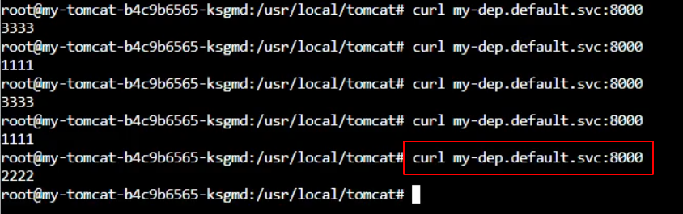

# Kubernetes核心实战

--------

## 资源创建方式

+   命令行
+   YAML 

## Namespace

名称空间用来隔离资源

### 命令行方式

```bash
# 创建namespace
kubectl create ns hello
# 删除namespace
kubectl delete ns hello
```

### yaml方式

```bash
vim hello.yml
```

```yaml
apiVersion: v1
kind: Namespace
metadata:
  name: hello   # 命名空间的名字
```

```bash
# 创建namespace
kubectl apply -f hello.yml
# 删除namespace
kubectl delete -f hello.yml
```

## Pod

运行中的一组容器，Pod是kubernetes中应用的最小单位.


### 命令行方式

#### 启动一个pod

```bash
# 启动一个pod,指定pod名为mynginx,里面的镜像为nginx,默认是在default命名空间
# 这里学习用,更多的是使用deployment进行部署,后面会说到
kubectl run mynginx --image=nginx
```

#### 查看Pod

```bash
kubectl get pod 
kubectl get pod -n default  # 上一句和这一句是一样的,因为不写命名空间这默认命名空间是default
```

```bash
# 查看pod的变化过程
kubectl get pod -w
```

查看更详细的pod的信息

```bash
# k8s会给每个Pod会分配一个ip
kubectl get pod -owide

# 使用 pod的ip + pod里面运行容器的端口
curl 192.168.169.136

# 集群中的任意一个机器以及任意的应用都能通过Pod分配的ip来访问这个Pod
# 为什么是192.168.x.x网段,是因为我们初始化的时候设置的
```


#### 查看pod创建的详细过程

```bash
kubectl describe pod 你自己的Pod名字
```

就是看详细过程,打开后我们拉到最低下主要看`Enents`


#### 删除pod

```bash
kubectl delete pod Pod名字
```

#### 查看Pod的运行日志

```bash
kubectl logs Pod名字
```

#### 查看pod的标签

```bash
kubectl get pod --show-labels
```

#### 进入pod

```bash
kubectl exec -it pod名称 -- /bin/bash
```

也可以通过图形化界面


### yaml方式

+ 一个pod一个容器

```yaml
apiVersion: v1
kind: Pod
metadata:
  labels:
    run: mynginx
  name: mynginx
#  namespace: default
spec:
  containers:
  - image: nginx
    name: mynginx
```

+ 一个pod多个容器

```yaml
apiVersion: v1
kind: Pod
metadata:
  labels:
    run: myapp
  name: myapp
spec:
  containers:   # pod内容器内容
  - image: nginx
    name: nginx
  - image: tomcat:8.5.68
    name: tomcat
```

对于pod内的多个容器,k8s会分配不同的ip,宿主机访问pod可以通过这个内网ip进行访问(比如:curl 192.168.36.68:8080)

对于pod内部的容器相互访问,只需要使用127.0.0.1进行访问就行(比如:curl 127.0.0.1:8080)


如果一个pod内启动两个端口相同的容器,会启动失败


+ 使用yaml文件

```bash
# 创建
kubectl apply -f xxx.yml
# 删除pod
kubectl delete -f xxx.yml
```

此时的应用还不能外部访问

## Deployment

### 基础命令

控制Pod，使Pod拥有多副本，自愈，扩缩容等能力

#### 部署应用

```bash
kubectl create deployment mytomcat --image=tomcat:8.5.68
```

和我们直接创建pod(`kubectl run mynginx --image=tomcat:8.5.68`)是不一样的,用deployment进行部署会拥有治愈能力


#### 查看所有deployment

```bash
kubectl get deploy    # deployment单词不用写全
```

#### 删除deployment

```bash
kubectl delete deploy Deployment名字
```

#### 修改yaml文件

```bash
kubectl edit deployment Deployment名字
```

### 多副本

```bash
kubectl create deployment my-dep --image=nginx --replicas=3
```

```yaml
apiVersion: apps/v1
kind: Deployment
metadata:
  labels:
    app: my-dep
  name: my-dep
spec:
  replicas: 3
  selector:
    matchLabels:
      app: my-dep
  template:
    metadata:
      labels:
        app: my-dep
    spec:
      containers:
      - image: nginx
        name: nginx
```

### 扩缩容

命令行

```bash
kubectl scale --replicas=5 deployment/my-dep
```

修改yaml文件

```bash
# 在打开的文件中修改replicas
kubectl edit deployment my-dep
```

使用图形界面


这里是手动操作,k8s是可以动态扩缩容的

### 自愈&故障转移

+ 停机
+ 删除Pod
+ 容器崩溃
+ ....


### 滚动更新

```bash
# 查看旧的部署的yaml => 用以查看正在运行的是哪个pod
kubectl get deploy my-dep -oyaml

# 滚动更新 => 其实就是用新的镜像启动一个pod,再将旧的pod杀死,并将流量引到新的pod
# => set image 表明要更新镜像
# => deployment/my-dep nginx=nginx:1.16.1 将my-dep应用中,名为nginx容器的镜像更新为ginx:1.16.1
# => --record 表示记录一下这次版本的更新
kubectl set image deployment/my-dep nginx=nginx:1.16.1 --record

kubectl rollout status deployment/my-dep
````


### 版本回退

```bash
# 查看历史记录
kubectl rollout history deployment/my-dep

#查看某个历史详情
kubectl rollout history deployment/my-dep --revision=2

#回滚(回到上次)
kubectl rollout undo deployment/my-dep

#回滚(回到指定版本)
kubectl rollout undo deployment/my-dep --to-revision=2
````

### 更多

除了Deployment，k8s还有 StatefulSet 、DaemonSet 、Job  等 类型资源。我们都称为工作负载。

有状态应用使用 StatefulSet 部署，无状态应用使用 Deployment 部署

https://kubernetes.io/zh/docs/concepts/workloads/controllers/


## Service

将一组 Pods 公开为网络服务的抽象方法。

### 命令行

#### 将pod内容器的端口通过service进行暴露

```bash
kubectl expose deployment my-dep --port=8000 --target-port=80

# 上面命令等价于如下
# => 默认为ClusterIP,表明暴露的IP只能在集群内访问
kubectl expose deployment my-dep --port=8000 --target-port=80 --type=ClusterIP
```


#### 使用标签检索Pod

```bash
kubectl get pod -l app=my-dep
```

#### 查看service

```bash
kubectl get service
```

#### 删除service
```bash
kubectl delete service my-dep
```

### yaml文件

service是一组pods公开为网络服务的抽象方法,而service如何知道自己对应的是哪几个pod,通过的是`标签`

查看pod的标签

```bash
kubectl get pod --show-labels
```


yaml中的选择器(selector)里需要填写对应的标签

```yaml
apiVersion: v1
kind: Service
metadata:
  labels:
    app: my-dep
  name: my-dep
spec:
  selector:   # 要填写该service要暴露的pod的标签
    app: my-dep
  ports:
  - port: 8000
    protocol: TCP
    targetPort: 80
```


### 访问service


#### 方式一: 使用IP地址


#### 方式二: 域名方式

service的NAME.所在命名空间.svc => 比如这里:my-dep.default.svc

!>  使用域名的方式是在容器内部操作,在宿主机上是不行的

这里创建了一个tomcat服务的pod



### ClusterIP

```bash
# 等同于没有--type的
kubectl expose deployment my-dep --port=8000 --target-port=80 --type=ClusterIP
```

```yaml
apiVersion: v1
kind: Service
metadata:
  labels:
    app: my-dep
  name: my-dep
spec:
  ports:
  - port: 8000
    protocol: TCP
    targetPort: 80
  selector:
    app: my-dep
  type: ClusterIP
```

### NodePort

```bash
kubectl expose deployment my-dep --port=8000 --target-port=80 --type=NodePort
```

```yaml
apiVersion: v1
kind: Service
metadata:
  labels:
    app: my-dep
  name: my-dep
spec:
  ports:
  - port: 8000
    protocol: TCP
    targetPort: 80
  selector:
    app: my-dep
  type: NodePort
```

NodePort范围在 30000-32767 之间
