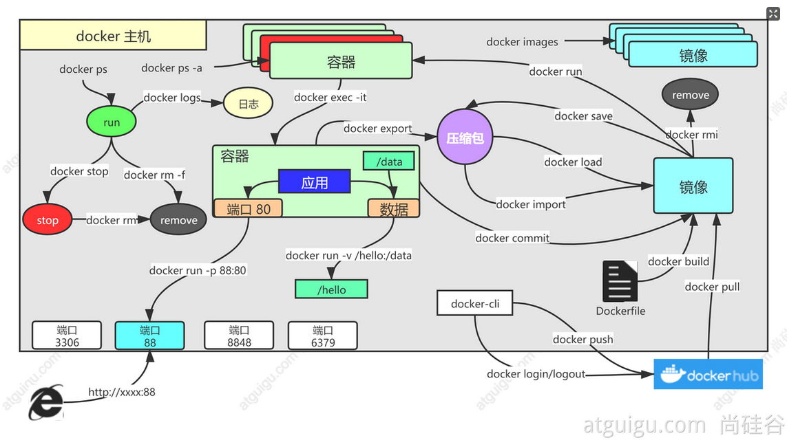

#	Docker命令实战

----



#	基础实战

##  找镜像

去docker hub，找到nginx镜像

```bash
docker pull nginx  #下载最新版

镜像名:版本名（标签）

docker pull nginx:1.20.1


docker pull redis  #下载最新
docker pull redis:6.2.4

## 下载来的镜像都在本地
docker images  #查看所有镜像

redis = redis:latest

docker rmi 镜像名:版本号/镜像id
```


##  启动容器

启动nginx应用容器，并映射88端口，测试的访问

```bash
docker run [OPTIONS] IMAGE [COMMAND] [ARG...]

【docker run  设置项   镜像名  】 镜像启动运行的命令（镜像里面默认有的，一般不会写）

# -d：后台运行
# --restart=always: 开机自启
docker run --name=mynginx   -d  --restart=always -p  88:80   nginx

# 查看正在运行的容器
docker ps
# 查看所有
docker ps -a
# 删除停止的容器
docker rm  容器id/名字
docker rm -f mynginx   #强制删除正在运行中的

#停止容器
docker stop 容器id/名字
#再次启动
docker start 容器id/名字

#应用开机自启
docker update 容器id/名字 --restart=always
```


##  修改容器内容

修改默认的index.html 页面

### 进容器内部修改

```bash
# 进入容器内部的系统，修改容器内容
docker exec -it 容器id  /bin/bash
```

### 挂载数据到外部修改

```bash
docker run --name=mynginx   \
-d  --restart=always \
-p  88:80 -v /data/html:/usr/share/nginx/html:ro  \
nginx

# 修改页面只需要去 主机的 /data/html
```

##  提交改变

将自己修改好的镜像提交

```bash
docker commit [OPTIONS] CONTAINER [REPOSITORY[:TAG]]

docker commit -a "leifengyang"  -m "首页变化" 341d81f7504f guignginx:v1.0
```

### 镜像传输

```bash
# 将镜像保存成压缩包
docker save -o abc.tar guignginx:v1.0

# 别的机器加载这个镜像
docker load -i abc.tar

# 离线安装
```

##  推送远程仓库

推送镜像到docker hub；应用市场

```bash
docker tag local-image:tagname new-repo:tagname
docker push new-repo:tagname
# 把旧镜像的名字，改成仓库要求的新版名字
docker tag guignginx:v1.0 leifengyang/guignginx:v1.0

# 登录到docker hub
docker login       


docker logout（推送完成镜像后退出）

# 推送
docker push leifengyang/guignginx:v1.0


# 别的机器下载
docker pull leifengyang/guignginx:v1.0
```

##  补充

```bash
docker logs 容器名/id   排错

docker exec -it 容器id /bin/bash


# docker 经常修改nginx配置文件
docker run -d -p 80:80 \
-v /data/html:/usr/share/nginx/html:ro \
-v /data/conf/nginx.conf:/etc/nginx/nginx.conf \
--name mynginx-02 \
nginx


#把容器指定位置的东西复制出来 
docker cp 5eff66eec7e1:/etc/nginx/nginx.conf  /data/conf/nginx.conf
#把外面的内容复制到容器里面
docker cp  /data/conf/nginx.conf  5eff66eec7e1:/etc/nginx/nginx.conf
```

#   进阶实战

##  编写自己的应用

编写一个HelloWorld应用

https://start.spring.io/

示例代码：  https://gitee.com/leifengyang/java-demo.git


##  将应用打包成镜像

编写Dockerfile将自己的应用打包镜像

### 以前

Java为例
+ SpringBoot打包成可执行jar
+ 把jar包上传给服务
+ 服务器运行java -jar

### 现在

所有机器都安装Docker，任何应用都是镜像，所有机器都可以运行

### 怎么打包(使用Dockerfile)

```bash
FROM openjdk:8-jdk-slim
LABEL maintainer=leifengyang

COPY target/*.jar   /app.jar

ENTRYPOINT ["java","-jar","/app.jar"]

docker build -t java-demo:v1.0 .
```

思考：
每个应用每次打包，都需要本地编译、再上传服务器、再进行docker构建，如果有1000个应用要打包镜像怎么办？有没有更好的方式？

##  启动容器
启动应用容器

```bash
docker run -d -p 8080:8080 --name myjava-app java-demo:v1.0
```

分享镜像

```bash
# 登录docker hub
docker login

#给旧镜像起名
docker tag java-demo:v1.0  leifengyang/java-demo:v1.0

# 推送到docker hub
docker push leifengyang/java-demo:v1.0

# 别的机器
docker pull leifengyang/java-demo:v1.0

# 别的机器运行
docker run -d -p 8080:8080 --name myjava-app java-demo:v1.0
```

##  部署中间件

部署一个Redis+应用，尝试应用操作Redis产生数据

```bash
docker run [OPTIONS] IMAGE [COMMAND] [ARG...]

#redis使用自定义配置文件启动

docker run -v /data/redis/redis.conf:/etc/redis/redis.conf \
-v /data/redis/data:/data \
-d --name myredis \
-p 6379:6379 \
redis:latest  redis-server /etc/redis/redis.conf
```
