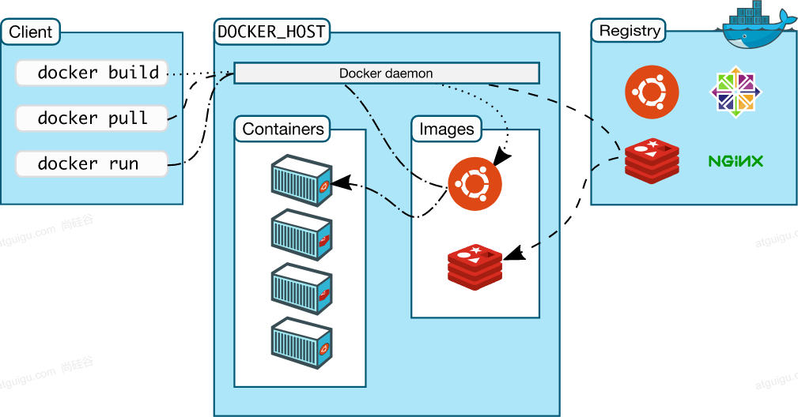

# Docker基本概念

----

# 解决的问题

## 统一标准
+ 应用构建
  - Java、C++、JavaScript
  - 打成软件包
  - .exe
  - docker build ....   镜像
+ 应用分享
  - 所有软件的镜像放到一个指定地方  docker hub
  - 安卓，应用市场
+ 应用运行
  - 统一标准的 镜像
  - docker run
+ .......

容器化

## 资源隔离

+ cpu、memory资源隔离与限制
+ 访问设备隔离与限制
+ 网络隔离与限制
+ 用户、用户组隔离限制
+ ......

# 架构

+ Docker_Host：
  - 安装Docker的主机
+ Docker Daemon：
  - 运行在Docker主机上的Docker后台进程
+ Client：
  - 操作Docker主机的客户端（命令行、UI等）
+ Registry：
  - 镜像仓库
  - Docker Hub
+ Images：
  - 镜像，带环境打包好的程序，可以直接启动运行
+ Containers：
  - 容器，由镜像启动起来正在运行中的程序

交互逻辑

装好Docker，然后去 软件市场 寻找镜像，下载并运行，查看容器状态日志等排错