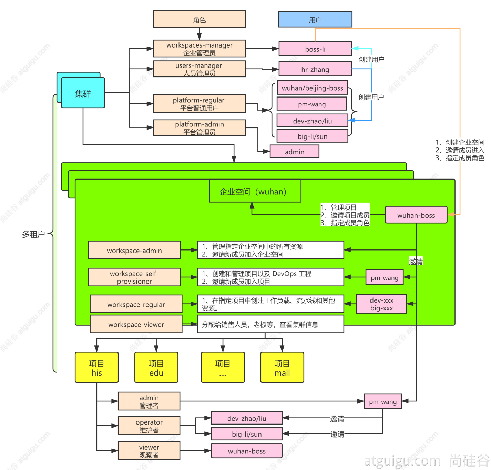

#   Kubesphere多租户系统实战

----

+   platform-admin:平台管理员,拥有最高权限
+   user-manager:人员管理员,给HR用,只有创建其他用户的权限
+   workspaces-manager:企业管理员,给大老板用,这个角色可以做到为不同的子公司分配不同的企业空间,即可以创建企业空间,不能创建其他用户
+   platform-regular:平台普通用户

现在有子公司A,子公司B,子公司A的负责人是甲,子公司B的负责人是乙

1.  甲和乙首先由hr创建为平台普通用户
2.  大老板用户进入企业空间A,邀请甲,成为企业空间A的管理员(workspace-admin);进入企业空间B,邀请乙,成为企业空间B的管理员(workspace-admin)
3.  甲可以邀请其他人,并分配不同的角色
4.  其他人的角色对应的权限看上图

有状态多使用单节点读写
无状态多使用多节点读写

