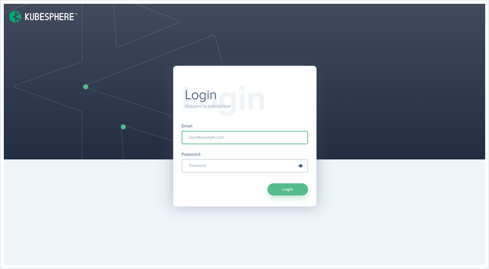

#	KubeSphere安装

----

# 环境准备

[已有Kubernetes环境](/2021/20211213-Kubernetes基础概念与安装?id=kubeadm创建集群)

[安装nfs](/2021/20211130-Kubernetes核心实战?id=环境准备)

##  配置默认存储(动态供应)

!>  要修改文件中的NFS_SERVER,NFS_PATH和volumes

```
# 在底下文件中找到这几个进行修改

    - name: NFS_SERVER
      value: 172.31.0.4 ## 指定自己nfs服务器地址
    - name: NFS_PATH
      value: /nfs/data  ## nfs服务器共享的目录

volumes:
  nfs:
    server: 172.31.0.4
    path: /nfs/data
```

```yaml
## 创建了一个存储类
apiVersion: storage.k8s.io/v1
kind: StorageClass
metadata:
  name: nfs-storage
  annotations:
    storageclass.kubernetes.io/is-default-class: "true"
provisioner: k8s-sigs.io/nfs-subdir-external-provisioner
parameters:
  archiveOnDelete: "true"  ## 删除pv的时候，pv的内容是否要备份

---
apiVersion: apps/v1
kind: Deployment
metadata:
  name: nfs-client-provisioner
  labels:
    app: nfs-client-provisioner
  # replace with namespace where provisioner is deployed
  namespace: default
spec:
  replicas: 1
  strategy:
    type: Recreate
  selector:
    matchLabels:
      app: nfs-client-provisioner
  template:
    metadata:
      labels:
        app: nfs-client-provisioner
    spec:
      serviceAccountName: nfs-client-provisioner
      containers:
        - name: nfs-client-provisioner
          image: registry.cn-hangzhou.aliyuncs.com/lfy_k8s_images/nfs-subdir-external-provisioner:v4.0.2
          # resources:
          #    limits:
          #      cpu: 10m
          #    requests:
          #      cpu: 10m
          volumeMounts:
            - name: nfs-client-root
              mountPath: /persistentvolumes
          env:
            - name: PROVISIONER_NAME
              value: k8s-sigs.io/nfs-subdir-external-provisioner
            - name: NFS_SERVER
              value: 172.31.0.4 ## 指定自己nfs服务器地址
            - name: NFS_PATH
              value: /nfs/data  ## nfs服务器共享的目录
      volumes:
        - name: nfs-client-root
          nfs:
            server: 172.31.0.4
            path: /nfs/data
---
apiVersion: v1
kind: ServiceAccount
metadata:
  name: nfs-client-provisioner
  # replace with namespace where provisioner is deployed
  namespace: default
---
kind: ClusterRole
apiVersion: rbac.authorization.k8s.io/v1
metadata:
  name: nfs-client-provisioner-runner
rules:
  - apiGroups: [""]
    resources: ["nodes"]
    verbs: ["get", "list", "watch"]
  - apiGroups: [""]
    resources: ["persistentvolumes"]
    verbs: ["get", "list", "watch", "create", "delete"]
  - apiGroups: [""]
    resources: ["persistentvolumeclaims"]
    verbs: ["get", "list", "watch", "update"]
  - apiGroups: ["storage.k8s.io"]
    resources: ["storageclasses"]
    verbs: ["get", "list", "watch"]
  - apiGroups: [""]
    resources: ["events"]
    verbs: ["create", "update", "patch"]
---
kind: ClusterRoleBinding
apiVersion: rbac.authorization.k8s.io/v1
metadata:
  name: run-nfs-client-provisioner
subjects:
  - kind: ServiceAccount
    name: nfs-client-provisioner
    # replace with namespace where provisioner is deployed
    namespace: default
roleRef:
  kind: ClusterRole
  name: nfs-client-provisioner-runner
  apiGroup: rbac.authorization.k8s.io
---
kind: Role
apiVersion: rbac.authorization.k8s.io/v1
metadata:
  name: leader-locking-nfs-client-provisioner
  # replace with namespace where provisioner is deployed
  namespace: default
rules:
  - apiGroups: [""]
    resources: ["endpoints"]
    verbs: ["get", "list", "watch", "create", "update", "patch"]
---
kind: RoleBinding
apiVersion: rbac.authorization.k8s.io/v1
metadata:
  name: leader-locking-nfs-client-provisioner
  # replace with namespace where provisioner is deployed
  namespace: default
subjects:
  - kind: ServiceAccount
    name: nfs-client-provisioner
    # replace with namespace where provisioner is deployed
    namespace: default
roleRef:
  kind: Role
  name: leader-locking-nfs-client-provisioner
  apiGroup: rbac.authorization.k8s.io
```

```bash
#确认配置是否生效
kubectl get sc
```

##  指定默认存储

!>  有时候会配置多个存储盘,但是默认存储只能有一个

+ [改变默认 StorageClass文档](https://kubernetes.io/zh/docs/tasks/administer-cluster/change-default-storage-class/)

###   列出你的集群中的 StorageClasses

```bash
kubectl get storageclass
```

输出类似这样

```bash
NAME                 PROVISIONER               AGE
standard (default)   kubernetes.io/gce-pd      1d
gold                 kubernetes.io/gce-pd      1d
```

默认 StorageClass 以 (default) 标记。

### 标记默认 StorageClass 非默认

默认 StorageClass 的注解 storageclass.kubernetes.io/is-default-class 设置为 true。 注解的其它任意值或者缺省值将被解释为 false。

要标记一个 StorageClass 为非默认的，你需要改变它的值为 false

```bash
# 这里的 standard 是你选择的 StorageClass 的名字

kubectl patch storageclass standard -p '{"metadata": {"annotations":{"storageclass.kubernetes.io/is-default-class":"false"}}}'
```

### 标记一个 StorageClass 为默认的

和前面的步骤类似，你需要添加/设置注解 storageclass.kubernetes.io/is-default-class=true。

```bash
kubectl patch storageclass <your-class-name> -p '{"metadata": {"annotations":{"storageclass.kubernetes.io/is-default-class":"true"}}}'
```

请注意，最多只能有一个 StorageClass 能够被标记为默认。 如果它们中有两个或多个被标记为默认，Kubernetes 将忽略这个注解， 也就是它将表现为没有默认 StorageClass。

### 验证你选用的 StorageClass 为默认的

```bash
kubectl get storageclass
```

输出类似这样：

```bash
NAME             PROVISIONER               AGE
standard         kubernetes.io/gce-pd      1d
gold (default)   kubernetes.io/gce-pd      1d
```

##  安装2.1.1版

### 前提条件

看这个官方文档 https://v2-1.docs.kubesphere.io/docs/zh-CN/installation/prerequisites/

+   Kubernetes 版本： 1.15.x ≤ K8s version ≤ 1.17.x；
+   Helm版本： 2.10.0 ≤ Helm Version ＜ 3.0.0，建议使用 Helm 2.16.2（不支持 helm 2.16.0 #6894），且已安装了 Tiller，参考 如何安装与配置 Helm （预计 3.0 支持 Helm v3）；
+   集群已有默认的存储类型（StorageClass），若还没有准备存储请参考 安装 OpenEBS 创建 LocalPV 存储类型 用作开发测试环境。
+   集群能够访问外网，若无外网请参考 在 Kubernetes 离线安装 KubeSphere。

这里需要注意的是Helm安装

下载地址 https://get.helm.sh/helm-v2.16.2-linux-amd64.tar.gz

```bash
$ mv helm /usr/local/bin/

$ helm version
Client: &version.Version{SemVer:"v2.16.9", GitCommit:"8ad7037828e5a0fca1009dabe290130da6368e39", GitTreeState:"clean"}
Error: could not find a ready tiller pod
# 暂时不用关注这个 Error

----

# 安装Tiller
$ kubectl create serviceaccount --namespace kube-system tiller
$ kubectl create clusterrolebinding tiller-cluster-rule --clusterrole=cluster-admin --serviceaccount=kube-system:tiller
$ kubectl patch deploy --namespace kube-system tiller-deploy -p '{"spec":{"template":{"spec":{"serviceAccount":"tiller"}}}}'
$ helm_version=$(helm version --client | grep "Client" | cut -d '"' -f2)
$ helm init --upgrade --service-account tiller -i registry.cn-hangzhou.aliyuncs.com/google_containers/tiller:${helm_version} --stable-repo-url https://kubernetes.oss-cn-hangzhou.aliyuncs.com/charts

# 验证 Tiller

$ kubectl get pods --namespace kube-system | grep tiller
tiller-deploy-6c45f9966d-vcmlk     1/1     Running   0          8s

# 删除 Tiller
$ kubectl delete deployment tiller-deploy --namespace kube-system
```

### 安装

文档地址 [在 Kubernetes 安装 KubeSphere](https://v2-1.docs.kubesphere.io/docs/zh-CN/installation/install-on-k8s/)

```bash
kubectl apply -f https://raw.githubusercontent.com/kubesphere/ks-installer/v2.1.1/kubesphere-minimal.yaml

# 说明：安装过程中若遇到问题，也可以通过以下日志命令来排查问题。
kubectl logs -n kubesphere-system $(kubectl get pod -n kubesphere-system -l app=ks-install -o jsonpath='{.items[0].metadata.name}') -f
```

+   通过 kubectl get pod --all-namespaces 查看 KubeSphere 相关 namespace 下所有 Pod 状态是否为 Running。
+   确认 Pod 都正常运行后，可使用 IP:30880 访问 KubeSphere UI 界面，改IP通过 `kubectl edit svc xxxx`
+   默认的集群管理员账号为 admin/P@88w0rd。




##  安装3.1.1版

文档地址 [在 Kubernetes 上最小化安装 KubeSphere](https://kubesphere.com.cn/docs/quick-start/minimal-kubesphere-on-k8s/)

### 前提条件

+   如需在 Kubernetes 上安装 KubeSphere v3.1.1，您的 Kubernetes 版本必须为：v1.17.x，v1.18.x，v1.19.x 或 v1.20.x。
+   可用 CPU > 1 核；内存 > 2 G。
+   Kubernetes 集群已配置默认 StorageClass（请使用 kubectl get sc 进行确认）。
+   使用 --cluster-signing-cert-file 和 --cluster-signing-key-file 参数启动集群时，kube-apiserver 将启用 CSR 签名功能。请参见 RKE 安装问题。

### 安装

确保您的机器满足安装的前提条件之后，可以按照以下步骤安装 KubeSphere。

执行以下命令开始安装：

```bash
# 两个文件我放一份在文档后面

kubectl apply -f https://github.com/kubesphere/ks-installer/releases/download/v3.1.1/kubesphere-installer.yaml

# 要改文件
# endpointIps改成master的ip => endpointIps: 172.31.0.4
kubectl apply -f https://github.com/kubesphere/ks-installer/releases/download/v3.1.1/cluster-configuration.yaml
```

检查安装日志

```bash
kubectl logs -n kubesphere-system $(kubectl get pod -n kubesphere-system -l app=ks-install -o jsonpath='{.items[0].metadata.name}') -f
```

使用 kubectl get pod --all-namespaces 查看所有 Pod 是否在 KubeSphere 的相关命名空间中正常运行。如果是，请通过以下命令检查控制台的端口（默认为 30880）：

```bash
kubectl get svc/ks-console -n kubesphere-system
```

确保在安全组中打开了端口 30880，并通过 NodePort (IP:30880) 使用默认帐户和密码 (admin/P@88w0rd) 访问 Web 控制台。

登录控制台后，您可以在系统组件中检查不同组件的状态。如果要使用相关服务，可能需要等待某些组件启动并运行。

+   访问任意机器的 30880端口
+   账号 ： admin
+   密码 ： P@88w0rd

解决etcd监控证书找不到问题


```bash
kubectl -n kubesphere-monitoring-system create secret generic kube-etcd-client-certs  --from-file=etcd-client-ca.crt=/etc/kubernetes/pki/etcd/ca.crt  --from-file=etcd-client.crt=/etc/kubernetes/pki/apiserver-etcd-client.crt  --from-file=etcd-client.key=/etc/kubernetes/pki/apiserver-etcd-client.key
```

kubesphere-installer.yaml文件

```yaml
---
apiVersion: apiextensions.k8s.io/v1beta1
kind: CustomResourceDefinition
metadata:
  name: clusterconfigurations.installer.kubesphere.io
spec:
  group: installer.kubesphere.io
  versions:
  - name: v1alpha1
    served: true
    storage: true
  scope: Namespaced
  names:
    plural: clusterconfigurations
    singular: clusterconfiguration
    kind: ClusterConfiguration
    shortNames:
    - cc

---
apiVersion: v1
kind: Namespace
metadata:
  name: kubesphere-system

---
apiVersion: v1
kind: ServiceAccount
metadata:
  name: ks-installer
  namespace: kubesphere-system

---
apiVersion: rbac.authorization.k8s.io/v1
kind: ClusterRole
metadata:
  name: ks-installer
rules:
- apiGroups:
  - ""
  resources:
  - '*'
  verbs:
  - '*'
- apiGroups:
  - apps
  resources:
  - '*'
  verbs:
  - '*'
- apiGroups:
  - extensions
  resources:
  - '*'
  verbs:
  - '*'
- apiGroups:
  - batch
  resources:
  - '*'
  verbs:
  - '*'
- apiGroups:
  - rbac.authorization.k8s.io
  resources:
  - '*'
  verbs:
  - '*'
- apiGroups:
  - apiregistration.k8s.io
  resources:
  - '*'
  verbs:
  - '*'
- apiGroups:
  - apiextensions.k8s.io
  resources:
  - '*'
  verbs:
  - '*'
- apiGroups:
  - tenant.kubesphere.io
  resources:
  - '*'
  verbs:
  - '*'
- apiGroups:
  - certificates.k8s.io
  resources:
  - '*'
  verbs:
  - '*'
- apiGroups:
  - devops.kubesphere.io
  resources:
  - '*'
  verbs:
  - '*'
- apiGroups:
  - monitoring.coreos.com
  resources:
  - '*'
  verbs:
  - '*'
- apiGroups:
  - logging.kubesphere.io
  resources:
  - '*'
  verbs:
  - '*'
- apiGroups:
  - jaegertracing.io
  resources:
  - '*'
  verbs:
  - '*'
- apiGroups:
  - storage.k8s.io
  resources:
  - '*'
  verbs:
  - '*'
- apiGroups:
  - admissionregistration.k8s.io
  resources:
  - '*'
  verbs:
  - '*'
- apiGroups:
  - policy
  resources:
  - '*'
  verbs:
  - '*'
- apiGroups:
  - autoscaling
  resources:
  - '*'
  verbs:
  - '*'
- apiGroups:
  - networking.istio.io
  resources:
  - '*'
  verbs:
  - '*'
- apiGroups:
  - config.istio.io
  resources:
  - '*'
  verbs:
  - '*'
- apiGroups:
  - iam.kubesphere.io
  resources:
  - '*'
  verbs:
  - '*'
- apiGroups:
  - notification.kubesphere.io
  resources:
  - '*'
  verbs:
  - '*'
- apiGroups:
  - auditing.kubesphere.io
  resources:
  - '*'
  verbs:
  - '*'
- apiGroups:
  - events.kubesphere.io
  resources:
  - '*'
  verbs:
  - '*'
- apiGroups:
  - core.kubefed.io
  resources:
  - '*'
  verbs:
  - '*'
- apiGroups:
  - installer.kubesphere.io
  resources:
  - '*'
  verbs:
  - '*'
- apiGroups:
  - storage.kubesphere.io
  resources:
  - '*'
  verbs:
  - '*'
- apiGroups:
  - security.istio.io
  resources:
  - '*'
  verbs:
  - '*'
- apiGroups:
  - monitoring.kiali.io
  resources:
  - '*'
  verbs:
  - '*'
- apiGroups:
  - kiali.io
  resources:
  - '*'
  verbs:
  - '*'
- apiGroups:
  - networking.k8s.io
  resources:
  - '*'
  verbs:
  - '*'
- apiGroups:
  - kubeedge.kubesphere.io
  resources:
  - '*'
  verbs:
  - '*'
- apiGroups:
  - types.kubefed.io
  resources:
  - '*'
  verbs:
  - '*'

---
kind: ClusterRoleBinding
apiVersion: rbac.authorization.k8s.io/v1
metadata:
  name: ks-installer
subjects:
- kind: ServiceAccount
  name: ks-installer
  namespace: kubesphere-system
roleRef:
  kind: ClusterRole
  name: ks-installer
  apiGroup: rbac.authorization.k8s.io

---
apiVersion: apps/v1
kind: Deployment
metadata:
  name: ks-installer
  namespace: kubesphere-system
  labels:
    app: ks-install
spec:
  replicas: 1
  selector:
    matchLabels:
      app: ks-install
  template:
    metadata:
      labels:
        app: ks-install
    spec:
      serviceAccountName: ks-installer
      containers:
      - name: installer
        image: kubesphere/ks-installer:v3.1.1
        imagePullPolicy: "Always"
        resources:
          limits:
            cpu: "1"
            memory: 1Gi
          requests:
            cpu: 20m
            memory: 100Mi
        volumeMounts:
        - mountPath: /etc/localtime
          name: host-time
      volumes:
      - hostPath:
          path: /etc/localtime
          type: ""
        name: host-time
```

cluster-configuration.yaml文件

```yaml
---
apiVersion: installer.kubesphere.io/v1alpha1
kind: ClusterConfiguration
metadata:
  name: ks-installer
  namespace: kubesphere-system
  labels:
    version: v3.1.1
spec:
  persistence:
    storageClass: ""        # If there is no default StorageClass in your cluster, you need to specify an existing StorageClass here.
  authentication:
    jwtSecret: ""           # Keep the jwtSecret consistent with the Host Cluster. Retrieve the jwtSecret by executing "kubectl -n kubesphere-system get cm kubesphere-config -o yaml | grep -v "apiVersion" | grep jwtSecret" on the Host Cluster.
  local_registry: ""        # Add your private registry address if it is needed.
  etcd:
    monitoring: false       # Enable or disable etcd monitoring dashboard installation. You have to create a Secret for etcd before you enable it.
    endpointIps: 192.168.0.204  # etcd cluster EndpointIps. It can be a bunch of IPs here.
    port: 2379              # etcd port.
    tlsEnable: true
  common:
    redis:
      enabled: false
    openldap:
      enabled: false
    minioVolumeSize: 20Gi # Minio PVC size.
    openldapVolumeSize: 2Gi   # openldap PVC size.
    redisVolumSize: 2Gi # Redis PVC size.
    monitoring:
      # type: external   # Whether to specify the external prometheus stack, and need to modify the endpoint at the next line.
      endpoint: http://prometheus-operated.kubesphere-monitoring-system.svc:9090 # Prometheus endpoint to get metrics data.
    es:   # Storage backend for logging, events and auditing.
      # elasticsearchMasterReplicas: 1   # The total number of master nodes. Even numbers are not allowed.
      # elasticsearchDataReplicas: 1     # The total number of data nodes.
      elasticsearchMasterVolumeSize: 4Gi   # The volume size of Elasticsearch master nodes.
      elasticsearchDataVolumeSize: 20Gi    # The volume size of Elasticsearch data nodes.
      logMaxAge: 7                     # Log retention time in built-in Elasticsearch. It is 7 days by default.
      elkPrefix: logstash              # The string making up index names. The index name will be formatted as ks-<elk_prefix>-log.
      basicAuth:
        enabled: false
        username: ""
        password: ""
      externalElasticsearchUrl: ""
      externalElasticsearchPort: ""
  console:
    enableMultiLogin: true  # Enable or disable simultaneous logins. It allows different users to log in with the same account at the same time.
    port: 30880
  alerting:                # (CPU: 0.1 Core, Memory: 100 MiB) It enables users to customize alerting policies to send messages to receivers in time with different time intervals and alerting levels to choose from.
    enabled: false         # Enable or disable the KubeSphere Alerting System.
    # thanosruler:
    #   replicas: 1
    #   resources: {}
  auditing:                # Provide a security-relevant chronological set of records，recording the sequence of activities happening on the platform, initiated by different tenants.
    enabled: false         # Enable or disable the KubeSphere Auditing Log System.
  devops:                  # (CPU: 0.47 Core, Memory: 8.6 G) Provide an out-of-the-box CI/CD system based on Jenkins, and automated workflow tools including Source-to-Image & Binary-to-Image.
    enabled: false             # Enable or disable the KubeSphere DevOps System.
    jenkinsMemoryLim: 2Gi      # Jenkins memory limit.
    jenkinsMemoryReq: 1500Mi   # Jenkins memory request.
    jenkinsVolumeSize: 8Gi     # Jenkins volume size.
    jenkinsJavaOpts_Xms: 512m  # The following three fields are JVM parameters.
    jenkinsJavaOpts_Xmx: 512m
    jenkinsJavaOpts_MaxRAM: 2g
  events:                  # Provide a graphical web console for Kubernetes Events exporting, filtering and alerting in multi-tenant Kubernetes clusters.
    enabled: false         # Enable or disable the KubeSphere Events System.
    ruler:
      enabled: true
      replicas: 2
  logging:                 # (CPU: 57 m, Memory: 2.76 G) Flexible logging functions are provided for log query, collection and management in a unified console. Additional log collectors can be added, such as Elasticsearch, Kafka and Fluentd.
    enabled: false         # Enable or disable the KubeSphere Logging System.
    logsidecar:
      enabled: true
      replicas: 2
  metrics_server:                    # (CPU: 56 m, Memory: 44.35 MiB) It enables HPA (Horizontal Pod Autoscaler).
    enabled: false                   # Enable or disable metrics-server.
  monitoring:
    storageClass: ""                 # If there is an independent StorageClass you need for Prometheus, you can specify it here. The default StorageClass is used by default.
    # prometheusReplicas: 1          # Prometheus replicas are responsible for monitoring different segments of data source and providing high availability.
    prometheusMemoryRequest: 400Mi   # Prometheus request memory.
    prometheusVolumeSize: 20Gi       # Prometheus PVC size.
    # alertmanagerReplicas: 1          # AlertManager Replicas.
  multicluster:
    clusterRole: none  # host | member | none  # You can install a solo cluster, or specify it as the Host or Member Cluster.
  network:
    networkpolicy: # Network policies allow network isolation within the same cluster, which means firewalls can be set up between certain instances (Pods).
      # Make sure that the CNI network plugin used by the cluster supports NetworkPolicy. There are a number of CNI network plugins that support NetworkPolicy, including Calico, Cilium, Kube-router, Romana and Weave Net.
      enabled: false # Enable or disable network policies.
    ippool: # Use Pod IP Pools to manage the Pod network address space. Pods to be created can be assigned IP addresses from a Pod IP Pool.
      type: none # Specify "calico" for this field if Calico is used as your CNI plugin. "none" means that Pod IP Pools are disabled.
    topology: # Use Service Topology to view Service-to-Service communication based on Weave Scope.
      type: none # Specify "weave-scope" for this field to enable Service Topology. "none" means that Service Topology is disabled.
  openpitrix: # An App Store that is accessible to all platform tenants. You can use it to manage apps across their entire lifecycle.
    store:
      enabled: false # Enable or disable the KubeSphere App Store.
  servicemesh:         # (0.3 Core, 300 MiB) Provide fine-grained traffic management, observability and tracing, and visualized traffic topology.
    enabled: false     # Base component (pilot). Enable or disable KubeSphere Service Mesh (Istio-based).
  kubeedge:          # Add edge nodes to your cluster and deploy workloads on edge nodes.
    enabled: false   # Enable or disable KubeEdge.
    cloudCore:
      nodeSelector: {"node-role.kubernetes.io/worker": ""}
      tolerations: []
      cloudhubPort: "10000"
      cloudhubQuicPort: "10001"
      cloudhubHttpsPort: "10002"
      cloudstreamPort: "10003"
      tunnelPort: "10004"
      cloudHub:
        advertiseAddress: # At least a public IP address or an IP address which can be accessed by edge nodes must be provided.
          - ""            # Note that once KubeEdge is enabled, CloudCore will malfunction if the address is not provided.
        nodeLimit: "100"
      service:
        cloudhubNodePort: "30000"
        cloudhubQuicNodePort: "30001"
        cloudhubHttpsNodePort: "30002"
        cloudstreamNodePort: "30003"
        tunnelNodePort: "30004"
    edgeWatcher:
      nodeSelector: {"node-role.kubernetes.io/worker": ""}
      tolerations: []
      edgeWatcherAgent:
        nodeSelector: {"node-role.kubernetes.io/worker": ""}
        tolerations: []

```
