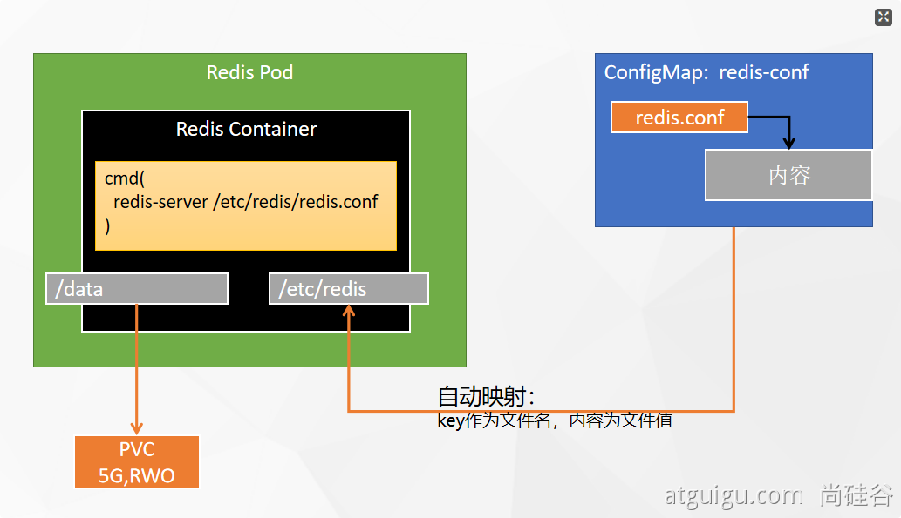

# kubesphere部署redis

----

主要说明有启动命令该怎么处理

## 版本

+   docker 18.09.0
+   kubernetes 1.20.9
+   KubeSphere 版本 : v3.1.1

## 创建redis

```
#创建配置文件
## 1、准备redis配置文件内容
mkdir -p /mydata/redis/conf && vim /mydata/redis/conf/redis.conf


##配置示例
appendonly yes
port 6379
bind 0.0.0.0


#docker启动redis
docker run -d -p 6379:6379 --restart=always \
-v /mydata/redis/conf/redis.conf:/etc/redis/redis.conf \
-v  /mydata/redis-01/data:/data \
 --name redis-01 redis:6.2.5 \
 redis-server /etc/redis/redis.conf
```



