#	使用KubeSphere部署中间件

----

#   部署Mysql

##  创建pvc

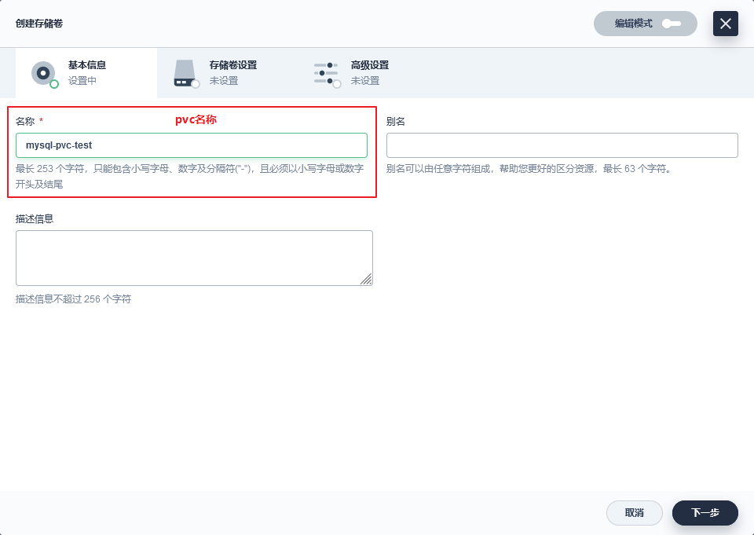

+   有状态多使用单节点读写
+   无状态多使用多节点读写

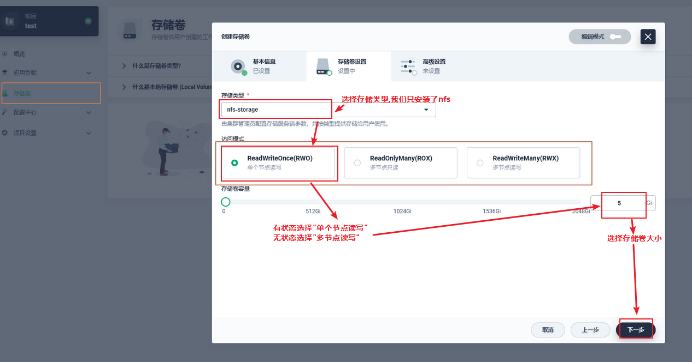

##  创建配置文件

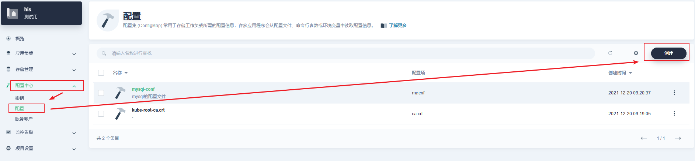

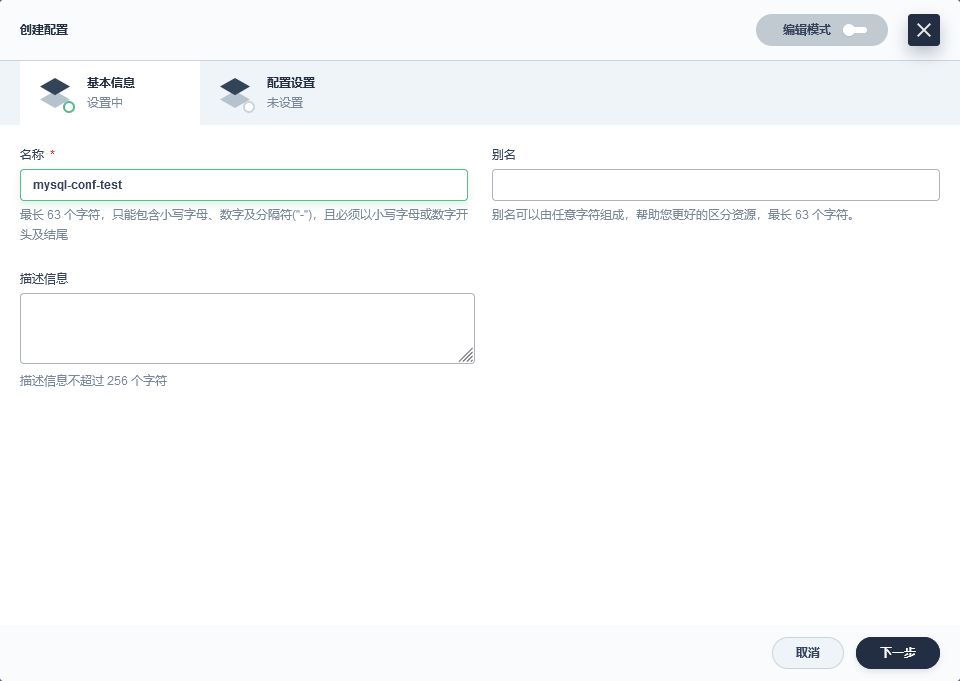

##  创建mysql

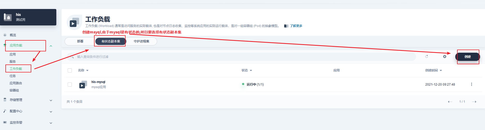

+   配置镜像

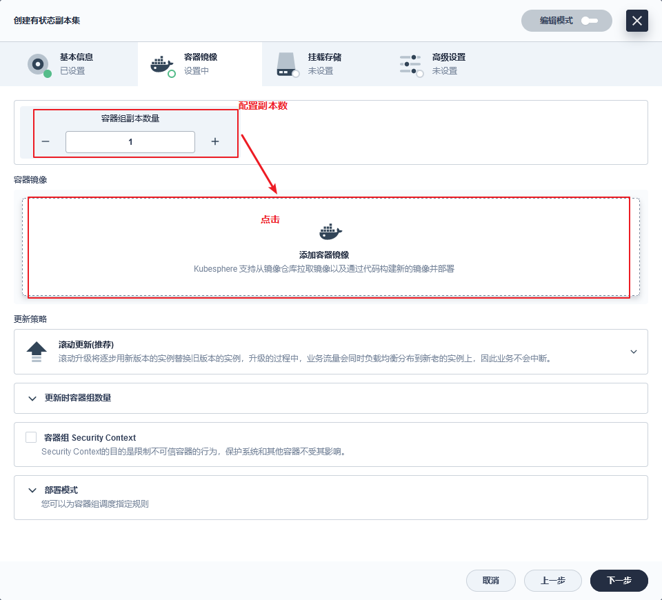

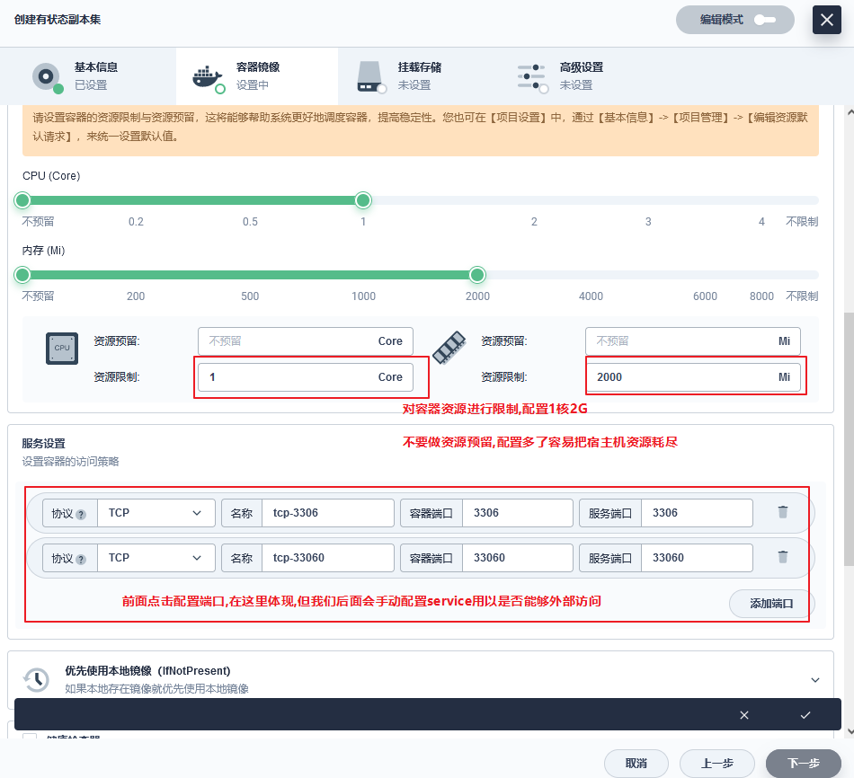

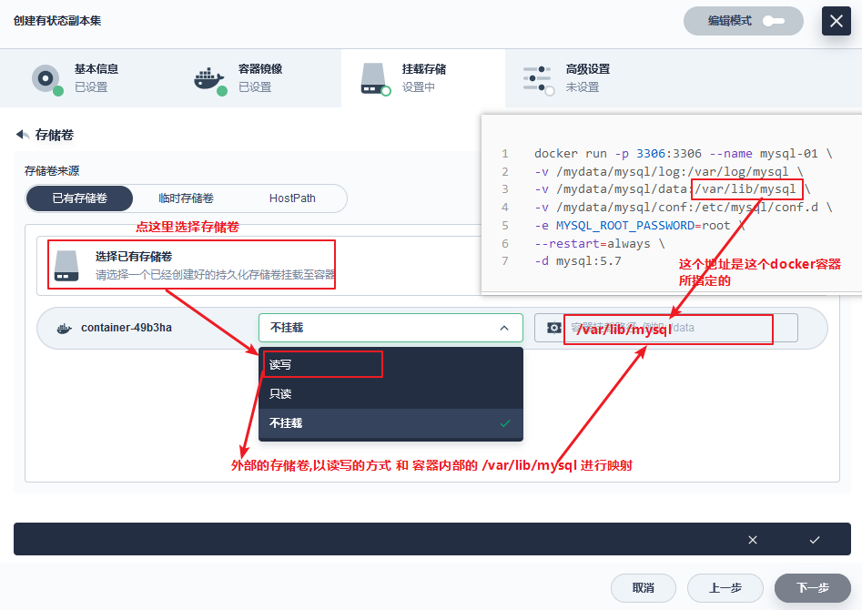

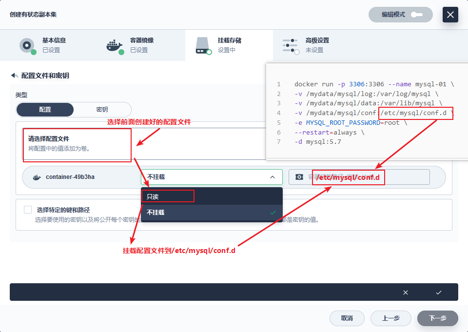

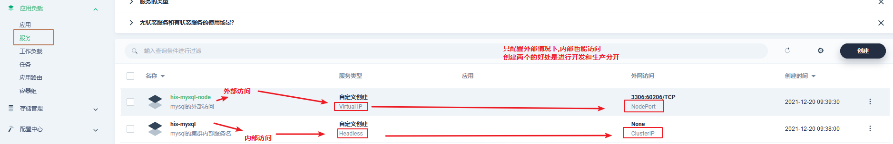

##  配置service

+   targetPort:是continer暴露出来的端口
+   port:是service暴露出来的端口
+   NodePort:是node暴露出来的端

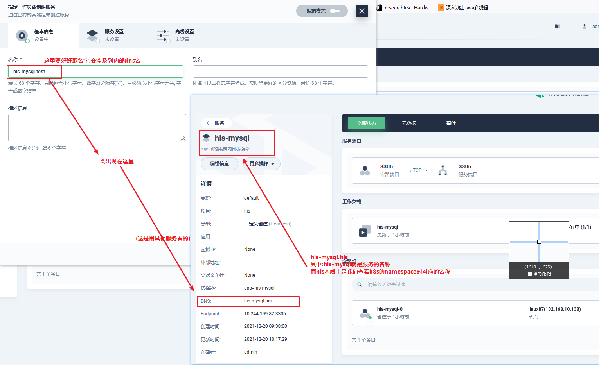

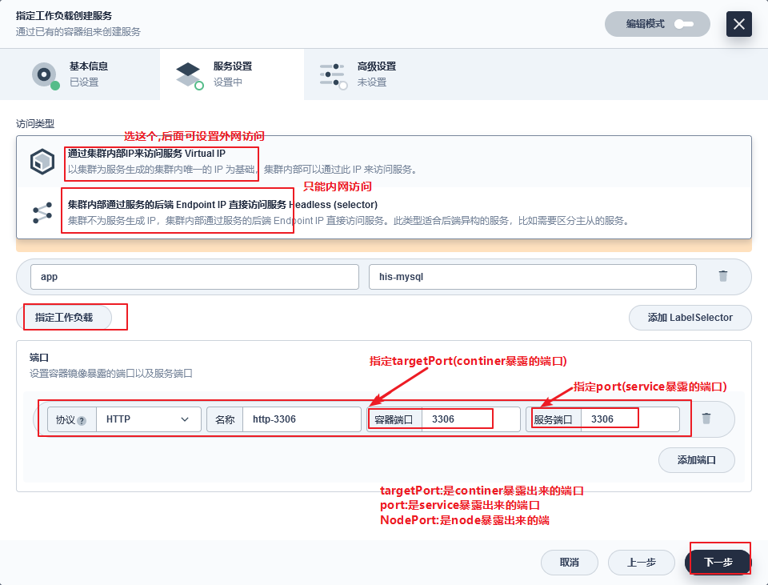

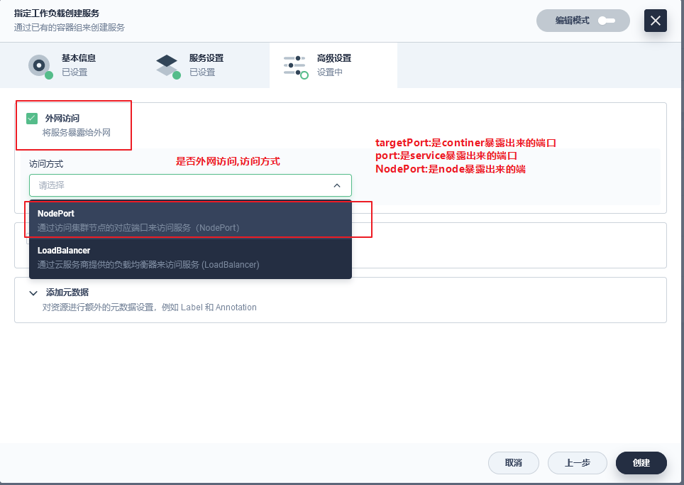

设置完成后可以查看外网的ip

#   部署redis

主要说明有启动命令该怎么处理

##  创建redis

#   部署es

1.  说明配置文件要挂载的目录不为空
2.  说明有多个文件要如何挂载

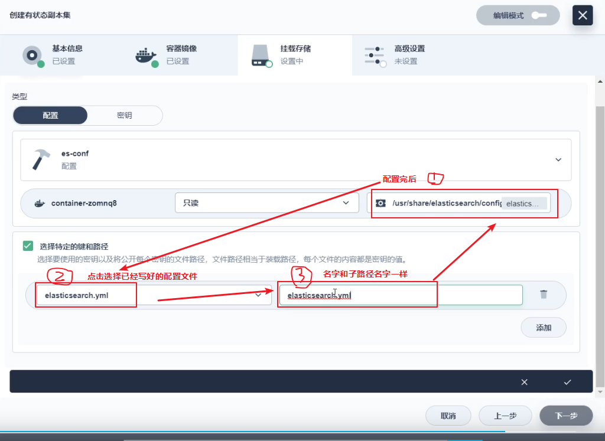

#   使用商店或helm

##  使用Helm

### 添加Helm仓库

### 使用Helm构建应用

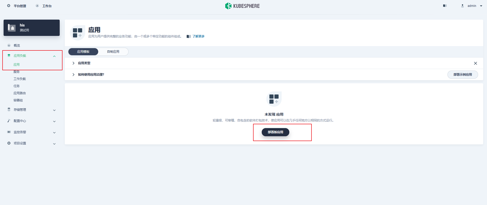

这里主要是helm语法

