# Java日志体系的发展史

---

# 发展史

## System.out和System.err

2001年以前，Java是没有日志库的，打印日志全凭System.out和System.err

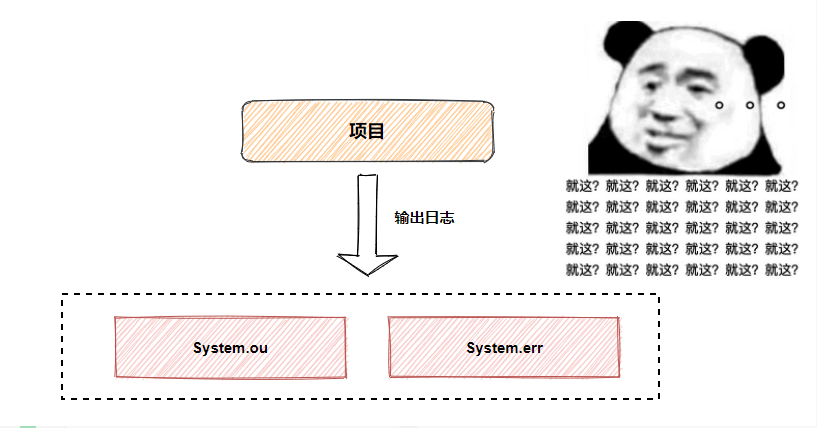

缺点如下：

+   产生大量的IO操作   同时在生产环境中 无法合理的控制是否需要输出
+   输出的内容不能保存到文件
+   只打印在控制台，打印完就过去了，也就是说除非你一直盯着程序跑
+   无法定制化，且日志粒度不够细

## Log4j日志标准库

此时名为Ceki的巨佬站出来，说你这个不好用，我这个好用，接着在2001年掏出了Log4j，用起来也确实比System系列香，Log4j一度成为业内日志标准。

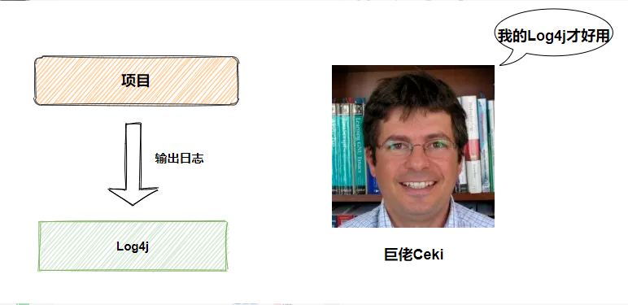

后来Log4j成为Apache项目，Ceki也加入Apache组织（据说Apache还曾经建议Sun引入Log4j到Java的标准库中，但Sun拒绝了）。

## JUL（Java Util Logging）日志标准库

原来Sun也有自己的盘算，不就一个日志嘛，我自己也搞一个，2002年2月JDK1.4发布，Sun推出了自己的日志标准库JUL（Java Util Logging），其实是照着Log4j抄的，而且还没抄好，还是在JDK1.5以后性能和可用性才有所提升。

因为在JUL出来以前，Log4j就已经成为一项成熟的技术，使得Log4j在选择上占据了一定的优势。

## JCL（Jakarta Commons Logging）日志标准接口规范

现在市面上有两款Java日志标准库，分别是Log4j与JUL，此时Apache组织十分有想法，想统一抽象日志标准接口规范（就像JDBC统一数据库访问层），让其他日志标准库去实现它的抽象接口，这样你的日志操作都是统一的接口。

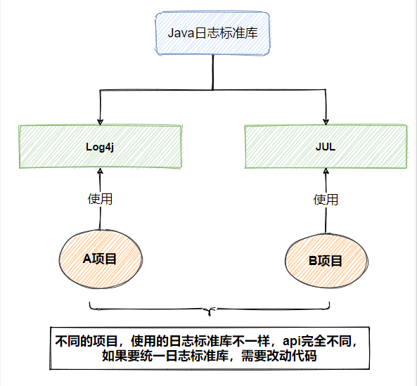

于是JUL刚出来不久，2002年8月Apache推出了JCL（Jakarta Commons Logging），也就是日志抽象层，支持运行时动态加载日志组件的实现，当然也提供一个默认实现Simple Log（在ClassLoader中进行查找，如果能找到Log4j则默认使用log4j实现，如果没有则使用JUL 实现，再没有则使用JCL内部提供的Simple Log实现）。

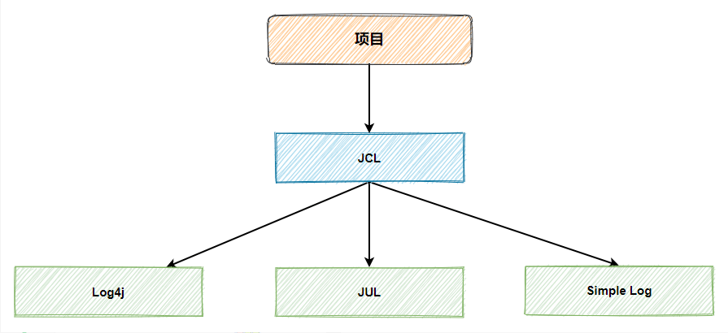

但是JUL有三个缺点

+   效率较低
+   容易引发混乱
+   使用了自定义ClassLoader的程序中，使用JCL会引发内存泄露

总之就是问题也挺多

## Slf4j（Simple Logging Facade for Java）日志标准接口规范

2006年巨佬Ceki（Log4j的作者）因为一些原因离开了Apache组织，之后Ceki觉得JCL不好用，自己撸了一套新的日志标准接口规范Slf4j（Simple Logging Facade for Java），也可以称为日志门面，很明显Slf4j是对标JCL，后面也证明了Slf4j比JCL更优秀。

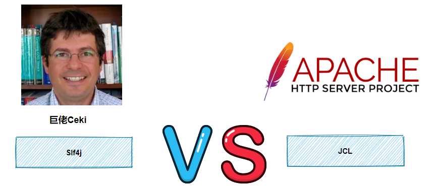

由于Slf4j出来的较晚，光有一个接口，没有实现的日志库也很蛋疼，如JUL和Log4j都是没有实现Slf4j，就算开发者想用Slf4j也用不了。

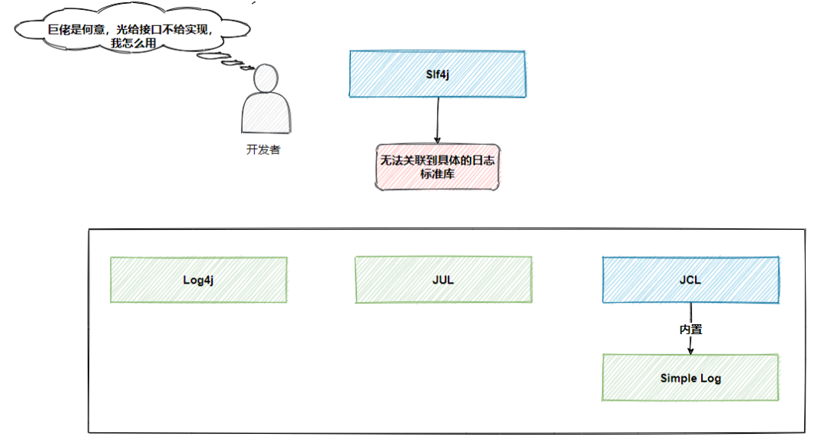

这时候巨佬Ceki发话了，Sum和Apache这两个组织不来实现我的接口没关系，我来实现就好了，只有魔法才能打败魔法。

后面巨佬Ceki提供了一系列的桥接包来帮助Slf4j接口与其他日志库建立关系，这种方式称为桥接设计模式。

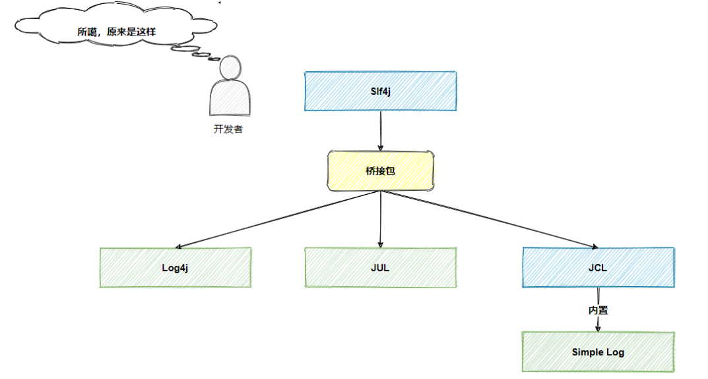

有了桥接包配合，其他的问题都迎刃而解，我们先看看有那些问题吧~

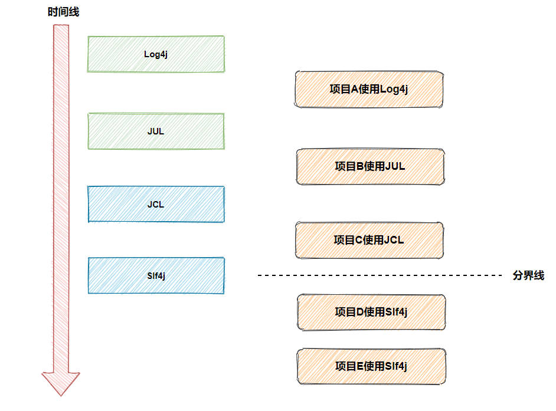

从上图可以看出，不同时期的项目使用的日志标准库不一样，我们以Slf4j接口作为划分线，考虑两个问题，一个是Slf4j之前的项目怎么统一日志标准，另一个是Slf4j之后的项目怎么统一日志标准。

先来看Slf4j之后的项目怎么统一日志标准，项目D、E都使用Slf4j接口，首先在代码层已经统一了，如果要做到日志标准统一也十分简单，直接替换日志标准库与对应的桥接包即可，就如下图所示

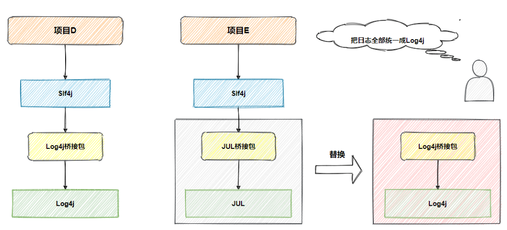

好家伙，Slf4j接口配合桥接包简直无敌了，灵活配置。。

再来看Slf4j之前的项目怎么统一日志标准，项目A、B、C都使用了不同的日志标准，所以它们的API不一样，如果要统一标准，首先就要改动代码，这样侵入太强了，难道就没有办法在不改代码的情况下，让A、B、C项目统一日志标准吗？

办法当然有，Slf4j接口能通过桥接包勾搭上具体的日志标准库，为什么日志标准库不能通过桥接包勾搭Slf4j接口呢？

阿星想把A、B、C项目都统一成Log4j日志输出，只需要做如下调整

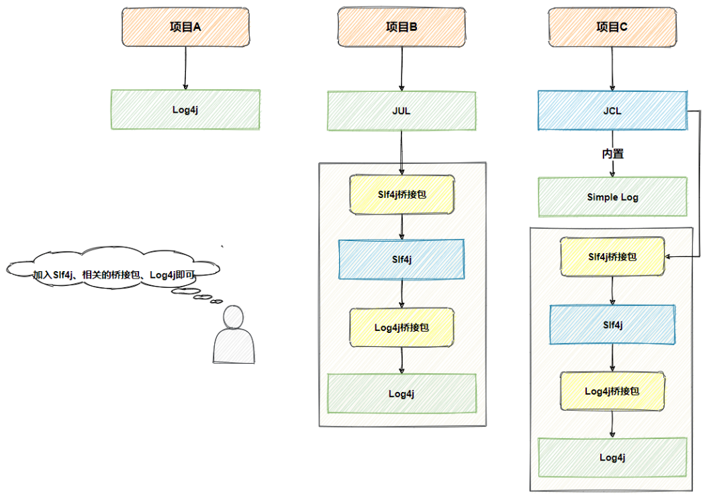

是不是很简单，引入Slf4j与相关的桥接包，再引入具体的日志标准库，比如Log4j，就完成了3个项目的统一日志标准，对代码层是零入侵。

## Logback日志标准库

Ceki巨佬觉得市场上的日志标准库都是间接实现Slf4j接口，也就是说每次都需要配合桥接包，因此在2006年，Ceki巨佬基于Slf4j接口撸出了Logback日志标准库，做为Slf4j接口的默认实现，Logback也十分给力，在功能完整度和性能上超越了所有已有的日志标准库。

目前Java日志体系关系图如下

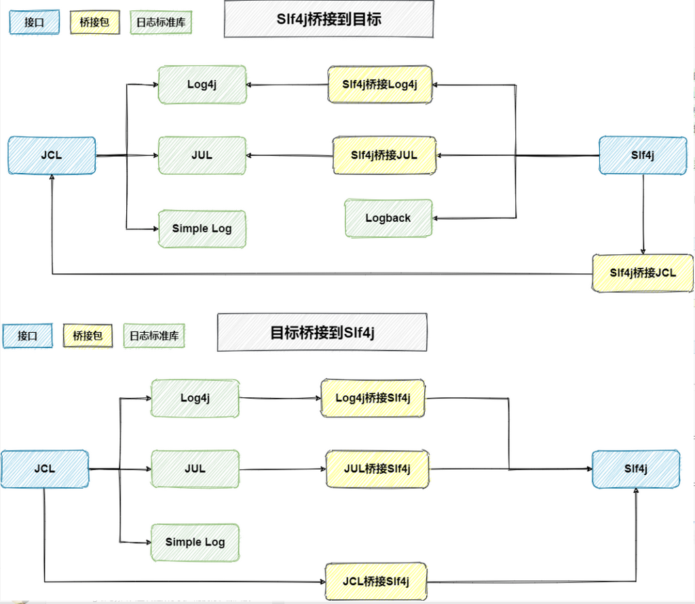

## Log4j2

自从Logback出来后，可以说Slf4j+Logback组合如日中天，很冲击JCL+Log4j组合，Apache眼看有被Logback反超的势头。

于2012年，Apache直接推出新项目Log4j2（不兼容Log4j），Log4j2全面借鉴Slf4j+Logback（十分明显的抄袭嫌疑）。

因为Log4j2不仅仅具有Logback的所有特性，还做了分离设计，分为log4j-api和log4j-core，log4j-api是日志接口，log4j-core是日志标准库，并且Apache也为Log4j2提供了各种桥接包。。。

## 结论

到目前为止Java日志体系被划分为两大阵营，分别是Apache阵营和Cekij阵营，如下图所示

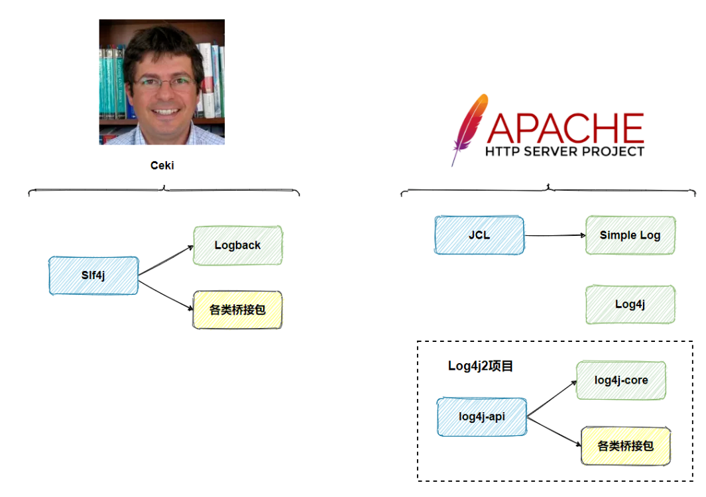

# Slf4j的桥接包介绍

相信大家都对桥接包都有了基本概念，这里阿星罗列下与Slf4j配合使用的桥接包

Slf4j转向某个日志标准库

+   slf4j-jdk14.jar
+   Slf4j到JUL的桥梁
+   slf4j-log4j12.jar
+   Slf4j到Log4j的桥梁
+   log4j-slf4j-impl.jar
+   Slf4j到Log4j2的桥梁
+   slf4j-jcl.jar
+   Slf4j到JCL的桥梁

某个实际日志框架转向Slf4j

+   jul-to-slf4j.jar
+   JUL到Slf4j的桥梁
+   log4j-over-slf4j.jar
+   Log4j到Slf4j的桥梁
+   jcl-over-slf4j.jar
+   JCL到Slf4j的桥梁

# 小小实践

从事Java开发的伙伴们都清楚，Spring框架内部使用JCL做日志输出标准，可是项目使用Slf4j + Logback做日志输出标准，问题来了，怎样才能让项目内的Spring保持统一日志输出标准呢？

其实非常简单，只需要引入正确的Slf4j桥接包，去除无用的日志组件即可。

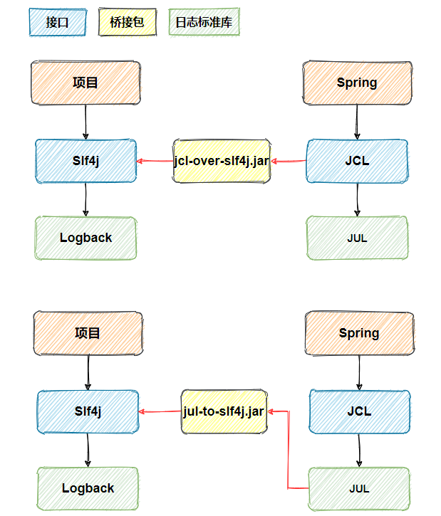

引入jcl-over-slf4j.jar或jul-to-slf4j.jar问题就解决了，十分简单

# 来源

https://mp.weixin.qq.com/s/BAalig29uB2Lc-UFPdmlKw