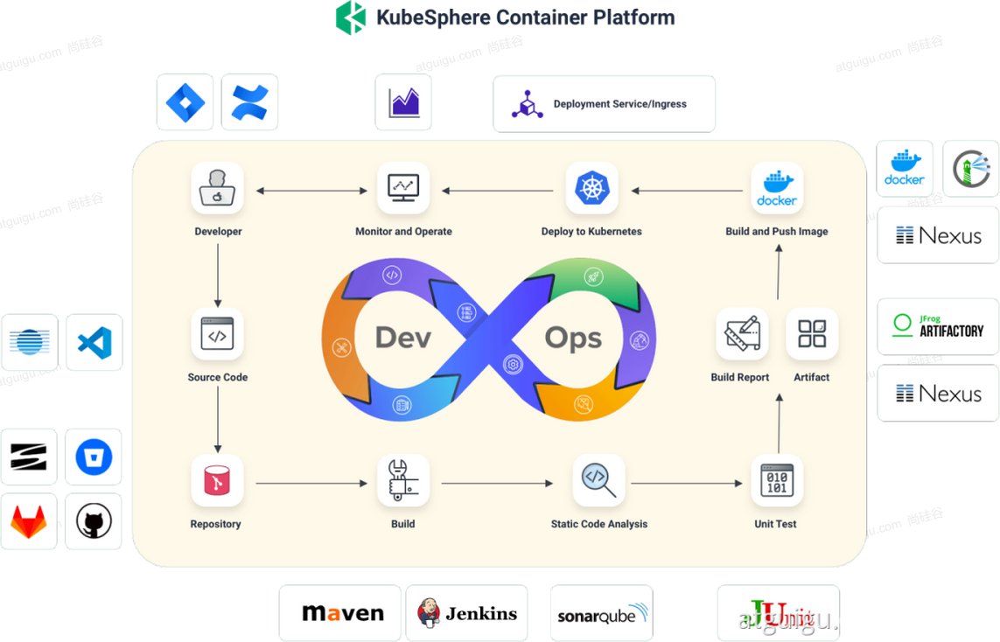
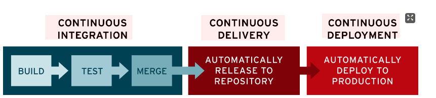

#	DevOps基础

----

##  DevOps简介

DevOps 是一系列做法和工具，可以使 IT 和软件开发团队之间的流程实现自动化。其中，随着敏捷软件开发日趋流行，持续集成 (CI) 和持续交付 (CD) 已经成为该领域一个理想的解决方案。在 CI/CD 工作流中，每次集成都通过自动化构建来验证，包括编码、发布和测试，从而帮助开发者提前发现集成错误，团队也可以快速、安全、可靠地将内部软件交付到生产环境。

##  Kubesphere落地DevOps

+   https://kubesphere.com.cn/docs/devops-user-guide/understand-and-manage-devops-projects/overview/
+   https://kubesphere.com.cn/docs/devops-user-guide/how-to-use/choose-jenkins-agent/