#   kubesphere部署Mysql

----

##  创建pvc

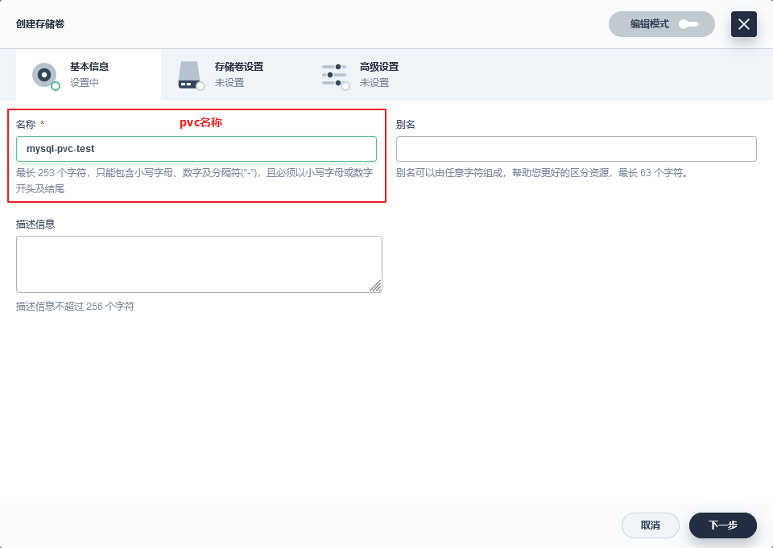

+   有状态多使用单节点读写
+   无状态多使用多节点读写

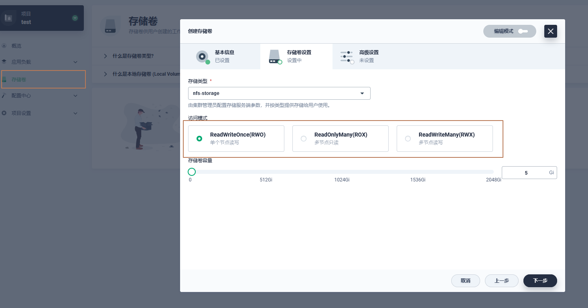

##  创建配置文件

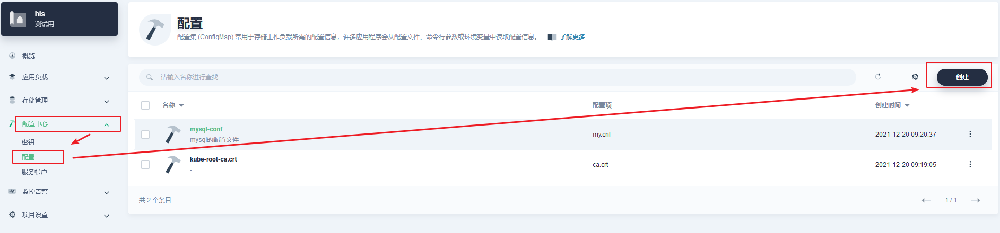

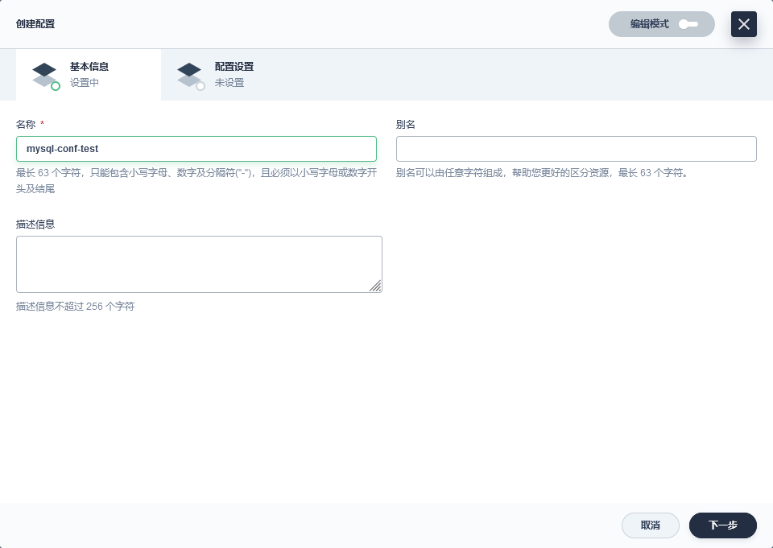

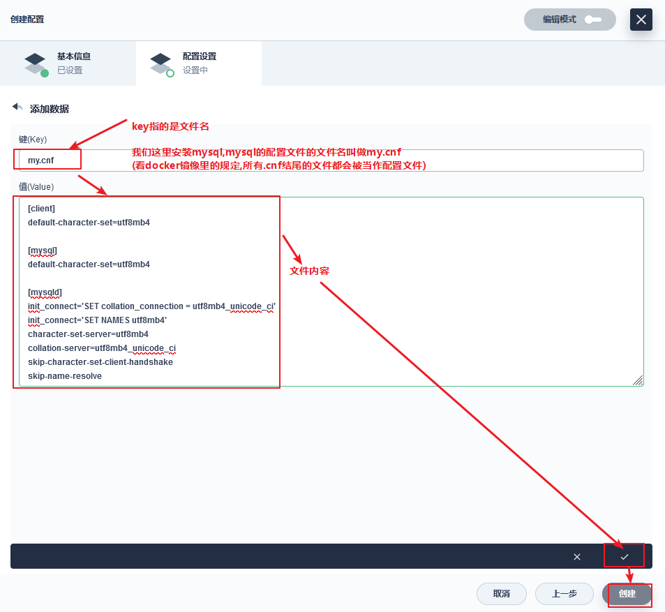

##  创建mysql

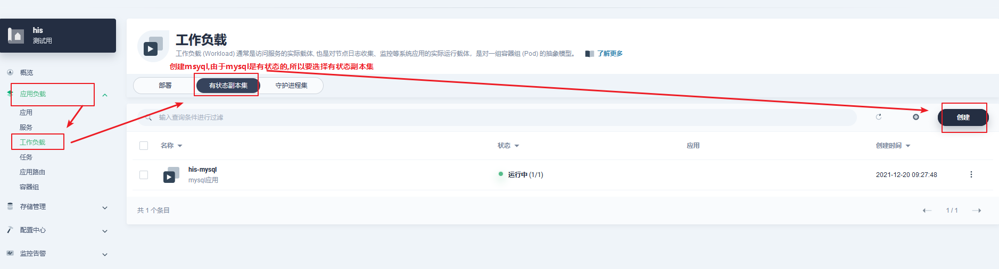

+   配置镜像

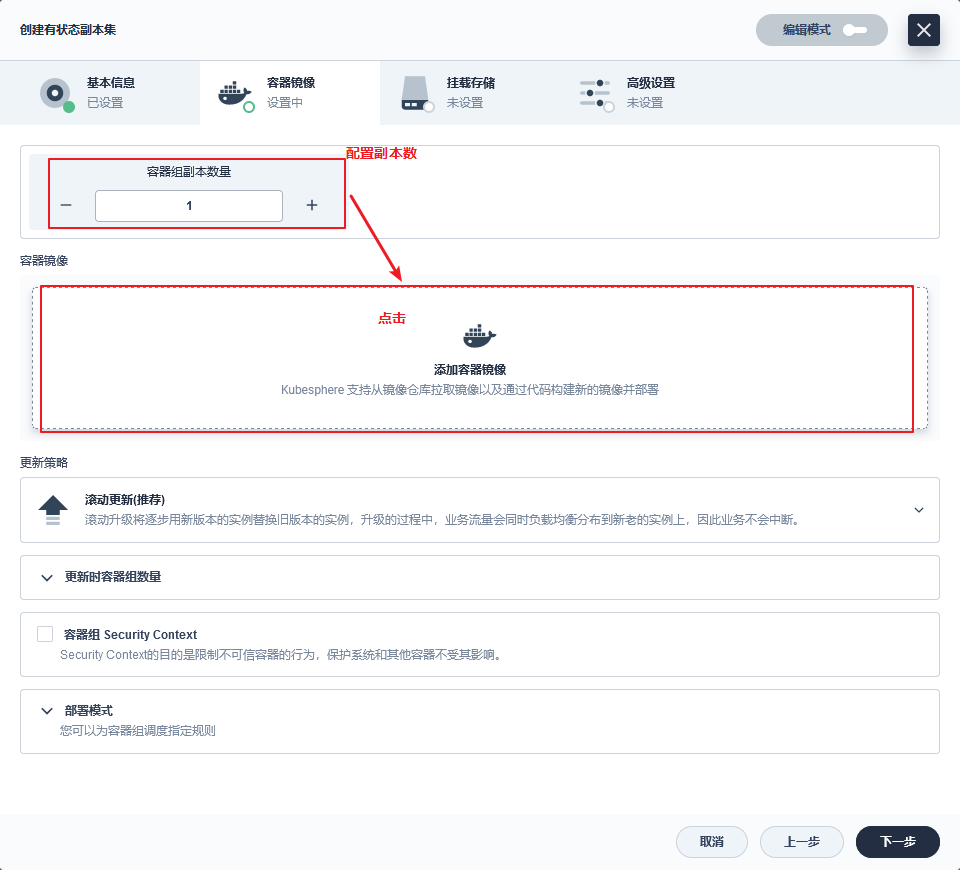

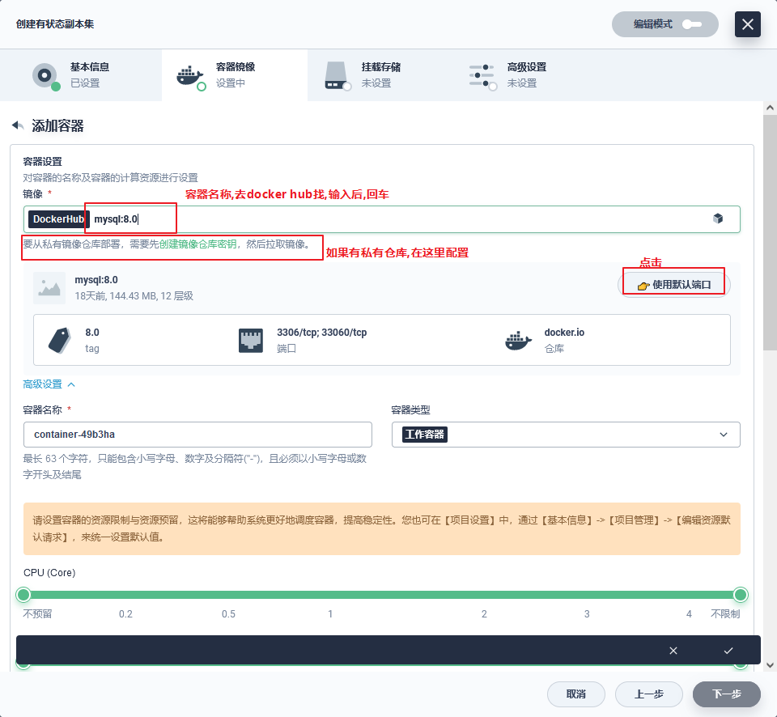

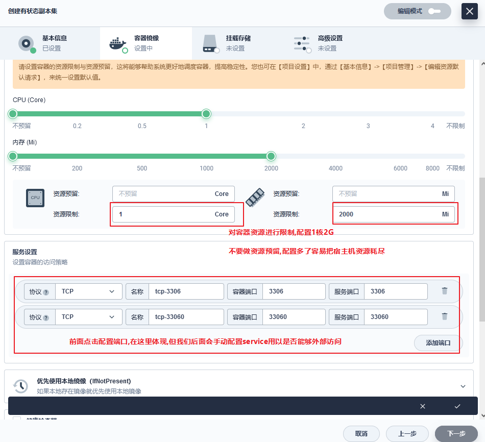

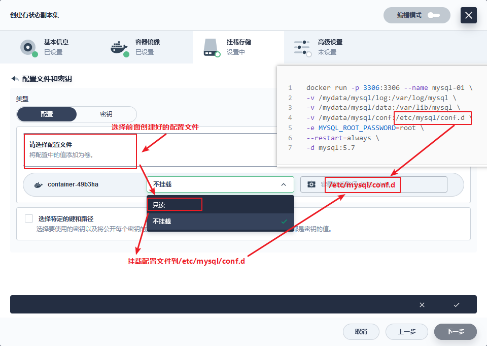

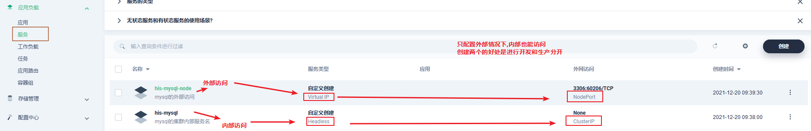

##  配置service

+   targetPort:是continer暴露出来的端口
+   port:是service暴露出来的端口
+   NodePort:是node暴露出来的端

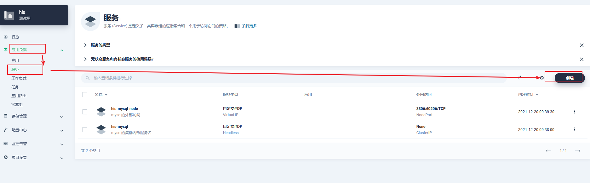

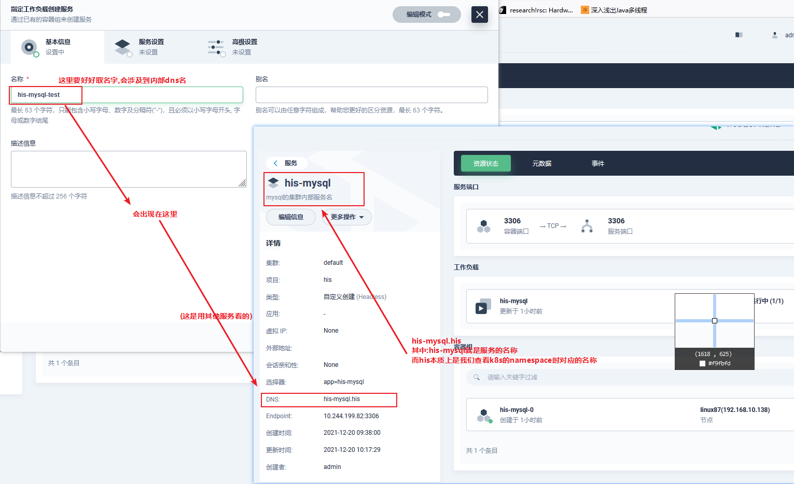

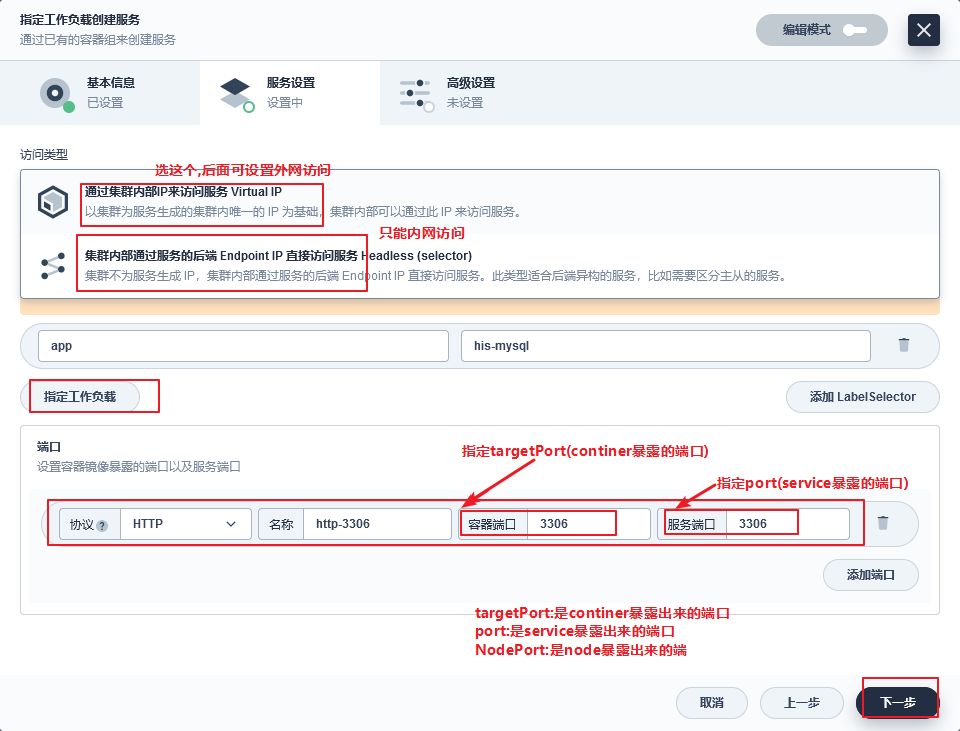

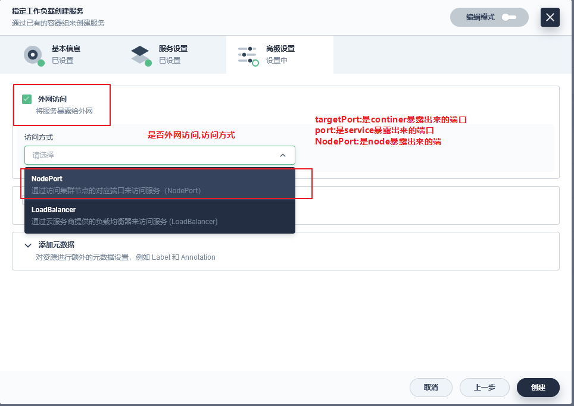

设置完成后可以查看外网的ip