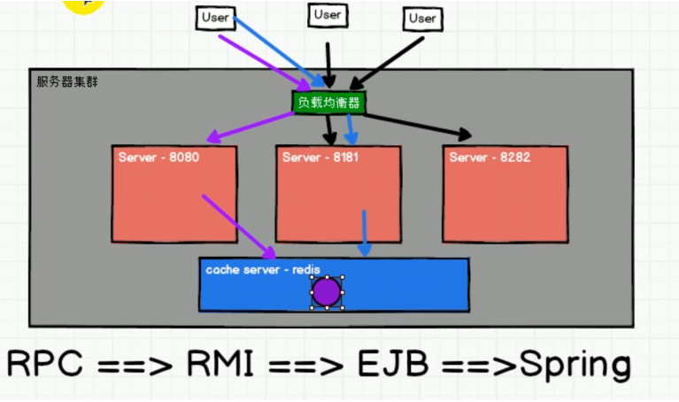
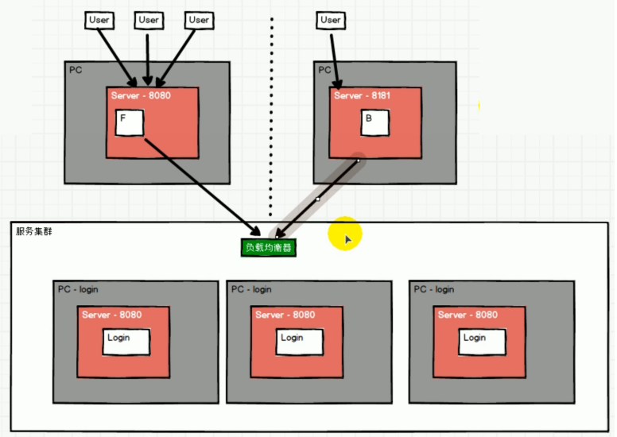
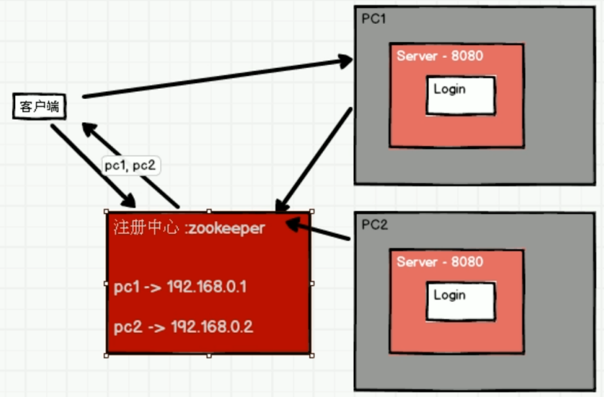
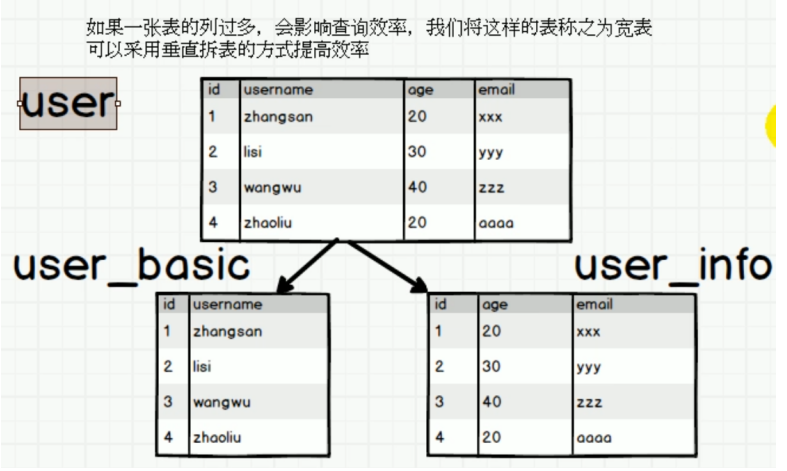
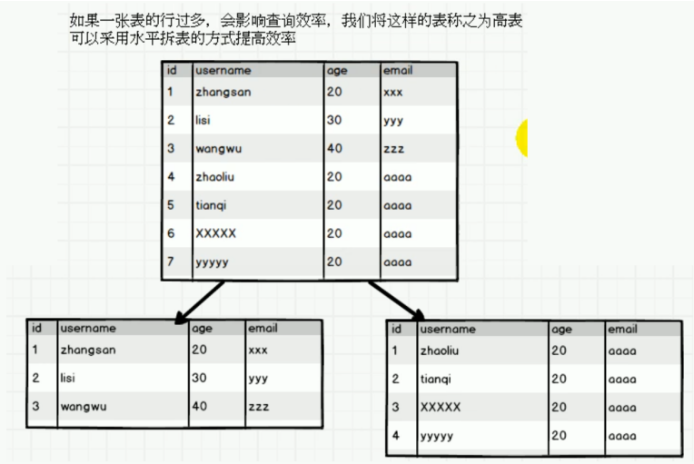
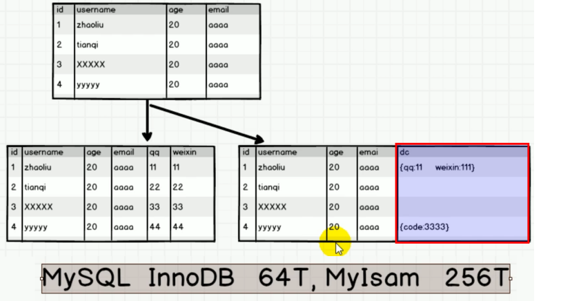
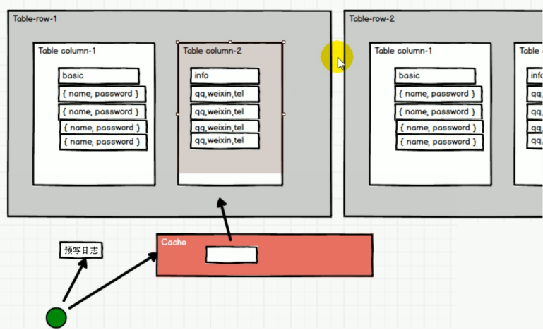

#	HBase系列_01_HBase架构的设计思路演化

----

#	分布式如何设计

##  分布式，实现高性能，可伸缩

+   会出现问题：
    -   负载均衡器负载过高
    -   不是高可靠

##  服务器负载均衡

进一步提高性能，可伸缩

+   问题依旧：
    -   负载均衡器负载过高
    -   不是高可靠

##  客户端负载均衡

+   使用zookeeper，实现高可靠
+   分布式，实现高性能，可伸缩

#   大数据背景下存储如何设计

##  宽表垂直拆分

##  高表水平拆分

拆分表后会造成增减列难度增大，可以使用json解决列增减问题

思路已经可以了，但是，使用MySQL是有极限的，MySQL InnoDB 64T，MyIsam 256T。对于大数据来讲远远不够。

##  类HBase结构设计

1.  依照MySQL优化后的方案，设计一个思路相同的数据库系统，使用文件直接存储。
2.  为了提高读写速度，同时增加Cache（类似Redis在网站中的地位）

同时为了保证不丢数据，可以预写日志（也是文件，但比写到庞大文件里快多了）来保证

