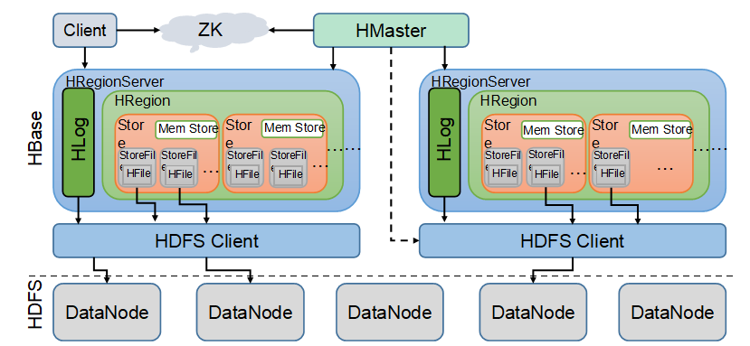

# HBase系列_02_HBase简介

----

# 什么是HBase

HBase的原型是Google的BigTable论文，受到了该论文思想的启发，目前作为Hadoop的子项目来开发维护，用于支持结构化的数据存储。

官方网站：http://hbase.apache.org

+   2006年Google发表BigTable白皮书
+   2006年开始开发HBase
+   2008年北京成功开奥运会，程序员默默地将HBase弄成了Hadoop的子项目
+   2010年HBase成为Apache顶级项目
+   现在很多公司二次开发出了很多发行版本，你也开始使用了。

HBase是一个高可靠性、高性能、面向列、可伸缩的分布式存储系统，利用HBASE技术可在廉价PC Server上搭建起大规模结构化存储集群。

HBase的目标是存储并处理大型的数据，更具体来说是仅需使用普通的硬件配置，就能够处理由成千上万的行和列所组成的大型数据。

HBase是Google Bigtable的开源实现，但是也有很多不同之处。

比如：

1.  Google Bigtable利用GFS作为其文件存储系统，HBase利用Hadoop HDFS作为其文件存储系统；
2.  Google运行MAPREDUCE来处理Bigtable中的海量数据，HBase同样利用Hadoop MapReduce来处理HBase中的海量数据；
3.  Google Bigtable利用Chubby作为协同服务，HBase利用Zookeeper作为对应。

# HBase特点

+   海量存储
    -   Hbase适合`存储PB级别的海量数据`，在PB级别的数据以及`采用廉价PC存储`的情况下，`能在几十到百毫秒内返回数据`。这与Hbase的极易扩展性息息相关。正式因为Hbase良好的扩展性，才为海量数据的存储提供了便利。
+   列式存储
    -   这里的列式存储其实说的是列族存储，Hbase是根据列族来存储数据的。列族下面可以有非常多的列，列族在创建表的时候就必须指定。
+   极易扩展
    -   Hbase的扩展性主要体现在两个方面，一个是基于`上层处理能力（RegionServer）的扩展`，一个是基于`存储的扩展（HDFS）`。
    -   通过横向添加RegionSever的机器，进行水平扩展，提升Hbase上层的处理能力，提升Hbsae服务更多Region的能力。
    -   备注：RegionServer的作用是管理region、承接业务的访问，这个后面会详细的介绍通过横向添加Datanode的机器，进行存储层扩容，提升Hbase的数据存储能力和提升后端存储的读写能力。
+   高并发
    -   由于目前大部分使用Hbase的架构，都是采用的廉价PC，因此单个IO的延迟其实并不小，一般在几十到上百ms之间。这里说的高并发，主要是在并发的情况下，Hbase的单个IO延迟下降并不多。能获得高并发、低延迟的服务。
+   稀疏
    -   稀疏主要是针对Hbase列的灵活性，在列族中，你可以指定任意多的列，在`列数据为空的情况下，是不会占用存储空间`的。

# HBase架构

Hbase架构如图1所示：

从图中可以看出Hbase是由Client、Zookeeper、Master、HRegionServer、HDFS等几个组件组成，下面来介绍一下几个组件的相关功能：

+   Client
    -   Client包含了访问Hbase的接口，另外Client还维护了对应的cache来加速Hbase的访问，比如cache的.META.元数据的信息。
+   Zookeeper
    -   HBase通过Zookeeper来做master的高可用、RegionServer的监控、元数据的入口以及集群配置的维护等工作。具体工作如下：
    -   通过Zoopkeeper来保证集群中只有1个master在运行，如果master异常，会通过竞争机制产生新的master提供服务
    -   通过Zoopkeeper来监控RegionServer的状态，当RegionSevrer有异常的时候，通过回调的形式通知Master RegionServer上下线的信息
    -   通过Zoopkeeper存储元数据的统一入口地址
+   Hmaster
    -   master节点的主要职责如下：
    -   为RegionServer分配Region
    -   维护整个集群的负载均衡
    -   维护集群的元数据信息
    -   发现失效的Region，并将失效的Region分配到正常的RegionServer上
    -   当RegionSever失效的时候，协调对应Hlog的拆分
+   HregionServer
    -   HregionServer直接对接用户的读写请求，是真正的“干活”的节点。它的功能概括如下：
    -   管理master为其分配的Region
    -   处理来自客户端的读写请求
    -   负责和底层HDFS的交互，存储数据到HDFS
    -   负责Region变大以后的拆分
    -   负责Storefile的合并工作
+   HDFS
    -   HDFS为Hbase提供最终的底层数据存储服务，同时为HBase提供高可用（Hlog存储在HDFS）的支持，具体功能概括如下：
    -   提供元数据和表数据的底层分布式存储服务
    -   数据多副本，保证的高可靠和高可用性

# HBase中的角色

## HMaster

功能

+   监控RegionServer
+   处理RegionServer故障转移
+   处理元数据的变更
+   处理region的分配或转移
+   在空闲时间进行数据的负载均衡
+   通过Zookeeper发布自己的位置给客户端

## RegionServer

功能

+   负责存储HBase的实际数据
+   处理分配给它的Region
+   刷新缓存到HDFS
+   维护Hlog
+   执行压缩
+   负责处理Region分片

## 其他组件

### Write-Ahead logs

HBase的修改记录，当对HBase读写数据的时候，数据不是直接写进磁盘，它会在内存中保留一段时间（时间以及数据量阈值可以设定）。但把数据保存在内存中可能有更高的概率引起数据丢失，为了解决这个问题，数据会先写在一个叫做Write-Ahead logfile的文件中，然后再写入内存中。所以在系统出现故障的时候，数据可以通过这个日志文件重建。

### Region

Hbase表的分片，HBase表会根据RowKey值被切分成不同的region存储在RegionServer中，在一个RegionServer中可以有多个不同的region。

### Store

HFile存储在Store中，一个Store对应HBase表中的一个列族。

### MemStore

顾名思义，就是内存存储，位于内存中，用来保存当前的数据操作，所以当数据保存在WAL中之后，RegsionServer会在内存中存储键值对。

### HFile

对实际数据的一个抽象，这是在磁盘上保存原始数据的实际的物理文件，是实际的存储文件。StoreFile是以Hfile的形式存储在HDFS的。