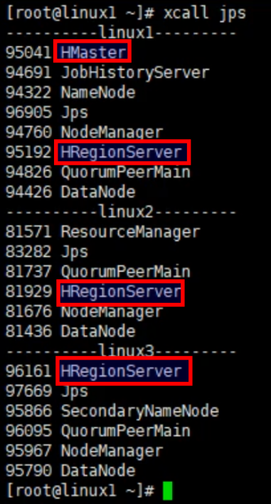

#	HBase系列_03_HBase安装

----

#   Zookeeper正常部署

首先保证Zookeeper集群的正常部署，并启动之：

```bash
[atguigu@hadoop102 zookeeper-3.4.10]$ bin/zkServer.sh start
[atguigu@hadoop103 zookeeper-3.4.10]$ bin/zkServer.sh start
[atguigu@hadoop104 zookeeper-3.4.10]$ bin/zkServer.sh start
```

#   Hadoop正常部署

Hadoop集群的正常部署并启动：

```bash
[atguigu@hadoop102 hadoop-2.7.2]$ sbin/start-dfs.sh
[atguigu@hadoop103 hadoop-2.7.2]$ sbin/start-yarn.sh
```

#   HBase的解压

解压HBase到指定目录：

```bash
[atguigu@hadoop102 software]$ tar -zxvf hbase-1.3.1-bin.tar.gz -C /opt/module
```

#   HBase的配置文件

修改HBase对应的配置文件。

##  hbase-env.sh修改内容：

```bash
export JAVA_HOME=/opt/module/jdk1.8.0_144
# hbase有内置zookeeper,但一般来说zookeeper有多个系统在用
# 所以我们并不是用内置的zookeeper,所以这里是false
export HBASE_MANAGES_ZK=false
# JDK1.8需要注释
# export HBASE_MASTER_OPTS ...
# export HBASE_REGIONSERVER_OPTS ...
```

##  hbase-site.xml修改内容：

```xml
<configuration>
    <property>
<!-- HBase数据存在Hadoop,这里写的是HDFS存储节点名称 -->
        <name>hbase.rootdir</name>  
        <value>hdfs://hadoop102:9000/hbase</value>  
    </property>

    <property>  
        <name>hbase.cluster.distributed</name>
        <value>true</value>
    </property>

   <!-- 0.98后的新变动，之前版本没有.port,默认端口为60000 -->
    <property>
        <name>hbase.master.info.port</name>
        <value>16000</value>
    </property>

<!-- zookeeper集群的路径 -->
    <property>  
        <name>hbase.zookeeper.quorum</name>
         <value>hadoop102:2181,hadoop103:2181,hadoop104:2181</value>
    </property>

<!-- zookeeper的dataDir位置 -->
    <property>  
       <name>hbase.zookeeper.property.dataDir</name>
         <value>/opt/module/zookeeper-3.4.10/zkData</value>
    </property>
</configuration>
```

##  regionservers文件：

```
hadoop102
hadoop103
hadoop104
```

##  软连接hadoop配置文件到hbase：

```bash
[atguigu@hadoop102 module]$ ln -s /opt/module/hadoop-2.7.2/etc/hadoop/core-site.xml
/opt/module/hbase/conf/core-site.xml
[atguigu@hadoop102 module]$ ln -s /opt/module/hadoop-2.7.2/etc/hadoop/hdfs-site.xml
/opt/module/hbase/conf/hdfs-site.xml
```

#   HBase远程发送到其他集群

```bash
[atguigu@hadoop102 module]$ xsync hbase/
```

#   HBase服务的启动

##  启动方式1

```bash
[atguigu@hadoop102 hbase]$ bin/hbase-daemon.sh start master
[atguigu@hadoop102 hbase]$ bin/hbase-daemon.sh start regionserver
```

提示：如果集群之间的节点时间不同步，会导致regionserver无法启动，抛出ClockOutOfSyncException异常。

修复提示：

+   同步时间服务

请参看帮助文档：《尚硅谷大数据技术之Hadoop入门》

+   属性：hbase.master.maxclockskew设置更大的值

```bash
<property>
        <name>hbase.master.maxclockskew</name>
        <value>180000</value>
        <description>Time difference of regionserver from master</description>
 </property>
```

##  启动方式2

```bash
[atguigu@hadoop102 hbase]$ bin/start-hbase.sh
```

对应的停止服务：

```bash
[atguigu@hadoop102 hbase]$ bin/stop-hbase.sh
```

#   查看HBase是否启动

##  （方式一）查看HBase页面

启动成功后，可以通过“host:port”的方式来访问HBase管理页面，例如：

http://hadoop102:16010

##  （方式二）查看HBase节点信息

