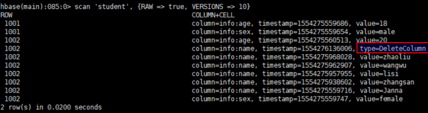

#	HBase系列_04_HBase_Shell操作

----

##  基本操作

### 进入HBase客户端命令行

```
[atguigu@hadoop102 hbase]$ bin/hbase shell
```

### 查看帮助命令

```
hbase(main):001:0> help
```

### 查看当前数据库中有哪些表

```
hbase(main):002:0> list
```

##  表的操作

### 创建表

```
hbase(main):002:0> create 'student','info'
```
提示: 和Mysq不一样，HBase创建表的时，不用创建列，要创建列族。

### 插入数据到表

```
hbase(main):003:0> put 'student','1001','info:sex','male'
hbase(main):004:0> put 'student','1001','info:age','18'
hbase(main):005:0> put 'student','1002','info:name','Janna'
hbase(main):006:0> put 'student','1002','info:sex','female'
hbase(main):007:0> put 'student','1002','info:age','20'
```

提示：对于 put 'student','1001','info:sex','male'这句来说，意思为：插入student表，rowkey为1001,列族为info，列名为sex，列值为'male'

### 扫描查看表数据

```
hbase(main):008:0> scan 'student'
# 包含起始，不包含结束
hbase(main):009:0> scan 'student',{STARTROW => '1001', STOPROW  => '1001'}
hbase(main):010:0> scan 'student',{STARTROW => '1001'}
```

### 查看表结构

```
hbase(main):011:0> describe ‘student’
```

### 更新指定字段的数据

```
# 和插入命令相同，有重复就覆盖
hbase(main):012:0> put 'student','1001','info:name','Nick'
hbase(main):013:0> put 'student','1001','info:age','100'
```

提示：其实put是增加的意思，只是增加是按照版本进行迭代

### 查看“指定行”或“指定列族:列”的数据

```
hbase(main):014:0> get 'student','1001'
hbase(main):015:0> get 'student','1001','info:name'
```

### 统计表数据行数

```
hbase(main):021:0> count 'student'
```

### 删除数据

删除某rowkey的全部数据：

```
hbase(main):016:0> deleteall 'student','1001'
```

删除某rowkey的某一列数据：

```
hbase(main):017:0> delete 'student','1002','info:sex'
```

删除本质上并没有马上真正的删除，因为会影响性能，而是先给一个标记字段，真正删除会到“数据合并(HFile的合并策略)”的时候进行删除，而合并过程也分两种，有轻量级和重量级，只有在重量级别合并的时候才会真正删除
可以用`scan ‘student’, {RAW => true, VERSION => 10}`进行查看。

被删除的数据有`type=DeleteColumn`标记



### 清空表数据

```
hbase(main):018:0> truncate 'student'
```

提示：清空表的操作顺序为先disable，然后再truncate。

### 删除表

首先需要先让该表为disable状态：

```
hbase(main):019:0> disable 'student'
```

然后才能drop这个表：

```
hbase(main):020:0> drop 'student'
```
提示：如果直接drop表，会报错：ERROR: Table student is enabled. Disable it first.

### 变更表信息

将info列族中的数据存放3个版本：

```
# 设置info列族中的数据存放3个版本
hbase(main):022:0> alter 'student',{NAME=>'info',VERSIONS=>3}
# 用get方式查看，可以看到3个版本
hbase(main):022:0> get 'student','1001',{COLUMN=>'info:name',VERSIONS=>3}
```