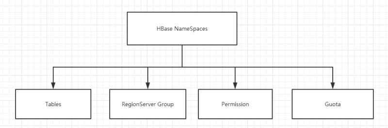

# HBase系列_05_HBase数据结构

-----

## RowKey

与nosql数据库们一样,RowKey是用来检索记录的主键。

+   访问HBASE table中的行，只有三种方式：
    -   通过单个RowKey访问
    -   通过RowKey的range（正则）
    -   全表扫描

RowKey行键 (RowKey)可以是`任意字符串`(最大长度是64KB，实际应用中长度一般为 10-100bytes)，在HBASE内部，RowKey保存为字节数组（因为字节是可以压缩的，并且压缩比例是最好的，存储空间会更省）。存储时，`数据按照RowKey的字典顺序(byte order)(字典顺序就是ASCII顺序)排序存储`。设计RowKey时，要充分排序存储这个特性，将经常一起读取的行存储放到一起。(位置相关性)

## Column Family

列族：HBASE表中的每个列，都归属于某个列族。列族是表的schema的一部分(而列不是)，必须在使用表之前定义。列名都以列族作为前缀。例如 courses:history，courses:math都属于courses 这个列族。

## Cell

HBASE 中通过`{rowkey, column Family:columu, version} 唯一确定的存贮单元称为cell`。

cell中的数据是没有类型的，全部是字节码形式存贮。每个 cell都保存 着同一份数据的多个版本。版本通过时间戳来索引。

关键字：无类型、字节码

## Time Stamp

HBASE 中通过rowkey和columns确定的为一个存贮单元称为cell。每个 cell都保存着同一份数据的多个版本。`版本通过时间戳来索引`。时间戳的类型是 64位整型。时间戳可以由HBASE(在数据写入时自动 )赋值，此时时间戳是精确到毫秒的当前系统时间。时间戳也可以由客户显式赋值。如果应用程序要避免数据版本冲突，就必须自己生成具有唯一性的时间戳。每个 cell中，不同版本的数据按照时间倒序排序，即最新的数据排在最前面。
为了避免数据存在过多版本造成的的管理 (包括存贮和索引)负担，HBASE提供了两种数据版本回收方式。一是保存数据的最后n个版本，二是保存最近一段时间内的版本（比如最近七天）。用户可以针对每个列族进行设置。

## 命名空间

其实就是用来分类用的

命名空间的结构:



+   Table：表，所有的表都是命名空间的成员，即表必属于某个命名空间，如果没有指定，则在default默认的命名空间中。
    -   HBase系统默认定义了两个缺省的namespace
        -   hbase：系统内建表，包括namespace和meta表
        -   default：用户建表时未指定namespace的表都创建在此
+   RegionServer group：一个命名空间包含了默认的RegionServer Group。
+   Permission：权限，命名空间能够让我们来定义访问控制列表ACL（Access Control List）。例如，创建表，读取表，删除，更新等等操作。
+   Quota：限额，可以强制一个命名空间可包含的region的数量。

### namespace操作

创建namespace

```
hbase>create_namespace 'ai_ns'
```

删除namespace

```
hbase>drop_namespace 'ai_ns'
```

查看namespace

```
hbase>describe_namespace 'ai_ns'
```

列出所有namespace

```
hbase>list_namespace
```

在namespace下创建表

```
hbase>create 'ai_ns:testtable', 'fm1'
```

查看namespace下的表

```
hbase>list_namespace_tables 'ai_ns'
```