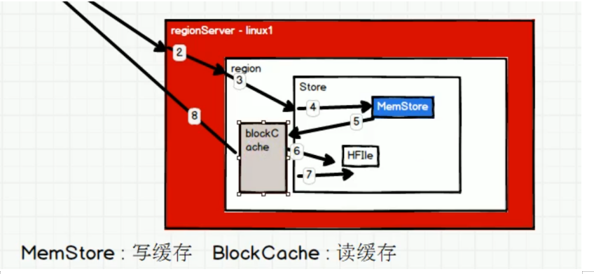

#	HBase系列_06_HBase原理

----

##  读流程

HBase读数据流程如图所示


下图所示 Client如何找到rowkey=1001所在的regionServer




1.  Client先访问zookeeper，从meta表读取region的位置，然后读取meta表中的数据。meta中又存储了用户表的region信息；
2.  根据namespace、表名和rowkey在meta表中找到对应的region信息；
3.  找到这个region对应的regionserver；
4.  查找对应的region；
5.  先从MemStore找数据，如果没有，再到BlockCache里面读；
6.  BlockCache还没有，再到StoreFile上读(为了读取的效率)；
7.  如果是从StoreFile里面读取的数据，不是直接返回给客户端，而是先写入BlockCache，再返回给客户端。

综上，HBase无法做到即席查询（一查就看到）

注意：如果是范围查询，比如查询rowkey从[1001, 1005)，那么查询是一定要走到HFile。因为缓存里（MemStore和BlockCache）一定只有部分数据，所以必须查HFile

##  写流程


1.  Client向HregionServer发送写请求；
2.  HregionServer将数据写到HLog（write ahead log）。为了数据的持久化和恢复；
3.  HregionServer将数据写到内存（MemStore），由于内存比硬盘小，也就是说HLog写成功后再写MemStore并不一定会成功，如果失败，虽然没有事务机制，但有rollback（回滚）机制，会将HLog中的数据擦除；
4.  反馈Client写成功。

##  数据Flush过程(溢写,从MemStore写入HDFS)

溢写开始，即将MemStore数据写入HDFS中的时机

1.  当MemStore数据达到阈值（默认是128M，老版本是64M） ，将数据刷到硬盘，将内存中的数据删除，同时删除HLog中的历史数据；
2.  并将数据存储到HDFS中；
3.  在HLog中做标记点。

##  数据合并过程

1.  当数据块达到4块，Hmaster触发合并操作，Region将数据块加载到本地，进行合并；
2.  当合并的数据超过256M，整个Region进行拆分（注意，不是Store拆分，而是整个Region进行拆分），将拆分后的Region分配给不同的HregionServer管理；
3.  当HregionServer宕机后，将HregionServer上的hlog拆分，然后分配给不同的HregionServer加载，修改.META.；
4.  注意：HLog会同步到HDFS。

### 深入数据拆分逻辑

1.  有配置文件hbase-default.xml我们可以只知道region在切分的默认切分策略

```xml
<!-- region在切分的时候的默认切分策略 -->
<property>
    <name>hbase.regionserver.region.split.policy</name>
    <value>org.apache.hadoop.hbase.regionserver.IncreasingToUpperBoundRegionSplitPolicy</value>
    <description>
        A split policy determines when a region should be split. The various
        other split policies that
        are available currently are ConstantSizeRegionSplitPolicy,
        DisabledRegionSplitPolicy,
        DelimitedKeyPrefixRegionSplitPolicy, KeyPrefixRegionSplitPolicy etc.
    </description>
</property>
```

2.  在代码中找到这个类


3.  接下去只需要看`sizeToCheck = getSizeToCheck(tableRegionCount)`的逻辑,点进去,可以看到如下代码


4.  说说上面的三元运算

getDesiredMaxFileSize()函数说明

跳转到


跳转到


是一个属性,那么向下找到给属性赋值的地方(一般在构造函数)


上述代码,返回10G这个值,也就是说getDesiredMaxFileSize()函数返回的值是10G

initialSize 说明


最后讲讲这个三元运算

+   第一次访问,region数量为1,那么执行的是`initialSize * tableRegionsCount * tableRegionsCount * tableRegionsCount,即256M*1*1*1`, 所以是大于256M是分割
+   第二次访问,region数量为2时,则要超过`256M*2*2*2`时才进行分割
+   以此类推
+   但是,当region大于10G,则分割阈值变为getDesiredMaxFileSize()这个函数,即分割阈值是10G

### HFile的合并策略

合并操作主要是在一个Store里边找到需要合并的HFile，然后把它们合并起来，合并在大体意义上有两大类Minor Compation和Major Compaction：

+   Minor Compaction：将Store中多个HFile合并为一个HFile，这个过程中，达到TTL（记录保留时间）会被移除，但是有墓碑标记的记录不会被移除，因为墓碑标记可能存储在不同HFile中，合并可能会跨国部分墓碑标记。这种合并的触发频率很高
+   Major Compaction：合并Store中所有的HFile为一个HFile（并不是把一个Region中的HFile合并为一个），这个过程有墓碑标记的几率会被真正移除，同时超过单元格maxVersion的版本记录也会被删除。合并频率比较低，默认7天执行一次，并且性能消耗非常大，最后手动控制进行合并，防止出现在业务高峰期。

需要注意的是，有资料说只有Major合并才会删数据，其实Major合并删除的是带墓碑标记的，而Minor合并直接就不读取TTL过期文件，所以也相当于删除了。

