# HBase系列_07_HBase_API操作

----

## 环境准备

新建项目后在pom.xml中添加依赖：

```xml
<dependency>
    <groupId>org.apache.hbase</groupId>
    <artifactId>hbase-server</artifactId>
    <version>1.3.1</version>
</dependency>

<dependency>
    <groupId>org.apache.hbase</groupId>
    <artifactId>hbase-client</artifactId>
    <version>1.3.1</version>
</dependency>

<dependency>
    <groupId>jdk.tools</groupId>
    <artifactId>jdk.tools</artifactId>
    <version>1.8</version>
    <scope>system</scope>
    <systemPath>${JAVA_HOME}/lib/tools.jar</systemPath>
</dependency>
```

## HBaseAPI

### 获取Configuration对象

```
public static Configuration conf;
static{
    //使用HBaseConfiguration的单例方法实例化
    conf = HBaseConfiguration.create();
    conf.set("hbase.zookeeper.quorum", "192.168.9.102");
    conf.set("hbase.zookeeper.property.clientPort", "2181");
}
```

### 判断表是否存在

```java
public static boolean isTableExist(String tableName) throws MasterNotRunningException,
 ZooKeeperConnectionException, IOException{
    //在HBase中管理、访问表需要先创建HBaseAdmin对象
//Connection connection = ConnectionFactory.createConnection(conf);
//HBaseAdmin admin = (HBaseAdmin) connection.getAdmin();
    HBaseAdmin admin = new HBaseAdmin(conf);
    return admin.tableExists(tableName);
}
```

### 创建表

```java
public static void createTable(String tableName, String... columnFamily) throws
 MasterNotRunningException, ZooKeeperConnectionException, IOException{
    HBaseAdmin admin = new HBaseAdmin(conf);
    //判断表是否存在
    if(isTableExist(tableName)){
        System.out.println("表" + tableName + "已存在");
        //System.exit(0);
    }else{
        //创建表属性对象,表名需要转字节
        HTableDescriptor descriptor = new HTableDescriptor(TableName.valueOf(tableName));
        //创建多个列族
        for(String cf : columnFamily){
            descriptor.addFamily(new HColumnDescriptor(cf));
        }
        //根据对表的配置，创建表
        admin.createTable(descriptor);
        System.out.println("表" + tableName + "创建成功！");
    }
}
```

### 删除表

```java
public static void dropTable(String tableName) throws MasterNotRunningException,
 ZooKeeperConnectionException, IOException{
    HBaseAdmin admin = new HBaseAdmin(conf);
    if(isTableExist(tableName)){
        admin.disableTable(tableName);
        admin.deleteTable(tableName);
        System.out.println("表" + tableName + "删除成功！");
    }else{
        System.out.println("表" + tableName + "不存在！");
    }
}
```

### 向表中插入数据

```java
public static void addRowData(String tableName, String rowKey, String columnFamily, String
 column, String value) throws IOException{
    //创建HTable对象
    HTable hTable = new HTable(conf, tableName);
    //向表中插入数据
    Put put = new Put(Bytes.toBytes(rowKey));
    //向Put对象中组装数据
    put.add(Bytes.toBytes(columnFamily), Bytes.toBytes(column), Bytes.toBytes(value));
    hTable.put(put);
    hTable.close();
    System.out.println("插入数据成功");
}
```

### 删除多行数据

```java
public static void deleteMultiRow(String tableName, String... rows) throws IOException{
    HTable hTable = new HTable(conf, tableName);
    List<Delete> deleteList = new ArrayList<Delete>();
    for(String row : rows){
        Delete delete = new Delete(Bytes.toBytes(row));
        deleteList.add(delete);
    }
    hTable.delete(deleteList);
    hTable.close();
}
```

### 获取所有数据

```java
public static void getAllRows(String tableName) throws IOException{
    HTable hTable = new HTable(conf, tableName);
    //得到用于扫描region的对象
    Scan scan = new Scan();
    //使用HTable得到resultcanner实现类的对象
    ResultScanner resultScanner = hTable.getScanner(scan);
    for(Result result : resultScanner){
        Cell[] cells = result.rawCells();
        for(Cell cell : cells){
            //得到rowkey
            System.out.println("行键:" + Bytes.toString(CellUtil.cloneRow(cell)));
            //得到列族
            System.out.println("列族" + Bytes.toString(CellUtil.cloneFamily(cell)));
            System.out.println("列:" + Bytes.toString(CellUtil.cloneQualifier(cell)));
            System.out.println("值:" + Bytes.toString(CellUtil.cloneValue(cell)));
        }
    }
}
```

### 获取某一行数据

```java
public static void getRow(String tableName, String rowKey) throws IOException{
    HTable table = new HTable(conf, tableName);
    Get get = new Get(Bytes.toBytes(rowKey));
    //get.setMaxVersions();显示所有版本
    //get.setTimeStamp();显示指定时间戳的版本
    Result result = table.get(get);
    for(Cell cell : result.rawCells()){
        System.out.println("行键:" + Bytes.toString(result.getRow()));
        System.out.println("列族" + Bytes.toString(CellUtil.cloneFamily(cell)));
        System.out.println("列:" + Bytes.toString(CellUtil.cloneQualifier(cell)));
        System.out.println("值:" + Bytes.toString(CellUtil.cloneValue(cell)));
        System.out.println("时间戳:" + cell.getTimestamp());
    }
}
```

### 获取某一行指定“列族:列”的数据

```java
public static void getRowQualifier(String tableName, String rowKey, String family, String
 qualifier) throws IOException{
    HTable table = new HTable(conf, tableName);
    Get get = new Get(Bytes.toBytes(rowKey));
    get.addColumn(Bytes.toBytes(family), Bytes.toBytes(qualifier));
    Result result = table.get(get);
    for(Cell cell : result.rawCells()){
        System.out.println("行键:" + Bytes.toString(result.getRow()));
        System.out.println("列族" + Bytes.toString(CellUtil.cloneFamily(cell)));
        System.out.println("列:" + Bytes.toString(CellUtil.cloneQualifier(cell)));
        System.out.println("值:" + Bytes.toString(CellUtil.cloneValue(cell)));
    }
}
```

### 综合应用

代码结构

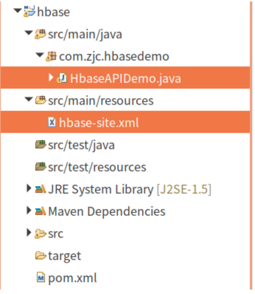

代码

+   hbase-site.xml

就是hbase的配置文件

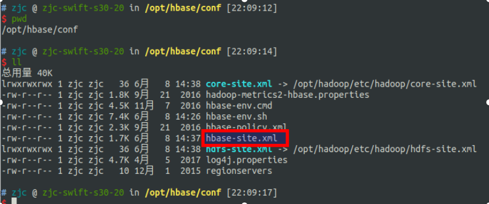

文件具体内容（参考前面安装HBase）

```xml
<?xml version="1.0"?>
<?xml-stylesheet type="text/xsl" href="configuration.xsl"?>
<!-- /** * * Licensed to the Apache Software Foundation (ASF) under one *
    or more contributor license agreements. See the NOTICE file * distributed
    with this work for additional information * regarding copyright ownership.
    The ASF licenses this file * to you under the Apache License, Version 2.0
    (the * "License"); you may not use this file except in compliance * with
    the License. You may obtain a copy of the License at * * http://www.apache.org/licenses/LICENSE-2.0
    * * Unless required by applicable law or agreed to in writing, software *
    distributed under the License is distributed on an "AS IS" BASIS, * WITHOUT
    WARRANTIES OR CONDITIONS OF ANY KIND, either express or implied. * See the
    License for the specific language governing permissions and * limitations
    under the License. */ -->
<configuration>
    <!-- HBase数据存在Hadoop,这里写的是HDFS存储节点名称 -->
    <property>
        <name>hbase.rootdir</name>
        <value>hdfs://localhost:9000/hbase</value>
    </property>
    <property>
        <name>hbase.cluster.distributed</name>
        <value>true</value>
    </property>
    <!-- 0.98后的新变动，之前版本没有.port,默认端口为60000 -->
    <property>
        <name>hbase.master.port</name>
        <value>16000</value>
    </property>
    <!-- zookeeper集群的路径 -->
    <property>
        <name>hbase.zookeeper.quorum</name>
        <value>localhost:2181</value>
    </property>
    <!-- zookeeper的dataDir位置 -->
    <property>
        <name>hbase.zookeeper.property.dataDir</name>
        <value>/var/lib/zookeeper</value>
    </property>
</configuration>
```

+   HbaseAPIDemo.java

```java
package com.zjc.hbasedemo;

import java.io.IOException;
import java.io.PushbackInputStream;

import org.apache.hadoop.conf.Configuration;
import org.apache.hadoop.hbase.Cell;
import org.apache.hadoop.hbase.CellUtil;
import org.apache.hadoop.hbase.HBaseConfiguration;
import org.apache.hadoop.hbase.HColumnDescriptor;
import org.apache.hadoop.hbase.HTableDescriptor;
import org.apache.hadoop.hbase.NamespaceDescriptor;
import org.apache.hadoop.hbase.NamespaceNotFoundException;
import org.apache.hadoop.hbase.TableName;
import org.apache.hadoop.hbase.client.Admin;
import org.apache.hadoop.hbase.client.Connection;
import org.apache.hadoop.hbase.client.ConnectionFactory;
import org.apache.hadoop.hbase.client.Get;
import org.apache.hadoop.hbase.client.Put;
import org.apache.hadoop.hbase.client.Result;
import org.apache.hadoop.hbase.client.Table;
import org.apache.hadoop.hbase.util.Bytes;

public class HbaseAPIDemo {
    public static void main(String[] args) throws IOException {
        // 1. 创建配置对象，获取hbase的连接
        Configuration conf = HBaseConfiguration.create();
        Connection connection = ConnectionFactory.createConnection(conf);
        System.out.println(connection);
        // 2. 获取操作对象:Admin
        Admin admin = connection.getAdmin();

        // 3. 操作数据库
        // 3-1 判断命名空间
        try {
            admin.getNamespaceDescriptor("testnamespace");
        } catch (NamespaceNotFoundException e) {
            // 命名空间不存在的情况下则创建命名空间
            System.out.println("创建命名空间");
            NamespaceDescriptor nd = NamespaceDescriptor.create("testnamespace").build();
            admin.createNamespace(nd);
        }

        // 3-2 判断hbase中是否存在某张表
        TableName tableName = TableName.valueOf("testnamespace:student");
        boolean tableExistsFlg = admin.tableExists(tableName);

        // 3-3 表存在则查询数据，不存在则创建表
        if (tableExistsFlg) {
            // 3-3-1 查询数据

            // 获取表对象
            String rowkey = "1001";
            Table table = connection.getTable(tableName);
            Get get = new Get(Bytes.toBytes(rowkey));

            // 查询结果
            Result result = table.get(get);
            boolean empty = result.isEmpty();

            // 如果查询不到增加数据,否则展示数据
            if (empty) {
                // 增加数据
                Put put = new Put(Bytes.toBytes(rowkey));
                byte[] family = Bytes.toBytes("info");  // 列族
                byte[] qualifier = Bytes.toBytes("name");   // 列
                byte[] value = Bytes.toBytes("zhangsan");   // 值
                put.addColumn(family, qualifier, value);

                table.put(put);

                System.out.println("增加数据");
            } else {
                System.out.println("展示数据");
                // 展示数据
                for (Cell cell : result.rawCells()) {
                    System.out.println("value=" + Bytes.toString(CellUtil.cloneValue(cell)));
                    System.out.println("rowkey=" + Bytes.toString(CellUtil.cloneRow(cell)));
                    System.out.println("family=" + Bytes.toString(CellUtil.cloneFamily(cell)));
                    System.out.println("column=" + Bytes.toString(CellUtil.cloneQualifier(cell)));
                }
            }
        } else {
            // 3-3-1 创建表
            System.out.println("创建表");
            // 创建表描述对象
            HTableDescriptor td = new HTableDescriptor(tableName);
            // 增加列族
            HColumnDescriptor cd = new HColumnDescriptor("info");
            td.addFamily(cd);

            admin.createTable(td);
        }
        // 4. 关闭数据库连接
        connection.close();
    }
}
```

## 封装HBaseUtil

### 主要要注意线程安全

什么是ThreadLocal

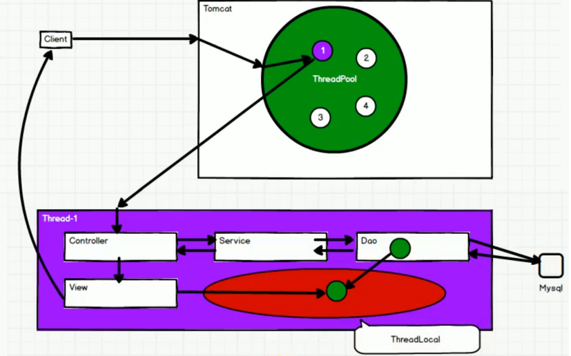

1.  进程之间空间相互独立
2.  进程可以有多个线程，但总的来说，线程之间共享一块空间
3.  对于线程池来说，若是创建的是static对象，则对象只会创建一个且所有线程共用
4.  而多线程共用一个对象且多线程对这个对象都能够进行开和关，则会出现问题。比如：A线程访问对象，B线程也访问这个对象，但A线程访问完之后，将对象关闭了，此时B会出错，因为对象没有了
5.  解决方案，使用ThreadLocal对象，开辟线程自己的空间
    1.  ThreadLocal解决线程存储问题,并不能解决线程安全问题(所有线程共用一个对象)。但我们只要保证对象不同就能解决线程安全问题，所以此时只将对象创建在线程内独立的空间，这样就能将对象分开了。
    2.  当然有其他解决方案，这里connHolder因为有static关键字是单例（和单例模式区分开），我们可以不使用static关键字，变成多例，也能解决线程安全问题

### 封装代码

HBaseUtil.java

```java
package com.zjc.util;

import java.io.IOException;

import org.apache.hadoop.conf.Configuration;
import org.apache.hadoop.hbase.HBaseConfiguration;
import org.apache.hadoop.hbase.TableName;
import org.apache.hadoop.hbase.client.Connection;
import org.apache.hadoop.hbase.client.ConnectionFactory;
import org.apache.hadoop.hbase.client.Put;
import org.apache.hadoop.hbase.client.Table;
import org.apache.hadoop.hbase.util.Bytes;

/**
 * HBase操作工具类
 */
public class HBaseUtil {
    // ThreadLocal
    // 用以解决多线程问题,用来操作线程的本地存储
    // ThreadLocal解决线程存储问题,并不能解决线程安全问题(所有线程共用一个对象)。但我们只要保证对象不同就能解决线程安全问题，所以此时只将对象创建在线程内独立的空间，这样就能将对象分开了。
    // 当然有其他解决方案，这里connHolder因为有static关键字是单例（和单例模式区分开）
    // 我们可以不使用static关键字，变成多例，也能解决线程安全问题
    private static ThreadLocal<Connection> connHolder = new ThreadLocal<Connection>();

    private HBaseUtil() {

    }

    /**
     * 获取Hbase连接对象
     * @throws IOException
     */
    public static void makeHBaseConnection() throws IOException {
        Connection conn = connHolder.get();
        if ( conn == null) {
            Configuration conf = HBaseConfiguration.create();
            conn = ConnectionFactory.createConnection(conf);
            connHolder.set(conn);
        }
    }

    /**
     * 增加数据
     * @throws IOException
     */
    public static void insertData(String tableName, String rowkey, String family, String column, String value) throws IOException {
        Connection conn = connHolder.get();
        Table table = conn.getTable(TableName.valueOf(tableName));
        Put put = new Put(Bytes.toBytes(rowkey));
        put.addColumn(Bytes.toBytes(family), Bytes.toBytes(column), Bytes.toBytes(value));
        table.put(put);
        table.close();
    }

    /**
     * 关闭HBase连接对象
     * @throws Exception
     */
    public static void close() throws Exception {
        Connection conn = connHolder.get();
        if (conn != null) {
            conn.close();
            connHolder.remove();
        }
    }
}
```

### 测试

HbaseAPIDemo2.java

```java
package com.zjc.hbasedemo;

import com.zjc.util.HBaseUtil;

public class HbaseAPIDemo2 {
    public static void main(String[] args) throws Exception {
        // 创建连接
        HBaseUtil.makeHBaseConnection();
        // 增加数据
        HBaseUtil.insertData("testnamespace:student", "1002", "info", "name", "lisi");
        // 关闭连接
        HBaseUtil.close();
    }
}
```

## 配置参数说明

```xml
<?xml version="1.0"?>
<?xml-stylesheet type="text/xsl" href="configuration.xsl"?>
<configuration>
    <!-- hbase的本地临时目录,每次机器重启数据会丢失，建议放到某个持久化文件目录下 -->
    <property>
        <name>hbase.tmp.dir</name>
        <value>${java.io.tmpdir}/hbase-${user.name}</value>
        <description>Temporary directory on the local filesystem.
            Change this setting to point to a location more permanent
            than '/tmp', the usual resolve for java.io.tmpdir, as the
            '/tmp' directory is cleared on machine restart.
        </description>
    </property>
    <!-- 每个regionServer的共享目录,用来持久化Hbase,默认情况下在/tmp/hbase下面 -->
    <property>
        <name>hbase.rootdir</name>
        <value>${hbase.tmp.dir}/hbase</value>
        <description>The directory shared by region servers and into
            which HBase persists. The URL should be 'fully-qualified'
            to include the filesystem scheme. For example, to specify the
            HDFS directory '/hbase' where the HDFS instance's namenode is
            running at namenode.example.org on port 9000, set this value to:
            hdfs://namenode.example.org:9000/hbase. By default, we write
            to whatever ${hbase.tmp.dir} is set too -- usually /tmp --
            so change this configuration or else all data will be lost on
            machine restart.
        </description>
    </property>
    <!-- hbase底层如果使用hdfs作为文件系统，这里是指默认在文件系统的临时存储目录用来存储临时数据 -->
    <property>
        <name>hbase.fs.tmp.dir</name>
        <value>/user/${user.name}/hbase-staging</value>
        <description>A staging directory in default file system (HDFS)
            for keeping temporary data.
        </description>
    </property>
    <!-- hdfs里面批量装载的目录 -->
    <property>
        <name>hbase.bulkload.staging.dir</name>
        <value>${hbase.fs.tmp.dir}</value>
        <description>A staging directory in default file system (HDFS)
            for bulk loading.
        </description>
    </property>
    <!-- hbase集群模式,false表示hbase的单机，true表示是分布式模式 -->
    <property>
        <name>hbase.cluster.distributed</name>
        <value>false</value>
        <description>The mode the cluster will be in. Possible values are
            false for standalone mode and true for distributed mode. If
            false, startup will run all HBase and ZooKeeper daemons together
            in the one JVM.
        </description>
    </property>
    <!-- hbase依赖的zk地址 -->
    <property>
        <name>hbase.zookeeper.quorum</name>
        <value>localhost</value>
        <description>Comma separated list of servers in the ZooKeeper ensemble
            (This config. should have been named hbase.zookeeper.ensemble).
            For example, "host1.mydomain.com,host2.mydomain.com,host3.mydomain.com".
            By default this is set to localhost for local and pseudo-distributed
            modes
            of operation. For a fully-distributed setup, this should be set to a
            full
            list of ZooKeeper ensemble servers. If HBASE_MANAGES_ZK is set in
            hbase-env.sh
            this is the list of servers which hbase will start/stop ZooKeeper on as
            part of cluster start/stop. Client-side, we will take this list of
            ensemble members and put it together with the
            hbase.zookeeper.clientPort
            config. and pass it into zookeeper constructor as the connectString
            parameter.
        </description>
    </property>
    <!-- 如果是本地存储，位于本地文件系统的路径 -->
    <property>
        <name>hbase.local.dir</name>
        <value>${hbase.tmp.dir}/local/</value>
        <description>Directory on the local filesystem to be used
            as a local storage.
        </description>
    </property>

    <!-- hbase master节点的端口 -->
    <property>
        <name>hbase.master.port</name>
        <value>16000</value>
        <description>The port the HBase Master should bind to.</description>
    </property>
    <!-- hbase master的web ui页面的端口 -->
    <property>
        <name>hbase.master.info.port</name>
        <value>16010</value>
        <description>The port for the HBase Master web UI.
            Set to -1 if you do not want a UI instance run.
        </description>
    </property>
    <!-- hbase master的web ui页面绑定的地址 -->
    <property>
        <name>hbase.master.info.bindAddress</name>
        <value>0.0.0.0</value>
        <description>The bind address for the HBase Master web UI
        </description>
    </property>
    <!-- 不知道干什么用 -->
    <property>
        <name>hbase.master.logcleaner.plugins</name>
        <value>org.apache.hadoop.hbase.master.cleaner.TimeToLiveLogCleaner
        </value>
        <description>A comma-separated list of BaseLogCleanerDelegate invoked
            by
            the LogsCleaner service. These WAL cleaners are called in order,
            so put the cleaner that prunes the most files in front. To
            implement your own BaseLogCleanerDelegate, just put it in HBase's classpath
            and add the fully qualified class name here. Always add the above
            default log cleaners in the list.
        </description>
    </property>
    <!-- hbase清理oldlogdir目录下的hlog文件的最长时间 ，单位毫秒 -->
    <property>
        <name>hbase.master.logcleaner.ttl</name>
        <value>600000</value>
        <description>Maximum time a WAL can stay in the .oldlogdir directory,
            after which it will be cleaned by a Master thread.
        </description>
    </property>
    <property>
        <name>hbase.master.hfilecleaner.plugins</name>
        <value>org.apache.hadoop.hbase.master.cleaner.TimeToLiveHFileCleaner
        </value>
        <description>A comma-separated list of BaseHFileCleanerDelegate
            invoked by
            the HFileCleaner service. These HFiles cleaners are called in order,
            so put the cleaner that prunes the most files in front. To
            implement your own BaseHFileCleanerDelegate, just put it in HBase's classpath
            and add the fully qualified class name here. Always add the above
            default log cleaners in the list as they will be overwritten in
            hbase-site.xml.
        </description>
    </property>
    <!-- 不知道干嘛的 -->
    <property>
        <name>hbase.master.catalog.timeout</name>
        <value>600000</value>
        <description>Timeout value for the Catalog Janitor from the master to
            META.
        </description>
    </property>
    <!-- master是否监听master web ui端口并重定向请求给web ui服务器，该配置是master和RegionServer共享 -->
    <property>
        <name>hbase.master.infoserver.redirect</name>
        <value>true</value>
        <description>Whether or not the Master listens to the Master web
            UI port (hbase.master.info.port) and redirects requests to the web
            UI server shared by the Master and RegionServer.
        </description>
    </property>

    <!-- hbase regionServer的默认端口 -->
    <property>
        <name>hbase.regionserver.port</name>
        <value>16020</value>
        <description>The port the HBase RegionServer binds to.</description>
    </property>
    <!-- hbase regionServer的web ui的默认端口 -->
    <property>
        <name>hbase.regionserver.info.port</name>
        <value>16030</value>
        <description>The port for the HBase RegionServer web UI
            Set to -1 if you do not want the RegionServer UI to run.
        </description>
    </property>
    <!-- hbase regionServer的web ui绑定地址 -->
    <property>
        <name>hbase.regionserver.info.bindAddress</name>
        <value>0.0.0.0</value>
        <description>The address for the HBase RegionServer web UI
        </description>
    </property>
    <!-- 如果regionServer默认的端口被暂用了，是否允许hbase搜索一个可用的端口来绑定 -->
    <property>
        <name>hbase.regionserver.info.port.auto</name>
        <value>false</value>
        <description>Whether or not the Master or RegionServer
            UI should search for a port to bind to. Enables automatic port
            search if hbase.regionserver.info.port is already in use.
            Useful for testing, turned off by default.
        </description>
    </property>
    <!-- regionServer端默认开启的RPC监控实例数，也即RegionServer能够处理的IO请求线程数 -->
    <property>
        <name>hbase.regionserver.handler.count</name>
        <value>30</value>
        <description>Count of RPC Listener instances spun up on RegionServers.
            Same property is used by the Master for count of master handlers.
        </description>
    </property>
    <!-- hbase提供的可以用来处理请求的队列数 0.1 * 总数，如果为0则表示所有请求公用一个队列， 如果为1则表示每个请求自己有一个独立的队列 -->
    <property>
        <name>hbase.ipc.server.callqueue.handler.factor</name>
        <value>0.1</value>
        <description>Factor to determine the number of call queues.
            A value of 0 means a single queue shared between all the handlers.
            A value of 1 means that each handler has its own queue.
        </description>
    </property>
    <!-- hbase提供的读写队列数比例,参数值为0-1之间，如果为0则所有队列同时处理读写请求 -->
    <!-- 现在假设我们有10个队列 1、该值设置为0，则这10个队列同时处理读写请求 2、该值设置为1，则1个队列处理写情况，9个队列处理读请求
        3、该值设置为0.x,则x个队列处理处理读请求，10-x个队列处理写请求 4、根据实际情况，读多写少还是写少读多，可按需配置 -->
    <property>
        <name>hbase.ipc.server.callqueue.read.ratio</name>
        <value>0</value>
        <description>Split the call queues into read and write queues.
            The specified interval (which should be between 0.0 and 1.0)
            will be multiplied by the number of call queues.
            A value of 0 indicate to not split the call queues, meaning that both
            read and write
            requests will be pushed to the same set of queues.
            A value lower than 0.5 means that there will be less read queues than
            write queues.
            A value of 0.5 means there will be the same number of read and write
            queues.
            A value greater than 0.5 means that there will be more read queues
            than write queues.
            A value of 1.0 means that all the queues except one are used to
            dispatch read requests.

            Example: Given the total number of call queues being 10
            a read.ratio of 0 means that: the 10 queues will contain both
            read/write requests.
            a read.ratio of 0.3 means that: 3 queues will contain only read
            requests
            and 7 queues will contain only write requests.
            a read.ratio of 0.5 means that: 5 queues will contain only read
            requests
            and 5 queues will contain only write requests.
            a read.ratio of 0.8 means that: 8 queues will contain only read
            requests
            and 2 queues will contain only write requests.
            a read.ratio of 1 means that: 9 queues will contain only read requests
            and 1 queues will contain only write requests.
        </description>
    </property>
    <!-- hbase提供的用于支持get/scan请求的队列比例 -->
    <property>
        <name>hbase.ipc.server.callqueue.scan.ratio</name>
        <value>0</value>
        <description>Given the number of read call queues, calculated from the
            total number
            of call queues multiplied by the callqueue.read.ratio, the scan.ratio
            property
            will split the read call queues into small-read and long-read queues.
            A value lower than 0.5 means that there will be less long-read queues
            than short-read queues.
            A value of 0.5 means that there will be the same number of short-read
            and long-read queues.
            A value greater than 0.5 means that there will be more long-read
            queues than short-read queues
            A value of 0 or 1 indicate to use the same set of queues for gets and
            scans.

            Example: Given the total number of read call queues being 8
            a scan.ratio of 0 or 1 means that: 8 queues will contain both long and
            short read requests.
            a scan.ratio of 0.3 means that: 2 queues will contain only long-read
            requests
            and 6 queues will contain only short-read requests.
            a scan.ratio of 0.5 means that: 4 queues will contain only long-read
            requests
            and 4 queues will contain only short-read requests.
            a scan.ratio of 0.8 means that: 6 queues will contain only long-read
            requests
            and 2 queues will contain only short-read requests.
        </description>
    </property>
    <!-- regionServer发送消息给Master的时间间隔,单位是毫秒 -->
    <property>
        <name>hbase.regionserver.msginterval</name>
        <value>3000</value>
        <description>Interval between messages from the RegionServer to Master
            in milliseconds.
        </description>
    </property>
    <!-- regionServer日志滚动提交的周期,不管这个日志有没有写满 -->
    <property>
        <name>hbase.regionserver.logroll.period</name>
        <value>3600000</value>
        <description>Period at which we will roll the commit log regardless
            of how many edits it has.
        </description>
    </property>
    <!-- 在regionServer上的WAL日志，在停止服务前允许的关闭 WAL 的连续错误数量 比如如果我们日志在滚动提交的是，此时wal写入错误，那么就会立即停止regionServer的服务
        默认值2表示运行有2个错误发生 -->
    <property>
        <name>hbase.regionserver.logroll.errors.tolerated</name>
        <value>2</value>
        <description>The number of consecutive WAL close errors we will allow
            before triggering a server abort. A setting of 0 will cause the
            region server to abort if closing the current WAL writer fails during
            log rolling. Even a small value (2 or 3) will allow a region server
            to ride over transient HDFS errors.
        </description>
    </property>
    <!-- regionServer的WAL文件读取的实现类 -->
    <property>
        <name>hbase.regionserver.hlog.reader.impl</name>
        <value>org.apache.hadoop.hbase.regionserver.wal.ProtobufLogReader
        </value>
        <description>The WAL file reader implementation.</description>
    </property>
    <!-- regionServer的WAL文件写的实现类 -->
    <property>
        <name>hbase.regionserver.hlog.writer.impl</name>
        <value>org.apache.hadoop.hbase.regionserver.wal.ProtobufLogWriter
        </value>
        <description>The WAL file writer implementation.</description>
    </property>
    <!-- regionServer的全局memstore的大小，超过该大小会触发flush到磁盘的操作,默认是堆大小的40%,而且regionserver级别的
        flush会阻塞客户端读写 -->
    <property>
        <name>hbase.regionserver.global.memstore.size</name>
        <value></value>
        <description>Maximum size of all memstores in a region server before
            new
            updates are blocked and flushes are forced. Defaults to 40% of heap (0.4).
            Updates are blocked and flushes are forced until size of all
            memstores
            in a region server hits
            hbase.regionserver.global.memstore.size.lower.limit.
            The default value in this configuration has been intentionally left
            emtpy in order to
            honor the old hbase.regionserver.global.memstore.upperLimit property if
            present.
        </description>
    </property>
    <!--可以理解为一个安全的设置，有时候集群的“写负载”非常高，写入量一直超过flush的量，这时，我们就希望memstore不要超过一定的安全设置。
        在这种情况下，写操作就要被阻塞一直到memstore恢复到一个“可管理”的大小, 这个大小就是默认值是堆大小 * 0.4 * 0.95，也就是当regionserver级别
        的flush操作发送后,会阻塞客户端写,一直阻塞到整个regionserver级别的memstore的大小为 堆大小 * 0.4 *0.95为止 -->
    <property>
        <name>hbase.regionserver.global.memstore.size.lower.limit</name>
        <value></value>
        <description>Maximum size of all memstores in a region server before
            flushes are forced.
            Defaults to 95% of hbase.regionserver.global.memstore.size (0.95).
            A 100% value for this value causes the minimum possible flushing to
            occur when updates are
            blocked due to memstore limiting.
            The default value in this configuration has been intentionally left
            emtpy in order to
            honor the old hbase.regionserver.global.memstore.lowerLimit property if
            present.
        </description>
    </property>
    <!-- 内存中的文件在自动刷新之前能够存活的最长时间，默认是1h -->
    <property>
        <name>hbase.regionserver.optionalcacheflushinterval</name>
        <value>3600000</value>
        <description>
            Maximum amount of time an edit lives in memory before being automatically
            flushed.
            Default 1 hour. Set it to 0 to disable automatic flushing.
        </description>
    </property>
    <property>
        <name>hbase.regionserver.catalog.timeout</name>
        <value>600000</value>
        <description>Timeout value for the Catalog Janitor from the
            regionserver to META.</description>
    </property>
    <!-- 当使用dns的时候，regionServer用来上报IP地址的网络接口名字 -->
    <property>
        <name>hbase.regionserver.dns.interface</name>
        <value>default</value>
        <description>The name of the Network Interface from which a region
            server
            should report its IP address.
        </description>
    </property>
    <!-- 当使用DNS的时候，RegionServer使用的DNS的域名或者IP 地址，RegionServer用它来确定和master用来进行通讯的域名 -->
    <property>
        <name>hbase.regionserver.dns.nameserver</name>
        <value>default</value>
        <description>The host name or IP address of the name server (DNS)
            which a region server should use to determine the host name used by
            the
            master for communication and display purposes.
        </description>
    </property>
    <!-- region在切分的时候的默认切分策略 -->
    <property>
        <name>hbase.regionserver.region.split.policy</name>
        <value>org.apache.hadoop.hbase.regionserver.IncreasingToUpperBoundRegionSplitPolicy</value>
        <description>
            A split policy determines when a region should be split. The various
            other split policies that
            are available currently are ConstantSizeRegionSplitPolicy,
            DisabledRegionSplitPolicy,
            DelimitedKeyPrefixRegionSplitPolicy, KeyPrefixRegionSplitPolicy etc.
        </description>
    </property>
    <!-- 当某个HRegionServer上的region到达这个限制时，不会在进行region切分，也就是一个HRegionServer默认最大允许有1000个region -->
    <property>
        <name>hbase.regionserver.regionSplitLimit</name>
        <value>1000</value>
        <description>
            Limit for the number of regions after which no more region splitting
            should take place.
            This is not hard limit for the number of regions but acts as a guideline
            for the regionserver
            to stop splitting after a certain limit. Default is set to 1000.
        </description>
    </property>

    <!-- zk sesscion超时时间 -->
    <property>
        <name>zookeeper.session.timeout</name>
        <value>90000</value>
        <description>ZooKeeper session timeout in milliseconds. It is used in
            two different ways.
            First, this value is used in the ZK client that HBase uses to connect to
            the ensemble.
            It is also used by HBase when it starts a ZK server and it is passed as
            the 'maxSessionTimeout'. See
            http://hadoop.apache.org/zookeeper/docs/current/zookeeperProgrammers.html#ch_zkSessions.
            For example, if a HBase region server connects to a ZK ensemble
            that's also managed by HBase, then the
            session timeout will be the one specified by this configuration. But, a
            region server that connects
            to an ensemble managed with a different configuration will be subjected
            that ensemble's maxSessionTimeout. So,
            even though HBase might propose using 90 seconds, the ensemble can have a
            max timeout lower than this and
            it will take precedence. The current default that ZK ships with is 40
            seconds, which is lower than HBase's.
        </description>
    </property>
    <!-- hbase在zk上默认的根目录 -->
    <property>
        <name>zookeeper.znode.parent</name>
        <value>/hbase</value>
        <description>Root ZNode for HBase in ZooKeeper. All of HBase's
            ZooKeeper
            files that are configured with a relative path will go under this node.
            By default, all of HBase's ZooKeeper file path are configured with a
            relative path, so they will all go under this directory unless
            changed.
        </description>
    </property>
    <!-- hbase在zk上的节点路径 -->
    <property>
        <name>zookeeper.znode.rootserver</name>
        <value>root-region-server</value>
        <description>Path to ZNode holding root region location. This is
            written by
            the master and read by clients and region servers. If a relative path is
            given, the parent folder will be ${zookeeper.znode.parent}. By
            default,
            this means the root location is stored at /hbase/root-region-server.
        </description>
    </property>
    <!-- hbase在zk上节点使用的权限 -->
    <property>
        <name>zookeeper.znode.acl.parent</name>
        <value>acl</value>
        <description>Root ZNode for access control lists.</description>
    </property>
    <property>
        <name>hbase.zookeeper.dns.interface</name>
        <value>default</value>
        <description>The name of the Network Interface from which a ZooKeeper
            server
            should report its IP address.
        </description>
    </property>
    <property>
        <name>hbase.zookeeper.dns.nameserver</name>
        <value>default</value>
        <description>The host name or IP address of the name server (DNS)
            which a ZooKeeper server should use to determine the host name used
            by the
            master for communication and display purposes.
        </description>
    </property>
    <!-- zk的使用端口 -->
    <property>
        <name>hbase.zookeeper.peerport</name>
        <value>2888</value>
        <description>Port used by ZooKeeper peers to talk to each other.
            See
            http://hadoop.apache.org/zookeeper/docs/r3.1.1/zookeeperStarted.html#sc_RunningReplicatedZooKeeper
            for more information.
        </description>
    </property>
    <!-- zk直接执行leader选举时通讯的端口 -->
    <property>
        <name>hbase.zookeeper.leaderport</name>
        <value>3888</value>
        <description>Port used by ZooKeeper for leader election.
            See
            http://hadoop.apache.org/zookeeper/docs/r3.1.1/zookeeperStarted.html#sc_RunningReplicatedZooKeeper
            for more information.
        </description>
    </property>
    <!-- zk是否支持多重更新 -->
    <property>
        <name>hbase.zookeeper.useMulti</name>
        <value>true</value>
        <description>Instructs HBase to make use of ZooKeeper's multi-update
            functionality.
            This allows certain ZooKeeper operations to complete more quickly and
            prevents some issues
            with rare Replication failure scenarios (see the release note of
            HBASE-2611 for an example).
            IMPORTANT: only set this to true if all ZooKeeper servers in the cluster are on
            version 3.4+
            and will not be downgraded. ZooKeeper versions before 3.4 do not support
            multi-update and
            will not fail gracefully if multi-update is invoked (see ZOOKEEPER-1495).
        </description>
    </property>
    <!-- 是否允许HBaseConfiguration去读取zk的配置文件，不清楚意义是什么? -->
    <property>
        <name>hbase.config.read.zookeeper.config</name>
        <value>false</value>
        <description>
            Set to true to allow HBaseConfiguration to read the
            zoo.cfg file for ZooKeeper properties. Switching this to true
            is not recommended, since the functionality of reading ZK
            properties from a zoo.cfg file has been deprecated.
        </description>
    </property>
    <property>
        <name>hbase.zookeeper.property.initLimit</name>
        <value>10</value>
        <description>Property from ZooKeeper's config zoo.cfg.
            The number of ticks that the initial synchronization phase can take.
        </description>
    </property>
    <property>
        <name>hbase.zookeeper.property.syncLimit</name>
        <value>5</value>
        <description>Property from ZooKeeper's config zoo.cfg.
            The number of ticks that can pass between sending a request and getting
            an
            acknowledgment.
        </description>
    </property>
    <property>
        <name>hbase.zookeeper.property.dataDir</name>
        <value>${hbase.tmp.dir}/zookeeper</value>
        <description>Property from ZooKeeper's config zoo.cfg.
            The directory where the snapshot is stored.
        </description>
    </property>
    <property>
        <name>hbase.zookeeper.property.clientPort</name>
        <value>2181</value>
        <description>Property from ZooKeeper's config zoo.cfg.
            The port at which the clients will connect.
        </description>
    </property>
    <property>
        <name>hbase.zookeeper.property.maxClientCnxns</name>
        <value>300</value>
        <description>Property from ZooKeeper's config zoo.cfg.
            Limit on number of concurrent connections (at the socket level) that a
            single client, identified by IP address, may make to a single member
            of
            the ZooKeeper ensemble. Set high to avoid zk connection issues running
            standalone and pseudo-distributed.
        </description>
    </property>

    <!--Client configurations -->
    <!-- hbase客户端每次 写缓冲的大小(也就是客户端批量提交到server端)，这块大小会同时占用客户端和服务端，缓冲区更大可以减少RPC次数，但是更大意味着内存占用更多 -->
    <property>
        <name>hbase.client.write.buffer</name>
        <value>2097152</value>
        <description>Default size of the HTable client write buffer in bytes.
            A bigger buffer takes more memory -- on both the client and server
            side since server instantiates the passed write buffer to process
            it -- but a larger buffer size reduces the number of RPCs made.
            For an estimate of server-side memory-used, evaluate
            hbase.client.write.buffer * hbase.regionserver.handler.count
        </description>
    </property>
    <!-- 在hbase发生请求失败的情况下,每次重试的等待时间 ,如果某段时间网络持续不好,重试会一直发生,如果还是连不上,就会放弃连接,在重试的过程中,会阻塞其它线程来抢锁,如果长时间的超时会导致业务处理的阻塞 -->
    <property>
        <name>hbase.client.pause</name>
        <value>100</value>
        <description>General client pause value. Used mostly as value to wait
            before running a retry of a failed get, region lookup, etc.
            See hbase.client.retries.number for description of how we backoff from
            this initial pause amount and how this pause works w/ retries.
        </description>
    </property>
    <!--重试次数，如果连不上或者fail，会重试 -->
    <property>
        <name>hbase.client.retries.number</name>
        <value>35</value>
        <description>Maximum retries. Used as maximum for all retryable
            operations such as the getting of a cell's value, starting a row
            update,
            etc. Retry interval is a rough function based on hbase.client.pause. At
            first we retry at this interval but then with backoff, we pretty
            quickly reach
            retrying every ten seconds. See HConstants#RETRY_BACKOFF for how the backup
            ramps up. Change this setting and hbase.client.pause to suit your
            workload.
        </description>
    </property>
    <!-- 单个Htable实例发送给集群的最大任务数,也就是同一个实例最大的并发数 -->
    <property>
        <name>hbase.client.max.total.tasks</name>
        <value>100</value>
        <description>The maximum number of concurrent tasks a single HTable
            instance will
            send to the cluster.
        </description>
    </property>
    <!-- 单个Htable实例发给regionServer的最大的任务并发数 -->
    <property>
        <name>hbase.client.max.perserver.tasks</name>
        <value>5</value>
        <description>The maximum number of concurrent tasks a single HTable
            instance will
            send to a single region server.
        </description>
    </property>
    <!-- 客户端到一个region的最大连接数，也就是说如果一个客户端有超过配置项值到某个region的连接，后面的请求会被阻塞 -->
    <property>
        <name>hbase.client.max.perregion.tasks</name>
        <value>1</value>
        <description>The maximum number of concurrent connections the client
            will
            maintain to a single Region. That is, if there is already
            hbase.client.max.perregion.tasks writes in progress for this region,
            new puts
            won't be sent to this region until some writes finishes.
        </description>
    </property>
    <!-- 在执行hbase scan操作的时候，客户端缓存的行数，设置小意味着更多的rpc次数，设置大比较吃内存 -->
    <property>
        <name>hbase.client.scanner.caching</name>
        <value>2147483647</value>
        <description>Number of rows that we try to fetch when calling next
            on a scanner if it is not served from (local, client) memory. This
            configuration
            works together with hbase.client.scanner.max.result.size to try and use
            the
            network efficiently. The default value is Integer.MAX_VALUE by default so
            that
            the network will fill the chunk size defined by
            hbase.client.scanner.max.result.size
            rather than be limited by a particular number of rows since the size of
            rows varies
            table to table. If you know ahead of time that you will not require more
            than a certain
            number of rows from a scan, this configuration should be set to that row
            limit via
            Scan#setCaching. Higher caching values will enable faster scanners but will eat up
            more
            memory and some calls of next may take longer and longer times when the
            cache is empty.
            Do not set this value such that the time between invocations is greater
            than the scanner
            timeout; i.e. hbase.client.scanner.timeout.period
        </description>
    </property>
    <!--一个KeyValue实例的最大大小，这是存储文件中一个entry的容量上限,因为一个KeyValue是不能分割的， 所有可以避免因为数据过大导致region不可分割 -->
    <property>
        <name>hbase.client.keyvalue.maxsize</name>
        <value>10485760</value>
        <description>Specifies the combined maximum allowed size of a KeyValue
            instance. This is to set an upper boundary for a single entry saved
            in a
            storage file. Since they cannot be split it helps avoiding that a region
            cannot be split any further because the data is too large. It seems
            wise
            to set this to a fraction of the maximum region size. Setting it to
            zero
            or less disables the check.
        </description>
    </property>
    <!-- scan操作中单次rpc的超时时间(比较重要的参数) -->
    <property>
        <name>hbase.client.scanner.timeout.period</name>
        <value>60000</value>
        <description>Client scanner lease period in milliseconds.
        </description>
    </property>
    <property>
        <name>hbase.client.localityCheck.threadPoolSize</name>
        <value>2</value>
    </property>
    <!--Miscellaneous configuration -->
    <property>
        <name>hbase.bulkload.retries.number</name>
        <value>10</value>
        <description>Maximum retries. This is maximum number of iterations
            to atomic bulk loads are attempted in the face of splitting operations
            0 means never give up.
        </description>
    </property>
    <property>
        <name>hbase.balancer.period</name>
        <value>300000</value>
        <description>Period at which the region balancer runs in the Master.
        </description>
    </property>
    <property>
        <name>hbase.normalizer.period</name>
        <value>1800000</value>
        <description>Period at which the region normalizer runs in the Master.
        </description>
    </property>
    <!-- HRegion负载迁移的时候的一个配置参数,具体怎么用可看HMaster里面的负载迁移的源代码 -->
    <property>
        <name>hbase.regions.slop</name>
        <value>0.2</value>
        <description>Rebalance if any regionserver has average + (average *
            slop) regions.</description>
    </property>
    <!-- 每次线程唤醒的周期 -->
    <property>
        <name>hbase.server.thread.wakefrequency</name>
        <value>10000</value>
        <description>Time to sleep in between searches for work (in
            milliseconds).
            Used as sleep interval by service threads such as log roller.
        </description>
    </property>
    <property>
        <name>hbase.server.versionfile.writeattempts</name>
        <value>3</value>
        <description>
            How many time to retry attempting to write a version file
            before just aborting. Each attempt is seperated by the
            hbase.server.thread.wakefrequency milliseconds.
        </description>
    </property>
    <!-- 单个region里memstore的缓存大小，超过那么整个HRegion就会flush,默认128M -->
    <property>
        <name>hbase.hregion.memstore.flush.size</name>
        <value>134217728</value>
        <description>
            Memstore will be flushed to disk if size of the memstore
            exceeds this number of bytes. Value is checked by a thread that runs
            every hbase.server.thread.wakefrequency.
        </description>
    </property>
    <property>
        <name>hbase.hregion.percolumnfamilyflush.size.lower.bound</name>
        <value>16777216</value>
        <description>
            If FlushLargeStoresPolicy is used, then every time that we hit the
            total memstore limit, we find out all the column families whose
            memstores
            exceed this value, and only flush them, while retaining the others whose
            memstores are lower than this limit. If none of the families have
            their
            memstore size more than this, all the memstores will be flushed
            (just as usual). This value should be less than half of the total memstore
            threshold (hbase.hregion.memstore.flush.size).
        </description>
    </property>
    <!--当一个 region 中的 memstore 的大小大于这个值的时候，我们又触发 了 close.会先运行“pre-flush”操作，清理这个需要关闭的
        memstore，然后 将这个 region 下线。当一个 region 下线了，我们无法再进行任何写操作。 如果一个 memstore 很大的时候，flush
        操作会消耗很多时间。"pre-flush" 操作意味着在 region 下线之前，会先把 memstore 清空。这样在最终执行 close 操作的时候，flush
        操作会很快。 -->
    <property>
        <name>hbase.hregion.preclose.flush.size</name>
        <value>5242880</value>
        <description>
            If the memstores in a region are this size or larger when we go
            to close, run a "pre-flush" to clear out memstores before we put up
            the region closed flag and take the region offline. On close,
            a flush is run under the close flag to empty memory. During
            this time the region is offline and we are not taking on any writes.
            If the memstore content is large, this flush could take a long time to
            complete. The preflush is meant to clean out the bulk of the memstore
            before putting up the close flag and taking the region offline so the
            flush that runs under the close flag has little to do.
        </description>
    </property>
    <!-- 当一个HRegion上的memstore的大小满足hbase.hregion.memstore.block.multiplier *
        hbase.hregion.memstore.flush.size, 这个HRegion会执行flush操作并阻塞对该HRegion的写入 -->
    <property>
        <name>hbase.hregion.memstore.block.multiplier</name>
        <value>4</value>
        <description>
            Block updates if memstore has hbase.hregion.memstore.block.multiplier
            times hbase.hregion.memstore.flush.size bytes. Useful preventing
            runaway memstore during spikes in update traffic. Without an
            upper-bound, memstore fills such that when it flushes the
            resultant flush files take a long time to compact or split, or
            worse, we OOME.
        </description>
    </property>
    <!-- 设置为true,有效减少在高并发写时候的内存碎片 -->
    <property>
        <name>hbase.hregion.memstore.mslab.enabled</name>
        <value>true</value>
        <description>
            Enables the MemStore-Local Allocation Buffer,
            a feature which works to prevent heap fragmentation under
            heavy write loads. This can reduce the frequency of stop-the-world
            GC pauses on large heaps.
        </description>
    </property>
    <!--HStoreFile最大的大小，当某个region的某个列族超过这个大小会进行region拆分 -->
    <property>
        <name>hbase.hregion.max.filesize</name>
        <value>10737418240</value>
        <description>
            Maximum HStoreFile size. If any one of a column families' HStoreFiles has
            grown to exceed this value, the hosting HRegion is split in two.
        </description>
    </property>
    <!-- 一个region进行 major compaction合并的周期,在这个点的时候， 这个region下的所有hfile会进行合并,默认是7天,major
        compaction非常耗资源,建议生产关闭(设置为0)，在应用空闲时间手动触发 -->
    <property>
        <name>hbase.hregion.majorcompaction</name>
        <value>604800000</value>
        <description>The time (in miliseconds) between 'major' compactions of
            all
            HStoreFiles in a region. Default: Set to 7 days. Major compactions tend to
            happen exactly when you need them least so enable them such that they
            run at
            off-peak for your deploy; or, since this setting is on a periodicity that is
            unlikely to match your loading, run the compactions via an external
            invocation out of a cron job or some such.
        </description>
    </property>
    <!-- 一个抖动比例，意思是说上一个参数设置是7天进行一次合并，也可以有50%的抖动比例 -->
    <property>
        <name>hbase.hregion.majorcompaction.jitter</name>
        <value>0.50</value>
        <description>Jitter outer bound for major compactions.
            On each regionserver, we multiply the hbase.region.majorcompaction
            interval by some random fraction that is inside the bounds of this
            maximum. We then add this + or - product to when the next
            major compaction is to run. The idea is that major compaction
            does happen on every regionserver at exactly the same time. The
            smaller this number, the closer the compactions come together.
        </description>
    </property>
    <!-- 一个store里面允许存的hfile的个数，超过这个个数会被写到新的一个hfile里面 也即是每个region的每个列族对应的memstore在fulsh为hfile的时候，默认情况下当超过3个hfile的时候就会
        对这些文件进行合并重写为一个新文件，设置个数越大可以减少触发合并的时间，但是每次合并的时间就会越长 -->
    <property>
        <name>hbase.hstore.compactionThreshold</name>
        <value>3</value>
        <description>
            If more than this number of HStoreFiles in any one HStore
            (one HStoreFile is written per flush of memstore) then a compaction
            is run to rewrite all HStoreFiles files as one. Larger numbers
            put off compaction but when it runs, it takes longer to complete.
        </description>
    </property>
    <!-- 执行flush操作的线程数,设置小了刷新操作会排队，大了会增加底层hdfs的负载压力 -->
    <property>
        <name>hbase.hstore.flusher.count</name>
        <value>2</value>
        <description>
            The number of flush threads. With less threads, the memstore flushes
            will be queued. With
            more threads, the flush will be executed in parallel, increasing the hdfs
            load. This can
            lead as well to more compactions.
        </description>
    </property>
    <!-- 每个store阻塞更新请求的阀值,表示如果当前hstore中文件数大于该值，系统将会强制执行compaction操作进行文件合并， 合并的过程会阻塞整个hstore的写入,这样有个好处是避免compaction操作赶不上Hfile文件的生成速率 -->
    <property>
        <name>hbase.hstore.blockingStoreFiles</name>
        <value>10</value>
        <description>
            If more than this number of StoreFiles in any one Store
            (one StoreFile is written per flush of MemStore) then updates are
            blocked for this HRegion until a compaction is completed, or
            until hbase.hstore.blockingWaitTime has been exceeded.
        </description>
    </property>
    <!-- 每个store阻塞更新请求的超时时间，如果超过这个时间合并操作还未完成，阻塞也会取消 -->
    <property>
        <name>hbase.hstore.blockingWaitTime</name>
        <value>90000</value>
        <description>
            The time an HRegion will block updates for after hitting the StoreFile
            limit defined by hbase.hstore.blockingStoreFiles.
            After this time has elapsed, the HRegion will stop blocking updates even
            if a compaction has not been completed.
        </description>
    </property>
    <!-- 每个minor compaction操作的 允许的最大hfile文件上限 -->
    <property>
        <name>hbase.hstore.compaction.max</name>
        <value>10</value>
        <description>Max number of HStoreFiles to compact per 'minor'
            compaction.</description>
    </property>
    <!-- 在执行compaction操作的过程中，每次读取hfile文件的keyValue个数 -->
    <property>
        <name>hbase.hstore.compaction.kv.max</name>
        <value>10</value>
        <description>How many KeyValues to read and then write in a batch when
            flushing
            or compacting. Do less if big KeyValues and problems with OOME.
            Do more if wide, small rows.
        </description>
    </property>
    <property>
        <name>hbase.hstore.time.to.purge.deletes</name>
        <value>0</value>
        <description>The amount of time to delay purging of delete markers
            with future timestamps. If
            unset, or set to 0, all delete markers, including those with future
            timestamps, are purged
            during the next major compaction. Otherwise, a delete marker is kept until
            the major compaction
            which occurs after the marker's timestamp plus the value of this setting,
            in milliseconds.
        </description>
    </property>
    <property>
        <name>hbase.storescanner.parallel.seek.enable</name>
        <value>false</value>
        <description>
            Enables StoreFileScanner parallel-seeking in StoreScanner,
            a feature which can reduce response latency under special conditions.
        </description>
    </property>
    <property>
        <name>hbase.storescanner.parallel.seek.threads</name>
        <value>10</value>
        <description>
            The default thread pool size if parallel-seeking feature enabled.
        </description>
    </property>
    <!--LRUBlockCache块缓存的大小，默认为堆大小的40% -->
    <property>
        <name>hfile.block.cache.size</name>
        <value>0.4</value>
        <description>Percentage of maximum heap (-Xmx setting) to allocate to
            block cache
            used by HFile/StoreFile. Default of 0.4 means allocate 40%.
            Set to 0 to disable but it's not recommended; you need at least
            enough cache to hold the storefile indices.
        </description>
    </property>
    <property>
        <name>hfile.block.index.cacheonwrite</name>
        <value>false</value>
        <description>This allows to put non-root multi-level index blocks into
            the block
            cache at the time the index is being written.
        </description>
    </property>
    <property>
        <name>hfile.index.block.max.size</name>
        <value>131072</value>
        <description>When the size of a leaf-level, intermediate-level, or
            root-level
            index block in a multi-level block index grows to this size, the
            block is written out and a new block is started.
        </description>
    </property>
    <!--bucketcache的工作模式,默认有3种可选择，heap,offheap,file。其中heap由jvm分配内存存储，offheap
        由操作系统分配内存存储 -->
    <property>
        <name>hbase.bucketcache.ioengine</name>
        <value></value>
        <description>Where to store the contents of the bucketcache. One of:
            heap,
            offheap, or file. If a file, set it to file:PATH_TO_FILE. See
            http://hbase.apache.org/book.html#offheap.blockcache for more
            information.
        </description>
    </property>
    <!-- 默认为true,意思是combinedcache里面包括了LRU和bucketcache -->
    <property>
        <name>hbase.bucketcache.combinedcache.enabled</name>
        <value>true</value>
        <description>Whether or not the bucketcache is used in league with the
            LRU
            on-heap block cache. In this mode, indices and blooms are kept in the LRU
            blockcache and the data blocks are kept in the bucketcache.
        </description>
    </property>
    <!-- 就是bucketcache大小,如果配置的值在0-1直接,表示占用堆内存的百分比,或者配置XXMB也可 -->
    <property>
        <name>hbase.bucketcache.size</name>
        <value></value>
        <description>A float that EITHER represents a percentage of total heap
            memory
            size to give to the cache (if < 1.0) OR, it is the total capacity in
            megabytes of BucketCache. Default: 0.0
        </description>
    </property>
    <property>
        <name>hbase.bucketcache.sizes</name>
        <value></value>
        <description>A comma-separated list of sizes for buckets for the
            bucketcache.
            Can be multiple sizes. List block sizes in order from smallest to
            largest.
            The sizes you use will depend on your data access patterns.
            Must be a multiple of 1024 else you will run into
            'java.io.IOException: Invalid HFile block magic' when you go to read from cache.
            If you specify no values here, then you pick up the default bucketsizes
            set
            in code (See BucketAllocator#DEFAULT_BUCKET_SIZES).
        </description>
    </property>
    <property>
        <name>hfile.format.version</name>
        <value>3</value>
        <description>The HFile format version to use for new files.
            Version 3 adds support for tags in hfiles (See
            http://hbase.apache.org/book.html#hbase.tags).
            Distributed Log Replay requires that tags are enabled. Also see the
            configuration
            'hbase.replication.rpc.codec'.
        </description>
    </property>
    <property>
        <name>hfile.block.bloom.cacheonwrite</name>
        <value>false</value>
        <description>Enables cache-on-write for inline blocks of a compound
            Bloom filter.</description>
    </property>
    <property>
        <name>io.storefile.bloom.block.size</name>
        <value>131072</value>
        <description>The size in bytes of a single block ("chunk") of a
            compound Bloom
            filter. This size is approximate, because Bloom blocks can only be
            inserted at data block boundaries, and the number of keys per data
            block varies.
        </description>
    </property>
    <property>
        <name>hbase.rs.cacheblocksonwrite</name>
        <value>false</value>
        <description>Whether an HFile block should be added to the block cache
            when the
            block is finished.
        </description>
    </property>
    <!-- 单次rpc请求的超时时间,如果某次RPC时间超过该值，客户端就会主动关闭socket -->
    <property>
        <name>hbase.rpc.timeout</name>
        <value>60000</value>
        <description>This is for the RPC layer to define how long
            (millisecond) HBase client applications
            take for a remote call to time out. It uses pings to check connections
            but will eventually throw a TimeoutException.
        </description>
    </property>
    <!-- 该参数表示HBase客户端发起一次数据操作(一次操作可能有多次rpc)直至得到响应之间总的超时时间 -->
    <property>
        <name>hbase.client.operation.timeout</name>
        <value>1200000</value>
        <description>Operation timeout is a top-level restriction
            (millisecond) that makes sure a
            blocking operation in Table will not be blocked more than this. In each
            operation, if rpc
            request fails because of timeout or other reason, it will retry until
            success or throw
            RetriesExhaustedException. But if the total time being blocking reach the operation timeout
            before retries exhausted, it will break early and throw
            SocketTimeoutException.
        </description>
    </property>
    <property>
        <name>hbase.cells.scanned.per.heartbeat.check</name>
        <value>10000</value>
        <description>The number of cells scanned in between heartbeat checks.
            Heartbeat
            checks occur during the processing of scans to determine whether or not the
            server should stop scanning in order to send back a heartbeat message
            to the
            client. Heartbeat messages are used to keep the client-server connection
            alive
            during long running scans. Small values mean that the heartbeat checks will
            occur more often and thus will provide a tighter bound on the
            execution time of
            the scan. Larger values mean that the heartbeat checks occur less
            frequently
        </description>
    </property>
    <property>
        <name>hbase.rpc.shortoperation.timeout</name>
        <value>10000</value>
        <description>This is another version of "hbase.rpc.timeout". For those
            RPC operation
            within cluster, we rely on this configuration to set a short timeout
            limitation
            for short operation. For example, short rpc timeout for region server's
            trying
            to report to active master can benefit quicker master failover process.
        </description>
    </property>
    <property>
        <name>hbase.ipc.client.tcpnodelay</name>
        <value>true</value>
        <description>Set no delay on rpc socket connections. See
            http://docs.oracle.com/javase/1.5.0/docs/api/java/net/Socket.html#getTcpNoDelay()
        </description>
    </property>
    <property>
        <name>hbase.regionserver.hostname</name>
        <value></value>
        <description>This config is for experts: don't set its value unless
            you really know what you are doing.
            When set to a non-empty value, this represents the (external facing)
            hostname for the underlying server.
            See https://issues.apache.org/jira/browse/HBASE-12954 for details.
        </description>
    </property>
    <!-- The following properties configure authentication information for HBase
        processes when using Kerberos security. There are no default values, included
        here for documentation purposes -->
    <property>
        <name>hbase.master.keytab.file</name>
        <value></value>
        <description>Full path to the kerberos keytab file to use for logging
            in
            the configured HMaster server principal.
        </description>
    </property>
    <property>
        <name>hbase.master.kerberos.principal</name>
        <value></value>
        <description>Ex. "hbase/_HOST@EXAMPLE.COM". The kerberos principal
            name
            that should be used to run the HMaster process. The principal name should
            be in the form: user/hostname@DOMAIN. If "_HOST" is used as the
            hostname
            portion, it will be replaced with the actual hostname of the running
            instance.
        </description>
    </property>
    <property>
        <name>hbase.regionserver.keytab.file</name>
        <value></value>
        <description>Full path to the kerberos keytab file to use for logging
            in
            the configured HRegionServer server principal.
        </description>
    </property>
    <property>
        <name>hbase.regionserver.kerberos.principal</name>
        <value></value>
        <description>Ex. "hbase/_HOST@EXAMPLE.COM". The kerberos principal
            name
            that should be used to run the HRegionServer process. The principal name
            should be in the form: user/hostname@DOMAIN. If "_HOST" is used as
            the
            hostname portion, it will be replaced with the actual hostname of the
            running instance. An entry for this principal must exist in the file
            specified in hbase.regionserver.keytab.file
        </description>
    </property>
    <!-- Additional configuration specific to HBase security -->
    <property>
        <name>hadoop.policy.file</name>
        <value>hbase-policy.xml</value>
        <description>The policy configuration file used by RPC servers to make
            authorization decisions on client requests. Only used when HBase
            security is enabled.
        </description>
    </property>
    <property>
        <name>hbase.superuser</name>
        <value></value>
        <description>List of users or groups (comma-separated), who are
            allowed
            full privileges, regardless of stored ACLs, across the cluster.
            Only used when HBase security is enabled.
        </description>
    </property>
    <property>
        <name>hbase.auth.key.update.interval</name>
        <value>86400000</value>
        <description>The update interval for master key for authentication
            tokens
            in servers in milliseconds. Only used when HBase security is enabled.
        </description>
    </property>
    <property>
        <name>hbase.auth.token.max.lifetime</name>
        <value>604800000</value>
        <description>The maximum lifetime in milliseconds after which an
            authentication token expires. Only used when HBase security is
            enabled.
        </description>
    </property>
    <property>
        <name>hbase.ipc.client.fallback-to-simple-auth-allowed</name>
        <value>false</value>
        <description>When a client is configured to attempt a secure
            connection, but attempts to
            connect to an insecure server, that server may instruct the client to
            switch to SASL SIMPLE (unsecure) authentication. This setting controls
            whether or not the client will accept this instruction from the
            server.
            When false (the default), the client will not allow the fallback to
            SIMPLE
            authentication, and will abort the connection.
        </description>
    </property>
    <property>
        <name>hbase.ipc.server.fallback-to-simple-auth-allowed</name>
        <value>false</value>
        <description>When a server is configured to require secure
            connections, it will
            reject connection attempts from clients using SASL SIMPLE (unsecure)
            authentication.
            This setting allows secure servers to accept SASL SIMPLE connections from
            clients
            when the client requests. When false (the default), the server will not
            allow the fallback
            to SIMPLE authentication, and will reject the connection. WARNING: This
            setting should ONLY
            be used as a temporary measure while converting clients over to secure
            authentication. It
            MUST BE DISABLED for secure operation.
        </description>
    </property>
    <property>
        <name>hbase.coprocessor.enabled</name>
        <value>true</value>
        <description>Enables or disables coprocessor loading. If 'false'
            (disabled), any other coprocessor related configuration will be
            ignored.
        </description>
    </property>
    <property>
        <name>hbase.coprocessor.user.enabled</name>
        <value>true</value>
        <description>Enables or disables user (aka. table) coprocessor
            loading.
            If 'false' (disabled), any table coprocessor attributes in table
            descriptors will be ignored. If "hbase.coprocessor.enabled" is
            'false'
            this setting has no effect.
        </description>
    </property>
    <property>
        <name>hbase.coprocessor.region.classes</name>
        <value></value>
        <description>A comma-separated list of Coprocessors that are loaded by
            default on all tables. For any override coprocessor method, these
            classes
            will be called in order. After implementing your own Coprocessor, just
            put
            it in HBase's classpath and add the fully qualified class name here.
            A coprocessor can also be loaded on demand by setting
            HTableDescriptor.
        </description>
    </property>
    <property>
        <name>hbase.rest.port</name>
        <value>8080</value>
        <description>The port for the HBase REST server.</description>
    </property>
    <property>
        <name>hbase.rest.readonly</name>
        <value>false</value>
        <description>Defines the mode the REST server will be started in.
            Possible values are:
            false: All HTTP methods are permitted - GET/PUT/POST/DELETE.
            true: Only the GET method is permitted.
        </description>
    </property>
    <property>
        <name>hbase.rest.threads.max</name>
        <value>100</value>
        <description>The maximum number of threads of the REST server thread
            pool.
            Threads in the pool are reused to process REST requests. This
            controls the maximum number of requests processed concurrently.
            It may help to control the memory used by the REST server to
            avoid OOM issues. If the thread pool is full, incoming requests
            will be queued up and wait for some free threads.
        </description>
    </property>
    <property>
        <name>hbase.rest.threads.min</name>
        <value>2</value>
        <description>The minimum number of threads of the REST server thread
            pool.
            The thread pool always has at least these number of threads so
            the REST server is ready to serve incoming requests.
        </description>
    </property>
    <property>
        <name>hbase.rest.support.proxyuser</name>
        <value>false</value>
        <description>Enables running the REST server to support proxy-user
            mode.</description>
    </property>
    <property skipInDoc="true">
        <name>hbase.defaults.for.version</name>
        <value>1.2.3</value>
        <description>This defaults file was compiled for version
            ${project.version}. This variable is used
            to make sure that a user doesn't have an old version of
            hbase-default.xml on the
            classpath.
        </description>
    </property>
    <property>
        <name>hbase.defaults.for.version.skip</name>
        <value>false</value>
        <description>Set to true to skip the 'hbase.defaults.for.version'
            check.
            Setting this to true can be useful in contexts other than
            the other side of a maven generation; i.e. running in an
            ide. You'll want to set this boolean to true to avoid
            seeing the RuntimException complaint: "hbase-default.xml file
            seems to be for and old version of HBase (\${hbase.version}), this
            version is X.X.X-SNAPSHOT"
        </description>
    </property>
    <property>
        <name>hbase.coprocessor.master.classes</name>
        <value></value>
        <description>A comma-separated list of
            org.apache.hadoop.hbase.coprocessor.MasterObserver coprocessors that
            are
            loaded by default on the active HMaster process. For any implemented
            coprocessor methods, the listed classes will be called in order.
            After
            implementing your own MasterObserver, just put it in HBase's classpath
            and add the fully qualified class name here.
        </description>
    </property>
    <property>
        <name>hbase.coprocessor.abortonerror</name>
        <value>true</value>
        <description>Set to true to cause the hosting server (master or
            regionserver)
            to abort if a coprocessor fails to load, fails to initialize, or throws
            an
            unexpected Throwable object. Setting this to false will allow the server to
            continue execution but the system wide state of the coprocessor in
            question
            will become inconsistent as it will be properly executing in only a
            subset
            of servers, so this is most useful for debugging only.
        </description>
    </property>
    <property>
        <name>hbase.online.schema.update.enable</name>
        <value>true</value>
        <description>Set true to enable online schema changes.</description>
    </property>
    <property>
        <name>hbase.table.lock.enable</name>
        <value>true</value>
        <description>Set to true to enable locking the table in zookeeper for
            schema change operations.
            Table locking from master prevents concurrent schema modifications to
            corrupt table
            state.
        </description>
    </property>
    <!-- hbase table单行row的最大大小 -->
    <property>
        <name>hbase.table.max.rowsize</name>
        <value>1073741824</value>
        <description>
            Maximum size of single row in bytes (default is 1 Gb) for Get'ting
            or Scan'ning without in-row scan flag set. If row size exceeds this
            limit
            RowTooBigException is thrown to client.
        </description>
    </property>
    <property>
        <name>hbase.thrift.minWorkerThreads</name>
        <value>16</value>
        <description>The "core size" of the thread pool. New threads are
            created on every
            connection until this many threads are created.
        </description>
    </property>
    <property>
        <name>hbase.thrift.maxWorkerThreads</name>
        <value>1000</value>
        <description>The maximum size of the thread pool. When the pending
            request queue
            overflows, new threads are created until their number reaches this number.
            After that, the server starts dropping connections.
        </description>
    </property>
    <property>
        <name>hbase.thrift.maxQueuedRequests</name>
        <value>1000</value>
        <description>The maximum number of pending Thrift connections waiting
            in the queue. If
            there are no idle threads in the pool, the server queues requests. Only
            when the queue overflows, new threads are added, up to
            hbase.thrift.maxQueuedRequests threads.
        </description>
    </property>
    <property>
        <name>hbase.thrift.htablepool.size.max</name>
        <value>1000</value>
        <description>The upper bound for the table pool used in the Thrift
            gateways server.
            Since this is per table name, we assume a single table and so with 1000
            default
            worker threads max this is set to a matching number. For other workloads
            this number
            can be adjusted as needed.
        </description>
    </property>
    <property>
        <name>hbase.regionserver.thrift.framed</name>
        <value>false</value>
        <description>Use Thrift TFramedTransport on the server side.
            This is the recommended transport for thrift servers and requires a
            similar setting
            on the client side. Changing this to false will select the default
            transport,
            vulnerable to DoS when malformed requests are issued due to THRIFT-601.
        </description>
    </property>
    <property>
        <name>hbase.regionserver.thrift.framed.max_frame_size_in_mb</name>
        <value>2</value>
        <description>Default frame size when using framed transport
        </description>
    </property>
    <property>
        <name>hbase.regionserver.thrift.compact</name>
        <value>false</value>
        <description>Use Thrift TCompactProtocol binary serialization
            protocol.</description>
    </property>
    <property>
        <name>hbase.rootdir.perms</name>
        <value>700</value>
        <description>FS Permissions for the root directory in a
            secure(kerberos) setup.
            When master starts, it creates the rootdir with this permissions or sets
            the permissions
            if it does not match.
        </description>
    </property>
    <property>
        <name>hbase.data.umask.enable</name>
        <value>false</value>
        <description>Enable, if true, that file permissions should be assigned
            to the files written by the regionserver
        </description>
    </property>
    <property>
        <name>hbase.data.umask</name>
        <value>000</value>
        <description>File permissions that should be used to write data
            files when hbase.data.umask.enable is true
        </description>
    </property>
    <property>
        <name>hbase.metrics.showTableName</name>
        <value>true</value>
        <description>Whether to include the prefix "tbl.tablename" in
            per-column family metrics.
            If true, for each metric M, per-cf metrics will be reported for
            tbl.T.cf.CF.M, if false,
            per-cf metrics will be aggregated by column-family across tables, and
            reported for cf.CF.M.
            In both cases, the aggregated metric M across tables and cfs will be
            reported.
        </description>
    </property>
    <property>
        <name>hbase.metrics.exposeOperationTimes</name>
        <value>true</value>
        <description>Whether to report metrics about time taken performing an
            operation on the region server. Get, Put, Delete, Increment, and
            Append can all
            have their times exposed through Hadoop metrics per CF and per region.
        </description>
    </property>
    <!-- 允许快照被使用 -->
    -->
    <property>
        <name>hbase.snapshot.enabled</name>
        <value>true</value>
        <description>Set to true to allow snapshots to be taken / restored /
            cloned.</description>
    </property>
    <!-- 在hbase重启的时候，如果重启失败了，则使用快照代替，同时成功后删除快照 -->
    <property>
        <name>hbase.snapshot.restore.take.failsafe.snapshot</name>
        <value>true</value>
        <description>Set to true to take a snapshot before the restore
            operation.
            The snapshot taken will be used in case of failure, to restore the
            previous state.
            At the end of the restore operation this snapshot will be deleted
        </description>
    </property>
    <property>
        <name>hbase.snapshot.restore.failsafe.name</name>
        <value>hbase-failsafe-{snapshot.name}-{restore.timestamp}</value>
        <description>Name of the failsafe snapshot taken by the restore
            operation.
            You can use the {snapshot.name}, {table.name} and {restore.timestamp}
            variables
            to create a name based on what you are restoring.
        </description>
    </property>
    <!-- hbase.server.compactchecker.interval.multiplier * hbase.server.thread.wakefrequency
        后台线程每隔多久定期检查是否需要执行compaction -->
    <property>
        <name>hbase.server.compactchecker.interval.multiplier</name>
        <value>1000</value>
        <description>The number that determines how often we scan to see if
            compaction is necessary.
            Normally, compactions are done after some events (such as memstore flush), but
            if
            region didn't receive a lot of writes for some time, or due to different
            compaction
            policies, it may be necessary to check it periodically. The interval between
            checks is
            hbase.server.compactchecker.interval.multiplier multiplied by
            hbase.server.thread.wakefrequency.
        </description>
    </property>
    <property>
        <name>hbase.lease.recovery.timeout</name>
        <value>900000</value>
        <description>How long we wait on dfs lease recovery in total before
            giving up.</description>
    </property>
    <property>
        <name>hbase.lease.recovery.dfs.timeout</name>
        <value>64000</value>
        <description>How long between dfs recover lease invocations. Should be
            larger than the sum of
            the time it takes for the namenode to issue a block recovery command as
            part of
            datanode; dfs.heartbeat.interval and the time it takes for the primary
            datanode, performing block recovery to timeout on a dead datanode;
            usually
            dfs.client.socket-timeout. See the end of HBASE-8389 for more.
        </description>
    </property>
    <!-- hbase colume最大的版本数 -->
    <property>
        <name>hbase.column.max.version</name>
        <value>1</value>
        <description>New column family descriptors will use this value as the
            default number of versions
            to keep.
        </description>
    </property>
    <property>
        <name>hbase.dfs.client.read.shortcircuit.buffer.size</name>
        <value>131072</value>
        <description>If the DFSClient configuration
            dfs.client.read.shortcircuit.buffer.size is unset, we will
            use what is configured here as the short circuit read default
            direct byte buffer size. DFSClient native default is 1MB; HBase
            keeps its HDFS files open so number of file blocks * 1MB soon
            starts to add up and threaten OOME because of a shortage of
            direct memory. So, we set it down from the default. Make
            it > the default hbase block size set in the HColumnDescriptor
            which is usually 64k.
        </description>
    </property>
    <property>
        <name>hbase.regionserver.checksum.verify</name>
        <value>true</value>
        <description>
            If set to true (the default), HBase verifies the checksums for hfile
            blocks. HBase writes checksums inline with the data when it writes
            out
            hfiles. HDFS (as of this writing) writes checksums to a separate file
            than the data file necessitating extra seeks. Setting this flag saves
            some on i/o. Checksum verification by HDFS will be internally
            disabled
            on hfile streams when this flag is set. If the hbase-checksum
            verification
            fails, we will switch back to using HDFS checksums (so do not disable HDFS
            checksums! And besides this feature applies to hfiles only, not to
            WALs).
            If this parameter is set to false, then hbase will not verify any
            checksums,
            instead it will depend on checksum verification being done in the HDFS
            client.
        </description>
    </property>
    <property>
        <name>hbase.hstore.bytes.per.checksum</name>
        <value>16384</value>
        <description>
            Number of bytes in a newly created checksum chunk for HBase-level
            checksums in hfile blocks.
        </description>
    </property>
    <property>
        <name>hbase.hstore.checksum.algorithm</name>
        <value>CRC32C</value>
        <description>
            Name of an algorithm that is used to compute checksums. Possible values
            are NULL, CRC32, CRC32C.
        </description>
    </property>
    <!-- hbase客户端scan操作的时候，每次远程调用返回的最大字节数，默认是2M, 用来限制client从HRegionServer取到的bytes总数，bytes总数通过row的KeyValue计算得出 -->
    <property>
        <name>hbase.client.scanner.max.result.size</name>
        <value>2097152</value>
        <description>Maximum number of bytes returned when calling a scanner's
            next method.
            Note that when a single row is larger than this limit the row is still
            returned completely.
            The default value is 2MB, which is good for 1ge networks.
            With faster and/or high latency networks this value should be increased.
        </description>
    </property>
    <!-- hbase服务端对scan请求返回的结果大小做限制 -->
    <property>
        <name>hbase.server.scanner.max.result.size</name>
        <value>104857600</value>
        <description>Maximum number of bytes returned when calling a scanner's
            next method.
            Note that when a single row is larger than this limit the row is still
            returned completely.
            The default value is 100MB.
            This is a safety setting to protect the server from OOM situations.
        </description>
    </property>
    <property>
        <name>hbase.status.published</name>
        <value>false</value>
        <description>
            This setting activates the publication by the master of the status of the
            region server.
            When a region server dies and its recovery starts, the master will push
            this information
            to the client application, to let them cut the connection immediately
            instead of waiting
            for a timeout.
        </description>
    </property>
    <property>
        <name>hbase.status.publisher.class</name>
        <value>org.apache.hadoop.hbase.master.ClusterStatusPublisher$MulticastPublisher
        </value>
        <description>
            Implementation of the status publication with a multicast message.
        </description>
    </property>
    <property>
        <name>hbase.status.listener.class</name>
        <value>org.apache.hadoop.hbase.client.ClusterStatusListener$MulticastListener
        </value>
        <description>
            Implementation of the status listener with a multicast message.
        </description>
    </property>
    <property>
        <name>hbase.status.multicast.address.ip</name>
        <value>226.1.1.3</value>
        <description>
            Multicast address to use for the status publication by multicast.
        </description>
    </property>
    <property>
        <name>hbase.status.multicast.address.port</name>
        <value>16100</value>
        <description>
            Multicast port to use for the status publication by multicast.
        </description>
    </property>

    <property>
        <name>hbase.dynamic.jars.dir</name>
        <value>${hbase.rootdir}/lib</value>
        <description>
            The directory from which the custom filter/co-processor jars can be
            loaded
            dynamically by the region server without the need to restart. However,
            an already loaded filter/co-processor class would not be un-loaded. See
            HBASE-1936 for more details.
        </description>
    </property>
    <property>
        <name>hbase.security.authentication</name>
        <value>simple</value>
        <description>
            Controls whether or not secure authentication is enabled for HBase.
            Possible values are 'simple' (no authentication), and 'kerberos'.
        </description>
    </property>
    <property>
        <name>hbase.rest.filter.classes</name>
        <value>org.apache.hadoop.hbase.rest.filter.GzipFilter</value>
        <description>
            Servlet filters for REST service.
        </description>
    </property>
    <property>
        <name>hbase.master.loadbalancer.class</name>
        <value>org.apache.hadoop.hbase.master.balancer.StochasticLoadBalancer
        </value>
        <description>
            Class used to execute the regions balancing when the period occurs.
            See the class comment for more on how it works
            http://hbase.apache.org/devapidocs/org/apache/hadoop/hbase/master/balancer/StochasticLoadBalancer.html
            It replaces the DefaultLoadBalancer as the default (since renamed
            as the SimpleLoadBalancer).
        </description>
    </property>
    <property>
        <name>hbase.security.exec.permission.checks</name>
        <value>false</value>
        <description>
            If this setting is enabled and ACL based access control is active (the
            AccessController coprocessor is installed either as a system
            coprocessor
            or on a table as a table coprocessor) then you must grant all relevant
            users EXEC privilege if they require the ability to execute
            coprocessor
            endpoint calls. EXEC privilege, like any other permission, can be
            granted globally to a user, or to a user on a per table or per namespace
            basis. For more information on coprocessor endpoints, see the
            coprocessor
            section of the HBase online manual. For more information on granting or
            revoking permissions using the AccessController, see the security
            section of the HBase online manual.
        </description>
    </property>
    <property>
        <name>hbase.procedure.regionserver.classes</name>
        <value></value>
        <description>A comma-separated list of
            org.apache.hadoop.hbase.procedure.RegionServerProcedureManager
            procedure managers that are
            loaded by default on the active HRegionServer process. The lifecycle
            methods (init/start/stop)
            will be called by the active HRegionServer process to perform the
            specific globally barriered
            procedure. After implementing your own RegionServerProcedureManager, just put
            it in
            HBase's classpath and add the fully qualified class name here.
        </description>
    </property>
    <property>
        <name>hbase.procedure.master.classes</name>
        <value></value>
        <description>A comma-separated list of
            org.apache.hadoop.hbase.procedure.MasterProcedureManager procedure
            managers that are
            loaded by default on the active HMaster process. A procedure is identified
            by its signature and
            users can use the signature and an instant name to trigger an execution of
            a globally barriered
            procedure. After implementing your own MasterProcedureManager, just put it in
            HBase's classpath
            and add the fully qualified class name here.
        </description>
    </property>
    <property>
        <name>hbase.coordinated.state.manager.class</name>
        <value>org.apache.hadoop.hbase.coordination.ZkCoordinatedStateManager
        </value>
        <description>Fully qualified name of class implementing coordinated
            state manager.</description>
    </property>
    <property>
        <name>hbase.regionserver.storefile.refresh.period</name>
        <value>0</value>
        <description>
            The period (in milliseconds) for refreshing the store files for the
            secondary regions. 0
            means this feature is disabled. Secondary regions sees new files (from
            flushes and
            compactions) from primary once the secondary region refreshes the list of files
            in the
            region (there is no notification mechanism). But too frequent refreshes
            might cause
            extra Namenode pressure. If the files cannot be refreshed for longer than
            HFile TTL
            (hbase.master.hfilecleaner.ttl) the requests are rejected. Configuring HFile TTL to a larger
            value is also recommended with this setting.
        </description>
    </property>
    <property>
        <name>hbase.region.replica.replication.enabled</name>
        <value>false</value>
        <description>
            Whether asynchronous WAL replication to the secondary region replicas is
            enabled or not.
            If this is enabled, a replication peer named
            "region_replica_replication" will be created
            which will tail the logs and replicate the mutatations to region replicas
            for tables that
            have region replication > 1. If this is enabled once, disabling this
            replication also
            requires disabling the replication peer using shell or ReplicationAdmin java
            class.
            Replication to secondary region replicas works over standard inter-cluster
            replication.
            So replication, if disabled explicitly, also has to be enabled by
            setting "hbase.replication"
            to true for this feature to work.
        </description>
    </property>
    <property>
        <name>hbase.http.filter.initializers</name>
        <value>org.apache.hadoop.hbase.http.lib.StaticUserWebFilter</value>
        <description>
            A comma separated list of class names. Each class in the list must
            extend
            org.apache.hadoop.hbase.http.FilterInitializer. The corresponding Filter will
            be initialized. Then, the Filter will be applied to all user facing jsp
            and servlet web pages.
            The ordering of the list defines the ordering of the filters.
            The default StaticUserWebFilter add a user principal as defined by the
            hbase.http.staticuser.user property.
        </description>
    </property>
    <property>
        <name>hbase.security.visibility.mutations.checkauths</name>
        <value>false</value>
        <description>
            This property if enabled, will check whether the labels in the visibility
            expression are associated
            with the user issuing the mutation
        </description>
    </property>
    <property>
        <name>hbase.http.max.threads</name>
        <value>10</value>
        <description>
            The maximum number of threads that the HTTP Server will create in its
            ThreadPool.
        </description>
    </property>
    <property>
        <name>hbase.replication.rpc.codec</name>
        <value>org.apache.hadoop.hbase.codec.KeyValueCodecWithTags</value>
        <description>
            The codec that is to be used when replication is enabled so that
            the tags are also replicated. This is used along with HFileV3 which
            supports tags in them. If tags are not used or if the hfile version
            used
            is HFileV2 then KeyValueCodec can be used as the replication codec.
            Note that
            using KeyValueCodecWithTags for replication when there are no tags causes
            no harm.
        </description>
    </property>
    <property>
        <name>hbase.replication.source.maxthreads</name>
        <value>10</value>
        <description>
            The maximum number of threads any replication source will use for
            shipping edits to the sinks in parallel. This also limits the number
            of
            chunks each replication batch is broken into.
            Larger values can improve the replication throughput between the master and
            slave clusters. The default of 10 will rarely need to be changed.
        </description>
    </property>
    <!-- Static Web User Filter properties. -->
    <property>
        <description>
            The user name to filter as, on static web filters
            while rendering content. An example use is the HDFS
            web UI (user to be used for browsing files).
        </description>
        <name>hbase.http.staticuser.user</name>
        <value>dr.stack</value>
    </property>
    <property>
        <name>hbase.master.normalizer.class</name>
        <value>org.apache.hadoop.hbase.master.normalizer.SimpleRegionNormalizer
        </value>
        <description>
            Class used to execute the region normalization when the period occurs.
            See the class comment for more on how it works
            http://hbase.apache.org/devapidocs/org/apache/hadoop/hbase/master/normalizer/SimpleRegionNormalizer.html
        </description>
    </property>
    <property>
        <name>hbase.regionserver.handler.abort.on.error.percent</name>
        <value>0.5</value>
        <description>The percent of region server RPC threads failed to abort
            RS.
            -1 Disable aborting; 0 Abort if even a single handler has died;
            0.x Abort only when this percent of handlers have died;
            1 Abort only all of the handers have died.
        </description>
    </property>
    <property>
        <name>hbase.snapshot.master.timeout.millis</name>
        <value>300000</value>
        <description>
            Timeout for master for the snapshot procedure execution
        </description>
    </property>
    <property>
        <name>hbase.snapshot.region.timeout</name>
        <value>300000</value>
        <description>
            Timeout for regionservers to keep threads in snapshot request pool waiting
        </description>
    </property>
</configuration>
```

## 过滤器（筛选器）

基础API中的查询操作在面对大量数据的时候是非常苍白的，这里Hbase提供了高级的查询方法：Filter。`Filter可以根据簇、列、版本等更多的条件来对数据进行过滤`，基于Hbase本身提供的三维有序（主键有序、列有序、版本有序），这些Filter可以高效的完成查询过滤的任务。带有Filter条件的RPC查询请求会把Filter分发到各个RegionServer，是一个服务器端（Server-side）的过滤器，这样也可以降低网络传输的压力。

要完成一个过滤的操作，至少需要两个参数。

+   一个是`抽象的操作符`，Hbase提供了枚举类型的变量来表示这些抽象的操作符：LESS/LESS_OR_EQUAL/EQUAL/NOT_EUQAL等；
+   另外一个就是`具体的比较器（Comparator）`，代表具体的比较逻辑，如果可以提高字节级的比较、字符串级的比较等。有了这两个参数，我们就可以清晰的定义筛选的条件，过滤数据。

### 抽象操作符

+   LESS <
+   LESS_OR_EQUAL <=
+   EQUAL =
+   NOT_EQUAL <>
+   GREATER_OR_EQUAL >=
+   GREATER >
+   NO_OP 排除所有

### 比较器

+   BinaryComparator 按字节索引顺序比较指定字节数组，采用 `Bytes.compareTo(byte[])`
+   BinaryPrefixComparator 跟前面相同，只是比较左端的数据是否相同
+   NullComparator 判断给定的是否为空
+   BitComparator 按位比较
+   RegexStringComparator 提供一个正则的比较器，仅支持 EQUAL 和非 EQUAL
+   SubstringComparator 判断提供的子串是否出现在 value 中

### 比较过滤器

#### 行键过滤器RowFilter

行过滤器是基于行键来过滤数据

```java
package com.zjc.comparator;

import java.io.IOException;
import java.util.List;

import org.apache.hadoop.conf.Configuration;
import org.apache.hadoop.hbase.Cell;
import org.apache.hadoop.hbase.HBaseConfiguration;
import org.apache.hadoop.hbase.TableName;
import org.apache.hadoop.hbase.client.Connection;
import org.apache.hadoop.hbase.client.ConnectionFactory;
import org.apache.hadoop.hbase.client.Result;
import org.apache.hadoop.hbase.client.ResultScanner;
import org.apache.hadoop.hbase.client.Scan;
import org.apache.hadoop.hbase.client.Table;
import org.apache.hadoop.hbase.filter.BinaryComparator;
import org.apache.hadoop.hbase.filter.CompareFilter.CompareOp;
import org.apache.hadoop.hbase.filter.RowFilter;
import org.apache.hadoop.hbase.util.Bytes;

public class HbaseFilterTest {
    public static void main(String[] args) throws IOException {
        Configuration conf = HBaseConfiguration.create();
        Connection conn = ConnectionFactory.createConnection(conf);

        // 获取操作对象
//      Admin admin = conn.getAdmin();
        TableName tableName = TableName.valueOf("testnamespace:student");
        Table table = conn.getTable(tableName);

        // 设置过滤器
        Scan scan = new Scan();
        RowFilter rowFilter = new RowFilter(CompareOp.GREATER, new BinaryComparator(Bytes.toBytes("1001")));
        scan.setFilter(rowFilter);

        // 查询结果
        ResultScanner scanner = table.getScanner(scan);
        for (Result result : scanner) {
            List<Cell> cells = result.listCells();
            for (Cell cell : cells) {
                System.out.println(cell);
            }
        }
    }
}
```

#### 列族过滤器 FimilyFilter

列族过滤器是基于列族来进行过滤数据

```java
package com.zjc.comparator;

import java.io.IOException;
import java.util.List;

import org.apache.hadoop.conf.Configuration;
import org.apache.hadoop.hbase.Cell;
import org.apache.hadoop.hbase.HBaseConfiguration;
import org.apache.hadoop.hbase.TableName;
import org.apache.hadoop.hbase.client.Connection;
import org.apache.hadoop.hbase.client.ConnectionFactory;
import org.apache.hadoop.hbase.client.Result;
import org.apache.hadoop.hbase.client.ResultScanner;
import org.apache.hadoop.hbase.client.Scan;
import org.apache.hadoop.hbase.client.Table;
import org.apache.hadoop.hbase.filter.BinaryComparator;
import org.apache.hadoop.hbase.filter.CompareFilter.CompareOp;
import org.apache.hadoop.hbase.filter.FamilyFilter;
import org.apache.hadoop.hbase.util.Bytes;

public class HbaseFilterTest {
    public static void main(String[] args) throws IOException {
        Configuration conf = HBaseConfiguration.create();
        Connection conn = ConnectionFactory.createConnection(conf);

        // 获取操作对象
//      Admin admin = conn.getAdmin();
        TableName tableName = TableName.valueOf("testnamespace:student");
        Table table = conn.getTable(tableName);

        // 设置过滤器
        Scan scan = new Scan();

        FamilyFilter filter = new FamilyFilter(CompareOp.EQUAL, new BinaryComparator(Bytes.toBytes("info")));
        scan.setFilter(filter);

        // 查询结果
        ResultScanner scanner = table.getScanner(scan);
        for (Result result : scanner) {
            List<Cell> cells = result.listCells();
            for (Cell cell : cells) {
                System.out.println(cell);
            }
        }
    }
}
```

#### 列过滤器QualifierFilter

列名过滤器用户筛选特定的列

```java
package com.zjc.comparator;

import java.io.IOException;
import java.util.List;

import org.apache.hadoop.conf.Configuration;
import org.apache.hadoop.hbase.Cell;
import org.apache.hadoop.hbase.HBaseConfiguration;
import org.apache.hadoop.hbase.TableName;
import org.apache.hadoop.hbase.client.Connection;
import org.apache.hadoop.hbase.client.ConnectionFactory;
import org.apache.hadoop.hbase.client.Result;
import org.apache.hadoop.hbase.client.ResultScanner;
import org.apache.hadoop.hbase.client.Scan;
import org.apache.hadoop.hbase.client.Table;
import org.apache.hadoop.hbase.filter.BinaryComparator;
import org.apache.hadoop.hbase.filter.CompareFilter.CompareOp;
import org.apache.hadoop.hbase.filter.QualifierFilter;
import org.apache.hadoop.hbase.util.Bytes;

public class HbaseFilterTest {
    public static void main(String[] args) throws IOException {
        Configuration conf = HBaseConfiguration.create();
        Connection conn = ConnectionFactory.createConnection(conf);

        // 获取操作对象
//      Admin admin = conn.getAdmin();
        TableName tableName = TableName.valueOf("testnamespace:student");
        Table table = conn.getTable(tableName);

        // 设置过滤器
        Scan scan = new Scan();

        QualifierFilter filter = new QualifierFilter(CompareOp.EQUAL, new BinaryComparator(Bytes.toBytes("name")));
        scan.setFilter(filter);

        // 查询结果
        ResultScanner scanner = table.getScanner(scan);
        for (Result result : scanner) {
            List<Cell> cells = result.listCells();
            for (Cell cell : cells) {
                System.out.println(cell);
            }
        }
    }
}
```

#### 值过滤器ValueFilter

值过滤器用户筛选某个特定值的单元格。与RegexStringComparator配合使用，可以使用功能强大的表达式来进行筛选。

```java
package com.zjc.comparator;

import java.io.IOException;
import java.util.List;

import org.apache.hadoop.conf.Configuration;
import org.apache.hadoop.hbase.Cell;
import org.apache.hadoop.hbase.HBaseConfiguration;
import org.apache.hadoop.hbase.TableName;
import org.apache.hadoop.hbase.client.Connection;
import org.apache.hadoop.hbase.client.ConnectionFactory;
import org.apache.hadoop.hbase.client.Result;
import org.apache.hadoop.hbase.client.ResultScanner;
import org.apache.hadoop.hbase.client.Scan;
import org.apache.hadoop.hbase.client.Table;
import org.apache.hadoop.hbase.filter.CompareFilter.CompareOp;
import org.apache.hadoop.hbase.filter.SubstringComparator;
import org.apache.hadoop.hbase.filter.ValueFilter;

public class HbaseFilterTest {
    public static void main(String[] args) throws IOException {
        Configuration conf = HBaseConfiguration.create();
        Connection conn = ConnectionFactory.createConnection(conf);

        // 获取操作对象
//      Admin admin = conn.getAdmin();
        TableName tableName = TableName.valueOf("testnamespace:student");
        Table table = conn.getTable(tableName);

        // 设置过滤器
        Scan scan = new Scan();

        // SubstringComparator 判断提供的子串是否出现在 value 中
        ValueFilter filter = new ValueFilter(CompareOp.EQUAL, new SubstringComparator("男"));
        scan.setFilter(filter);

        // 查询结果
        ResultScanner scanner = table.getScanner(scan);
        for (Result result : scanner) {
            List<Cell> cells = result.listCells();
            for (Cell cell : cells) {
                System.out.println(cell);
            }
        }
    }
}
```

#### 时间戳过滤器TimestampsFilter

使用时间戳过滤器可以对扫描结果中对版本进行细粒度的控制。

```java
public class HbaseFilterTest {

    private static final String ZK_CONNECT_KEY = "hbase.zookeeper.quorum";
    private static final String ZK_CONNECT_VALUE = "hadoop1:2181,hadoop2:2181,hadoop3:2181";

    private static Connection conn = null;
    private static Admin admin = null;

    public static void main(String[] args) throws Exception {

        Configuration conf = HBaseConfiguration.create();
        conf.set(ZK_CONNECT_KEY, ZK_CONNECT_VALUE);
        conn = ConnectionFactory.createConnection(conf);
        admin = conn.getAdmin();
        Table table = conn.getTable(TableName.valueOf("student"));

        Scan scan = new Scan();

        List<Long> list = new ArrayList<>();
        list.add(1522469029503l);
        TimestampsFilter timestampsFilter = new TimestampsFilter(list);
        scan.setFilter(timestampsFilter);
        ResultScanner resultScanner = table.getScanner(scan);
        for(Result result : resultScanner) {
            List<Cell> cells = result.listCells();
            for(Cell cell : cells) {
                System.out.println(Bytes.toString(cell.getRow()) + "\t" + Bytes.toString(cell.getFamily()) + "\t" + Bytes.toString(cell.getQualifier())
                + "\t" + Bytes.toString(cell.getValue()) + "\t" + cell.getTimestamp());
            }
        }
    }
}
```

### 专用过滤器

#### 单列值过滤器 SingleColumnValueFilter ----会返回满足条件的整行

用一列的值决定这一行的数据是否被过滤。在它的具体对象上，可以调用setFilterIfMissing(true)或者setFilterIfMissing(false)，默认的值是false，其作用是，对于咱们要使用作为条件的列，如果这一列本身就不存在，那么如果为true，这样的行将会被过滤掉，如果为false，这样的行会包含在结果集中。

```java
public class HbaseFilterTest2 {

    private static final String ZK_CONNECT_KEY = "hbase.zookeeper.quorum";
    private static final String ZK_CONNECT_VALUE = "hadoop1:2181,hadoop2:2181,hadoop3:2181";

    private static Connection conn = null;
    private static Admin admin = null;

    public static void main(String[] args) throws Exception {

        Configuration conf = HBaseConfiguration.create();
        conf.set(ZK_CONNECT_KEY, ZK_CONNECT_VALUE);
        conn = ConnectionFactory.createConnection(conf);
        admin = conn.getAdmin();
        Table table = conn.getTable(TableName.valueOf("student"));

        Scan scan = new Scan();

        SingleColumnValueFilter singleColumnValueFilter = new SingleColumnValueFilter(
                "info".getBytes(),
                "name".getBytes(),
                CompareOp.EQUAL,
                new SubstringComparator("刘晨"));
        singleColumnValueFilter.setFilterIfMissing(true);

        scan.setFilter(singleColumnValueFilter);
        ResultScanner resultScanner = table.getScanner(scan);
        for(Result result : resultScanner) {
            List<Cell> cells = result.listCells();
            for(Cell cell : cells) {
                System.out.println(Bytes.toString(cell.getRow()) + "\t" + Bytes.toString(cell.getFamily()) + "\t" + Bytes.toString(cell.getQualifier())
                + "\t" + Bytes.toString(cell.getValue()) + "\t" + cell.getTimestamp());
            }
        }
    }
}
```

#### 单列值排除器 SingleColumnValueExcludeFilter

该过滤器继承SingleColumnValueFilter，与SingleColumnValueFilter 种的过滤器唯一的区别就是，作为筛选条件的列的不会包含在返回的结果中

```java
public class HbaseFilterTest2 {

    private static final String ZK_CONNECT_KEY = "hbase.zookeeper.quorum";
    private static final String ZK_CONNECT_VALUE = "hadoop1:2181,hadoop2:2181,hadoop3:2181";

    private static Connection conn = null;
    private static Admin admin = null;

    public static void main(String[] args) throws Exception {

        Configuration conf = HBaseConfiguration.create();
        conf.set(ZK_CONNECT_KEY, ZK_CONNECT_VALUE);
        conn = ConnectionFactory.createConnection(conf);
        admin = conn.getAdmin();
        Table table = conn.getTable(TableName.valueOf("student"));

        Scan scan = new Scan();

        SingleColumnValueExcludeFilter singleColumnValueExcludeFilter = new SingleColumnValueExcludeFilter(
                "info".getBytes(),
                "name".getBytes(),
                CompareOp.EQUAL,
                new SubstringComparator("刘晨"));
        singleColumnValueExcludeFilter.setFilterIfMissing(true);

        scan.setFilter(singleColumnValueExcludeFilter);
        ResultScanner resultScanner = table.getScanner(scan);
        for(Result result : resultScanner) {
            List<Cell> cells = result.listCells();
            for(Cell cell : cells) {
                System.out.println(Bytes.toString(cell.getRow()) + "\t" + Bytes.toString(cell.getFamily()) + "\t" + Bytes.toString(cell.getQualifier())
                + "\t" + Bytes.toString(cell.getValue()) + "\t" + cell.getTimestamp());
            }
        }
    }
}
```

#### 前缀过滤器 PrefixFilter----针对行键

筛选出具有特点前缀的行键的数据。扫描操作以字典序查找，当遇到比前缀大的行时，扫描结束。PrefixFilter对get()方法作用不大。前缀过滤器只针对行键。

```java
public class HbaseFilterTest2 {

    private static final String ZK_CONNECT_KEY = "hbase.zookeeper.quorum";
    private static final String ZK_CONNECT_VALUE = "hadoop1:2181,hadoop2:2181,hadoop3:2181";

    private static Connection conn = null;
    private static Admin admin = null;

    public static void main(String[] args) throws Exception {

        Configuration conf = HBaseConfiguration.create();
        conf.set(ZK_CONNECT_KEY, ZK_CONNECT_VALUE);
        conn = ConnectionFactory.createConnection(conf);
        admin = conn.getAdmin();
        Table table = conn.getTable(TableName.valueOf("student"));

        Scan scan = new Scan();

        PrefixFilter prefixFilter = new PrefixFilter("9501".getBytes());

        scan.setFilter(prefixFilter);
        ResultScanner resultScanner = table.getScanner(scan);
        for(Result result : resultScanner) {
            List<Cell> cells = result.listCells();
            for(Cell cell : cells) {
                System.out.println(Bytes.toString(cell.getRow()) + "\t" + Bytes.toString(cell.getFamily()) + "\t" + Bytes.toString(cell.getQualifier())
                + "\t" + Bytes.toString(cell.getValue()) + "\t" + cell.getTimestamp());
            }
        }
    }
}
```

#### 列前缀过滤器 ColumnPrefixFilter

类似PrefixFilter，列前缀过滤器通过对列名进行前缀匹配过滤

```java
public class HbaseFilterTest2 {

    private static final String ZK_CONNECT_KEY = "hbase.zookeeper.quorum";
    private static final String ZK_CONNECT_VALUE = "hadoop1:2181,hadoop2:2181,hadoop3:2181";

    private static Connection conn = null;
    private static Admin admin = null;

    public static void main(String[] args) throws Exception {

        Configuration conf = HBaseConfiguration.create();
        conf.set(ZK_CONNECT_KEY, ZK_CONNECT_VALUE);
        conn = ConnectionFactory.createConnection(conf);
        admin = conn.getAdmin();
        Table table = conn.getTable(TableName.valueOf("student"));

        Scan scan = new Scan();

        ColumnPrefixFilter columnPrefixFilter = new ColumnPrefixFilter("name".getBytes());

        scan.setFilter(columnPrefixFilter);
        ResultScanner resultScanner = table.getScanner(scan);
        for(Result result : resultScanner) {
            List<Cell> cells = result.listCells();
            for(Cell cell : cells) {
                System.out.println(Bytes.toString(cell.getRow()) + "\t" + Bytes.toString(cell.getFamily()) + "\t" + Bytes.toString(cell.getQualifier())
                + "\t" + Bytes.toString(cell.getValue()) + "\t" + cell.getTimestamp());
            }
        }
    }
}
```

#### 分页过滤器 PageFilter

与PageFilter类似，列分页过滤器可以对一行的所有列进行分页。

#### 列计数过滤器 ColumnCountGetFilter

确定每行最多返回多少列，并在遇到一定的列数超过我们锁设置的限制值的时候，结束扫描操作

#### 首次行键过滤器 FirstKeyOnlyFilter

只想返回的结果集中只包含第一列的数据

#### 包含结束的过滤器 InclusiveStopFilter

开始行被包含在结果中，单终止行被排除在外，使用这个过滤器，也可以将结束行包含在结果中。

#### RandomRowFilter（随机行过滤器）

随机行过滤器可以让结果中包含随机行。


### 附加过滤器

#### 跳转过滤器 SkipFilter

与ValueFilter结合使用，如果发现一行中的某一列不符合条件，那么整行都会被过滤掉。

#### 全匹配过滤器 WhileMatchFilter

如果你想想要在遇到某种条件数据之前的数据时，就可以使用这个过滤器，当遇到不符合设定条件的数据的时候，整个扫描也结束了。

#### 自定义过滤器

可以通过实现Filter接口或者直接竭诚FilterBase类来实现自定义过滤器

## 用MapReduce操作HBase

可以用MapReduce操作HBase

通过HBase的相关JavaAPI，我们可以实现伴随HBase操作的MapReduce过程，比如使用MapReduce将数据从本地文件系统导入到HBase的表中，比如我们从HBase中读取一些原始数据后使用MapReduce做数据分析。

### 官方HBase-MapReduce

1.  查看HBase的MapReduce任务的执行

```
$ bin/hbase mapredcp
```

查看需要的jar包，即MapReduce要操作HBase需要如下jar包

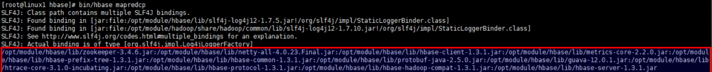

2.  环境变量的导入

（1）执行环境变量的导入（临时生效，在命令行执行下述操作）

```
$ export HBASE_HOME=/opt/module/hbase-1.3.1
$ export HADOOP_HOME=/opt/module/hadoop-2.7.2
$ export HADOOP_CLASSPATH=`${HBASE_HOME}/bin/hbase mapredcp`
```

（2）永久生效：在/etc/profile配置

```
export HBASE_HOME=/opt/module/hbase-1.3.1
export HADOOP_HOME=/opt/module/hadoop-2.7.2
```

并在hadoop-env.sh中配置：（注意：在for循环之后配）
```
export HADOOP_CLASSPATH=$HADOOP_CLASSPATH:/opt/module/hbase/lib/*
```

即：在原来HADOOP_CLASSPATH路径不变的情况下，增加/opt/module/hbase/lib/下的所有文件，冒号表示分隔的意思

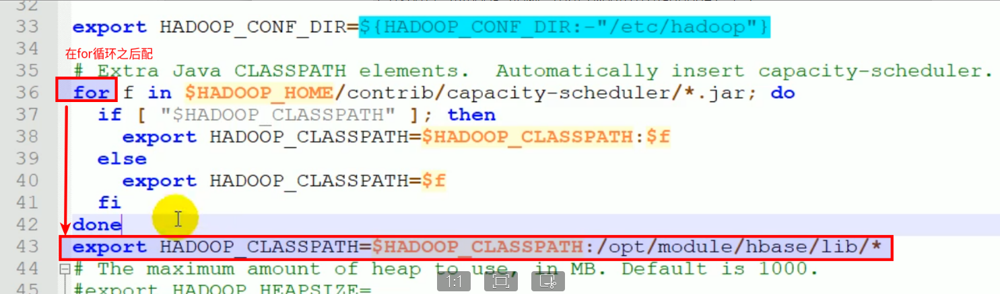

3.  运行官方的MapReduce任务

案例一：统计Student表中有多少行数据

```
$ /opt/module/hadoop-2.7.2/bin/yarn jar lib/hbase-server-1.3.1.jar rowcounter student
```

案例二：使用MapReduce将本地数据导入到HBase

1）在本地创建一个tsv格式的文件：fruit.tsv

```
1001    Apple   Red
1002    Pear        Yellow
1003    Pineapple   Yellow
```

2）创建HBase表

```
hbase(main):001:0> create 'fruit','info'
```

3）在HDFS中创建input_fruit文件夹并上传fruit.tsv文件

```
$ /opt/module/hadoop-2.7.2/bin/hdfs dfs -mkdir /input_fruit/
$ /opt/module/hadoop-2.7.2/bin/hdfs dfs -put fruit.tsv /input_fruit/
```

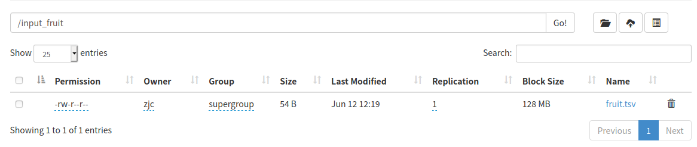

4）执行MapReduce到HBase的fruit表中

```
$ /opt/module/hadoop-2.7.2/bin/yarn jar lib/hbase-server-1.3.1.jar importtsv \
-Dimporttsv.columns=HBASE_ROW_KEY,info:name,info:color fruit \
hdfs://hadoop102:9000/input_fruit
```

5）使用scan命令查看导入后的结果

```
hbase(main):001:0> scan 'fruit'
```

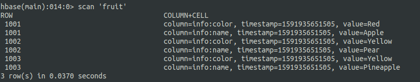

### 自定义HBase-MapReduce1

目标：将fruit表中的一部分数据，通过MR迁入到fruit_mr表中。

分步实现：

1.  maven的pom.xml文件配置

```xml
<!-- 这个插件是为了打包时打的是可执行包而不是依赖包 -->
    <build>
        <plugins>
            <plugin>
                <groupId>org.apache.maven.plugins</groupId>
                <artifactId>maven-shade-plugin</artifactId>
                <version>2.4.3</version>
                <configuration>
                    <transformers>
                        <transformer
                            implementation="org.apache.maven.plugins.shade.resource.ManifestResourceTransformer">
                            <mainClass>这里填写main方法所在类</mainClass>
                        </transformer>
                    </transformers>
                </configuration>
                <executions>
                    <execution>
                        <phase>package</phase>
                        <goals>
                            <goal>shade</goal>
                        </goals>
                    </execution>
                </executions>
            </plugin>
        </plugins>
    </build>
    <dependencies>
        <dependency>
            <groupId>org.apache.hbase</groupId>
            <artifactId>hbase-server</artifactId>
            <version>1.3.1</version>
        </dependency>

        <dependency>
            <groupId>org.apache.hbase</groupId>
            <artifactId>hbase-client</artifactId>
            <version>1.3.1</version>
        </dependency>
    </dependencies>
```

2．构建ReadFruitMapper类，用于读取fruit表中的数据

```java
package com.atguigu;

import java.io.IOException;
import org.apache.hadoop.hbase.Cell;
import org.apache.hadoop.hbase.CellUtil;
import org.apache.hadoop.hbase.client.Put;
import org.apache.hadoop.hbase.client.Result;
import org.apache.hadoop.hbase.io.ImmutableBytesWritable;
import org.apache.hadoop.hbase.mapreduce.TableMapper;
import org.apache.hadoop.hbase.util.Bytes;

public class ReadFruitMapper extends TableMapper<ImmutableBytesWritable, Put> {

    @Override
    protected void map(ImmutableBytesWritable key, Result value, Context context)
    throws IOException, InterruptedException {
    //将fruit的name和color提取出来，相当于将每一行数据读取出来放入到Put对象中。
        Put put = new Put(key.get());
        //遍历添加column行
        for(Cell cell: value.rawCells()){
            //添加/克隆列族:info
            if("info".equals(Bytes.toString(CellUtil.cloneFamily(cell)))){
                //添加/克隆列：name
                if("name".equals(Bytes.toString(CellUtil.cloneQualifier(cell)))){
                    //将该列cell加入到put对象中
                    put.add(cell);
                    //添加/克隆列:color
                }else if("color".equals(Bytes.toString(CellUtil.cloneQualifier(cell)))){
                    //向该列cell加入到put对象中
                    put.add(cell);
                }
            }
        }
        //将从fruit读取到的每行数据写入到context中作为map的输出
        context.write(key, put);
    }
}
```

3.  构建WriteFruitMRReducer类，用于将读取到的fruit表中的数据写入到fruit_mr表中

```java
package com.atguigu.hbase_mr;

import java.io.IOException;
import org.apache.hadoop.hbase.client.Put;
import org.apache.hadoop.hbase.io.ImmutableBytesWritable;
import org.apache.hadoop.hbase.mapreduce.TableReducer;
import org.apache.hadoop.io.NullWritable;

public class WriteFruitMRReducer extends TableReducer<ImmutableBytesWritable, Put, NullWritable> {
    @Override
    protected void reduce(ImmutableBytesWritable key, Iterable<Put> values, Context context)
    throws IOException, InterruptedException {
        //读出来的每一行数据写入到fruit_mr表中
        for(Put put: values){
            context.write(NullWritable.get(), put);
        }
    }
}
```

4.  构建Fruit2FruitMRRunner extends Configured implements Tool用于组装运行Job任务

```java
public class Fruit2FruitMRRunner extends Configured implements Tool{
//组装Job
    public int run(String[] args) throws Exception {
        //得到Configuration
        Configuration conf = this.getConf();
        //创建Job任务
        Job job = Job.getInstance(conf, this.getClass().getSimpleName());
        job.setJarByClass(Fruit2FruitMRRunner.class);

        //配置Job
        Scan scan = new Scan();
        scan.setCacheBlocks(false);
        scan.setCaching(500);

        //设置Mapper，注意导入的是mapreduce包下的，不是mapred包下的，后者是老版本
        TableMapReduceUtil.initTableMapperJob(
        "fruit", //数据源的表名
        scan, //scan扫描控制器
        ReadFruitMapper.class,//设置Mapper类
        ImmutableBytesWritable.class,//设置Mapper输出key类型
        Put.class,//设置Mapper输出value值类型
        job//设置给哪个JOB
        );
        //设置Reducer
        TableMapReduceUtil.initTableReducerJob("fruit_mr", WriteFruitMRReducer.class, job);
        //设置Reduce数量，最少1个
        job.setNumReduceTasks(1);

        boolean isSuccess = job.waitForCompletion(true);
        if(!isSuccess){
            throw new IOException("Job running with error");
        }
        return isSuccess ? 0 : 1;
    }
}
```

5.  主函数中调用运行该Job任务

```java
public static void main( String[] args ) throws Exception{
    Configuration conf = HBaseConfiguration.create();
    int status = ToolRunner.run(conf, new Fruit2FruitMRRunner(), args);
    System.exit(status);
}
```

6.  打包运行任务(打可执行包而不是依赖包)

```
$ /opt/module/hadoop-2.7.2/bin/yarn jar ~/softwares/jars/hbase-0.0.1-SNAPSHOT.jar
 com.z.hbase.mr1.Fruit2FruitMRRunner
```

提示：运行任务前，如果待数据导入的表不存在，则需要提前创建。
提示：maven打包命令：-P local clean package或-P dev clean package install（将第三方jar包一同打包，需要插件：maven-shade-plugin）


### 自定义HBase-MapReduce2

目标：实现将HDFS中的数据写入到HBase表中。

分步实现：

1.  maven的pom.xml文件配置

```xml
<!-- 这个插件是为了打包时打的是可执行包而不是依赖包 -->
    <build>
        <plugins>
            <plugin>
                <groupId>org.apache.maven.plugins</groupId>
                <artifactId>maven-shade-plugin</artifactId>
                <version>2.4.3</version>
                <configuration>
                    <transformers>
                        <transformer
                            implementation="org.apache.maven.plugins.shade.resource.ManifestResourceTransformer">
                            <mainClass>这里填写main方法所在类</mainClass>
                        </transformer>
                    </transformers>
                </configuration>
                <executions>
                    <execution>
                        <phase>package</phase>
                        <goals>
                            <goal>shade</goal>
                        </goals>
                    </execution>
                </executions>
            </plugin>
        </plugins>
    </build>
    <dependencies>
        <dependency>
            <groupId>org.apache.hbase</groupId>
            <artifactId>hbase-server</artifactId>
            <version>1.3.1</version>
        </dependency>

        <dependency>
            <groupId>org.apache.hbase</groupId>
            <artifactId>hbase-client</artifactId>
            <version>1.3.1</version>
        </dependency>
    </dependencies>
```

2.  构建ReadFruitFromHDFSMapper于读取HDFS中的文件数据

```java
package com.atguigu;

import java.io.IOException;

import org.apache.hadoop.hbase.client.Put;
import org.apache.hadoop.hbase.io.ImmutableBytesWritable;
import org.apache.hadoop.hbase.util.Bytes;
import org.apache.hadoop.io.LongWritable;
import org.apache.hadoop.io.Text;
import org.apache.hadoop.mapreduce.Mapper;

public class ReadFruitFromHDFSMapper extends Mapper<LongWritable, Text, ImmutableBytesWritable, Put> {
    @Override
    protected void map(LongWritable key, Text value, Context context) throws IOException, InterruptedException {
        //从HDFS中读取的数据
        String lineValue = value.toString();
        //读取出来的每行数据使用\t进行分割，存于String数组
        String[] values = lineValue.split("\t");

        //根据数据中值的含义取值
        String rowKey = values[0];
        String name = values[1];
        String color = values[2];

        //初始化rowKey
        ImmutableBytesWritable rowKeyWritable = new ImmutableBytesWritable(Bytes.toBytes(rowKey));

        //初始化put对象
        Put put = new Put(Bytes.toBytes(rowKey));

        //参数分别:列族、列、值
        put.add(Bytes.toBytes("info"), Bytes.toBytes("name"),  Bytes.toBytes(name));
        put.add(Bytes.toBytes("info"), Bytes.toBytes("color"),  Bytes.toBytes(color));

        context.write(rowKeyWritable, put);
    }
}
```

3.  构建WriteFruitMRFromTxtReducer类

```java
package com.z.hbase.mr2;

import java.io.IOException;
import org.apache.hadoop.hbase.client.Put;
import org.apache.hadoop.hbase.io.ImmutableBytesWritable;
import org.apache.hadoop.hbase.mapreduce.TableReducer;
import org.apache.hadoop.io.NullWritable;

public class WriteFruitMRFromTxtReducer extends TableReducer<ImmutableBytesWritable, Put, NullWritable> {
    @Override
    protected void reduce(ImmutableBytesWritable key, Iterable<Put> values, Context context) throws IOException, InterruptedException {
        //读出来的每一行数据写入到fruit_hdfs表中
        for(Put put: values){
            context.write(NullWritable.get(), put);
        }
    }
}
```

4.  创建Txt2FruitRunner组装Job

```java
public class Txt2FruitRunner extends Configured implements Tool{
    public int run(String[] args) throws Exception {
        //得到Configuration
        Configuration conf = this.getConf();

        //创建Job任务
        Job job = Job.getInstance(conf, this.getClass().getSimpleName());
        job.setJarByClass(Txt2FruitRunner.class);
        Path inPath = new Path("hdfs://hadoop102:9000/input_fruit/fruit.tsv");
        FileInputFormat.addInputPath(job, inPath);

        //设置Mapper
        job.setMapperClass(ReadFruitFromHDFSMapper.class);
        job.setMapOutputKeyClass(ImmutableBytesWritable.class);
        job.setMapOutputValueClass(Put.class);

        //设置Reducer
        TableMapReduceUtil.initTableReducerJob("fruit_mr", WriteFruitMRFromTxtReducer.class, job);

        //设置Reduce数量，最少1个
        job.setNumReduceTasks(1);

        boolean isSuccess = job.waitForCompletion(true);
        if(!isSuccess){
            throw new IOException("Job running with error");
        }

        return isSuccess ? 0 : 1;
    }
}
```

5.  调用执行Job

```java
public static void main(String[] args) throws Exception {
        Configuration conf = HBaseConfiguration.create();
        int status = ToolRunner.run(conf, new Txt2FruitRunner(), args);
        System.exit(status);
}
```

6.  打包运行(打可执行包而不是依赖包)

```
$ /opt/module/hadoop-2.7.2/bin/yarn jar hbase-0.0.1-SNAPSHOT.jar com.atguigu.hbase.mr2.Txt2FruitRunner
```

提示：运行任务前，如果待数据导入的表不存在，则需要提前创建之。

提示：maven打包命令：-P local clean package或-P dev clean package install（将第三方jar包一同打包，需要插件：maven-shade-plugin）

### 将HBase的查询结果统计分析后保存到Mysql

创建HBase,并添加数据

```sql
create 'phone','info'

put 'phone','18600000001_202006141750','info:phoneTo','15200000001'
put 'phone','18600000001_202006141750','info:endTime','202006141800'

put 'phone','18600000001_202006111750','info:phoneTo','15200000001'
put 'phone','18600000001_202006111750','info:endTime','202006111800'

put 'phone','18600000001_202005111750','info:phoneTo','15200000001'
put 'phone','18600000001_202005111750','info:endTime','202005111800'

put 'phone','18600000002_202005111750','info:phoneTo','15200000001'
put 'phone','18600000002_202005111750','info:endTime','202005111755'
```

创建Mysql数据库和表

```sql
CREATE DATABASE `phone` /*!40100 DEFAULT CHARACTER SET utf8 */
```

```sql
CREATE TABLE `phoneTime` (
  `phone` varchar(16) DEFAULT NULL,
  `sumTime` varchar(200) DEFAULT NULL
) ENGINE=InnoDB DEFAULT CHARSET=utf8
```

定义一个类，这里面的字段要和你的mysql数据库中的表的字段相对应

```java
package com.zjc.hbase2mysql;

import java.sql.PreparedStatement;
import java.sql.ResultSet;
import java.sql.SQLException;

import org.apache.hadoop.mapreduce.lib.db.DBWritable;

public class UserInfo implements DBWritable {
    private String phone;
    private String sumTime;

    public String getPhone() {
        return phone;
    }

    public void setPhone(String phone) {
        this.phone = phone;
    }

    public String getSumTime() {
        return sumTime;
    }

    public void setSumTime(String sumTime) {
        this.sumTime = sumTime;
    }

    public void write(PreparedStatement statement) throws SQLException {
        statement.setString(1, this.getPhone());
        statement.setString(2, this.getSumTime());
    }

    public void readFields(ResultSet resultSet) throws SQLException {

    }
}
```

Map端，从hbase中读取数据

```java
package com.zjc.hbase2mysql;

import java.io.IOException;

import org.apache.hadoop.hbase.Cell;
import org.apache.hadoop.hbase.CellUtil;
import org.apache.hadoop.hbase.client.Result;
import org.apache.hadoop.hbase.io.ImmutableBytesWritable;
import org.apache.hadoop.hbase.mapreduce.TableMapper;
import org.apache.hadoop.hbase.util.Bytes;
import org.apache.hadoop.io.Text;
import org.apache.hadoop.mapreduce.Mapper;

/**
 * 根据用户在hbase的通话记录，求出每个用户总共通话时间，放入mysql中
 */
public class PhoneMapper extends TableMapper<Text, Text> {
    @Override
    protected void map(ImmutableBytesWritable key, Result value,
            Mapper<ImmutableBytesWritable, Result, Text, Text>.Context context)
            throws IOException, InterruptedException {

        String rowkey = new String(key.get());
        String phoneTo = "";
        String startTime = "";
        String endTime = "";

        for (Cell cell : value.rawCells()) {
            if ("info".equals(Bytes.toString(CellUtil.cloneFamily(cell)))) {
                String qualifier = Bytes.toString(CellUtil.cloneQualifier(cell));
                if ("phoneTo".equals(qualifier)) {
                    phoneTo = Bytes.toString(CellUtil.cloneValue(cell));
                } else if ("endTime".equals(qualifier)) {
                    endTime = Bytes.toString(CellUtil.cloneValue(cell));
                }
            }
        }

        String[] split = rowkey.split("_");
        // 开始时间
        startTime = split[1];
        // key
        String keys = split[0];
        // info
        String info = phoneTo+ "-" + startTime + "-" + endTime;
        //输出到文件
        context.write(new Text(keys), new Text(info));
    }
}
```


Reduce端

```java
package com.zjc.hbase2mysql;

import java.io.IOException;
import java.text.ParseException;
import java.text.SimpleDateFormat;

import org.apache.hadoop.io.NullWritable;
import org.apache.hadoop.io.Text;
import org.apache.hadoop.mapreduce.Reducer;

public class PhoneReducer extends Reducer<Text, Text, UserInfo, NullWritable>{
    private UserInfo userInfo = new UserInfo();

    @Override
    protected void reduce(Text key, Iterable<Text> values,
            Reducer<Text, Text, UserInfo, NullWritable>.Context context)
            throws IOException, InterruptedException {
        // 获取手机号
        String phone = key.toString();

        Long sumTime = 0L;
        for (Text info : values) {
            String[] split = info.toString().split("-");
            try {
                Long caclTimeDifference = caclTimeDifference(split[1], split[2]);
                sumTime += caclTimeDifference;
            } catch (ParseException e) {
                e.printStackTrace();
            }
        }
        userInfo.setPhone(phone);
        userInfo.setSumTime(String.valueOf(sumTime));


        // 写入到db,放在key

        context.write(userInfo , null);
    }

    private long caclTimeDifference(String startTime, String endTime) throws ParseException {
        SimpleDateFormat simpleFormat = new SimpleDateFormat("yyyyMMddHHmm");
        long start = simpleFormat.parse(startTime).getTime();
        System.out.println(start);
        long end = simpleFormat.parse(endTime).getTime();
        System.out.println(end);
        long minutes = (end - start) / (1000 * 60);
        System.out.println(minutes);
        return minutes;
    }
}
```


Driver端

```java
package com.zjc.hbase2mysql;

import java.io.IOException;

import org.apache.hadoop.conf.Configuration;
import org.apache.hadoop.conf.Configured;
import org.apache.hadoop.hbase.HBaseConfiguration;
import org.apache.hadoop.hbase.client.Scan;
import org.apache.hadoop.hbase.mapreduce.TableMapReduceUtil;
import org.apache.hadoop.io.NullWritable;
import org.apache.hadoop.io.Text;
import org.apache.hadoop.mapreduce.Job;
import org.apache.hadoop.mapreduce.lib.db.DBConfiguration;
import org.apache.hadoop.mapreduce.lib.db.DBOutputFormat;
import org.apache.hadoop.util.Tool;
import org.apache.hadoop.util.ToolRunner;

public class Driver extends Configured implements Tool {
    public static void main(String[] args) throws Exception {
        Configuration configuration = HBaseConfiguration.create();
        int re = ToolRunner.run(configuration, new Driver(), args);
        System.out.println(re);
        System.exit(re);
    }

    public int run(String[] args) throws Exception {
        // 得到Conf
        Configuration configuration = this.getConf();
        // 数据库配置
        DBConfiguration.configureDB(configuration, "com.mysql.jdbc.Driver",
                "jdbc:mysql://localhost:3306/phone", "root", "root");

        Job job = Job.getInstance(configuration,
                this.getClass().getSimpleName());

        // 创建job任务
        job.setJarByClass(Driver.class);
        // 配置job
        Scan scan = new Scan();
        scan.setCacheBlocks(false);
        scan.setCaching(500);

        // 设置Mapper
        TableMapReduceUtil.initTableMapperJob(
                "phone", // 数据源的表名
                scan, // scan扫描控制器
                PhoneMapper.class, // 设置Mapper类
                Text.class, // 设置Mapper输入key类型
                Text.class, // 设置Mapper输出value值类型
                job // 设置job
        );

        // 设置Reduce
        // 设置reduce数量，最少一个
        job.setNumReduceTasks(1);
        job.setReducerClass(PhoneReducer.class);
        job.setOutputKeyClass(UserInfo.class);
        job.setOutputValueClass(NullWritable.class);
        DBOutputFormat.setOutput(job, "phoneTime", "phone", "sumTime");
        job.setOutputFormatClass(DBOutputFormat.class);
        boolean isSuccess = job.waitForCompletion(true);
        if (!isSuccess) {
            throw new IOException("Job running with error");
        }
        return isSuccess ? 0 : 1;
    }
}
```

### 将Mysql中的数据作为MapReduce的输入，并存到hbase中

因为这里用到上面自定义的StuHbase类，且把StuHbase当做了Map端的输出，所以上面就必须继承一个WritableCompable接口，实现对key的排序

```java
//这里把Map端、reduce端、Driver端以静态内部类写到了一块儿
package com.hbase2mysql;

import org.apache.hadoop.conf.Configuration;
import org.apache.hadoop.conf.Configured;
import org.apache.hadoop.hbase.HBaseConfiguration;
import org.apache.hadoop.hbase.client.Put;
import org.apache.hadoop.hbase.io.ImmutableBytesWritable;
import org.apache.hadoop.hbase.mapreduce.TableMapReduceUtil;
import org.apache.hadoop.hbase.mapreduce.TableReducer;
import org.apache.hadoop.hbase.util.Bytes;
import org.apache.hadoop.io.LongWritable;
import org.apache.hadoop.io.NullWritable;
import org.apache.hadoop.io.Text;

import org.apache.hadoop.mapreduce.Job;
import org.apache.hadoop.mapreduce.Mapper;
import org.apache.hadoop.mapreduce.lib.db.DBConfiguration;
import org.apache.hadoop.mapreduce.lib.db.DBInputFormat;
import org.apache.hadoop.util.Tool;
import org.apache.hadoop.util.ToolRunner;

import java.io.IOException;

public class Mysql2Hbase{

    public static class Mysql2HbaseMapper extends Mapper<LongWritable,StuHbase,StuHbase,NullWritable>{
        @Override
        protected void map(LongWritable key, StuHbase value, Context context) throws IOException, InterruptedException {

            System.err.println("******************");
            System.out.println(value);
            context.write(value,NullWritable.get());
        }
    }


    public static class Mysql2HbaseReducer extends TableReducer<StuHbase,NullWritable,ImmutableBytesWritable>{
                    //
        @Override
        protected void reduce(StuHbase key, Iterable<NullWritable> values, Context context) throws IOException, InterruptedException {
            final Put put = new Put(Bytes.toBytes("03_001"));

            for(NullWritable v : values){
                put.addColumn(Bytes.toBytes("info"),Bytes.toBytes("name"),Bytes.toBytes(key.getName()));
                //此处+ “” 的目的是 为了不再 hbase中 显示乱码， 先把数字转为字符串
                put.addColumn(Bytes.toBytes("info"),Bytes.toBytes("age"),Bytes.toBytes(key.getAge()+""));
                put.addColumn(Bytes.toBytes("info"),Bytes.toBytes("sex"),Bytes.toBytes(key.getSex()));
                put.addColumn(Bytes.toBytes("info"),Bytes.toBytes("grade"),Bytes.toBytes(key.getGrade()+""));
            }

                //此处要传入的是（ImmutableBytesWritable, Mutation） ,put是mutation的子类
            context.write(/*new ImmutableBytesWritable(*//*Bytes.toBytes("02_001"))*/new ImmutableBytesWritable(Bytes.toBytes("03_001")),put);
            //context.write();
        }
    }


    public static class Mysql2HbaseDriver extends Configured implements Tool{
        public static void main(String[] args) throws Exception {
            Configuration conf = HBaseConfiguration.create();
            //设置连接的zookeeper的地址，可以对hbase进行操作
            conf.set("hbase.zookeeper.quorum","192.168.136.150:2181,192.168.136.151:2181,192.168.136.152:2181");
            ToolRunner.run(conf,new Mysql2HbaseDriver(),args);
        }

        @Override
        public int run(String[] strings) throws Exception {
            Configuration conf = this.getConf();
            //配置MySQL的的url,用户名和密码
            DBConfiguration.configureDB(conf,"com.mysql.jdbc.Driver","jdbc:mysql://localhost:3306/hbase2db","root","root");

            final Job job = Job.getInstance(conf);

            job.setJarByClass(Mysql2HbaseDriver.class);

            job.setMapperClass(Mysql2HbaseMapper.class);

            job.setMapOutputKeyClass(StuHbase.class);
            job.setMapOutputValueClass(NullWritable.class);
            //要把数据存储的hbase中的stu1表
            TableMapReduceUtil.initTableReducerJob("stu1",Mysql2HbaseReducer.class,job);

            //设置输入格式是从Database中读取
            job.setInputFormatClass(DBInputFormat.class);
            // job,继承DBWritable的类，表名，查询条件，按那个字段进行排序，要读取的字段
            DBInputFormat.setInput(job,StuHbase.class,"stu",null,"grade","name","age","sex","grade");

            job.waitForCompletion(true);

            return 0;
        }
    }
}
```

## 协处理器（类似触发器）

[HBase 协处理器详解](https://www.bookstack.cn/read/BigData-Notes/notes-Hbase%E5%8D%8F%E5%A4%84%E7%90%86%E5%99%A8%E8%AF%A6%E8%A7%A3.md)

### 协处理器分类

#### Observer协处理器

Observer 协处理器类似于关系型数据库中的触发器，当发生某些事件的时候这类协处理器会被 Server 端调用。通常可以用来实现下面功能：

+   权限校验：在执行 Get 或 Put 操作之前，您可以使用 preGet 或 prePut 方法检查权限；
+   完整性约束： HBase 不支持关系型数据库中的外键功能，可以通过触发器在插入或者删除数据的时候，对关联的数据进行检查；
+   二级索引： 可以使用协处理器来维护二级索引。

当前 Observer 协处理器有以下四种类型：

+   RegionObserver : 允许您观察 Region 上的事件，例如 Get 和 Put 操作。
+   RegionServerObserver : 允许您观察与 RegionServer 操作相关的事件，例如启动，停止或执行合并，提交或回滚。
+   MasterObserver : 允许您观察与 HBase Master 相关的事件，例如表创建，删除或 schema 修改。
+   WalObserver : 允许您观察与预写日志（WAL）相关的事件。

### Endpoint协处理器

[如何开发HBase Endpoint类型的Coprocessor以及部署使用](https://cloud.tencent.com/developer/article/1158195)

[HBase 2.0版本协处理器 Endpoint使用](https://blog.csdn.net/LLJJYY001/article/details/90183679)
[How to使用HBase协处理器---Endpoint服务端的实现](https://blog.csdn.net/LLJJYY001/article/details/90183679)

Endpoint类比于数据库中的存储过程，他触发服务端的基于region的同步运行，再将各个结果在客户端搜集后归并计算。特点类似于传统的MR框架，在服务端MAP在客户端Reduce。相对于Observer来说开发难度大一点。

#### Observer协处理器操作

需求

student表插入数据同时触发second:student表也插入数据

**创建协处理器并导入hbase的lib下**

1.创建依赖包

代码结构

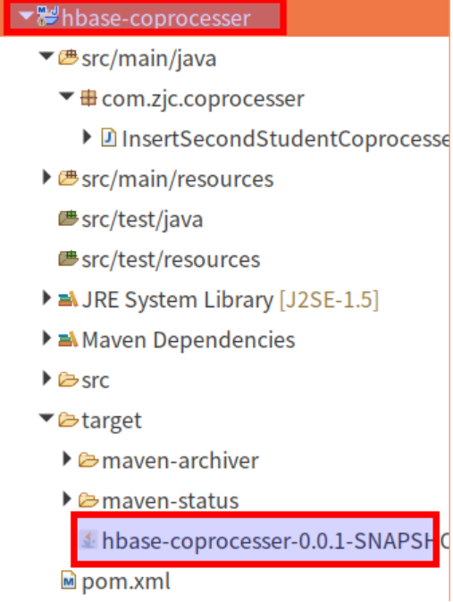

InsertSecondStudentCoprocesser.java

```java
package com.zjc.coprocesser;

import java.io.IOException;

import org.apache.hadoop.hbase.TableName;
import org.apache.hadoop.hbase.client.Durability;
import org.apache.hadoop.hbase.client.Put;
import org.apache.hadoop.hbase.client.Table;
import org.apache.hadoop.hbase.coprocessor.BaseRegionObserver;
import org.apache.hadoop.hbase.coprocessor.ObserverContext;
import org.apache.hadoop.hbase.coprocessor.RegionCoprocessorEnvironment;
import org.apache.hadoop.hbase.regionserver.wal.WALEdit;

/**
 * 协处理器
 * 1. 创建类,继承BaseRegionObserver
 * 2. 重写方法:postPut
 * 3. 实现逻辑
 *      增加student的数据
 *      同时增加second:student的数据
 * @author zjc
 *
 */
public class InsertSecondStudentCoprocesser extends BaseRegionObserver{
    @Override
    public void postPut(ObserverContext<RegionCoprocessorEnvironment> e,
            Put put, WALEdit edit, Durability durability) throws IOException {
        // 获取表
        Table table = e.getEnvironment().getTable(TableName.valueOf("second:student"));

        // 增加数据
        table.put(put);

        // 关闭表
        table.close();
    }
}
```

2.  将包放到hbase下的lib目录下

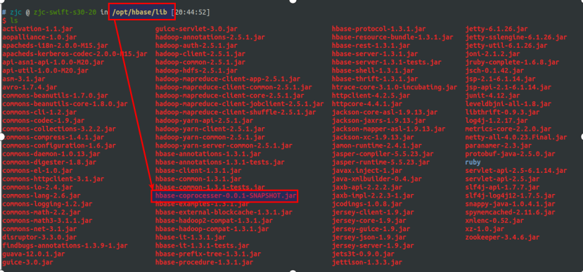

3.  重启hbase

```
stop-hbase.sh
start-hbase.sh
```

**创建表并设置协处理器**

代码结构

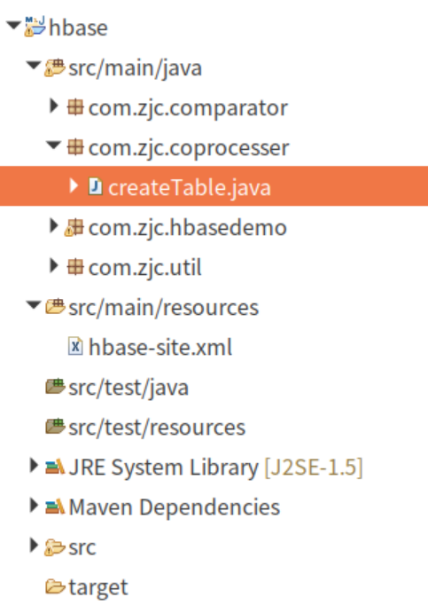

createTable.java

```java
package com.zjc.coprocesser;

import java.io.IOException;

import org.apache.hadoop.conf.Configuration;
import org.apache.hadoop.hbase.HBaseConfiguration;
import org.apache.hadoop.hbase.HColumnDescriptor;
import org.apache.hadoop.hbase.HTableDescriptor;
import org.apache.hadoop.hbase.TableName;
import org.apache.hadoop.hbase.client.Admin;
import org.apache.hadoop.hbase.client.Connection;
import org.apache.hadoop.hbase.client.ConnectionFactory;

public class createTable {
    public static void main(String[] args) throws IOException {
        Configuration conf = HBaseConfiguration.create();
        Connection conn = ConnectionFactory.createConnection(conf);

        Admin admin = conn.getAdmin();

        // 创建表
        TableName tableName = TableName.valueOf("student");
        HTableDescriptor td = new HTableDescriptor(tableName);

        // 设置协处理器
        td.addCoprocessor("com.zjc.coprocesser.InsertSecondStudentCoprocesser");

        // 增加列族
        HColumnDescriptor hcd = new HColumnDescriptor("info");
        td.addFamily(hcd);

        admin.createTable(td);
    }
}
```

新增数据时,两张表同时增加数据

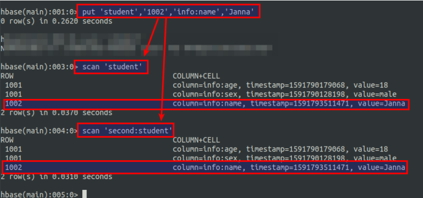

